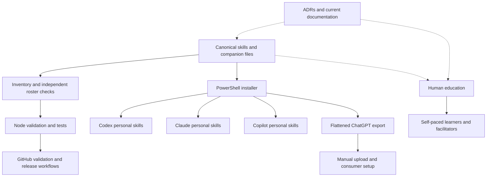
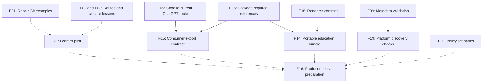
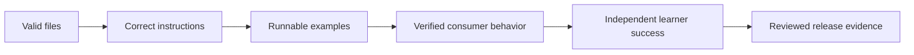

# Repository Audit Review — ChatGPT

<!-- markdownlint-disable MD013 -->

| Review detail | Value |
| --- | --- |
| Date | 2026-09-30, Europe/Copenhagen |
| Perspective | Senior development, technical documentation, and learning design |
| Repository | [JeanKadang/DOC-GitHub-Practice-Skills](https://github.com/JeanKadang/DOC-GitHub-Practice-Skills) |
| Baseline | `b24dfb14d2c50cc9d16c51ee6c48f62bca84a9e2` on `main` |
| Tracking | [Issue #113](https://github.com/JeanKadang/DOC-GitHub-Practice-Skills/issues/113) |
| Deliverable | Investigation and recommendations; implementation is separate work |

## 1. Assessment

This repository has a strong foundation: a deliberately bounded skill roster, defensive installation, independently checked manifests, evidence-based closure rules, and a substantial human training program. Its greatest opportunity is to make **content correctness and consumer behavior as verifiable as package structure**.

The existing checks pass while important content defects remain. Module 3f's commit example fails before rebase starts. Training pages disagree about prerequisites. Beginner exercises teach closing issues without first recording criterion evidence. Recovery-code guidance contradicts GitHub's current instructions. The ChatGPT adapter depends on a creation path whose availability has changed. A temporary installer fixture also confirmed that a normal reinstall deletes an added file inside a tracked skill without creating the backup advertised by its preview.

These are material problems for the repository's purpose: its product tells people and agents what to do. A plausible-looking instruction that fails, or a policy that changes depending on which page was loaded, is a product defect even when the Markdown is valid.

The highest-value order is:

1. Fix reinstall preservation, then correct runnable lessons, account-recovery advice, and platform availability.
2. Reconcile shared policy and complete the files needed by deployed consumers.
3. Add targeted checks for examples, descriptions, links, and diagrams.
4. Validate real consumer behavior and independent learner completion.
5. Package and release the resulting improvements with explicit provenance.

| Priority | Numbered findings | Immediate focus |
| --- | --- | --- |
| P0 | F17 | Prevent silent loss of added files during reinstall; make the preview truthful |
| P1 | F01–F07 | Correct lessons, recovery facts, consumer availability, deployed references, and CI policy |
| P2 | F08–F16, F18–F25 | Align contracts and documentation; improve packaging, verification, learning, and release evidence |

One P0 data-loss risk was reproduced in a disposable installation; no real consumer files were affected. No active credential exposure or exploitable vulnerability was established. The security-alert and dependency results below are a snapshot, not proof that every possible vulnerability has been excluded.

## 2. Intent, audiences, and architecture

### 2.1 What the product is

The primary product is a versioned collection of **agent-facing GitHub workflow policy**, distributed from `skills/<name>/`. Node.js validates that package; PowerShell installs or exports it. It is not a conventional application or an npm runtime library: `package.json` is private and its dependencies support development checks.

The second product is **human-facing education** under `education/`: GitHub workflow, local Git, and the beginning of an LLM tooling track. Its tags and changelog are independent of the skillset. ADRs record decisions; historical plans explain earlier implementations; platform adapters route readers to installation guidance.

Sources: [README](../../README.md), [maintainer guide](../MAINTAINING.md), [education overview](../../education/README.md), and [ADRs](../adr/README.md).

### 2.2 Audiences and success conditions

| Audience | Needs | A successful outcome |
| --- | --- | --- |
| Agent working in a maintained GitHub repository | Triggers, authority boundaries, handoffs, reliable commands | Selects the right skill, respects approval and disclosure gates, produces traceable work |
| Solo maintainer | Useful discipline without impossible self-review or excess administration | Required checks work; issue evidence remains clear; optional infrastructure stays optional |
| Contributor or reviewer | Clear separation of proposing, reviewing, and merging | Follows the target repository's conventions and avoids executing untrusted changes blindly |
| Complete beginner | Vocabulary, prerequisites, safe practice, observable feedback | Completes the first change and understands what GitHub did |
| Experienced Git, ADO, or GitLab user | Accurate mappings and efficient routing | Learns differences without importing false assumptions |
| Facilitator | Repeatable sandbox setup and completion signals | Can support a cohort or an individual without inventing missing steps |
| Package consumer | Installation provenance, compatibility, update and recovery guidance | Can identify the deployed policy and update it safely |

### 2.3 Current architecture

The two delivery surfaces share policy, but have different verification needs.

The dotted arrows are reference relationships, not automatic synchronization. A policy reference does not by itself prevent contradictory training prose, and successful export does not establish successful retrieval or tool access.

### 2.4 Design choices worth preserving

- Keep canonical skills separate from installed copies.
- Preserve independently maintained roster checks. Replacing them with one generated source would remove the intentional independent verification unless another independent contract replaces it.
- Keep the security-response path private until disclosure is safe.
- Keep review approval, merge authorization, and release authorization distinct.
- Preserve the `Refs`/`Closes` evidence gate and post-merge issue audit.
- Keep human instruction separate from agent policy, with explicit references between them.
- Keep Projects and CODEOWNERS conditional on actual shared ownership.
- Preserve historical ADRs; change decisions through a new record rather than silently rewriting their rationale.

## 3. Method, coverage, and evidence

### 3.1 Scope

The baseline contains **114 tracked files, including 75 Markdown files**. The review inspected all major repository areas, all twelve canonical skills and their sidecars, the active human modules, platform guides, scripts, tests, contracts, workflows, templates, changelogs, and ADRs. Historical specifications and plans were inspected for scope, references, and their relationship to current policy; they were not treated as current executable instructions.

The starting checkout also contained untracked `AGENTS.md` and `.claude/` content. These were preserved and excluded from the package audit. The supplied repository instructions governed this work; they are not assumed to be shipped product content.

This review combined source inspection, safe temporary fixtures, local checks, read-only GitHub API inspection, and current primary documentation. It did not install into the maintainer's real AI-tool homes, change security settings, merge, tag, publish, or execute learner exercises in a shared live practice repository.

### 3.2 Finding vocabulary

| Label | Meaning |
| --- | --- |
| **CONFIRMED** | Verified against current files, a safe reproduction, hosted state, or current primary documentation; the evidence says exactly what was verified |
| **PLAUSIBLE** | Source inspection identifies a credible behavior risk; the failure has not been reproduced |
| **PROPOSAL** | A quality improvement or design choice, not a demonstrated defect |

Priority follows the existing P0–P3 scheme. P0 includes data-loss risk; P1 identifies important user-facing correctness or reliability problems; P2 identifies valuable quality and maintainability work; P3 identifies optional polish. Effort estimates are relative: Small is a focused change, Medium spans several surfaces, Large needs a substantial mechanism or evaluation program.

### 3.3 Verification ledger

| Check | Result | What it establishes and what it does not |
| --- | --- | --- |
| `npm run check` | **Passed**, exit 0 | Manifest validation, 42 tests, and all three Markdown lint passes; does not execute lesson examples or render diagrams |
| Node tests | **42 passed, 0 failed, 0 skipped**, approximately 183–192 seconds across two local runs | Includes actual installer writes in temporary fixtures, byte checks, backups, and Windows junction cases |
| Direct installer previews | **Passed** for Both, Copilot, and ChatGPT | Reported twelve skills per CLI target and seventeen flattened export files; the temporary target root remained absent |
| Tracked-installation extra-file fixture | **Deletion reproduced**, reinstall exit 0 | After a preview advertised a backup, a normal same-source reinstall removed `user-note.txt` added to one tracked skill; no backup directory existed. Only a disposable temporary installation was affected |
| Local Markdown destination scan | **98 destination occurrences checked; no missing file/directory targets** | Scanned tracked Markdown outside fenced examples; excluded footnote definitions; did not validate anchors, external URLs, every Markdown dialect, or plain inline-code path mentions |
| Final report checks | **Markdown lint passed; 37 local links resolved** | Checks this new document separately; its three simple Mermaid diagrams were inspected as source, not rendered |
| Module 3f fixture | **Failure reproduced**, first commit exit 1 | The supplied edit/commit sequence omits staging and cannot create its advertised three commits |
| Session 2 state fixture | **Failure reproduced**, revert exit 128 on the branch left by the conflict exercise | Explicitly switching back to the intended scratch branch is necessary; the prose asks for that branch but supplies no command |
| Validator mutation fixture | **Invalid skill accepted**, `errors: []` | Removing `description` from frontmatter is not detected by the current validator |
| `npm audit --json` | **0 reported vulnerabilities** | Succeeded after retry with network access; development dependencies are included; advisory coverage is limited to the registry's data |
| Hosted baseline validation | **All six jobs passed** | Windows, Ubuntu, macOS, Node 20, Node 22, and Markdown jobs succeeded in [run 36749214440](https://github.com/JeanKadang/DOC-GitHub-Practice-Skills/actions/runs/36749214440) |
| Hosted baseline CodeQL | **Passed** | [Run 36749213989](https://github.com/JeanKadang/DOC-GitHub-Practice-Skills/actions/runs/36749213989); does not cover all prose or PowerShell behavior |
| Open hosted security alerts | **0 Dependabot, 0 code-scanning, 0 secret-scanning alerts** | Aggregated open-alert queries; no full historical secret scan or penetration test was performed |
| Mermaid / actual consumer sessions | **Not executed** | No claim of verified GitHub rendering, PDF fidelity, Copilot rediscovery, or Custom GPT behavior |

Local tools were Node `26.10.0`, npm `11.19.1`, PowerShell `7.6.6`, Git `2.56.0.windows.1`, and GitHub CLI `2.102.0` on Windows. Hosted Node 20/22 results supplement, rather than replace, this environment record.

### 3.4 Hosted governance snapshot

- The repository is public, default branch `main`, with automatic branch deletion enabled.
- The active `Protect main` ruleset has no bypass actors. It requires PRs, prohibits deletion and non-fast-forward updates, and requires the current Node 20, Node 22, Markdown, and Windows installer checks against an up-to-date branch.
- Required review count is zero, consistent with the documented solo-maintainer model. Merge commits are enabled; squash and rebase merges are disabled.
- Actions defaults to read permissions and cannot approve PR reviews. Each tracked workflow declares permissions; action references are full commit SHAs. The PR-label workflow uses `pull_request_target` for metadata only, with no checkout of PR head code.
- Private vulnerability reporting, secret scanning, push protection, and Dependabot security updates are enabled. No repository secrets were listed, and tracked workflows reference no named custom secrets.
- Discussions is enabled and includes Ideas and Q&A. The linked Projects v2 board is closed; a new active board is not presently required by the observed solo workflow.
- The community profile reports 100% health. Its `issue_template` field is null despite actual YAML issue forms, demonstrating why existence and quality must be inspected independently of that score.
- Before the audit tracking issue was created, there were no open issues or PRs. The remote branch inventory subsequently contained `main` and this audit's linked branch, without an observed stale merged-branch backlog.

## 4. Quality assessment by repository area

### 4.1 All twelve canonical skills

| Skill | Strongest quality | Main improvement focus |
| --- | --- | --- |
| `github-issue-first` | Observable criteria, ownership, conventions, security handoff | Ship referenced preflight guidance; harmonize audit batch gates and template completion |
| `github-hygiene` | Criterion evidence, post-merge recovery, separate merge approval | Resolve advisory-check semantics and distinguish consumer settings from this repo's merge defaults |
| `github-releases` | Version source, ruleset availability, generated-note labels | Match current milestone scheme and make changelog/release verification more explicit |
| `github-pr-review` | Reads diff before executing untrusted code; deliberate verdicts | Add scenario evidence for partial delivery, external conventions, and non-code fixes |
| `github-repo-review` | Evidence model, infrastructure scope, conditional scaffolding | Define the exactly-ten-issues boundary and distinguish triage candidates from proven unmet criteria |
| `github-repo-bootstrap` | Narrow pre-issue exception and post-creation API audit | Test boundary scenarios, plan constraints, and continuation of existing authorization |
| `github-repo-configure` | Existing-repo boundary; templates are generic rather than self-referential | Portable templates need acceptance criteria and explicit triage responsibility |
| `github-security-response` | Rotate first, private advisories, reachability-based triage | Test privacy-preserving handoffs and document recovery limitations without assuming universal settings |
| `github-projects` | Conditional creation, metadata authority, field-ID examples | Reconcile iteration-versus-milestone fallback language and validate against current API shapes |
| `github-for-ado-users` | Valuable process traps and TFVC orientation | Correct TFVC locking simplification and align Wiki guidance with the conditional shared policy |
| `github-for-gitlab-users` | Clearly treats CI migration as a rewrite | Remove incorrect ADO-Wiki contrast; qualify product capabilities versus team conventions |
| `github-contributing` | Target conventions take precedence; author/reviewer roles separated | Make external Superpowers references explicitly optional and verify default-branch assumptions |

All twelve `agents/openai.yaml` files have coherent display names, descriptions, and default prompts. Current tests validate their required text fields. Useful next checks concern consumer behavior and format limits, not cosmetic sidecar churn.

### 4.2 Human-facing content

| Material | Fit for intent | Review outcome |
| --- | --- | --- |
| Education overview | Clear numbered structure and topic map | Routing table, flowchart, and later prerequisite claims need alignment |
| Session 0 | Accessible conceptual primer and process caveat | Account-recovery section needs factual correction and less organization-specific prescription |
| LLM prerequisite | Names autonomy and confident error clearly | Needs product/model distinction, capability-based permissions, and practical verification examples |
| Local setup | Useful Windows-first installation path | Still labels itself Extra; authentication behavior and extension identity need clearer verification |
| Session 1 | Concrete issue-to-PR first experience | Remains facilitator-narrated; closure step omits the evidence gate it is meant to teach |
| Session 2 | Fills the essential local-Git rung | Branch state, cohort naming, reset/restore safety, and transition to later modules need correction |
| Module 2a | Strong explanation of connected-branch closure | Exercise should use explicit pending criteria, include milestone, and close the practice loop |
| Module 2b | Separates review from merge well | Final reference still says four advanced topics; solo assessment tests limited review skill |
| Module 3a | Makes plan and permission limits visible | Needs a complete CLI prerequisite or a documented web-only equivalent |
| Module 3b | Good read-only board inspection | Missing issue number is insufficient by itself to classify an item as a draft; PR items are legitimate too |
| Module 3c | Good comparison of changelog and generated notes | Optional API preview correctly notes push access, but “only works here” is ambiguous for read-only learners |
| Module 3d | Safe fake-secret reporting exercise | Preserve its no-real-secret design; add self-check answer guidance |
| Module 3e | Useful Actions/runner/agent distinctions | Pair agent behavior with explicit permissions and verification, without implying plan-independent availability |
| Module 3f | Valuable advanced scope | Missing staging is a blocking example defect; recovery timing and history-rewrite explanation are inaccurate |
| Cheat sheet | Useful preferred issue-linked branch command | Issue command omits required labels/milestone; “one page” has no checked print format |
| Facilitator guide | Dedicated sandbox and reset pattern | Web-only claims, advanced-module count, reset exceptions, authentication and CLI setup need alignment |
| Markdown showcase | Useful syntax reference | Distinguish GitHub rendering from local editor behavior; validate any future export output |
| Mermaid showcase | Broad selection and honest newer-type caveat | Claimed parser/render support needs reproducible evidence; add accessible alternatives |
| Education changelog | Clearly separates education releases | Unreleased entries contain intermediate names and migration history; prepare a current release summary |

### 4.3 Engineering and supporting documentation

| Area | Assessment |
| --- | --- |
| Installer | Strong preflight, source roster guard, overlap refusal, forced-replacement backups and staging. Ordinary reinstall can discard extra files despite previewing a backup; interrupted promotion and export provenance also need a clearer contract. |
| Validator | Strong manifest/path/roster checks and metadata parsing. Required skill description and useful failure cases remain unchecked. |
| Five test files | Meaningful filesystem fixtures and independent roster assertions. Policy tests cover a selected closure invariant, not general semantic consistency or learner examples. |
| Four tracked workflows | SHA-pinned actions and explicit permissions; cross-platform installer coverage. Release readiness and diagram/example correctness are only partially checked. |
| Dependabot and release-note config | Present and coherent; category labels exist. Label automation has no focused regression tests and adds labels from only the first matching reference. |
| Root and platform documentation | Clear entry points and public-content boundary. Version labels, compatibility promises, portability, and defaults need reconciliation. |
| ADRs 0001–0009 | Strong rationale and traceability. Preserve historical counts; clarify supersession in the index rather than treating every old number as a defect. |
| Historical specs/plans | Useful implementation history; intentionally excluded from standard docs lint. Label their historical status and avoid presenting them as the current user path. |
| Community files and licence | Present and substantive. Review the conduct reporting route as a usability/ownership choice, and include licence/provenance in portable outputs. |

## 5. Prioritized findings and improvement alternatives

Each item below is a proposed implementation unit. Acceptance criteria describe the evidence needed to close future work; these are not claims that the work has been delivered.

### F01 — Git lesson examples need executable state and accurate recovery guidance

**P1 · CONFIRMED · High confidence · Medium effort.**

**Evidence:** [Module 3f, lines 41–51 and 118–122](../../education/3_advanced/module-3f-rebase-cherry-pick-and-reflog.md) edits a tracked file and calls `git commit` three times without `git add`. A clean temporary fixture rejected the first commit with exit 1. Its “90 days of being unreferenced” explanation also conflates default reflog expiration: Git documents 90 days for ordinary entries and 30 days for entries unreachable from the current tip; neither is a guaranteed recovery window. [Git reflog reference](https://git-scm.com/docs/git-reflog).

[Session 2, lines 154–165](../../education/1_beginners/session-2-local-git-basics.md) asks learners to return to their scratch branch but supplies no checkout command. The preceding conflict exercise leaves them on a merge commit; continuing there produced `git revert HEAD` exit 128 because no mainline parent was supplied. The reset/restore prose also needs to distinguish safety for shared history from loss of uncommitted local work. Cherry-pick creates a new commit; it does not generally rewrite existing shared history as Module 3f's blanket explanation implies.

**Alternatives:** minimally add staging and explicit branch/status checkpoints; preferably replay each lesson in an isolated fixture; optionally provide separately executable examples with expected states. Do not fix this by teaching merge-commit revert to beginners when returning to the intended branch solves the problem.

**Acceptance:** the documented sequence creates three commits and squashes them; Session 2 returns to the named scratch branch before undo; recovery advice accurately distinguishes committed and uncommitted work; a fresh-clone replay completes without facilitator inference.

### F02 — Learning routes contradict required prerequisites

**P1 · CONFIRMED · High confidence · Small to Medium effort.**

**Evidence:** [education overview](../../education/README.md) requires the LLM prerequisite, but its routing table bypasses it for several entry points; Session 0's skip/next links also go directly to Session 1. [Session 2, lines 16–18](../../education/1_beginners/session-2-local-git-basics.md) and the [facilitator FAQ](../../education/facilitator-guide.md) say every later module works entirely in the web UI. Module 3f explicitly requires a terminal and Session 2; Module 3a's exercise supplies CLI commands. The local setup page still calls itself “Extra” and says it gates nothing after ADR 0009 moved it into prerequisites.

**Alternatives:** one focused editorial reconciliation; or a small learning-path manifest driving the table and prerequisite checks while leaving prose human-authored. Avoid adding a separate path generator until manual synchronization is demonstrably burdensome.

**Acceptance:** each entry route clearly names required reading and tools; only genuinely web-only modules claim that capability; Module 3f's dependency is visible before a learner selects it; page titles, next links, table and diagram agree.

### F03 — Beginner exercises bypass the evidence habit they claim to teach

**P1 · CONFIRMED · High confidence · Medium effort.**

**Evidence:** [Session 1](../../education/1_beginners/session-1-getting-started.md), steps 1 and 6, permits a one-sentence issue body and switches to `Closes` after approval without requiring an acceptance criterion or recorded evidence. [Module 2a](../../education/2_intermediate/module-2a-issue-first-and-closure-gate.md) teaches a mandatory milestone but omits it from the exercise, then reopens a completed toy issue solely to rehearse reopening. This trains the mechanism without its decision rule.

**Alternatives:** add one beginner-sized criterion (“my line appears once”) and point to the diff as evidence; redesign Module 2a with an intentionally pending second criterion; or provide a two-stage exercise showing partial and complete delivery.

**Acceptance:** the first learner PR demonstrates criterion → evidence → closing keyword; partial work has a real pending criterion; the post-merge audit evaluates both state and criteria; practice issues reach an explicitly documented final state.

### F04 — Account-recovery advice contains a false claim and ambiguous ownership

**P1 · CONFIRMED · High confidence · Small effort.**

**Evidence:** [Session 0, account-protection section](../../education/0_prerequisites/session-0-what-is-version-control.md) says recovery codes are shown once with no later chance to view the same set. GitHub explicitly documents viewing and downloading them after enabling 2FA. The same section prescribes a “shared/managed authenticator” arrangement, which can be interpreted as sharing individual-account factors. GitHub recommends secure recovery-code storage without sharing and more than one authentication method. [GitHub recovery documentation](https://docs.github.com/en/authentication/securing-your-account-with-two-factor-authentication-2fa/configuring-two-factor-authentication-recovery-methods).

**Alternatives:** a concise provider-backed checklist for individually controlled accounts; or separate ordinary-user-account and enterprise-managed-account guidance. Organizational administration should be described as helping with repository access and approved recovery processes, without implying administrators can bypass personal-account 2FA.

**Acceptance:** later code viewing is correctly described; new-code generation is distinguished from retrieving existing codes; personal factors are not prescribed as shared credentials; provider recovery and organization access administration are distinct; sources and review date are included.

### F05 — ChatGPT's primary setup path needs a current availability decision

**P1 · CONFIRMED · High confidence for documentation mismatch · Medium effort.**

**Evidence:** [ChatGPT guide](../chatgpt.md) tells users to create a Custom GPT and says a paid plan is the relevant access condition. Current OpenAI documentation says new creation/publishing is unavailable on personal accounts, while eligible Business, Enterprise and Edu workspaces can create GPTs. It also announces planned Custom GPT retirement and recommends migration to Plugins, including a planned December 11, 2026 retirement for affected Enterprise workspaces. Actual workspace eligibility was not tested. [OpenAI creation and editing documentation, checked 2026-09-30](https://help.openai.com/en/articles/8554397-creating-and-editing-gpts).

**Alternatives:** immediately document supported existing/managed-workspace use and the manual-paste fallback; evaluate a plugin-based consumer as a separate decision; retain the export for reference use if appropriate. Supersede ADR 0006 through a new ADR if the primary delivery mechanism changes.

**Acceptance:** a user can identify an available route before exporting; account and workspace permissions are distinguished; transition dates are attributed and qualified; the chosen primary path has an actual smoke test; related README/adapter guidance is updated together.

### F06 — Deployed skills refer to repository files that are not deployed

**P1 · CONFIRMED · High confidence · Medium effort.**

**Evidence:** [issue-first skill, lines 35–36](../../skills/github-issue-first/SKILL.md) refers consumers to `docs/repo-settings-snapshot.md` for risk-scaling preflight. The [installer](../../scripts/install-skills.ps1) copies skill directories, and the [inventory](../../contracts/skill-inventory.json) does not include that document. Other skills cite root ADRs and `github-contributing` cites an external Superpowers skill. A consumer installation therefore cannot resolve every reference locally. The existing contributing summary mitigates its external reference, but no dependency declaration identifies its optional status.

**Alternatives:** bundle essential reference material inside the skill; use a stable versioned public URL for optional background; or keep indispensable commands directly in the triggered skill. Distinguish “required to perform this step” from “background rationale.”

**Acceptance:** an isolated installed consumer can perform every mandatory step without the source checkout or undeclared plugin; required companion files are registered in all roster contracts; optional references are labeled; export tests validate dependency resolution as well as file bytes.

### F07 — CI success rules and advisory failure policy conflict

**P1 · CONFIRMED · High confidence · Medium effort.**

**Evidence:** [hygiene PR flow](../../skills/github-hygiene/SKILL.md) requires green on every matrix leg and prohibits merging on any red or pending check. [maintainer compatibility policy](../MAINTAINING.md) calls Ubuntu/macOS checks advisory, while [validation workflow](../../.github/workflows/validate.yml) suppresses macOS failure at workflow level with `continue-on-error`. The ruleset requires Windows, Node and Markdown only. A separate [Advanced Security run](https://github.com/JeanKadang/DOC-GitHub-Practice-Skills/actions/runs/36748228364) failed with `CAPIError: 400 The requested model is not supported`; this is an observed service/configuration failure, not a demonstrated repository vulnerability. Its workflow is not one of the four tracked YAML workflows.

**Alternatives:** explicitly define required checks, advisory checks and investigated exceptions; or promote intended platform coverage to required checks and remove advisory language. Diagnose the managed security workflow's supported model/configuration separately rather than repeatedly rerunning it.

**Acceptance:** a red advisory job has a documented owner and decision path; approval policy agrees with workflow and ruleset behavior; suppressed failures remain visible; a subsequent managed-security run succeeds or a documented owner-approved disposition explains the unavailable check.

### F08 — Declared Node compatibility exceeds the lint tool's support

**P2 · CONFIRMED · High confidence · Small effort.**

**Evidence:** [package.json](../../package.json) declares Node `>=20`; README says Node 20 or 22 validates the repository. Installed locked `markdownlint-cli2@0.23.3` and `markdownlint@0.41.1` both declare Node `>=22`. The Node 20 CI job runs validation/tests, while lint runs on Node 22. Its green result is not evidence that the full developer command is supported on Node 20.

**Alternatives:** raise the developer minimum to 22 while accurately preserving any narrower Node 20 validator support; or pin compatible lint tooling and exercise the complete command on 20. Choose based on an actual support need, not the desire to retain an old badge.

**Acceptance:** engine metadata, lockfile, README and contributor commands agree; every claimed full-development runtime executes `npm ci` and `npm run check` without unsupported-engine warnings.

### F09 — Structural validation misses required discovery metadata

**P2 · CONFIRMED · High confidence · Small effort.**

**Evidence:** [validator, lines 210–220](../../scripts/validate-skills.mjs) checks the frontmatter name but not `description`. Removing that field in a copied fixture produced no errors. The shared [Agent Skills specification](https://agentskills.io/specification) requires both name and description. YAML parsing alone also does not ensure useful trigger text.

**Alternatives:** enforce the required specification fields and limits; add a small schema layer; or use a compatible specification validator while preserving independent roster checks.

**Acceptance:** missing/blank/wrong-type description and malformed metadata fail with actionable messages; valid current skills pass; error branches for sidecar fields and non-object frontmatter have meaningful tests.

### F10 — Migration explanations mix platform facts with blanket policy

**P2 · CONFIRMED · High confidence · Medium effort.**

**Evidence:** [ADO skill](../../skills/github-for-ado-users/SKILL.md) presents TFVC as effectively one-at-a-time exclusive editing. Microsoft documents optional locking and multiple checkout. [TFVC editing documentation](https://learn.microsoft.com/en-us/azure/devops/repos/tfvc/check-out-edit-files?view=azure-devops). The [GitLab skill](../../skills/github-for-gitlab-users/SKILL.md) claims ADO lacks a comparable Wiki feature, although ADO supports project Wikis. [Microsoft Wiki documentation](https://learn.microsoft.com/en-us/azure/devops/project/wiki/wiki-create-repo?view=azure-devops). The ADO skill also says “don't use” GitHub Wiki while bootstrap/configure preserve established Wikis under ADR 0003.

**Alternatives:** retain short comparison tables but label facts, team defaults and migration tradeoffs separately; add a provider-backed migration appendix; or add a few realistic migration scenarios instead of expanding every feature comparison.

**Acceptance:** TFVC locking is qualified; ADO Wiki existence is correctly described; conditional Wiki policy agrees across skills and human mapping docs; changing a current policy does not silently rewrite accepted ADR history.

### F11 — Generic issue templates do not collect the completion contract

**P2 · CONFIRMED · High confidence · Small to Medium effort.**

**Evidence:** the portable [bug and improvement forms](../../skills/github-repo-configure/templates/) collect useful reproduction and impact information but have no acceptance-criteria field. The PR template asks for criterion evidence, and issue-first requires observable criteria. The repository's own issue forms already collect criteria; those are not suitable as generic replacements because of their skill-name dropdowns.

**Alternatives:** add a required expected-outcome/criteria field; or explicitly assign maintainers a pre-implementation triage step to add criteria after intake. Avoid making a novice reporter design a technical regression test merely to report a bug.

**Acceptance:** every actionable issue reaches implementation with an observable completion contract; generic forms remain generic; triage responsibility is explicit; tests check contract fields and valid GitHub field types, not YAML parsing alone.

### F12 — Milestone guidance contradicts the current hosted scheme

**P2 · CONFIRMED · High confidence · Small effort.**

**Evidence:** [WORKFLOW lifecycle step 2](../WORKFLOW.md) says this repo uses release-tag milestones, not thematic buckets. Hosted open milestones include `Documentation & Hygiene`, `Education Program v3`, and `Skill Coverage Expansion`; the review skill permits delivery phases. This is a documentation-versus-practice mismatch, not proof that the thematic milestones are wrong.

**Alternatives:** document the deliberately mixed delivery-bucket scheme; or choose a release-only scheme and migrate after recording the decision. Prefer reconciling intent before renaming issue metadata.

**Acceptance:** current scheme and examples agree; priority remains independent of milestones; rules for closing completed phase milestones are explicit; empty open milestones are reviewed for future scope rather than closed merely to tidy a count.

### F13 — Active documentation carries stale version and curriculum labels

**P2 · CONFIRMED · High confidence · Small effort.**

**Evidence:** [GUIDE](../GUIDE.md) declares v0.3.0 but its current-policy heading/body say v0.2.0. README's installer quick-start still refers to verified v0.1.0. Module 2b's ending says four advanced topics, the facilitator guide tracks 3a–3d, and its callout explanation names old unnumbered directories. The setup caption says four extensions although the table has five. [Current files](../../education/README.md).

**Alternatives:** one focused current-content sweep; or test selected version/count/path claims against a small public contract. Do not globally replace historical ADR counts or changelog paths describing actual migrations.

**Acceptance:** active pages reflect the current roster and curriculum; historical material is visibly historical; a new reader never needs an old folder name to navigate current content.

### F14 — Portable education is an accepted design without its delivery mechanism

**P2 · CONFIRMED gap · High confidence · Medium effort.**

**Evidence:** [ADR 0008](../adr/0008-education-portability-via-bundling.md) and the education overview explicitly say bundling is not built. [Issue #100](https://github.com/JeanKadang/DOC-GitHub-Practice-Skills/issues/100) is closed as a decision; its completion comment scopes the approach in the ADR rather than linking a separately filed implementation issue. No open implementation issue existed at review start.

**Alternatives:** a standalone education packager preserving directory relationships; an installer export target with an explicit dependency manifest; or an interim documented full-checkout distribution. Prefer preserving links over blindly flattening files referenced by relative path.

**Acceptance:** a moved package resolves its policy and supporting-document dependencies; dependency selection is derived or explicitly validated; version, licence and source commit accompany it; packaging is independently tracked rather than reopening the settled bundle-versus-duplicate decision.

### F15 — Flattened exports need reference mapping, provenance, and honest capability claims

**P2 · CONFIRMED structure gap / untested consumer behavior · Medium effort.**

**Evidence:** [ChatGPT exporter](../../scripts/install-skills.ps1) renames `review-prompt.md` and template paths, but exported contents retain their original references. Byte-equality tests prove copying, not consumer resolution. The export has no generated mapping, source commit, licence file or verification instructions. The guide says re-running overwrites the files, although any non-empty destination requires `-Force`, and says retrieval removes the need to reference files by name. Current [OpenAI guidance](https://help.openai.com/en/articles/8554397-creating-and-editing-gpts) distinguishes behavioral Instructions from reference Knowledge and calls for Preview testing.

**Alternatives:** a separate mapping/manifest without altering canonical prose; a consumer-specific reference wrapper; or directory-preserving export for consumers that support it. Essential gates should live in supported behavioral instructions, with detailed reference material separately retrieved. Coordinate with F05 before investing in a retiring delivery route.

**Acceptance:** source identity and original-to-exported names are discoverable; repeat-export behavior is accurately documented; distribution includes licence attribution; actual consumer tests resolve companion files; users understand that loading policy does not itself grant GitHub execution tools or guarantee compliance.

### F16 — Release descriptions lag the actual change set

**P2 · CONFIRMED · High confidence · Medium effort.**

**Evidence:** latest skillset release is `v0.3.0`; current main is 84 commits ahead. The education tag `education-v1.0.0` is 132 commits behind main. These counts include changes outside each product and are not release scopes. A diff shows policy risk-scaling, closure reminders, TFVC orientation, community content and installer changes, while root [Unreleased](../../CHANGELOG.md) lists only the ChatGPT exporter. Education has breaking path changes documented under Unreleased. The [education tag workflow](../../.github/workflows/education-tag-check.yml) checks Markdown only; the skillset release workflow verifies versions but does not require a matching human changelog section.

**Alternatives:** prepare focused, independently scoped release summaries; add a changelog-section/version guard; or add a release checklist that records changed surfaces and evidence. Education can remain tag-only as deliberately designed.

**Acceptance:** every notable product change since its own tag appears in its own release summary; breaking navigation changes have a migration table; tags correspond to reviewed commits; publish only after explicit approval and relevant checks; the release preview does not conflate all main commits with one product.

### F17 — Ordinary reinstall discards extra files and overstates backup protection

**P0 · CONFIRMED · High confidence · Medium effort.**

**Evidence:** [installer](../../scripts/install-skills.ps1), `Test-TrackedSkill` at lines 173–225, compares required-file hashes but does not reject additional files. The preview at lines 465–470 prints a backup path for every replacement. Promotion at lines 501–515 creates that backup only with `-Force`; otherwise it removes the destination directory. A safe fixture installed twelve skills into a fresh temporary Codex home, added `github-contributing/user-note.txt`, previewed a same-source reinstall, then reinstalled without `-Force`. The reinstall exited 0; the extra file disappeared; no `skill-backups` directory existed. Required source files were unchanged. No real consumer home was modified.

The repository correctly tells maintainers to edit canonical source rather than deployment output. Nevertheless, a protection mechanism presented as distinguishing installation output from user files should recognize this case, and a preview must describe the backup that will actually occur. P0 follows this repository's explicit data-loss-risk priority definition; the reproduction is bounded to extra files inside installer-owned skill directories.

**Alternatives:** treat added files as a modified installation and refuse replacement without `-Force`, backing up the entire directory when forced; preserve unregistered files during an ordinary update; or explicitly define complete ownership of installed directories and still back up destructive replacement. Prefer refusal plus a truthful preview because it fits the existing modified-file protection model.

**Acceptance:** an added-file fixture is preserved or refused without `-Force`; forced replacement preserves its bytes in a discoverable backup; preview and execution agree about deletion and backup behavior; a regression test covers both paths. Record the installed-directory ownership contract in user-facing guidance.

**Related PLAUSIBLE risk:** staged promotion is sequential across skills/platforms. Existing tests do not establish recovery after a mid-promotion failure, and this review did not inject one. A later improvement can specify rollback or partial-success recovery, preserve actionable diagnostics, and verify that cleanup removes only owned staging artifacts. Staging alone does not establish transactional atomicity.

### F18 — Diagram correctness and accessible fallback need a renderer contract

**P2 · CONFIRMED verification gap · High confidence · Medium effort.**

**Evidence:** [Mermaid showcase](../../education/examples/mermaid-diagram-types-showcase.md) claims newer examples parse and established types render on GitHub. The package has no Mermaid parser/render test. The caveat for newer types is useful but does not prove each example's syntax. Diagram captions explain intent, but often do not provide all relationships for a reader unable to see the graphic. Markdown lint never establishes SVG/PDF fidelity.

**Alternatives:** pin a Mermaid parser for local syntax checks; add optional rendered snapshots; or maintain a small manually verified GitHub support matrix with date/version. Give experimental examples text/source fallbacks.

**Acceptance:** every published Mermaid fence either parses under the stated version or is explicitly an unsupported example; published reader-facing diagrams are checked on the intended renderer; meaning is available in nearby text/tables; any PDF promise is supported by a real exported sample.

### F19 — Platform support needs end-to-end discovery evidence

**P2 · CONFIRMED verification gap · High confidence · Medium effort.**

**Evidence:** tests verify installed files, not discovery by Codex, Claude or Copilot. [VS Code guide](../vscode.md) explicitly marks Copilot reload as unverified. [Copilot guide](../copilot.md) discusses multiple surfaces together although installing user-level files on one machine does not itself establish cloud-agent or remote-review discovery. Current [GitHub documentation](https://docs.github.com/en/copilot/concepts/agents/about-agent-skills) distinguishes project and personal locations while supporting multiple surfaces.

**Alternatives:** a dated compatibility matrix with manual smoke tests; automate discoverable consumer diagnostics where available; or narrow support claims to actually tested surfaces. Keep filesystem-byte and consumer-recognition evidence separate.

**Acceptance:** each supported surface has a version, install path, discovery result, sample invocation and update check; cloud/repository and personal scope are distinguished; untested entries remain explicitly unverified.

### F20 — Policy needs behavior evaluations beyond regex presence

**P2 · PROPOSAL · High confidence in the coverage gap · Medium to Large effort.**

**Evidence:** [workflow-policy tests](../../tests/workflow-policy.test.mjs) guard selected closure wording in seven policy files. They do not test which skill an agent selects or whether it respects inherited authorization, privacy boundaries, target conventions, or missing deployment references. Human review remains necessary, as MAINTAINING correctly states.

**Alternatives:** a manual scenario rubric first; a bounded cross-consumer evaluation suite; or structural policy-fragment checks paired with behavior scenarios. Do not introduce a rule engine merely to make prose easier to generate.

**Acceptance:** scenarios include partial delivery, connected-branch closure, an already-authorized merge, solo review constraints, private findings, low-stakes repositories, and foreign contribution conventions; expected actions and prohibited disclosures are observable; disagreements produce reviewed policy improvements rather than automatically changing policy.

### F21 — Self-paced learning needs demonstrable completion and recovery

**P2 · PROPOSAL, with confirmed instruction gaps · Medium effort.**

**Evidence:** Session 1 is still facilitator-narrated. Most self-checks end with “re-read” without answer criteria. Session 2 shares `conflict-a` names across a cohort and pushes one of them, allowing name collisions. Module 3b equates absent issue numbers with draft items, overlooking valid PR items. The facilitator guide's reset-per-run and reusable-solo guidance need an explicit exception.

**Alternatives:** add expected outcomes and a short troubleshooting box per lesson; provide learner-specific branch names and two isolated clones for conflict practice; add a facilitator rubric without a new learning-management system.

**Acceptance:** a beginner and an experienced migrant each complete the relevant path unaided in a pilot; exercises identify permissions, starting state, success state, likely errors and cleanup; cohorts do not share scratch branch names; board inspection differentiates draft, issue and PR items; timing estimates are checked with learners.

### F22 — The LLM track needs scoped follow-through and a more precise mental model

**P2 · PROPOSAL · Medium effort.**

**Evidence:** ADR 0007 approves a second human training track; only its prerequisite is built. The prerequisite's mode diagram treats Chat mode as text-only and Agent mode as file-changing, which is an introductory simplification rather than a portable permissions model. Capabilities depend on enabled tools and authorization. Product names and underlying model families are also mixed in the vocabulary table.

**Alternatives:** one short basics module on prompts, context, tools, review and permissions; separate task-focused modules for reviewing agent diffs and using skills; or link provider material where a local lesson would soon become stale. Keep provider-specific setup out of the twelve GitHub-policy skills.

**Acceptance:** learners distinguish product, model, instructions, context, tools and permission; practice defining scope and checking actual actions; lessons cover sensitive input, untrusted instructions, verification and human decision gates using neutral examples; later tiers are separately scoped rather than promised by empty directories.

### F23 — Settings-audit examples need role and scope accuracy

**P2 · CONFIRMED · High confidence · Small effort.**

**Evidence:** [settings snapshot](../repo-settings-snapshot.md) introduces the checklist as requiring only read access, then includes operations whose access depends on admin/settings permissions; it already caveats secrets but not every operation. Its CODEOWNERS probe checks only root `CODEOWNERS`, missing `.github/CODEOWNERS` and `docs/CODEOWNERS`. Several examples assume branch `main` and use `head`, without a PowerShell-native equivalent.

**Alternatives:** split the table into public/read, settings/admin and private-security checks; use branch-effective rules for learners; provide compact PowerShell pairs for shell-specific pipelines. Show how to read an authorization or plan error.

**Acceptance:** each command states required access and read-only behavior; effective/default branch is discovered; supported CODEOWNERS locations are checked; missing, forbidden and unavailable are distinct outcomes; commands run in the documented shell.

### F24 — Reusable skills need explicit defaults and unambiguous boundaries

**P2 · CONFIRMED text ambiguity · High confidence · Medium effort.**

**Evidence:** hygiene says “repo history is merge commits” and “delete_branch_on_merge is ON,” which are true here but not necessarily in a consumer repository. Several recipes assume `main`. The review prompt defines fewer than ten and more than ten issues, leaving exactly ten unspecified. Projects says iterations are separate from milestones but later suggests mapping iterations to milestones as a fallback. Portable policy must distinguish a chosen default from a discovered platform setting.

**Alternatives:** verify consumer settings before selecting commands; explicitly scope team defaults; or define a small adapter/preflight contract applied before workflow execution. Choose an exact audit threshold such as “up to ten / more than ten” and reconcile iteration fallback without overwriting approved cadence semantics.

**Acceptance:** a consumer with default branch `trunk` and squash-only merging receives compatible steps; explicitly authorized actions do not cause repeated approval questions; exactly-ten finding batches have a defined path; cadence and delivery buckets remain distinguishable.

### F25 — Navigation and quality automation can make future maintenance cheaper

**P2 · PROPOSAL · Medium effort.**

**Evidence:** README lists many useful documents, but installation, policy reference, conceptual explanation and historical plans are not presented as a single role/task map. Link validation was an ad hoc audit check. Semantic drift in counts/prerequisites, exported references and label behavior currently relies heavily on manual review.

**Alternatives:** a short documentation map following tutorial/how-to/reference/explanation roles; a maintained link/anchor checker; focused contract checks for roster dropdowns, release labels and module prerequisites. Add issue-closure auditing as report-only automation before considering write automation.

**Acceptance:** a new learner, contributor and maintainer each find their next action quickly; links and selected metadata fail usefully in CI; closure auditing checks state reasons and evidence rather than blindly reopening examples or unchecked historical boxes; automation has an owner and actionable output.

## 6. Additional improvement variations

These options are intentionally not all proposed as immediate issues. They expand the design space without turning every idea into committed scope.

| Quality dimension | Minimal improvement | More ambitious improvement | Tradeoff / trigger |
| --- | --- | --- | --- |
| Policy consistency | Cross-skill checklist with invariant IDs | Scenario registry linking invariants, docs and tests | Prefer human-readable contracts; avoid central generation that removes independent checks |
| Learner support | Expected output and common-error box | Downloadable offline lesson bundle with verified diagrams | Bundle after prerequisite and content corrections |
| Assessment | Short answer rubric and task evidence | Small pre/post proficiency pilot across backgrounds | Measure independence and task correctness, not time spent reading |
| Documentation navigation | Role-based start links and glossary | Static searchable documentation site | Add hosting only if GitHub navigation no longer serves readers |
| Accessibility | Diagram text equivalents and descriptive links | Keyboard/contrast/print audit of generated HTML/PDF | Actual artifacts must exist before making artifact-accessibility claims |
| Installation | Status/report command and backup restore recipe | Failure recovery journal and rollback | Define guarantee before adding transactional complexity |
| Reproducibility | Source tag/commit in exports | Checksummed release bundles and automated provenance | Useful for distribution; avoid decorative attestations without a verification consumer |
| Release hygiene | Matching changelog section and migration notes | Automated affected-product detection and release preview | Keep independent education and skillset tracks |
| CI efficiency | Cancel obsolete PR runs and record runtime | Separate fast structural checks from targeted installer checks | Retain required full platform coverage; local 183–192 seconds alone does not prove regression |
| Label automation | Test first-reference behavior and supported labels | Reconcile multiple linked issues and stale category labels | Decide whether add-only behavior is intentional before changing it |
| Community operations | Clarify conduct-report ownership and access | Dedicated private conduct channel | Existing security channel was a maintainer decision; review usability, do not replace it silently |
| Provider freshness | Review dates and primary-source links | Scheduled report of changed provider assumptions | Report meaningful drift; avoid noisy repeated status messages |
| Contribution experience | Small worked example issue/PR pair | A reviewed “golden change” walkthrough with failure cases | Preserve the distinction between generic public examples and private team adaptations |
| Broader curriculum | Git bisect, stash and worktrees as optional focused lessons | Full advanced troubleshooting track | Add only after demonstrated demand; do not dilute the GitHub workflow purpose |
| LLM practice | Review an intentionally flawed generated diff | Compare tool behavior across supported consumers | Require explicit evaluation scope and protect private inputs |

## 7. Existing issue, milestone, and closure review

### 7.1 Do not repeat shipped findings

Earlier gaps are materially addressed: Session 0 and local Git basics exist; GitLab routing exists; the cheat sheet prefers `gh issue develop`; Code of Conduct is present; the twelve-skill roster has a dedicated consistency test; macOS installer coverage is restored; the `--milestone` CLI guidance is corrected; and Module 3f now covers the advanced Git scope chosen in #69.

[Issue #73](https://github.com/JeanKadang/DOC-GitHub-Practice-Skills/issues/73) is closed with a completion comment reporting fourteen subsequent closures with evidence comments. It should not be described as still waiting for the original three-issue forward sample. This review verified the issue's current body/state and completion comments; it did not independently reconstruct every one of those fourteen closures.

### 7.2 Historical unchecked boxes require criterion-level investigation

The current documented closed-as-completed query returns fourteen candidates: #6, #8, #9, #10, #11, #12, #13, #14, #23, #24, #27, #36, #40 and #65. A broader raw `[ ]` search also matches quoted examples and not-planned work; it is not an acceptance audit.

Current files demonstrate that several original goals were delivered: roster consistency, restored cross-platform tests, badge, Copilot support, ADRs, and independent education tagging all exist. An unchecked historical box therefore establishes a recording gap, not automatically unfinished implementation.

Recommended follow-through: evaluate the exact in-scope criteria and scope decisions on each candidate; record supporting evidence; check only delivered criteria; reopen only where current evidence proves an unmet or unevaluated in-scope contract. Do not recreate resolved issues or bulk-reopen based on regex output. The existing #73 process decision should be referenced before scoping any retrospective backfill.

### 7.3 Decisions versus implementation follow-ups

- #69's decision is resolved; F01 corrects its delivered module rather than reopening its scope question.
- #100 settles bundling versus duplication; F14 implements that decision.
- ADR 0007 settles two-track educational scope; F22 scopes subsequent content.
- ADR 0009 settles numbered folders and required LLM reading; F02 reconciles the delivered routes.
- ADR 0006 may need a superseding delivery decision because of current provider changes; it should remain an accurate record of its original reasoning.

The thematic milestones are empty of open issues at the starting snapshot. That does not authorize their closure: they may intentionally reserve future scope. Resolve F12's scheme decision first, then close only milestones whose delivery contract is actually complete.

## 8. Suggested roadmap and dependencies

### 8.1 Delivery waves

These are planning waves, not newly created milestones. Reuse existing milestones while clarifying their intent; define a new release milestone only when the release scope is approved.

| Wave | Proposed units | Existing milestone candidate | Exit evidence |
| --- | --- | --- | --- |
| A: Correct user-facing behavior | F01–F05, F17 | Education Program v3; Documentation & Hygiene | Fresh learner replay, corrected provider facts, consistent prerequisites, available ChatGPT route, extra-file preservation and truthful installer preview |
| B: Make policy and package promises agree | F06–F13, F23–F24 | Documentation & Hygiene; Skill Coverage Expansion where appropriate | Isolated consumer references, supported runtime, metadata mutation tests, reconciled rules |
| C: Prove delivery quality | F14–F15, F18–F21, F25; F17 recovery follow-up | Scoped follow-ups / approved delivery milestone | Portable bundle checks, interrupted-install recovery evidence, diagram checks, real consumer and learner outcomes |
| D: Extend and release deliberately | F16, F22 | Independently scoped skillset and education releases | Product-specific changelog, approved scope, release/tag verification |

F07's managed security failure can be investigated independently during Wave A. F08's runtime alignment is a small early correction even though it appears in Wave B.

### 8.2 Dependency map

Solid arrows show a real implementation prerequisite; dotted arrows show sequencing that reduces rework. These do not automatically justify priority inflation.

### 8.3 Issue-creation plan

The twenty-five numbered items are proposed units, not twenty-five automatically authorized implementation tickets. Group tightly coupled corrections where one PR can independently prove completion; keep product decisions and implementation separate. Suggested labels use existing P0/P1/P2 plus `documentation`, `tooling`, `process`, `developer-experience` or `enhancement`. A decision issue can use the existing `decision-needed` label.

The audit's tracking issue #113 was created and assigned. Separate finding issues have not been created in this pass. The repository-review skill requires a grouped plan and maintainer confirmation before a batch of more than ten issues. This document is that reviewable plan; it fulfills the requested audit without implementing its recommendations or silently creating a large backlog.

If a parent is useful, propose only an “Improve content and consumer correctness” parent with an explicit approved child list, boundaries and completion contract. Milestones and labels remain sufficient for the observed solo-maintainer workflow; do not create a Projects board solely for the audit.

## 9. A practical definition of exceptional quality

The next quality level is measurable. It should mean that a reader or agent can follow the published material successfully, with evidence that the repository's promises hold.

| Quality gate | Present evidence | Target evidence |
| --- | --- | --- |
| Package correctness | Independent roster, hashes, path guards, 42 tests | Required metadata and all mandatory references validated after deployment |
| Content correctness | Lint and manual review | Runnable examples, primary-source checks, consistent prerequisites and policy |
| Consumer correctness | Files installed/exported | Discovery and representative behavior observed on each supported surface |
| Learning effectiveness | Objectives, exercises, self-check questions | Independent learner completion, useful answer criteria, safe recovery and cleanup |
| Visual communication | Many diagrams and explanatory captions | Renderer checks plus equivalent text and verified print/export behavior |
| Release trust | Version matching and published tags | Product-complete changelog, source identity and reproducible portable outputs |

The checks should build confidence in layers, not collapse everything into one green badge.

## 10. Review limitations and recommended next action

The local link scan is deliberately narrower than a full Markdown parser and does not certify anchors. Historical plans were reviewed for scope and references rather than replayed. No live private training sandbox, actual AI consumer session, GitHub Mermaid rendering session, or PDF export was exercised. No failure was injected into the installer's promotion phase. Open-alert counts and registry audit results cannot establish absence of unknown vulnerabilities. Provider availability can change after the review date.

The report's strongest findings are the safely reproduced Git, metadata, and reinstall failures, explicit contradictory instructions, the current runtime contract mismatch, and primary-source discrepancies. Proposed evaluation, packaging, and interrupted-install recovery work should be scoped according to actual consumers and maintainer capacity.

**Recommended next action:** prioritize F17's reinstall preservation, approve the scope of Wave A and a focused batch of follow-up issues, then fix and verify those corrections before distributing the next training reference or changing the ChatGPT primary route. Preserve the current canonical architecture and build the missing evidence around it.
