# Repository audit review — Claude

<!-- markdownlint-disable MD013 -->

| | |
| --- | --- |
| **Repository** | `JeanKadang/DOC-GitHub-Practice-Skills` (public, MIT) |
| **Reviewed ref** | `main` at `b24dfb1`, reviewed from branch `codex/113-repository-audit-review` (no commits ahead of `main`) |
| **Review date** | 2026-09-30 |
| **Author** | Claude (`claude-sonnet-5-5`), at the repository owner's request |
| **Tracking issue** | [#113](https://github.com/JeanKadang/DOC-GitHub-Practice-Skills/issues/113) — the only open issue; this document is its deliverable |
| **Method** | `github-repo-review` methodology: full read of the repo, live verification where safe, evidence-labelled findings |
| **Independence** | Other files in `docs/review/` were deliberately not opened, per the instruction to ignore them |
| **Status** | Analysis only. No issues filed, nothing committed, no settings changed |

## How to read this document

Every finding carries a **confidence** label and a **priority**, using the repo's own vocabulary.

| Label | Meaning |
| --- | --- |
| **CONFIRMED** | Reproduced or directly observed in this session: a command I ran, a file I read, a live API result. The evidence is cited. |
| **PLAUSIBLE** | Supported by code or text I read, but the consequence was not reproduced, or depends on something I could not check. |
| **P0** | Critical bug, security risk, data-loss risk, broken build. **None found.** |
| **P1** | Important quality, reliability, security, or credibility issue. |
| **P2** | Valuable cleanup, consistency, testing, automation, or DX improvement. |
| **P3** | Polish and future ideas. |

Effort is **S** (under half a day), **M** (a day or two), or **L** (several days or a design decision). Impact is High, Medium, or Low.

Section 1 is the executive summary and section 5 is the findings register. Section 7 is the improvement catalog, with several variations per theme. Section 8 is the roadmap.

---

## 1. Executive summary

### Verdict

This is an unusually disciplined repository. It treats **prescriptive text as a product**: a validated manifest, a defensive installer, 42 passing tests, a policy invariant that is itself under regression test, SHA-pinned Actions, least-privilege workflow permissions, an active ruleset, CodeQL, and push protection. `npm run check` is green, and an ad-hoc scan of 76 Markdown files found zero broken relative links or anchors.

The weaknesses follow one pattern. **The repo is strongest where a machine checks the work and weakest where humans must keep prose in sync across many files.** It is also weaker where its own policies have not yet been applied to itself. The clearest example is the closure gate, the repo's flagship rule. The repo's own audit query flags 14 of the 53 issues closed as completed because they still carry unchecked acceptance boxes. A spot-check of all 14 shows that the work appears delivered but the criterion-by-criterion evidence was never recorded, so this is a record-keeping gap rather than proven unmet work (F01).

There are no P0 findings and no signs of committed secrets or exploitable defects. There are 5 P1 findings, 13 P2 findings, and 7 P3 findings. Finding IDs are stable labels, not a ranking. The priority column gives the rank.

### Scorecard

| Dimension | Score | Bar | Target | Why |
| --- | :---: | --- | :---: | --- |
| Policy clarity and internal consistency | 4.0 | `████████░░` | 4.5 | One sharp invariant, tested. Drift at the edges (F05, F07, F10) |
| Automation and tests | 4.0 | `████████░░` | 4.5 | 42 tests, roster-consistency guard. Gaps in links, snippets, stamps (F15) |
| CI/CD and supply chain | 4.0 | `████████░░` | 4.5 | Pinned SHAs, read-only defaults, CodeQL. Hardening and structure gaps (F14, F16, F18) |
| Installer engineering | 4.0 | `████████░░` | 4.5 | Defensive and well tested. Upgrade friction and PowerShell-only (F04, F13) |
| Documentation accuracy and freshness | 3.0 | `██████░░░░` | 4.5 | Stale version, tier, and platform text. Manual date stamps (F11, F19) |
| Education program | 3.0 | `██████░░░░` | 4.0 | Strong content. Drift after the ADR 0009 restructure (F12) |
| Distribution and portability | 3.0 | `██████░░░░` | 4.0 | Four targets, but a clone-and-run-PowerShell model and leaky references (F04, F05) |
| Governance and self-application | 3.0 | `██████░░░░` | 4.5 | 14 issues closed without recorded criterion evidence. Mixed milestone schemes (F01, F09) |
| Security posture | 4.0 | `████████░░` | 4.5 | No findings. Optional hardening available (F14, F18) |
| **Overall** | **3.6** | `███████░░░` | **4.4** | Strong foundation, drifting at the edges |

### Findings at a glance

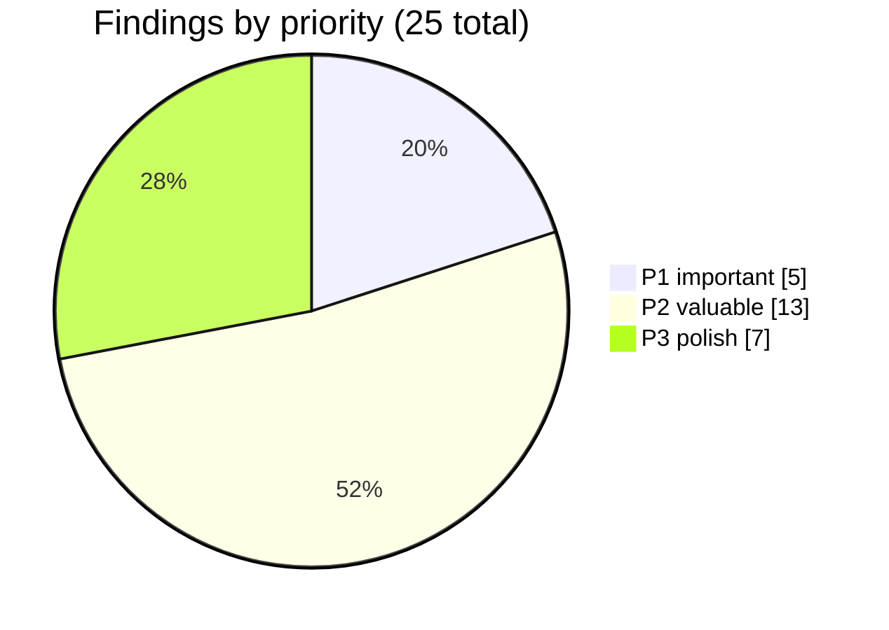

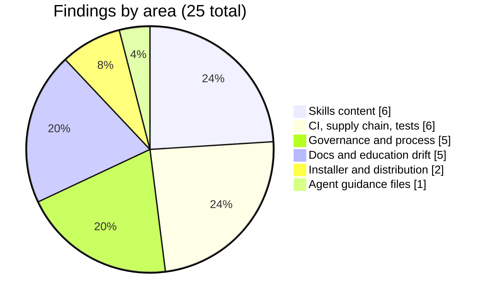

### The repo's own closure audit, run on the repo's own history

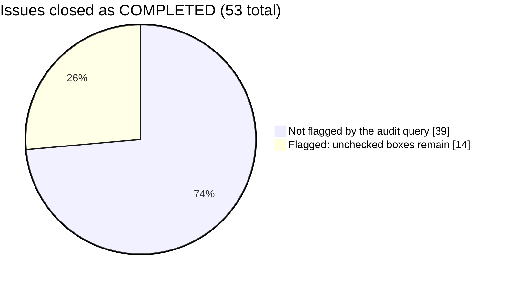

### Top ten actions, in order

| # | Action | Finding | Effort | Impact |
| --- | --- | --- | :---: | :---: |
| 1 | Do not commit `AGENTS.md` as-is. Make one agent-guidance file canonical | F02 | S | High |
| 2 | Raise the installer test timeout, make failures diagnosable, and move off Node 20 | F03, F16 | S | High |
| 3 | Give the installer a real upgrade path so `-Force` stops being the default habit | F04 | M | High |
| 4 | Remove references to files and plugins that do not ship with an installed skill | F05 | M | High |
| 5 | Add an ownership and permission gate to `github-issue-first` | F06 | S | High |
| 6 | Record the missing evidence on the 14 flagged issues, and schedule the audit | F01 | M | Medium |
| 7 | Sweep stale version, tier, and platform text, then add stamp and link tests | F10–F12, F15 | M | Medium |
| 8 | Split the release workflow into a read-only check job and a write-only publish job | F14 | S | Medium |
| 9 | Decide and document the milestone scheme, and align labels with release notes | F09, F20 | S | Medium |
| 10 | Prototype skill evals so policy wording changes are regression-tested | Section 7, theme C | L | High |

---

## 2. What this repository is

### Intent

The repo is **not an application**. It is a versioned package of twelve GitHub workflow skills (`skills/github-*/SKILL.md`) that AI coding agents read and act on. It also carries a human training program (`education/`), an installer, and a manifest. The product is **policy text plus the machinery that delivers it**: a validated inventory, an installer, and an export path for ChatGPT.

The audience has three layers:

1. **AI agents** on four platforms: OpenAI Codex, Claude Code, GitHub Copilot CLI, and ChatGPT.
2. **Maintainers** of the repo, who must keep twelve skills, four platforms, and a training program consistent.
3. **Colleagues** who learn the same workflow by reading `education/`.

Because agents act on the text, a wording change in one skill can contradict another. The repo's own guidance says so, and it is the right lens for this review.

### Shape

| Area | Files | What it holds |
| --- | ---: | --- |
| `skills/` | 29 | Twelve skills, twelve Codex sidecars, one review prompt, four templates |
| `docs/` | 30 | Guide, workflow, maintainer guide, platform guides, nine ADRs, ten planning artifacts, settings snapshot |
| `education/` | 19 | Two-track training program: GitHub track and LLM track |
| `.github/` | 10 | Four workflows, two issue forms plus `config.yml`, PR template, Dependabot, release-notes config |
| `scripts/`, `tests/`, `contracts/` | 8 | Installer, validator, five test files, skill inventory |
| `platforms/` | 5 | One short adapter stub per consumer |
| Root | 13 | README, CLAUDE.md, CONTRIBUTING, SECURITY, CODE_OF_CONDUCT, CHANGELOG, LICENSE, package files, lint configs |
| **Tracked total** | **114** | 220 commits, 5 tags, 4 releases, v0.3.0 latest |

### Architecture

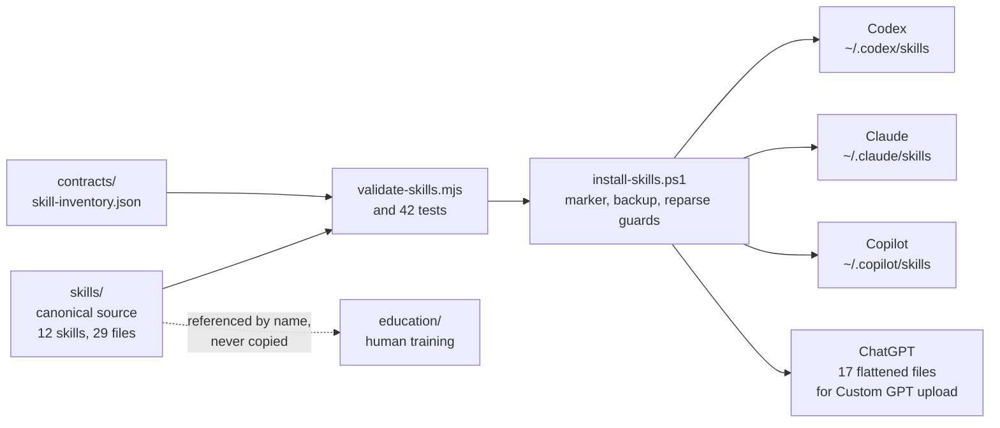

### Skill handoff model

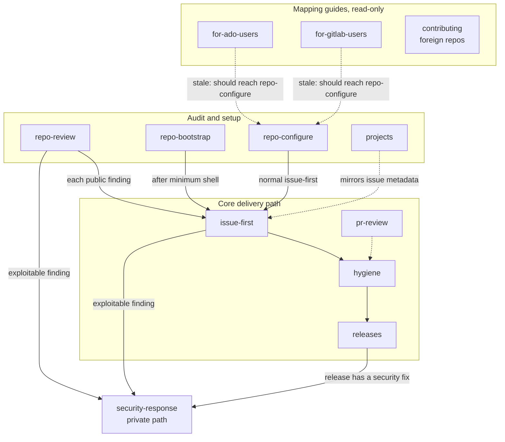

The two dotted "stale" edges are finding F10. Both mapping skills route template work to `github-repo-review`, which only audits. `github-repo-configure` ships the templates.

### Size of the policy surface

| Skill | Lines | Shape |
| --- | ---: | --- |
| `github-issue-first` | 425 | Seven topics in one file (see F25) |
| `github-projects` | 227 | Commands with PowerShell pairs |
| `github-hygiene` | 184 | PR flow, closure gate, sub-issues |
| `github-releases` | 179 | Milestones, rulesets, release recipe |
| `github-for-ado-users` | 171 | Mapping table, three traps |
| `github-for-gitlab-users` | 163 | Mapping table, three traps |
| `github-pr-review` | 144 | Review flow, fork PRs |
| `github-security-response` | 129 | Secrets, advisories, alert triage |
| `github-repo-bootstrap` | 125 | Prose-only, no command examples |
| `review-prompt.md` | 120 | Standalone audit method |
| `github-contributing` | 101 | Fork, sync, submit |
| `github-repo-configure` | 94 | Elicitation checklist plus templates |
| `github-repo-review` | 14 | Wrapper over `review-prompt.md` |

---

## 3. Verification baseline

Everything in this table was run or queried during this review. Nothing was mutated.

| Check | Result |
| --- | --- |
| `npm run check` (Windows, Node v26.10.0) | **Pass.** 42 of 42 tests, 0 lint issues across 34 + 14 + 19 Markdown files. The suite took about 127 s locally |
| Ad-hoc link and anchor scan (throwaway script) | 76 Markdown files, **0 broken** relative links or heading anchors |
| Repository settings | Public, `delete_branch_on_merge` on, Discussions on, Wiki on, Projects on |
| Ruleset `Protect main` | Active, no bypass actors, merge-only, 0 required approvals, strict required checks: `Validate skills (Node 20)`, `Validate skills (Node 22)`, `Markdown lint`, `Installer dry run (Windows)` |
| Actions permissions | Default token read-only, Actions cannot approve PRs, `allowed_actions: all`, `sha_pinning_required: false` |
| Security features | Private vulnerability reporting on, secret scanning and push protection on, Dependabot security updates on, CodeQL default setup configured weekly (includes `actions`). Non-provider patterns and validity checks off |
| Community profile | 100 percent health |
| Issues | 54 closed (53 completed, 1 not planned), 1 open (#113) |
| Closed-issue audit (`github-hygiene` query) | **14 of 53** completed issues are flagged for unchecked task boxes. Spot-check of all 14: zero boxes checked in each, every unchecked box is an acceptance criterion, and the deliverables visibly exist in the repo (F01) |
| Milestones | 10 total. Seven closed, three open (`Skill Coverage Expansion`, `Documentation & Hygiene`, `Education Program v3`). Four are release-named, six are thematic |
| Recent CI (12 runs) | 3 failures: one required-check failure on `main` (F03), two GitHub-managed "AI findings" runs (F17) |
| Releases | v0.1.0, v0.1.1, v0.2.0, v0.3.0. Latest 2026-09-28. Tag `education-v1.0.0` |

One detail of method: the `github-hygiene` audit query uses jq with `\\s` and `\\[`. It failed to parse when passed inline through this session's shell layer. It worked correctly when loaded from a file, which is exactly the workaround `docs/MAINTAINING.md` prescribes. The query itself is sound.

---

## 4. Strengths worth protecting

| Strength | Evidence |
| --- | --- |
| The closure-gate invariant is precise, repeated, and regression-tested | `tests/workflow-policy.test.mjs` scans seven policy files for false assurance |
| Triple-hardcoded roster is deliberate and guarded | `tests/roster-consistency.test.mjs` compares inventory, validator, and installer |
| Installer is defensive by design | Marker files, SHA-256 hashes, staging directory, backups, reparse-point and overlap guards, Windows-only junction tests |
| Workflow security is above typical | Every action pinned to a full SHA, explicit `permissions:` blocks, read-only default token |
| `label-pr-from-issue.yml` is a model `pull_request_target` workflow | No checkout, PR body passed through environment variables, label allow-list, minimal permissions, and a comment explaining why it is safe |
| Honest documentation of limits | ADR 0009 and 0008 record what was deliberately not built. `docs/chatgpt.md` flags the 20-file ceiling |
| Education diagrams carry a "What this shows" caption | Good accessibility habit for diagram-heavy material |
| The `github-repo-review` prompt states the plan-gating trap | A 403 on rulesets is a constraint, not a defect. This avoids a whole class of false findings |
| ADRs are immutable and indexed | Nine records, with a stated format and "when to add one" rule |
| Public-content boundary is explicit | Stated in CONTRIBUTING, the PR template, and issue forms |

---

## 5. Findings register

| ID | Sev | Confidence | Area | Finding | Effort |
| --- | :---: | --- | --- | --- | :---: |
| [F01](#f01) | 🟠 P2 | CONFIRMED / PLAUSIBLE | Governance | 14 of 53 completed issues closed with no recorded criterion evidence and unchecked boxes | M |
| [F02](#f02) | 🔴 P1 | CONFIRMED | Agent files | `AGENTS.md` is a corrupted find-and-replace copy of `CLAUDE.md` | S |
| [F03](#f03) | 🔴 P1 | CONFIRMED / PLAUSIBLE | CI | Required check failed on `main` at exactly the test helper's 20 s timeout; the failure record carries no timeout detail | S |
| [F04](#f04) | 🔴 P1 | CONFIRMED | Installer | Every upgrade needs `-Force`, which erodes the safety model | M |
| [F05](#f05) | 🔴 P1 | CONFIRMED | Skills | Installed skills cite files, ADRs, and a plugin that do not ship with them | M |
| [F06](#f06) | 🔴 P1 | PLAUSIBLE | Skills | `github-issue-first` files issues autonomously with no ownership or permission gate | S |
| [F07](#f07) | 🟠 P2 | CONFIRMED | Skills | `github-hygiene` contradicts its own `--body-file` rule | S |
| [F08](#f08) | 🟠 P2 | PLAUSIBLE | Content | Examples and education text may derive from private or workplace material | S |
| [F09](#f09) | 🟠 P2 | CONFIRMED | Governance | Milestones mix release and thematic schemes against written policy | S |
| [F10](#f10) | 🟠 P2 | CONFIRMED | Skills | Stale cross-skill handoffs and inconsistent Wiki stance | S |
| [F11](#f11) | 🟠 P2 | CONFIRMED | Docs | Stale version, platform, and tier statements | S |
| [F12](#f12) | 🟠 P2 | CONFIRMED | Education | Drift after the numbered-folder restructure | S |
| [F13](#f13) | 🟠 P2 | CONFIRMED | Installer | ChatGPT re-export needs `-Force`, never prunes, docs say otherwise | S |
| [F14](#f14) | 🟠 P2 | CONFIRMED | CI | Release workflow runs dependency code with a write-capable credential | S |
| [F15](#f15) | 🟠 P2 | CONFIRMED | Tests | Test and validator gaps let drift through | M |
| [F16](#f16) | 🟠 P2 | CONFIRMED | CI | Node 20 is end-of-life, installer tests run in five jobs, three jobs are copy-pasted | M |
| [F17](#f17) | 🟠 P2 | CONFIRMED | CI | GitHub-managed "AI findings" runs fail on recent PRs | S |
| [F18](#f18) | 🟠 P2 | CONFIRMED | Settings | Actions hardening switches are off despite full SHA pinning | S |
| [F19](#f19) | 🟡 P3 | CONFIRMED | Docs | `main` documents unreleased behavior; version stamps are manual | S |
| [F20](#f20) | 🟡 P3 | CONFIRMED | Governance | Labels, release-note categories, and the PR-label allow-list have drifted | S |
| [F21](#f21) | 🟡 P3 | PLAUSIBLE | Governance | Wiki and Projects are enabled, contrary to the bootstrap skill's defaults | S |
| [F22](#f22) | 🟡 P3 | CONFIRMED | Governance | 24 merged and 2 unmerged stale local branches | S |
| [F23](#f23) | 🟡 P3 | CONFIRMED | Docs | About 5,900 lines of planning artifacts sit unindexed and unlinted | S |
| [F24](#f24) | 🟡 P3 | CONFIRMED | Docs | Assorted papercuts | S |
| [F25](#f25) | 🟡 P3 | PLAUSIBLE | Skills | `github-issue-first` is large, and skill structure is uneven | M |

### F01

**P2, CONFIRMED (unchecked boxes) and PLAUSIBLE (work was delivered), governance. 14 of 53 completed issues were closed with unchecked boxes and no recorded criterion evidence.**

The repo's central policy is that an issue closes as completed only when every in-scope acceptance criterion is evaluated, backed by recorded evidence, and checked. A criterion that is no longer required is marked removed or superseded, not left blank (`github-hygiene:52-55`). `github-hygiene` ships an audit query for exactly this. Running it against the repo returns these issues:

| Issue | Title |
| --- | --- |
| #6 | Canonical skill roster is triplicated across validate-skills.mjs, install-skills.ps1, and skill-inventory.json |
| #8 | Installer is verified only on Windows PowerShell despite pwsh being cross-platform |
| #9 | install-skills.test.mjs suite takes 80-110s, dominated by heavy per-test filesystem setup |
| #10 | Decide disposition of the six "proposed improvements, not current policy" items in docs/GUIDE.md |
| #11 | README has no CI status badge despite validate.yml and release.yml existing |
| #12 | Adopt docs/adr/ for policy decisions that get re-litigated |
| #13 | No install path for GitHub Copilot CLI or VS Code — only Codex and Claude are supported targets |
| #14 | README release-status note is stale |
| #23 | install-skills.ps1's reparse-point ancestry guard false-positives on macOS |
| #24 | Release v0.1.1 |
| #27 | Commit CLAUDE.md — repo-root guidance file for Claude Code |
| #36 | Start an education/ folder |
| #40 | Split release/versioning: independent education-vX.Y.Z tags |
| #65 | Substantially upgrade education/ program |

**What the spot-check shows.** I read the body of all 14 issues.

- In every one, zero boxes are checked. Every unchecked box is an acceptance criterion, not a checklist of out-of-scope items.
- Ten of them (#6, #8, #9, #10, #11, #12, #13, #14, #24, #27) were closed within about 45 minutes of each other on 2026-08-11, which looks like a batch close-out. The other four were closed between 2026-09-26 and 2026-09-28.
- The deliverables visibly exist in the tree: the CI badge, `docs/adr/`, the Copilot target, `tests/roster-consistency.test.mjs`, `CLAUDE.md`, tag `v0.1.1`, the `education/` folder and its changelog, and the macOS guard fix.
- One issue, #13, has mutually exclusive criteria ("If in scope … If out of scope …"). The branch not taken should have been marked removed or superseded.

So the likely defect is **missing recorded evidence and unticked boxes**, not unmet work. I did not evaluate each criterion, so "delivered" is PLAUSIBLE.

**Why it matters.** The closure gate is the repo's most distinctive claim. A reader who runs the repo's own audit on the repo finds a flag rate of about 26 percent, which weakens the credibility of every skill that teaches the gate. It is P2 rather than P1 because the cost is to the record and the credibility, not to the product.

**Recommendation.**

1. Triage each issue without reopening it unless a criterion turns out to be unmet. Post one completion-evidence comment per issue that cites the artifact, then tick the boxes with a body file. Mark any criterion on a branch not taken as superseded.
2. Promote the deferred "automate audits" item in `docs/GUIDE.md` (lines 239 to 250). The stated reason for deferring it, a small issue count, no longer holds. A weekly scheduled workflow that runs the query and updates one tracking issue is a small job.

**Acceptance criteria.** The audit query returns zero rows, or each remaining row has a recorded scope decision. A scheduled check exists and is documented in `docs/MAINTAINING.md`.

### F02

**P1, CONFIRMED, agent files. `AGENTS.md` is a corrupted find-and-replace copy of `CLAUDE.md`. Do not commit it as it stands.**

`AGENTS.md` is untracked. Compared with `CLAUDE.md`, it shows the signature of a blind replace of "Claude" with "Codex":

| Line | Text | Problem |
| --- | --- | --- |
| 3 | `Codex (Codex.ai/code)` | Product and URL mangled |
| 10 | `OpenAI Codex, Codex, and GitHub Copilot CLI` | Same platform named twice |
| 14 | `~/.codex`, `~/.Codex` | Wrong, case-mangled path |
| 44 and 45 | Two identical `-Target Codex -DryRun` lines | The Claude line was overwritten |
| 49 | `-Target Both` means "Codex + Codex only" | Nonsense |
| 66 | `.codex/skills`, `.Codex/skills` | Mangled path |
| 167 | `docs/AGENTS.md` | Does not exist (`docs/claude.md` was renamed) |
| 185 | "Codex, Codex, Copilot, ChatGPT" | Duplicate |
| 9, 68 | "three AI coding platforms" | `CLAUDE.md` says four and explains ChatGPT |

It also predates ADR 0007 and 0009 text that `CLAUDE.md` already carries. An agent reading it would be told wrong paths and a wrong platform count.

**Recommendation.** Decide whether the repo wants an `AGENTS.md` at all. Codex and Copilot commonly read `AGENTS.md`. Options:

| Option | Description | Verdict |
| --- | --- | --- |
| A | Delete `AGENTS.md` | Simplest, but Codex and Copilot lose repo guidance |
| B | Make `AGENTS.md` canonical and reduce `CLAUDE.md` to an import of it | Single source. Verify the import syntax against current Claude Code documentation first |
| C | Keep both and generate one from the other with a script plus a drift test | Works everywhere, costs a script |

I recommend **B**, falling back to **C**. Whatever is chosen, add a test so the two cannot diverge.

### F03

**P1, CONFIRMED (failure and timing) and PLAUSIBLE (cold-start cause), CI. A required check failed on `main` at exactly the test helper's 20 s timeout, and the failure record does not say so.**

Run `36747127913` (push to `main`, commit `3780188`) failed the required check `Validate skills (Node 20)`. Exactly one test failed: `dry-run reports the complete plan without changing the filesystem`. The error is only `Command failed: pwsh -NoProfile -File … -Target Both … -DryRun -Force`, with no stderr. The test took 20.276 s, against 0.9 to 2.3 s for its neighbors. The same commit passed on Node 22, Ubuntu, Windows, and macOS in the same run, and the next push passed.

The helper explains the number. `runInstaller` in `tests/install-skills.test.mjs` passes `timeout: 20_000` to `execFile` (line 75). The failing test's duration matches that timeout, so the most likely story is that the first `pwsh` start on a cold runner took longer than 20 s and Node killed it. A killed child produces a generic "Command failed" message with empty stderr, and the helper rethrows the raw error (line 82) without reporting `error.killed`, `error.signal`, or `error.code`. The timeout cause is therefore invisible in the log.

**Why it matters.** A required check that fails on a hard-coded timeout blocks merges and trains people to re-run. `github-hygiene` says never to re-run without reading the failure, and here the log offers nothing to read. The hygiene skill also says a job that flakes twice is a defect to file, so the failure should leave enough evidence to count.

**Recommendation.**

1. Raise the timeout, for example to 60 s, or make it configurable through an environment variable.
2. On failure, wrap the error and print `killed`, `signal`, `code`, `stdout`, and `stderr`, so a timeout reads as a timeout.
3. Add a warm-up step in CI (a no-op `pwsh -NoProfile -Command exit`) before the test run.
4. If it recurs after that, file it.

### F04

**P1, CONFIRMED (code), installer. Every upgrade needs `-Force`, which erodes the safety model.**

`Test-TrackedSkill` (`scripts/install-skills.ps1`, lines 173 to 227) classifies an installed skill as valid only when both hold:

- the marker's `packageVersion` equals the **current** inventory version (line 200), and
- the recorded hash equals the **current source** hash (lines 219 to 222).

So an installed copy from an older release is reported as "non-matching marker" or "modified" even if it is byte-identical to what that release shipped. Without `-Force` the installer refuses (lines 430 to 432). The four platform docs each say "Upgrading over a previous install … needs `-Force`" (`docs/claude.md:24`, `copilot.md:37`, `openai-codex.md:24`, `vscode.md:70`).

**Consequences.**

1. Every upgrade writes a timestamped backup under `skill-backups/` that nothing ever prunes.
2. The default habit becomes "always pass `-Force`". `-Force` is also the only way past a real user edit, so the test `a modified tracked skill is refused without Force` protects less than it appears to.
3. Automation cannot express "ensure installed and current" idempotently.

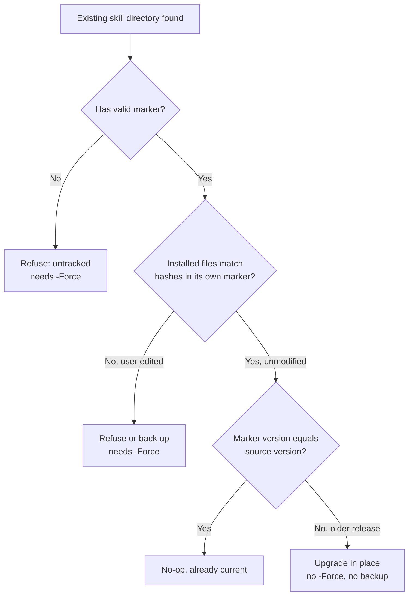

**Recommendation.** Compare installed files against the hashes recorded in their **own** marker. That separates "user modified it" from "source moved on". Unmodified older installs upgrade in place, and only genuine edits require `-Force` and a backup. Add `-KeepBackups N` or a `skill-backups` prune option. Add tests for the upgrade path and for the edited-file refusal.

### F05

**P1, CONFIRMED, skills. Installed skills cite files, ADRs, and a plugin that do not ship with them.**

The installer copies only `skills/<name>/`. The ChatGPT export flattens only `requiredFiles`. So on a consumer's machine, these references resolve to nothing:

| Skill and line | Reference | Problem |
| --- | --- | --- |
| `github-contributing:83` | `superpowers:receiving-code-review` | A third-party plugin skill, not in the roster. Absent for Codex, Copilot, and ChatGPT consumers |
| `github-issue-first:35` | `docs/repo-settings-snapshot.md` | Lives in this repo's `docs/`, not installed |
| `github-for-ado-users:22-23` | `education/0_prerequisites/session-0-…` | Lives in `education/`, not installed. The weakest row: the text is conditional ("If this repo's colleague-training program is available") and the next sentence stands alone, so this one is low risk |
| `github-repo-bootstrap:49,121`, `github-repo-configure:29`, `github-for-gitlab-users:74`, `github-projects:102` | "ADR 0003" | ADRs are not installed |
| `github-hygiene:93` | "repo history is merge commits, not squash", "`delete_branch_on_merge` is ON", `gh pr merge --merge` | Facts about **this** repo stated as general policy. On a squash-merge repo the skill instructs the wrong merge method |

The repo claims all four platforms consume `SKILL.md` verbatim. That holds only if each file stands alone.

**Recommendation.** Three complementary fixes:

1. Make each `SKILL.md` self-contained. Inline the few lines actually needed, or label the pointer "(this repository only)".
2. Where a companion is essential, ship it as a declared `requiredFile`, for example a `references/` folder, so it installs and exports.
3. Add a validator rule: any path-like token in a `SKILL.md` must resolve inside the skill directory or carry an explicit "this repository only" marker. Reject unknown `plugin:skill` references.

For the merge-method fact, phrase it as "follow the repo's configured merge method; check `gh repo view --json mergeCommitAllowed,squashMergeAllowed,rebaseMergeAllowed`".

### F06

**P1, PLAUSIBLE (code-read), skills. `github-issue-first` files issues autonomously with no ownership or permission gate.**

The skill description says to trigger "proactively and automatically, without being asked". The body says "the default move is: file the issue before you do anything else" (lines 8 to 14). The only precondition is a GitHub remote and an authenticated `gh` (lines 23 to 27). It then mandates `--assignee "@me"` (line 193).

There is no check that the user owns the repository or holds triage or write rights. There is no check that the repo is an upstream the user is contributing to. The sibling skill `github-contributing` describes exactly that foreign-repo situation, yet `issue-first` would also fire there and open issues in someone else's public tracker. Filing is an outward-facing, public action, and it is taken without a confirmation step.

**Recommendation.** Add a short **Preconditions** block:

1. Run `gh repo view --json viewerPermission`. If the result is below `TRIAGE` or `WRITE`, do not file. Hand off to `github-contributing`.
2. Note that an issue on a public repo is public. Confirm the first filing of a session once, with the same "ask once per repo" pattern the skill already uses for low-stakes repos.
3. Drop `--assignee "@me"` when the viewer cannot be assigned.

### F07

**P2, CONFIRMED, skills. `github-hygiene` contradicts its own `--body-file` rule.**

Lines 44 to 46 require `gh issue edit <N> --body-file <file>` and warn: "Do not round-trip multiline Markdown through a PowerShell string array; it can flatten the issue body." Line 155, in the sub-issue section, instructs `gh issue edit <parent> --body "..."` to update the parent checklist. That is the same hazard, in the same file.

**Recommendation.** Use `--body-file` at line 155 and add a PowerShell pair, per the repo's own dual-shell rule.

### F08

**P2, PLAUSIBLE, content. Examples and education text may derive from private or workplace material.**

`CONTRIBUTING.md:41-47` bars company names, internal policy, and copied workplace material. Text that reads as sourced from real projects:

| Location | Text |
| --- | --- |
| `github-releases:163` | Worked example `cve-reporting`, `WinCVEReport.psd1`, `Test-ModuleManifest` and Pester |
| `github-releases:13-14` | "v2.7 - quality & reliability", "Role Catalog Consistency" |
| `github-issue-first:68` | "CFO badge falls through to Engineer color" |
| `education/0_prerequisites/session-0…:27-35`, `education/CHANGELOG.md:76` | "A colleague recently lost GitHub access after a phone replacement", "the company's shared/managed authenticator setup (e.g. Microsoft Authenticator)" |
| `education/0_prerequisites/setup-local-dev-environment.md:4,15,59` | "the company's GitHub Enterprise account", "Connect VS Code to GitHub Enterprise" |

No company is named, so this is not a confirmed boundary breach. But these examples ship inside every installed skill and every ChatGPT export, which raises the stakes of getting it right.

**Recommendation.** The owner should confirm the `cve-reporting` and `WinCVEReport` names are a public or personal project. Either way, replace them with invented neutral examples. Reword the education anecdotes to be generic, or label the program as adaptable to an organization. Automate the boundary check (see section 7, theme B). A denylist committed to the repo would itself reveal the names, so load the patterns from a CI secret or a local pre-push hook rather than from a tracked file.

### F09

**P2, CONFIRMED, governance. Milestones mix release and thematic schemes against written policy.**

`docs/WORKFLOW.md:11-13` says: "This repo's milestones are release-based (named after the target tag) … not thematic buckets — reuse that scheme rather than introducing a second one." `github-releases:13` says "Two schemes in one repo is worse than either." The live milestone list:

| Scheme | Milestones |
| --- | --- |
| Release-named (4) | `v0.1.0`, `v0.1.1`, `v0.2.0`, `v0.3.0` |
| Thematic (6) | `Skill Coverage Expansion`, `Colleague Training Program`, `Release Process Improvements`, `Documentation & Hygiene`, `Education Program v2`, `Education Program v3` |

There is also no `v0.4.0` milestone, even though the ChatGPT target is sitting in `[Unreleased]`.

**Recommendation.** This is a policy decision, recorded as D-1 in section 9. The honest resolution is probably that the skillset is release-based and `education/`, which has its own tag track, uses programs. Write that down in an ADR and in `WORKFLOW.md`. Otherwise enforce the written rule going forward.

### F10

**P2, CONFIRMED, skills. Stale cross-skill handoffs and an inconsistent Wiki stance.**

| Location | Problem |
| --- | --- |
| `github-for-ado-users:154`, `github-for-gitlab-users:140` | Step "CODEOWNERS, CONTRIBUTING.md, issue forms, PR template — `github-repo-review`". Templates now ship from `github-repo-configure`, added in v0.3.0. `repo-review` only audits |
| `github-repo-review:12` | Companion list omits `github-repo-bootstrap`, `github-repo-configure`, and `github-for-gitlab-users` |
| `github-repo-bootstrap:108-110` | Mentions `github-for-ado-users` for mapping guidance but not the GitLab sibling |
| `github-for-gitlab-users:71-72` | Says "Azure DevOps (which has no wiki-equivalent gap to worry about)". Azure DevOps has a Git-backed Wiki, so the statement is inaccurate |
| `github-for-ado-users:42,87-92` versus ADR 0003 and the GitLab skill | The ADO skill calls the Wiki "a trap" and says "don't use it". ADR 0003 made the stance conditional (leave an established Wiki alone, never enable a fresh one). The GitLab skill follows the ADR. The two sister skills now disagree |

**Recommendation.** Fix the handoffs, correct the ADO factual line, and align the ADO Wiki section with ADR 0003. A roster-derived companion list (section 7, theme A) would prevent the next omission.

### F11

**P2, CONFIRMED, docs. Stale version, platform, and tier statements.**

| Location | Stale text | Current truth |
| --- | --- | --- |
| `docs/GUIDE.md:22-24` | "## Current v0.2.0 policy … as they exist in v0.2.0" | Header says v0.3.0, and the section covers v0.3.0 skills |
| `README.md:40` | "The verified v0.1.0 installer platform is Windows PowerShell" | Current release is v0.3.0. Ubuntu and macOS run as advisory checks |
| `docs/MAINTAINING.md:24-25` | "Claude, OpenAI Codex, and GitHub Copilot consume the same canonical `SKILL.md`" | Four platforms. ChatGPT omitted |
| `docs/MAINTAINING.md:100-101` | "pwsh 7+ supports both directly — see the platform notes above" | No note about PowerShell 7 chain-operator support exists anywhere above this line |
| `docs/GUIDE.md:226-250` | Issue-history narrative (#10, #19, #41) inside a policy document | Belongs in the changelog or an ADR |

### F12

**P2, CONFIRMED, education. Drift after the numbered-folder restructure.**

| Location | Stale text |
| --- | --- |
| `education/facilitator-guide.md:75` | "Advanced modules 3a-3d". Modules 3e and 3f exist |
| `education/facilitator-guide.md:83` | "six modules under `intermediate/` and `advanced/`". Folders are now `2_intermediate/` and `3_advanced/`, and there are eight modules |
| `education/facilitator-guide.md:54-63` | Pre-session checklist covers Session 2 and Modules 2a, 2b, 3b. `README.md:82-84` also lists Modules 3a and 3f as sandbox hands-on |
| `education/3_advanced/module-3a…:5`, `module-3e…:5` | "independent of Modules 3b-3d", "3a-3d". Modules 3e and 3f exist |
| `education/0_prerequisites/setup-local-dev-environment.md:1,17` | Titled "Extra: …" and says "Extra tier, not core curriculum". ADR 0009 moved it to `0_prerequisites/` as conditional prerequisite |
| Same file, line 99 | "the four extensions". The table at lines 77 to 81 lists five |
| `education/CHANGELOG.md` `[Unreleased]` | Holds two **Breaking** path renames, yet the latest tag is `education-v1.0.0` |

**Recommendation.** Fix the text. Cut `education-v2.0.0` for the breaking renames. Generate the module list, time budgets, and sandbox requirements from front matter (section 7, theme G) so this drift cannot recur.

### F13

**P2, CONFIRMED, installer. ChatGPT re-export needs `-Force`, never prunes, and the docs say otherwise.**

`docs/chatgpt.md:47-49` says: "Re-running the export overwrites the same 17 filenames; add `-Force` if the export folder already has unrelated content in it." The code (`scripts/install-skills.ps1:341-346`) throws whenever the export folder is non-empty and `-Force` is absent, including when the only content is the **previous export**. The test at `tests/install-skills.test.mjs:239` confirms the refusal. So every re-export needs `-Force`.

Two related gaps:

- A skill renamed or removed leaves its stale file in the export folder, and it would be uploaded again.
- `docs/chatgpt.md:92-97` tells users to "re-upload any changed files" but gives no way to learn which files changed.

**Recommendation.** Write a `manifest.json` (version and SHA-256 per file) into the export. On re-export, overwrite only files the previous manifest lists, remove listed files that no longer exist, and print which files changed. Correct the doc now.

### F14

**P2, CONFIRMED, CI. The release workflow runs dependency code with a write-capable credential.**

`.github/workflows/release.yml` sets `permissions: contents: write` for the whole workflow (lines 8 to 9). The single job checks out with default credentials and then runs `npm ci` (line 26) and `npm run check` (line 28). `actions/checkout` persists its token in `.git/config` by default, so dependency lifecycle scripts and the test suite run with a write-capable credential on disk. This is low probability with two dev dependencies, but it is exactly the class of exposure the repo's own `github-security-response` skill tells readers to remove.

Other gaps:

| Gap | Detail |
| --- | --- |
| No check that the tag commit is on `main` | Any `v*` tag pushed from any commit publishes a release |
| No CHANGELOG-section guard | `github-releases` teaches this exact guard ("Tagging before the CHANGELOG section exists → release.yml exits 1"), but this repo's own workflow does not implement it |
| No release assets | No archive, checksums, or provenance attestation, although the repo's product is a package |

**Recommendation.** Split into two jobs. A `check` job with `contents: read`, `persist-credentials: false`, and `npm ci --ignore-scripts`. A `publish` job that `needs: check` and holds the only `contents: write`. Add the main-ancestry and CHANGELOG checks. Consider attaching a zipped skills bundle, the ChatGPT export, and checksums with a build-provenance attestation.

### F15

**P2, CONFIRMED, tests. Test and validator gaps let drift through.**

| Gap | Evidence | Would have caught |
| --- | --- | --- |
| ChatGPT export count is not asserted to stay at most 20 | ADR 0006 and `docs/chatgpt.md:43-45` say to watch it. It is at 17 | A future skill crossing the ceiling |
| The roster is checked across three files only | README list, `bug.yml` dropdown, `chatgpt.md` Instructions block, `GUIDE.md` sections, `CLAUDE.md` are not compared | F10 and any future roster change |
| The validator never checks that `description` exists | `validate-skills.mjs:45-51,210-220` validates only `name`. The `warnings` array (lines 73, 240) is never populated | A skill that never triggers |
| The invariant test covers seven files | `workflow-policy.test.mjs:8-16` omits nine `SKILL.md` files, `cheat-sheet.md`, module 2a, the PR templates, and `CLAUDE.md` | Wording drift in uncovered copies |
| No link or anchor check | I found no link checker in `npm run check`. ADR 0009:10-12 implies one exists | Broken references after a move |
| No shell-snippet syntax check | `docs/MAINTAINING.md:104-110` demands every PowerShell example be verified to run | F07-class slips |
| No automated public-content scan | `CONTRIBUTING.md:41-47` is manual | F08 |
| Stamps are unchecked | `Policy version: v0.3.0` and `Reviewed: 2026-09-28` in `GUIDE.md`, `WORKFLOW.md`, `MAINTAINING.md`. `SECURITY.md:5` hard-codes "v0.3.0" | F11 and F19 |

Separately, the installer suite takes about 127 s locally and runs in five CI jobs (F16).

### F16

**P2, CONFIRMED, CI. Node 20 is end-of-life, installer tests run five times, three jobs are copy-pasted.**

- `package.json` declares `engines: node >=20`, and CI tests Node 20 and 22. Under the public Node.js release schedule, Node 20 reached end-of-life in April 2026 and Node 24 is the active LTS. I did not re-verify the schedule in-session, so treat the dates as PLAUSIBLE. Local development already runs Node v26.10.0.
- `tests/install-skills.test.mjs` runs in the Node 20 job, the Node 22 job (both through `npm test`), and the three installer jobs. That is five executions of the slowest test file.
- The three installer jobs (`validate.yml:61-168`) are near-identical blocks that differ only in `runs-on` and `continue-on-error`.
- There is no `concurrency` group and no `timeout-minutes`. The dry-run step exercises only `-Target Both`, so Copilot and ChatGPT are covered only by the unit tests.
- **Coupling to watch:** the ruleset requires the check names `Validate skills (Node 20)`, `Validate skills (Node 22)`, and `Installer dry run (Windows)`. Renaming a job silently orphans a required check. Change the ruleset in the same PR.

**Recommendation.** Move to Node 22 and 24, with `engines` set to `>=22`. Collapse the installer jobs into one matrix with `fail-fast: false`. Run the installer suite on the three OS legs only. Add `concurrency` and `timeout-minutes`. Document the required check names in `docs/MAINTAINING.md`.

### F17

**P2, CONFIRMED, CI. GitHub-managed "AI findings" runs fail on recent PRs.**

Runs `36746969903` (PR #110) and `36748228364` (PR #112), both named "Code scanning AI findings", failed with `CAPIError: 400 The requested model is not supported`. They are dynamic GitHub workflows, not files in `.github/workflows/`. They are not in the ruleset's required checks, so nothing is blocked. But they show as red on PRs, which collides with `github-hygiene`'s rule "never merge on a red or pending check", and they are noise that trains people to ignore red.

**Recommendation.** Options: turn off the AI-findings feature in **Settings → Code security**, leave it and document it as a known non-blocking failure in `docs/MAINTAINING.md`, or report it to GitHub. The hygiene skill's "infrastructure break" rule says to file it as its own issue.

### F18

**P2, CONFIRMED, settings. Actions hardening switches are off despite full SHA pinning.**

| Setting | Current | Suggestion |
| --- | --- | --- |
| `sha_pinning_required` | `false` | Turn on. Every workflow already pins to a full SHA, and Dependabot keeps them current. Verify no unpinned reference remains first |
| `allowed_actions` | `all` | Restrict to GitHub-owned actions (`actions/*` and `github/*`). The workflows use only `actions/*`, and CodeQL default setup uses `github/codeql-action`. After tightening this or `sha_pinning_required`, confirm the GitHub-managed dynamic workflows still run |
| Workflow linting | None | Add `actionlint` and `zizmor`. `zizmor` would flag the default `persist-credentials` and document the `pull_request_target` reasoning |
| `secret_scanning_non_provider_patterns`, `validity_checks` | Off | Enable if the plan allows. Low cost |
| Code scanning, default token, PR approval by Actions | Good | Keep |

### F19

**P3, CONFIRMED, docs. `main` documents unreleased behavior, and version stamps are manual.**

`README.md:60-62` documents `-Target ChatGPT`, but the latest release, v0.3.0, does not contain it (`CHANGELOG.md` `[Unreleased]`). The numbered education folders are likewise only on `main`. A reader on `main` sees features that someone installing from the v0.3.0 tag does not have. `SECURITY.md:5` ("The latest published release is v0.3.0") and the `Policy version` stamps need a manual edit at every release.

**Recommendation.** Add a banner distinguishing `main` from the latest release, or stamp versions at release time with a script. Add a test that every stamp equals `package.json`'s version. The README already sequences "tag first, update this line after", so the test must allow that intended lag.

### F20

**P3, CONFIRMED, governance. Labels, release-note categories, and the PR-label allow-list have drifted.**

Every label `.github/release.yml` names exists, which is good. But `developer-experience` and `decision-needed` exist with no release-note category. `label-pr-from-issue.yml:53` has its own hard-coded allow-list, separate from `release.yml`, that also omits them. So issues labeled `developer-experience` produce PRs that land in "Other". `github-issue-first:136` names a `testing` label in its default set, but the repo has none.

**Recommendation.** Add the missing categories or retire the labels. Derive the workflow's allow-list from `release.yml`, or add a test that the two match.

### F21

**P3, PLAUSIBLE, governance. Wiki and Projects are enabled, contrary to the bootstrap skill's defaults.**

The live settings show `hasWikiEnabled: true` and `hasProjectsEnabled: true`. `github-repo-bootstrap` says to keep Projects disabled unless approved and to never enable a fresh Wiki. Both are GitHub's defaults for a new repo, so this may be an oversight rather than a decision. I did not check whether either holds content.

**Recommendation.** Check for content. Disable both, or record the decision in an ADR.

### F22

**P3, CONFIRMED, governance. 24 merged and 2 unmerged stale local branches.**

`git branch --merged main` lists 24 local branches. Two more, `docs/education-scaffolding` and `feat/skills-roster-optimization`, show as unmerged and may be squash-equivalents or abandoned. The remote is clean, since `delete_branch_on_merge` works. This is the local clone only. `github-hygiene` has the cleanup checklist for it.

### F23

**P3, CONFIRMED, docs. About 5,900 lines of planning artifacts sit unindexed and unlinted.**

`docs/superpowers/` holds five plans and five specs, 5,911 lines in total. They are excluded from linting (`package.json` line 11), have no index or status, and include the source of the F08 examples. The directory name is tied to a specific authoring tool.

**Recommendation.** Add a short `README.md` that marks them as historical, or move them under `docs/design-history/`. Consider whether they belong in the public repo at all.

### F24

**P3, CONFIRMED, docs. Assorted papercuts.**

| Item | Detail |
| --- | --- |
| `docs/vscode.md:87-89` | An unresolved "Needs verification" note in user-facing documentation |
| `docs/repo-settings-snapshot.md` | Uses `head` and `grep`, breaking the repo's own dual-shell rule |
| `CODE_OF_CONDUCT.md` | Not linked from `README.md` or `CONTRIBUTING.md`. Based on Contributor Covenant 2.0, where 2.1 is current |
| `platforms/*/README.md` | Five three-line stubs that only point to `docs/`. They duplicate the routing in the README |
| `.gitattributes` | Covers only `skills/`. No repo-wide line-ending policy and no `.editorconfig` |
| `package.json` | No `description`, `repository`, `license`, `bugs`, or `homepage` fields, and no `.node-version` |
| `github-pr-review:62` | Muddled comment: `git checkout main # or: gh pr checkout is a real branch switch` |
| `-Target Both` | Means Codex plus Claude only, and is the default. Surprising now that there are four targets |
| `.claude/settings.local.json` | Ignored only through the owner's global gitignore. A repo-level entry would protect other contributors |
| `docs/adr/` index | ADR 0009 supersedes part of ADR 0007, but the index shows no status column, and immutability means ADR 0007 cannot say so itself |

### F25

**P3, PLAUSIBLE, skills. `github-issue-first` is large, and skill structure is uneven.**

`github-issue-first` is 425 lines covering filing, labels, issue types, templates, dependencies, ADRs, Discussions, and closing rules. It is the always-on trigger skill, so its size costs context on every activation. `github-repo-bootstrap` has no command examples at all, where its siblings carry Bash and PowerShell pairs. `github-repo-review` is a 14-line wrapper whose real content lives in `review-prompt.md`, and that shape is deliberate and documented. There is no shared skeleton such as Trigger, Preconditions, Procedure, Stop conditions, Common mistakes, and Handoffs.

---

## 6. Content quality review by area

### Skills

| Skill | Quality | Notes |
| --- | :---: | --- |
| `github-issue-first` | ●●●●○ | Excellent content. Needs a preconditions gate (F06), a size review (F25), and neutral examples (F08) |
| `github-hygiene` | ●●●●○ | Sharp closure gate. Repo-specific facts (F05) and the `--body` contradiction (F07) |
| `github-releases` | ●●●●○ | Strong plan-gating guidance. Private-looking worked example (F08). The recipe's CHANGELOG guard is not dogfooded (F14) |
| `github-pr-review` | ●●●●● | Clear verdict table, fork-PR section, untrusted-code warning. One muddled comment (F24) |
| `github-security-response` | ●●●●● | "Rotate first" is correct and well argued. Reachability table is practical |
| `github-repo-review` and `review-prompt.md` | ●●●●● | Best-in-set method. Plan-gating and scaffolding-baseline rules avoid false findings |
| `github-repo-bootstrap` | ●●●○○ | Sound policy, but prose-only and thin on verifiable commands (F25) |
| `github-repo-configure` | ●●●●○ | Tight. Its own disclaimer says the templates are a first pass |
| `github-projects` | ●●●●○ | Thorough. Correctly says a solo repo needs no board |
| `github-contributing` | ●●●○○ | Good flow, dangling plugin reference (F05) |
| `github-for-ado-users` | ●●●●○ | Insightful traps. Stale handoff, Wiki stance (F10) |
| `github-for-gitlab-users` | ●●●●○ | Good. Inaccurate ADO aside, stale handoff (F10) |

### Documentation

| Document | Verdict |
| --- | --- |
| `README.md` | Clear and complete. Stale "v0.1.0" line, describes unreleased behavior without a banner (F11, F19) |
| `CONTRIBUTING.md`, `SECURITY.md` | Precise and honest. `SECURITY.md` says no response time is promised, which is candid. The version line is manual (F19) |
| `docs/GUIDE.md`, `WORKFLOW.md`, `MAINTAINING.md` | Accurate in substance. Stale headings and stamps (F11) |
| Platform guides | Consistent. The `-Force` upgrade advice will change with F04. Tool-behavior claims have no "verified on" date |
| `docs/chatgpt.md` | Good walkthrough. Re-export statement is wrong (F13). The 20-file limit is an external claim with no freshness check |
| ADRs 0001 to 0009 | High quality, immutable, well indexed. No ADR yet for the installer safety model, the PowerShell-only decision, or the Node-version policy |

### Education

| Area | Verdict |
| --- | --- |
| Structure | Sound: numbered tiers, routing flowchart, mindmap, facilitator guide, cheat sheet |
| Pedagogy | Strong: objectives, hands-on exercise, self-check, feedback loop. Module 2a's deliberate trigger of the connected-branch gotcha is excellent |
| Accuracy | Mirrors the skills and points at them by name. Drift after restructure (F12) |
| Portability | ADR 0008 chose bundling, not yet built. Workplace cues (F08) |
| Gap | Self-checks have no answer key. The sandbox repo is set up by hand from a checklist |

### Scripts, tests, CI

| Area | Verdict |
| --- | --- |
| `install-skills.ps1` | Well engineered and commented. The ancestry-bound comment is a model. Upgrade and export semantics need work (F04, F13) |
| `validate-skills.mjs` | Clean, exported for reuse by tests. Validates less than it could (F15) |
| Tests | Clear names, TDD evidence in ADRs. Diagnostics and coverage gaps (F03, F15) |
| `validate.yml` | Correct and readable. Duplicated and slow (F16) |
| `release.yml` | Clear and simple. Token scope and missing guards (F14) |
| `label-pr-from-issue.yml` | Exemplary. Allow-list duplicated (F20) |
| `dependabot.yml` | Good grouping. Hard-coded assignee. Consider cooldown |

### Templates

The issue forms and PR template are coherent and dual-use (human and agent). The repo's own `bug.yml` has no environment field (OS, Node, `gh` version, platform target), which would speed installer triage. The PR template's checklist is solid.

---

## 7. Improvement catalog

Each theme lists **variations**, so the maintainer can choose a depth.

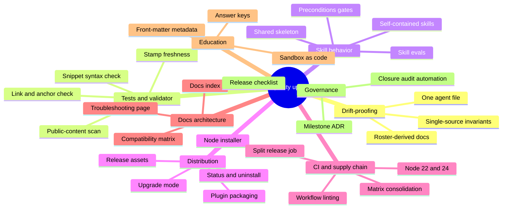

### Theme A — Drift-proofing (prose that must stay in sync)

| Variation | What | Effort | Benefit | Trade-off |
| --- | --- | :---: | --- | --- |
| A1 | Generate the `Refs #N` / `Closes #N` paragraph into every file from one canonical block, with a `--check` mode in CI | M | Removes the largest hand-synced duplication. It appears verbatim in at least seven files and paraphrased in more | Generated regions in prose files need clear markers |
| A2 | Keep hand-written copies but extend `workflow-policy.test.mjs` to every file carrying the invariant | S | Cheap, catches wording drift | Still edited by hand in many places |
| A3 | Add `description`, `summary`, and `trigger` fields to `skill-inventory.json` and generate the README skill list, GUIDE sections, `chatgpt.md` Instructions block, `bug.yml` dropdown, and each skill's companion list | L | Makes roster changes one edit. Prevents F10 | Adds generator and review overhead |
| A4 | Tests-only version of A3: assert that each of those places mentions exactly the roster names | S | Catches omissions without generation | Does not remove duplication |
| A5 | One canonical agent-guidance file (F02, option B) | S | Ends `AGENTS.md` and `CLAUDE.md` divergence | Verify import support on each platform |

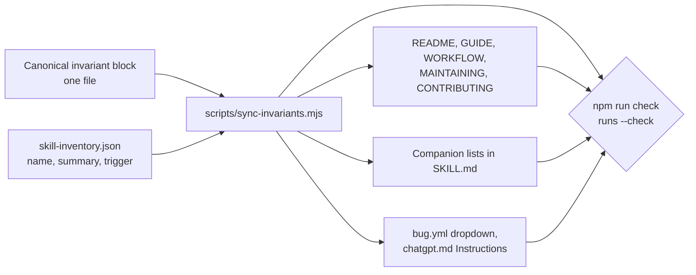

**Recommendation.** A2 and A4 now, A5 now, then A1 once the test net is in place. Consider A3 when a thirteenth skill is proposed.

### Theme B — Tests and validator

| Variation | What | Effort | Benefit |
| --- | --- | :---: | --- |
| B1 | Productize my ad-hoc link and anchor scan as `tests/links.test.mjs` | S | Catches broken references after every move. I already have a working version (76 files, 0 broken) |
| B2 | Extract every fenced `bash` and `powershell` block from skills and docs. Syntax-check Bash with `bash -n` and PowerShell with the language parser | M | Enforces `MAINTAINING.md`'s rule that examples are verified |
| B3 | Validator rules: `description` present and within the open Agent Skills length limit (1,024 characters; verify the current spec), starts with "Use when", no unknown frontmatter keys, `default_prompt` names `$<skill>`, no path-like token outside the skill directory (F05), no unknown `plugin:skill` reference | S | Turns F05 and F15 into failing checks |
| B4 | Cross-reference rule: every backticked `github-*` token names a real skill | S | Catches typos and dead references |
| B5 | Assert ChatGPT export size at most 20 files | S | Guards the ceiling ADR 0006 flagged |
| B6 | Stamp test: every `Policy version`, `Applies to`, and `SECURITY.md` version equals `package.json` (allowing the documented release lag) | S | Ends manual version chasing |
| B7 | Public-content scan: secret-scanning patterns plus an owner-supplied denylist loaded from a CI secret or a local pre-push hook | M | Automates a rule that is currently manual. Keeps private names out of the public repo |
| B8 | Speed: shared fixtures, `--test-concurrency`, run the installer suite on OS legs only | M | Cuts CI time and cost |
| B9 | Release-notes test: labels in `release.yml` equal the allow-list in `label-pr-from-issue.yml` | S | Fixes F20 durably |

**Recommendation.** B1, B3, B4, B5, B6, and B9 are all small. Do them as one PR. Do B2 next. Do B7 once the owner supplies patterns.

### Theme C — Skill behavior quality

The skills are prompts that agents follow. The repo validates their structure but not their behavior.

| Variation | What | Effort | Benefit | Trade-off |
| --- | --- | :---: | --- | --- |
| C1 | **Trigger evals:** a folder of realistic prompts with the expected skill, run through the `skill-creator` evaluation tooling | L | Detects descriptions that over- or under-trigger. Protects against regressions when wording changes | Needs an agent runtime in CI, or a manual run per release |
| C2 | **Behavior evals:** golden scenarios with assertions, for example "agent on a foreign repo does not file an issue" (F06), "agent uses `Refs` while a criterion is unmet" | L | Tests the policy itself, not its text | Non-deterministic. Use thresholds |
| C3 | **Safety-gate red-team prompts:** attempts to skip approval, rewrite history, or file a vulnerability publicly | M | Directly validates the repo's core promises | Needs maintenance as phrasing shifts |
| C4 | **Preconditions and stop conditions** in each skill (F06) | S | Makes side effects explicit | Adds a few lines per skill |
| C5 | **Self-contained skills** with "this repository only" callouts (F05) | M | Real portability across all four platforms | Some duplication of text |
| C6 | **Shared skeleton:** Trigger, Preconditions, Procedure, Stop conditions, Common mistakes, Handoffs, enforced by the validator | M | Uniform shape, easier review | One-time rewrite of twelve files |
| C7 | **Progressive disclosure:** keep `SKILL.md` short and move long material, such as the ADR and Discussions sections of `github-issue-first`, into declared `requiredFiles` under `references/` | M | Lowers per-activation context cost | Touches the inventory, installer list, and ChatGPT export count (see B5) |
| C8 | **Tested-tool matrix:** record the minimum `gh` version and the commands that need newer features (sub-issues, `issue develop`, `--type`) in a compatibility page | S | Helps users diagnose failures | Needs periodic refresh |

**Recommendation.** C4 and C5 now. C8 next. Then pilot C1 and C3 with a small set of prompts before committing to C2 and C7.

### Theme D — Installer and distribution

| Variation | What | Effort | Benefit | Trade-off |
| --- | --- | :---: | --- | --- |
| D1 | **Upgrade mode** (F04) | M | Ends "always `-Force`". Real edits still protected | Needs careful tests |
| D2 | **ChatGPT manifest and prune** (F13) | S | Re-export becomes idempotent and tells you what changed | Adds a file to the export folder, so count it against the 20-file limit |
| D3 | **`-Status`, `-List`, `-Uninstall`, `-Target All`**, deprecate `Both` with a warning | M | Completes the lifecycle, removes the surprising default | Introduces new surface to maintain |
| D4 | **Backup pruning** (`-KeepBackups N`) | S | Stops unbounded `skill-backups/` growth | Small |
| D5 | **Release assets:** zipped skills, ChatGPT export, SHA-256 checksums, build-provenance attestation | M | Consumers can install without cloning. Verifiable supply chain | Release workflow grows |
| D6 | **Claude Code and Copilot plugin or marketplace packaging** | M | `install` becomes one command inside the agent | I did not verify the current plugin specifications. Investigate before committing |
| D7 | **Node installer** alongside or replacing the PowerShell script | L | Removes the `pwsh` requirement on macOS and Linux. The repo already depends on Node | Loses the hard-won Windows junction tests unless ported. Needs an ADR |
| D8 | **Optional `npx`-style entry point** | M | Zero-clone install | Requires publishing decisions and a `private: true` change |
| D9 | **Installer threat-model ADR:** document what the guards defend against and what is out of scope | S | Preserves the reasoning now scattered in code comments | None |

**Recommendation.** D1, D2, D4, and D9 are well-scoped and valuable. D5 follows naturally from F14. Treat D6 and D7 as investigations with an ADR each.

### Theme E — CI, supply chain, and release

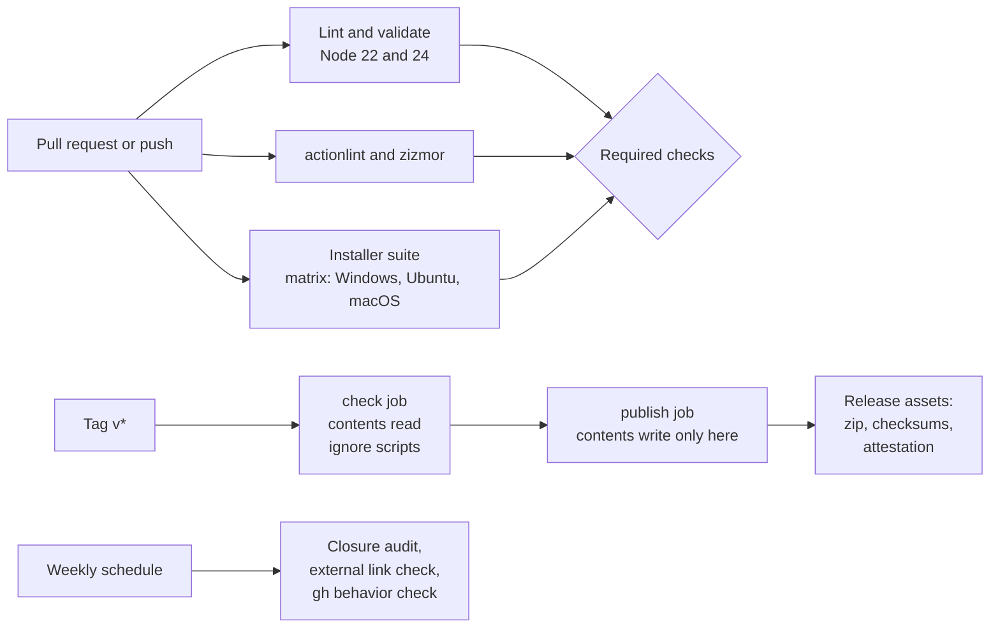

| Variation | What | Effort | Benefit |
| --- | --- | :---: | --- |
| E1 | Node 22 and 24 matrix, `engines >=22`, update the ruleset check names in the same PR | S | Removes an end-of-life runtime |
| E2 | One installer matrix job with `fail-fast: false` and advisory legs | M | Removes about 100 duplicated lines |
| E3 | `concurrency` (cancel superseded runs) and `timeout-minutes` | S | Saves minutes, bounds hangs |
| E4 | Split `release.yml` (F14) plus main-ancestry and CHANGELOG guards | S | Least privilege, catches bad tags |
| E5 | Turn on `sha_pinning_required`, restrict `allowed_actions` (F18) | S | Enforces what is already practiced |
| E6 | Add `actionlint` and `zizmor` | S | Continuous workflow security review |
| E7 | `dependency-review-action` on PRs and Dependabot `cooldown` | S | Catches risky dependency changes |
| E8 | OpenSSF Scorecard workflow and badge | S | Public, independent view of the posture |
| E9 | Weekly scheduled job: closure audit (F01), `lychee` external link check, smoke test of the `gh` commands the skills teach | M | Catches drift in the outside world, such as GitHub changing a CLI flag |
| E10 | Signed tags and commits | M | Stronger provenance for a policy package |

### Theme F — Documentation architecture

The content is good. The navigation makes the reader do the routing. Applying the four Diátaxis modes gives a map:

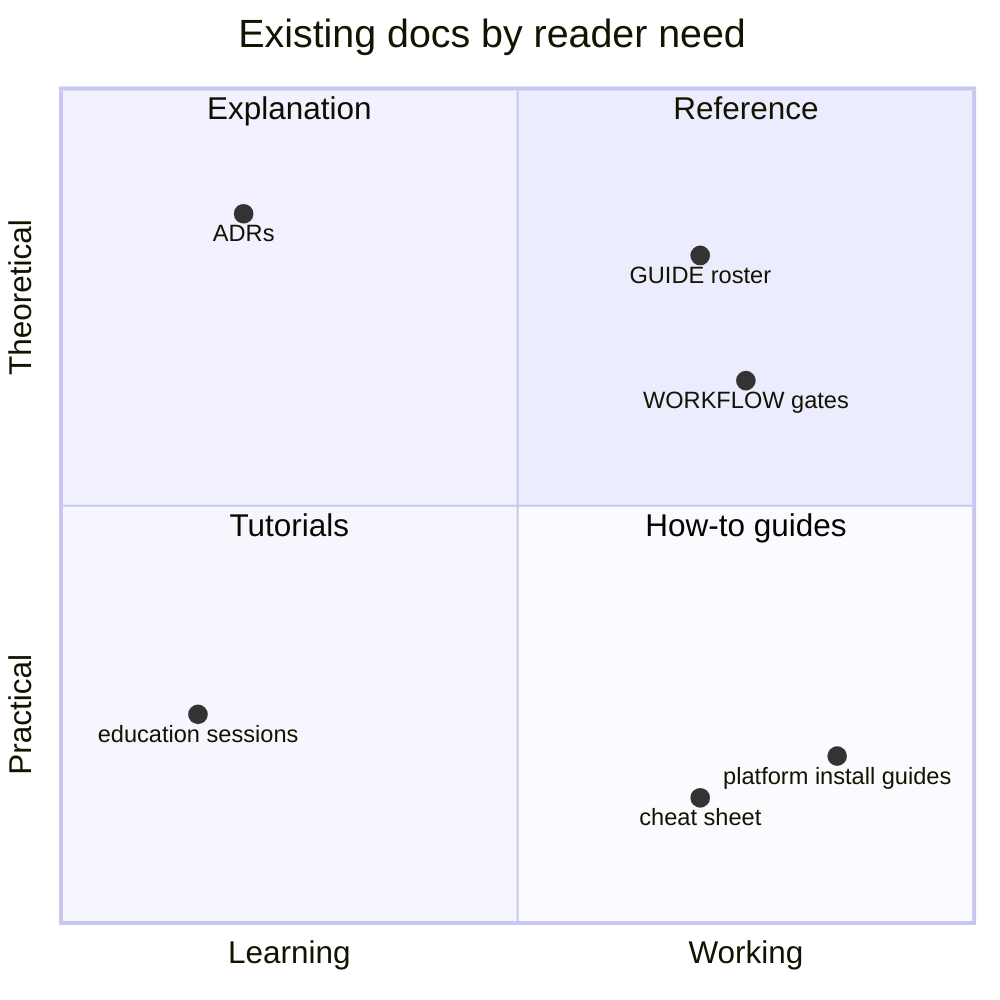

| Variation | What | Effort | Benefit |
| --- | --- | :---: | --- |
| F1 | `docs/README.md` index grouped by reader need: install, understand, maintain, decide | S | Ends the flat list of eight links |
| F2 | One **platform matrix** page: platform, install location, metadata read, reload method, verified on (date), known limits. Fold the five `platforms/` stubs into it | M | Replaces six near-identical pages with one scannable table |
| F3 | `docs/TROUBLESHOOTING.md` mapping each installer error string to cause and fix, for example "untracked existing skill has no valid marker" | S | The installer has deliberate, specific errors that deserve documented answers |
| F4 | A short "start here by persona" table and an architecture diagram in the README | S | Faster orientation |
| F5 | Move changelog-style narrative out of `GUIDE.md` into the changelog or an ADR | S | Keeps policy docs purely current |
| F6 | Replace manual `Reviewed:` stamps with the test in B6, or drop them | S | Honest freshness |
| F7 | Glossary of repo terms: closure gate, `Refs` semantics, roster, skillset, sandbox | S | Helps new readers and agents |
| F8 | Dated "verified on" notes with source links for external claims: Copilot skill paths, ChatGPT's 20-file limit, `gh` flags | M | External facts are the most likely to go stale |

### Theme G — Education program

| Variation | What | Effort | Benefit |
| --- | --- | :---: | --- |
| G1 | Add front matter to each module: tier, minutes, prerequisites, sandbox needs, skills referenced. Generate the README table, the mindmap, and the facilitator checklist | M | Removes F12-class drift for good |
| G2 | **Sandbox repo as code:** a seed script using `gh` that creates labels, a milestone, a board with one linked item and one draft item, and `CONTRIBUTORS.md` | M | The facilitator's checklist becomes one command and resets cleanly between cohorts |
| G3 | Answer keys for the self-checks, collapsed by default | M | Self-paced learners can verify understanding |
| G4 | Cut `education-v2.0.0`; make the tag check also validate structure | S | The two breaking changes get a release |
| G5 | Neutralize workplace cues or add an "adapting this program to your organization" note (F08) | S | Honest about audience, keeps the boundary |
| G6 | Build the ADR 0008 bundle: a script that collects `education/` plus only the skill files it references | M | Makes the program portable as decided |
| G7 | Decide what belongs in the reserved `4_next-level/` tier, for example code review with agents, prompt hygiene, secure agent use | L | Gives the LLM track its promised depth |
| G8 | Printable or PDF build for offline cohorts | M | Matches the Markdown PDF extension the setup page recommends |

### Theme H — Governance and self-application

| Variation | What | Effort | Benefit |
| --- | --- | :---: | --- |
| H1 | Triage the 14 issues (F01) and schedule the audit (E9) | M | Restores the flagship claim |
| H2 | ADR for milestone scheme (F09) | S | Ends the policy and reality mismatch |
| H3 | Release checklist as an issue form that includes stamps, changelog, SECURITY version, milestone close, and education tag | S | The release recipe becomes executable |
| H4 | Align labels and release categories (F20) | S | Correct release notes |
| H5 | Check and disable Wiki and Projects, or record the decision (F21) | S | Practices what bootstrap teaches |
| H6 | Prune local branches (F22) | S | Hygiene |
| H7 | Add compare links to `CHANGELOG.md` headings | S | Standard Keep a Changelog practice |
| H8 | Add `CODE_OF_CONDUCT` link to README and CONTRIBUTING | S | Discoverability |

### Theme I — Security posture

The baseline is already strong. Incremental options:

| Variation | What | Effort |
| --- | --- | :---: |
| I1 | E4, E5, E6, E7 from theme E | S |
| I2 | Enable secret-scanning non-provider patterns and validity checks | S |
| I3 | `SECURITY.md`: add a backup contact if private reporting is disabled, and a coordinated-disclosure note. Keep the honest "no promised timeline" statement | S |
| I4 | Installer threat-model ADR (D9) | S |
| I5 | Consider `npm ci --ignore-scripts` in every workflow | S |

### Theme J — Content and style

| Variation | What | Effort |
| --- | --- | :---: |
| J1 | A short style guide: voice, use of MUST and SHOULD, how to write an example, how to name things | S |
| J2 | Prose linting with Vale or cspell against the glossary | M |
| J3 | Replace workplace-derived examples with a small library of neutral invented ones, reused across skills | S |
| J4 | Mark each skill's repository-specific statements with a consistent "This repository:" callout | S |

### Impact versus effort

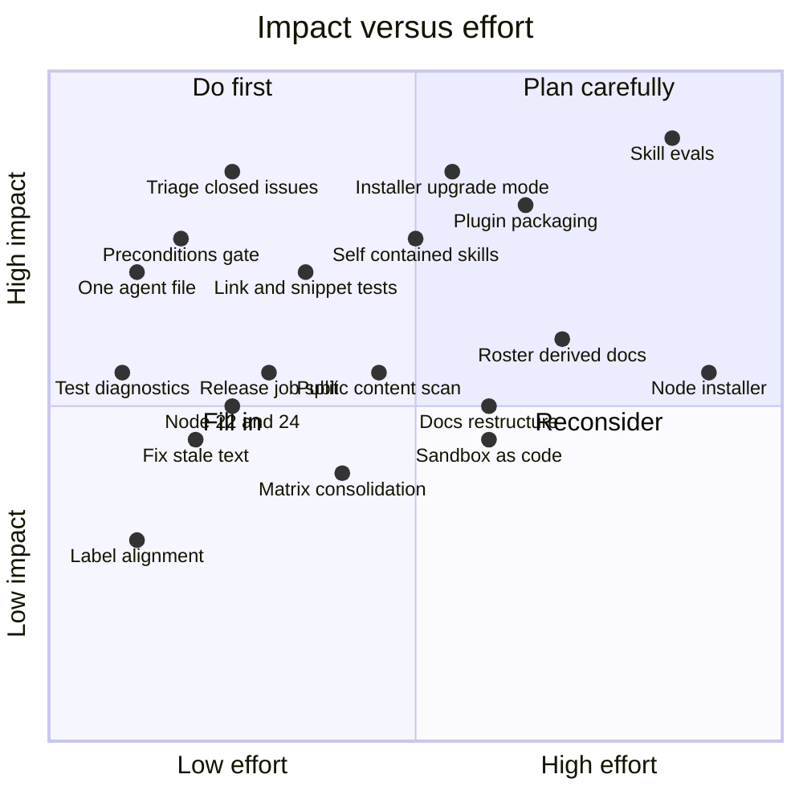

---

## 8. Roadmap

### Phasing

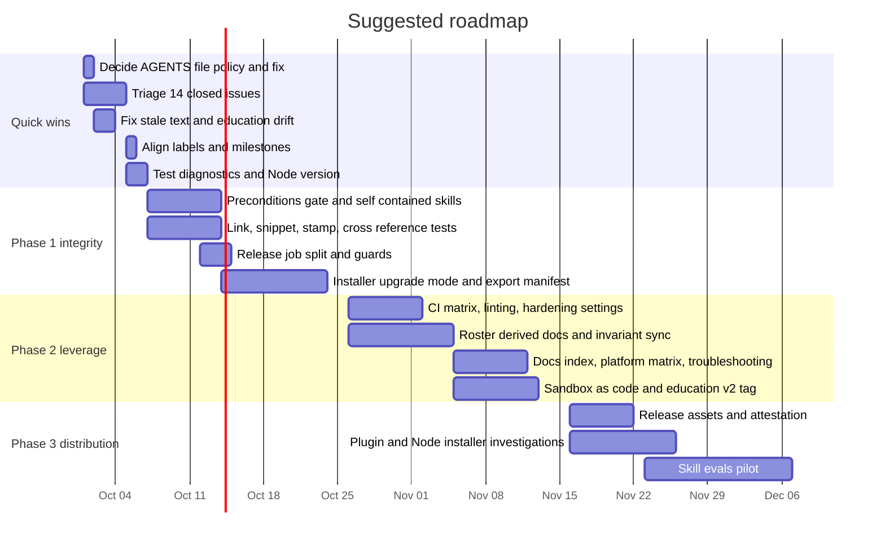

### Proposed milestone structure

Follow the decision in D-1. If release-based is kept:

| Milestone | Contents |
| --- | --- |
| `v0.4.0` | Phase 1 and the installer upgrade mode. Ships the ChatGPT target that is sitting in `[Unreleased]`. Consider the release the moment the tests in Theme B land |
| `v0.5.0` | Phase 2: CI, generated docs, release assets |
| `education-v2.0.0` | Breaking path renames, front-matter metadata, sandbox as code |
| Backlog | Plugin packaging, Node installer, skill evals |

### Issue-creation plan

The plan exceeds ten items, so under the review methodology it is **grouped and held for maintainer confirmation**. Nothing has been filed.

| Epic | Proposed issues | Priority | Milestone |
| --- | --- | :---: | --- |
| E1 Closure-gate integrity | Record evidence on the 14 flagged issues. Schedule a weekly closure audit | P2 | `v0.4.0` |
| E2 Agent guidance files | Decide and implement a single canonical agent file, and add a drift test | P1 | `v0.4.0` |
| E3 Installer lifecycle | Upgrade mode. ChatGPT manifest and prune. Backup pruning. `-Status`, `-Uninstall`, `-Target All` | P1, P2, P3 | `v0.4.0` and `v0.5.0` |
| E4 CI reliability and hardening | Installer test timeout and failure diagnostics. Node 22 and 24 with ruleset update. Matrix consolidation. Release job split and guards. Actions hardening settings and workflow linters. Decide the "AI findings" noise | P1, P2 | `v0.4.0` and `v0.5.0` |
| E5 Skill quality | Remove non-shipping references and repo-specific facts. Preconditions gate for `issue-first`. Fix `--body` contradiction and stale handoffs. Public-content audit of examples | P1, P2 | `v0.4.0` |
| E6 Tests and drift-proofing | Link, anchor, and snippet tests. Validator rules. Stamp and roster-surface tests. Release-label test | P2 | `v0.4.0` |
| E7 Docs and education freshness | Stale text sweep. Education drift and `education-v2.0.0`. Docs index, platform matrix, troubleshooting. Sandbox as code | P2, P3 | `v0.5.0`, `education-v2.0.0` |
| E8 Governance | Milestone-scheme ADR. Label alignment. Wiki and Projects decision. Branch cleanup. Changelog compare links | P2, P3 | `v0.4.0` |
| Investigations | Plugin packaging. Node installer. Skill evals. Release assets | P3 | Backlog |

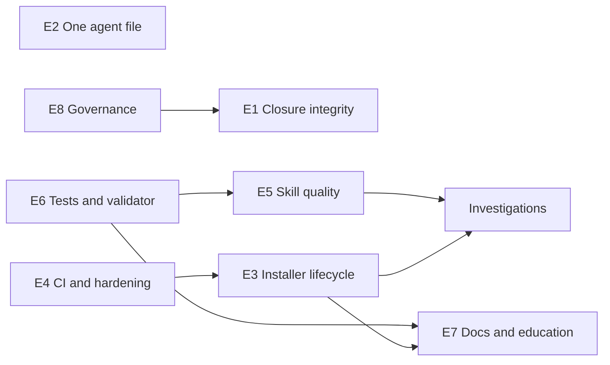

Reading the map: test infrastructure (E6) unlocks safe skill edits (E5) and trustworthy docs (E7). The CI changes (E4) come before the installer work (E3) so the new tests run on a stable pipeline. The milestone decision (E8) precedes the closure triage (E1) because the triage will attach milestones.

### Definition of done for the whole uplift

1. The closure-audit query returns zero unexplained rows.
2. `npm run check` fails on a stale stamp, a dangling reference, a broken link, a missing description, and a roster surface that omits a skill.
3. An unmodified older install upgrades without `-Force`.
4. The release workflow holds write access only in its publish step.
5. No installed skill points at a file the installer did not ship.
6. The scorecard in section 1 reaches the target column.

---

## 9. Decisions needed from the maintainer

| ID | Decision | Options | Recommendation |
| --- | --- | --- | --- |
| D-1 | Milestone scheme | Release-named only. Release-named for the skillset plus programs for `education/`. Thematic only | Release-named for the skillset, programs for education, recorded in an ADR |
| D-2 | `AGENTS.md` | Delete. Canonical with `CLAUDE.md` importing it. Generated pair | Canonical `AGENTS.md`, verify the import syntax first |
| D-3 | Are `cve-reporting`, `WinCVEReport`, and the education anecdotes public material? | Yes. No. Unsure | If unsure, replace them. Cheap either way |
| D-4 | Installer language | Keep PowerShell. Add a Node installer. Replace | Keep PowerShell now. Write an ADR and prototype Node |
| D-5 | Distribution channel | Clone and run. Release assets. Plugin or marketplace. `npx` | Release assets first. Investigate plugins |
| D-6 | Supported Node versions | 20 and 22. 22 and 24. 24 only | 22 and 24 |
| D-7 | Wiki and Projects | Disable. Keep and document | Disable unless content exists |
| D-8 | Skill `issue-first` autonomy | Keep "automatic". Require first-use confirmation. Permission gate only | Permission gate plus one confirmation per repo per session |
| D-9 | "AI findings" feature | Turn off. Keep and document. Ignore | Turn off, since it cannot succeed today |

---

## 10. Deliberately not recommended

| Idea | Why not |
| --- | --- |
| `CODEOWNERS` | One maintainer. `github-repo-review` itself says it is warranted with two or more |
| A Projects board | The repo's own rule: a solo maintainer needs milestones and labels only |
| Required PR approvals in the ruleset | Would lock out a solo maintainer. The current 0-approval setup with strict checks is correct |
| A stale bot | `github-issue-first` argues, correctly, that timer-closing destroys real reports |
| Making the macOS installer job required | It is deliberately advisory. The history of #23 and #45 supports that |
| Squash merges | The documented history is merge commits. Changing it buys nothing here |
| Rewriting history to tidy old commits | Destructive and unnecessary. No secret exposure was found |
| Removing the triple-hardcoded roster | It is deliberate defense in depth and is test-guarded. Extend the guard instead (A3, A4) |
| Deduplicating `review-prompt.md` into the skill wrapper | Documented as intentionally standalone |
| Splitting `education/` into its own repo now | ADR 0008 chose bundling. Revisit only after the bundle script exists |

---

## Appendix A — Commands and evidence

All read-only. Repository slug abbreviated `R`.

| Purpose | Command or method |
| --- | --- |
| Full check | `npm run check` |
| Link and anchor scan | Throwaway Node script over 76 Markdown files, relative links and heading anchors |
| Ruleset | `gh api repos/R/rulesets` and `gh api repos/R/rulesets/<id>` |
| Settings | `gh repo view R --json …`, `gh api repos/R`, `…/actions/permissions`, `…/actions/permissions/workflow`, `…/code-scanning/default-setup`, `…/private-vulnerability-reporting`, `…/community/profile` |
| Labels and milestones | `gh label list`, `gh api "repos/R/milestones?state=all"` |
| Issues | `gh issue list --state all`, plus the `github-hygiene` closed-with-unchecked-boxes query, loaded from a file |
| CI history | `gh run list`, `gh run view <id> --log-failed` for runs `36747127913`, `36746969903`, `36748228364` |
| Branches and tags | `git branch --merged main`, `git branch --no-merged main`, `git tag`, `git ls-files` |

## Appendix B — Limits of this review

| Limit | Effect |
| --- | --- |
| Mermaid diagrams were parse-checked with the Mermaid 11 parser (13 of 13 pass), not rendered on GitHub.com | GitHub may run an older Mermaid version. Only established diagram types are used (flowchart, pie, quadrant, gantt, mindmap). The repo's showcase flags newer types as unconfirmed on GitHub |
| External platform claims were not re-verified | Copilot skill locations, the ChatGPT 20-file Knowledge limit, Node release dates, and Claude Code import syntax are marked PLAUSIBLE or "verify first" |
| Plugin and marketplace packaging | Suggested as an investigation. Current specifications were not checked |
| F06 and F08 | Based on reading text, not on observing agent behavior |
| F03 cause | The failure and its 20 s duration are confirmed, and the helper's 20 s timeout matches. That the timeout killed the process is an inference, because the log records no signal. The cold-start explanation is a hypothesis |
| Closure-audit issues (F01) | I confirmed the unchecked boxes and read all 14 bodies. I did not evaluate whether each criterion was in fact met |

## Appendix C — Coverage

| Area | Depth |
| --- | --- |
| All twelve `SKILL.md`, `review-prompt.md`, four templates | Read in full |
| Root docs, all workflows, Dependabot, release config, both issue forms, PR template | Read in full |
| `scripts/` and three of five test files (names only for `install-skills.test.mjs`) | Read in full, or test names only |
| `docs/GUIDE`, `WORKFLOW`, `MAINTAINING`, platform guides, `chatgpt.md`, `vscode.md`, `repo-settings-snapshot.md`, `azure-devops-migration.md` | Read in full |
| ADRs 0003, 0006, 0007, 0008, 0009 and the ADR index | Read in full |
| ADRs 0001, 0002, 0004, 0005 | Not read, referenced through other documents |
| `education/` README, CHANGELOG, facilitator guide, cheat sheet, Session 0, Module 2a, Module 3a, Module 3e, LLM prerequisite, setup page | Read in full |
| Other education modules, sessions, and the two showcase files | Searched for drift patterns, not read in full |
| `docs/superpowers/` (ten files, 5,911 lines) | Sized and searched, not read |
| `validate-skills.test.mjs`, `package-lock.json`, `improvement.yml`, most `openai.yaml` files | Not read. The validator checks the YAML shape |
| Other files in `docs/review/` | Intentionally not opened |
