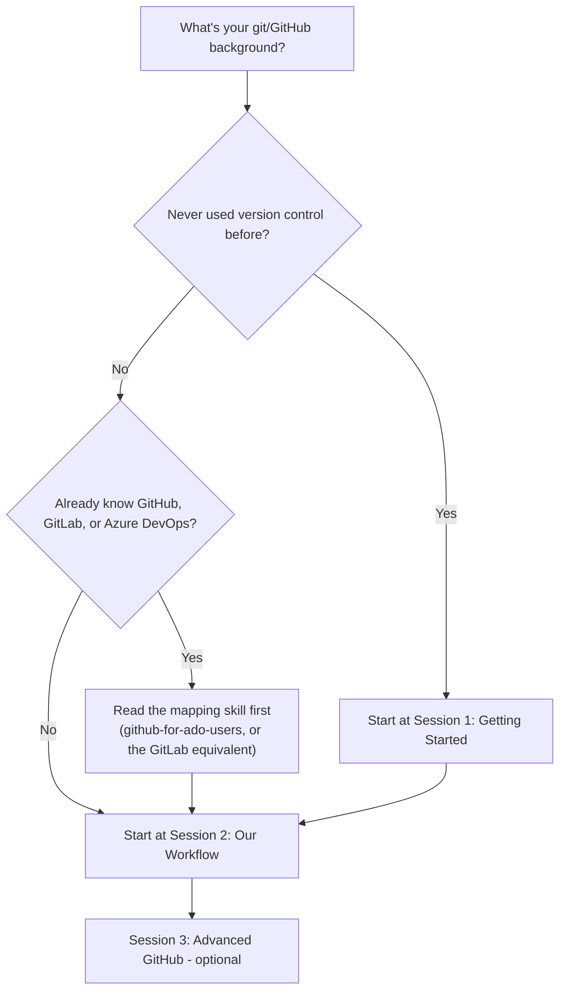
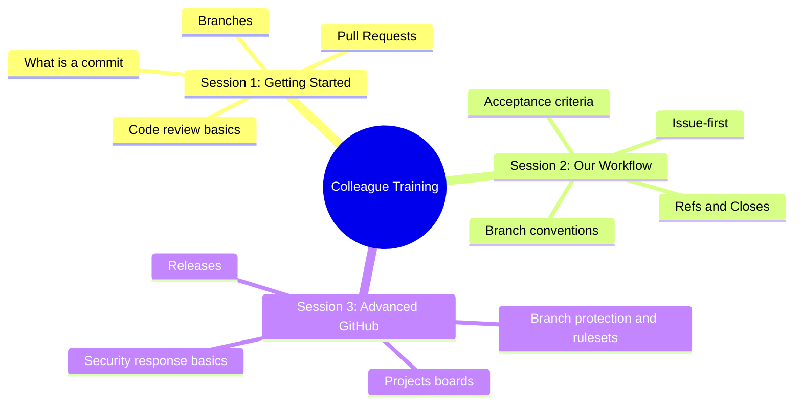
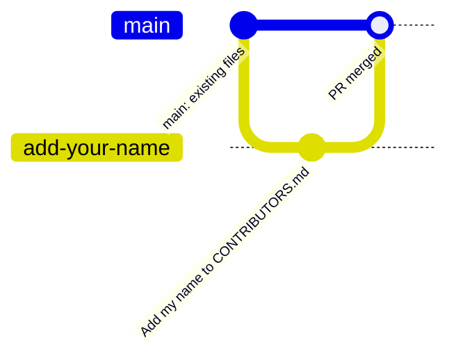
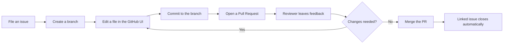
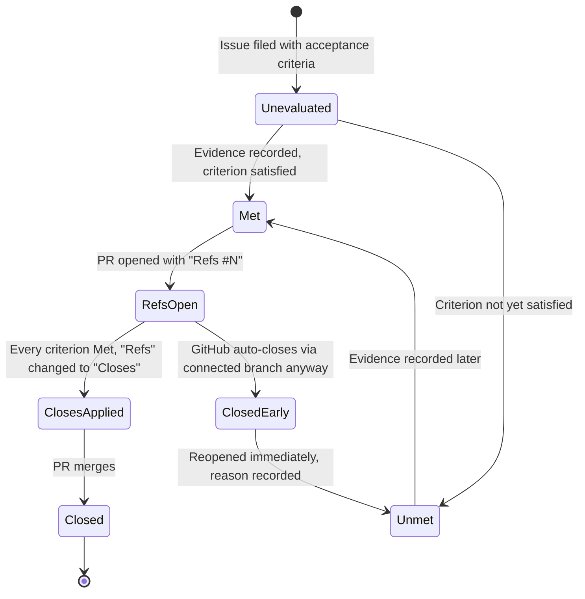
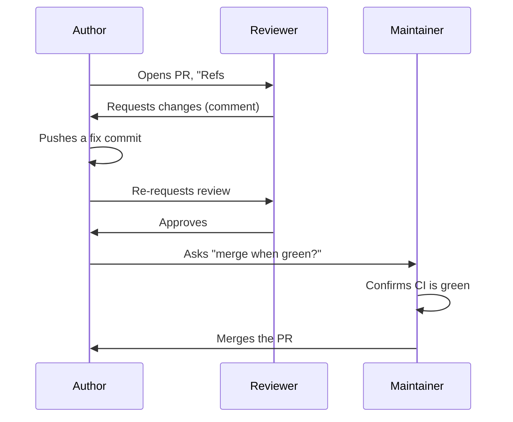
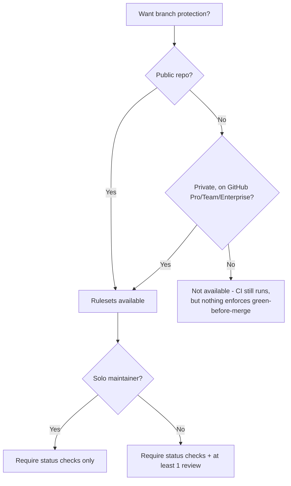
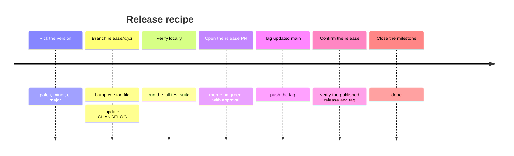
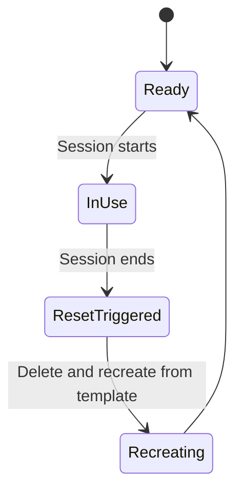

# Colleague Training Program Implementation Plan

> **For agentic workers:** REQUIRED SUB-SKILL: Use superpowers:subagent-driven-development (recommended) or superpowers:executing-plans to implement this plan task-by-task. Steps use checkbox (`- [ ]`) syntax for tracking.

**Goal:** Build the `education/` folder — human-facing GitHub training material for colleagues at three experience levels (never used version control, some git knowledge, GitHub/GitLab/ADO experience) — per the approved design spec.

**Architecture:** Six content files under a new top-level `education/` folder (`README.md`, `beginners/session-1-getting-started.md`, `intermediate/session-2-our-workflow.md`, `advanced/session-3-advanced-github.md`, `cheat-sheet.md`, `facilitator-guide.md`), each self-contained enough for a superuser to run a session directly from it, cross-referencing `skills/*/SKILL.md` by name rather than restating policy. Eight to nine Mermaid diagrams across six diagram types (flowchart, mindmap, `gitGraph`, state diagram, sequence diagram, timeline) illustrate the concepts most likely to be missing a mental model for a true beginner.

**Tech Stack:** Markdown, Mermaid (rendered natively by GitHub — no build step, no new dependency).

**Spec:** `docs/superpowers/specs/2026-09-26-colleague-training-program-design.md`

## Global Constraints

- All new content lives under `education/`. No changes to `skills/*/SKILL.md` content.
- Every Mermaid diagram gets a one-line "what this shows" caption directly above its code fence — never a bare diagram with no prose context.
- `education/intermediate/session-2-our-workflow.md` and `education/advanced/session-3-advanced-github.md` are **outline + talking points**, not full scripts (per the spec's Content depth decision) — don't over-author these into full prose scripts the way Session 1 is.
- No real company/organization-specific settings, names, or values anywhere in `education/**` — this repo is public (`CONTRIBUTING.md`'s public-content boundary applies here same as everywhere else in the repo).
- `npm run lint:markdown:docs` must pass after every task — unlike `docs/superpowers/**`, `education/**` is **not** excluded from this lint (it's durable published content, not ephemeral planning material).
- Session 1 is GitHub-web-UI-only — no git CLI commands, no local git install assumed (per the spec's audience-tier decision: true beginners start in the browser).
- Every commit message includes `Refs #36`.
- Content must not contradict `skills/github-hygiene/SKILL.md`, `skills/github-issue-first/SKILL.md`, or `docs/adr/0001-refs-closes-connected-branch-closure.md` — cross-check before finalizing any section describing the closure gate.

## Review Focus

- **A reader on Session 1 hits a step that quietly assumes CLI/local git** (e.g. "clone the repo") when the spec mandates browser-only for true beginners — the walkthrough must stay entirely within the GitHub web UI from first step to last.
- **A Mermaid diagram with a syntax error** that only shows as broken/unrendered text when someone actually opens the file on GitHub — no automated validation exists per the spec's own decision, so each diagram needs a deliberate syntax self-check against a known-good pattern, not just "looks right."
- **Session 2's closure-gate content (prose or diagram) drifts from the real ADR 0001 mechanics** — e.g. implying `Refs #N` alone guarantees an issue stays open, which is the exact wrong belief ADR 0001 exists to correct. The state diagram's "GitHub auto-closes anyway" edge and the reopen-and-record-the-reason step must match ADR 0001's actual text, not a simplified/incorrect version of it.
- **A real company name, real security setting, or real org-specific value lands in the facilitator-guide's org-settings-extraction appendix** as a worked "example output" — every example in that section must stay generic/hypothetical, never a real extracted value.
- **The README's audience-tier routing sends an experienced ADO/GitLab/GitHub person to Session 1 anyway** — defeating the entire point of tiered entry. The routing flowchart and the surrounding prose must agree, and both must route experienced users to the pre-reading + Session 2, never through Session 1 first.

---

## Task 1: `education/README.md`

**Files:**
- Create: `education/README.md`

**Interfaces:**
- Consumes: nothing.
- Produces: the links every other task's file will be linked *from* — Tasks 2-6 don't need to link back to this file (one-directional index), but their filenames must match exactly what this task links to.

- [ ] **Step 1: Create the directory and file with the following content**

```markdown
# Colleague GitHub Training Program

This is training material **for people** — colleagues learning how to use
GitHub and how this team specifically works. It's a different surface from
`skills/*/SKILL.md`, which teaches an AI coding agent the same workflow.
Where this program describes a policy the skills already state precisely
(the closure gate, issue-first, branch conventions), it points at the
relevant skill file by name rather than restating it, so the two can't
silently drift apart.

## Where do I start?

What this shows: how your existing background routes you to the right
starting point — nobody needs to sit through material for a background
they don't have.



| Background | Start here |
|---|---|
| Never used version control | [Session 1: Getting Started](beginners/session-1-getting-started.md) |
| Some git knowledge, new to this team's process | [Session 2: Our Workflow](intermediate/session-2-our-workflow.md) |
| Already know GitHub, GitLab, or Azure DevOps | Read `skills/github-for-ado-users/SKILL.md` (or its GitLab equivalent, once it exists) as pre-reading, then [Session 2](intermediate/session-2-our-workflow.md) |

Session 3 is optional and for anyone who wants to go deeper — attend it
whenever, in any order relative to your own comfort level.

## What's covered

What this shows: the topic areas across all three sessions, at a glance,
so you can judge whether Session 3 is relevant to you without reading its
full outline.



## Materials

- [Session 1: Getting Started](beginners/session-1-getting-started.md) — ~60 min, hands-on, no prior experience needed.
- [Session 2: Our Workflow](intermediate/session-2-our-workflow.md) — ~1-2 hr, this team's specific conventions.
- [Session 3: Advanced GitHub](advanced/session-3-advanced-github.md) — ~1-2 hr, optional, deeper topics.
- [Cheat sheet](cheat-sheet.md) — one page, take it with you.
- [Facilitator guide](facilitator-guide.md) — for the superuser running a session, not attendees.
```

- [ ] **Step 2: Run markdownlint**

Run: `npm run lint:markdown:docs`
Expected: pass, 0 issues.

- [ ] **Step 3: Self-review against Global Constraints and Review Focus**

Confirm: both diagrams have a "What this shows:" caption directly above them; the routing flowchart and the table beneath it agree (both send experienced ADO/GitHub/GitLab users to pre-reading + Session 2, never Session 1); no CLI commands appear anywhere in this file.

- [ ] **Step 4: Self-review — Mermaid syntax**

Confirm the `flowchart TD` block starts with `flowchart TD` and every node/edge line uses valid syntax (`NodeID[Label]`, `NodeID{Decision}`, `-->`, `-- label -->`). Confirm the `mindmap` block starts with `mindmap` on its own line, uses a single `root((...))` node, and consistent indentation for each level beneath it (mismatched indentation is the most common way a Mermaid mindmap silently fails to render). Confirm both diagrams have their caption immediately above the fence.

- [ ] **Step 5: Commit**

```bash
git add education/README.md
git commit -m "docs: add education program README with audience routing

Refs #36"
```

---

## Task 2: `education/beginners/session-1-getting-started.md`

**Files:**
- Create: `education/beginners/session-1-getting-started.md`

**Interfaces:**
- Consumes: nothing.
- Produces: the session name/link `beginners/session-1-getting-started.md` that Task 1 already links to (verify the path matches exactly).

- [ ] **Step 1: Create the directory and file with the following content**

```markdown
# Session 1: Getting Started with GitHub

**Audience:** Never used version control before.
**Format:** Hands-on, in the GitHub web UI — no command line, nothing to install.
**Timing budget:** ~60 minutes total.

## Learning objectives

By the end of this session, you will have:

- Made a commit and understood what one is.
- Created a branch and understood why we don't work directly on `main`.
- Opened a pull request and gone through a review.
- Watched an issue close automatically when your work merged.

## Timing

| Section | Minutes |
|---|---|
| Welcome and concepts (what is a commit/branch/PR, in plain terms) | 10 |
| Setup (make sure everyone can access the sandbox repo) | 5 |
| Walkthrough: file an issue, branch, commit, PR, review, merge | 30 |
| Watch the issue close, recap | 10 |
| Buffer / questions | 5 |

## Setup

You need: a GitHub account with access to the sandbox repo (the
facilitator will confirm this before the session starts). Nothing else —
no software to install, no command line.

## The two things happening at once

What this shows: every time you do this workflow, two things are true at
once — what's happening to the *repository* (left) and what you're
actually *clicking* (right). Beginners usually only see the second one;
this session teaches both.





## Walkthrough

Everyone does this on their own, in the shared sandbox repo, at the same
time — the facilitator narrates each step and checks the room before
moving on.

### 1. File your own issue (5 min)

- Go to the sandbox repo's **Issues** tab → **New issue**.
- Title: `Add <your name> to CONTRIBUTORS.md`.
- Body: one sentence is fine — "Adding myself as a contributor."
- Click **Submit new issue**. Note your issue number (e.g. `#42`) — you'll need it later.

This is the first habit to build: **work starts with an issue**, not with
editing a file. `skills/github-issue-first/SKILL.md` is the full policy
behind why — this session is the hands-on version of it.

### 2. Create a branch (5 min)

- From your issue page, look for **Create a branch** (GitHub offers this
  directly from an issue) — or go to the repo's branch dropdown and type
  a new branch name like `add-<your-name>`.
- We never commit directly to `main` — a branch is your own space to work
  in until it's reviewed.

### 3. Edit a file and commit (10 min)

- Navigate to `CONTRIBUTORS.md` in the sandbox repo, **on your branch**.
- Click the pencil (edit) icon.
- Add a line with your name.
- Scroll down to **Commit changes** — make sure "Commit directly to the
  `add-<your-name>` branch" is selected, not `main`.
- Write a short commit message: `Add <your name> to CONTRIBUTORS.md`.
- Click **Commit changes**.

A commit is a saved snapshot of your change, with a message explaining
what and why. You just made one.

### 4. Open a Pull Request (5 min)

- GitHub will offer a **Compare & pull request** button right after your
  commit — click it.
- Title: leave the default or make it clearer.
- Body: type `Refs #<your issue number>` (e.g. `Refs #42`) — this is how
  we link a PR to the issue it's working on. (Full reasoning:
  `skills/github-hygiene/SKILL.md`'s traceability chain — Session 2 goes
  deeper on this.)
- Click **Create pull request**.

### 5. Get it reviewed (10 min)

- The facilitator (or a paired colleague) opens your PR, looks at the
  **Files changed** tab, and leaves a comment or an approval.
- If changes are requested: go back to step 3, edit the file again on the
  same branch, commit again — your PR updates automatically.
- If approved: move to step 6.

### 6. Merge (5 min)

- On your PR, once approved, change the PR body from `Refs #42` to
  `Closes #42` — this tells GitHub to close the issue when the PR merges.
  (Session 2 explains exactly when this switch is safe to make.)
- Click **Merge pull request** → **Confirm merge**.

### 7. Watch it close

- Go back to your issue (`#42`). It should now show as **Closed**, with a
  note that it was closed by your merged PR.

That's the full loop: **issue → branch → commit → PR → review → merge →
issue closes.** Every contribution on this team follows this shape.

## Wrap-up

You've now done, by hand, the entire workflow this team uses for every
change, from a one-line doc fix to a major feature. Session 2 covers the
*why* behind each step in more depth, and the specific conventions
(labels, milestones, the exact wording of `Refs`/`Closes`) that make this
team's process work at scale.

Next: [Session 2: Our Workflow](../intermediate/session-2-our-workflow.md)
```

- [ ] **Step 2: Run markdownlint**

Run: `npm run lint:markdown:docs`
Expected: pass, 0 issues.

- [ ] **Step 3: Self-review — no CLI, no local git**

Re-read the entire walkthrough section. Confirm every single step happens in a web browser, in the GitHub UI — no `git clone`, no terminal, no "open your editor." If any step assumes local tooling, rewrite it as a web-UI equivalent before proceeding.

- [ ] **Step 4: Self-review — Mermaid syntax**

Both diagrams (`gitGraph` and the `flowchart LR`) must use valid Mermaid syntax. Check the `gitGraph` block especially — it must start with `gitGraph` on its own line, and `branch`/`checkout`/`commit`/`merge` keywords must each be spelled exactly as shown, with `id:` values in quotes. Confirm both diagrams have their "What this shows:" caption immediately above the code fence.

- [ ] **Step 5: Commit**

```bash
git add education/beginners/session-1-getting-started.md
git commit -m "docs: add Session 1 (Getting Started) full content

Refs #36"
```

---

## Task 3: `education/intermediate/session-2-our-workflow.md`

**Files:**
- Create: `education/intermediate/session-2-our-workflow.md`

**Interfaces:**
- Consumes: `skills/github-issue-first/SKILL.md`, `skills/github-hygiene/SKILL.md`, `docs/adr/0001-refs-closes-connected-branch-closure.md` (content this file must accurately reflect, not restate in full).
- Produces: the filename Task 1 already links to.

- [ ] **Step 1: Create the directory and file with the following content**

```markdown
# Session 2: Our Workflow

**Audience:** Anyone who's done Session 1, or already knows git/GitHub/GitLab/Azure DevOps and read the mapping skill as pre-reading.
**Format:** Outline and talking points for the facilitator — not a script to read verbatim.
**Timing budget:** ~1-2 hours.

This session covers the specific conventions this team uses on top of
plain GitHub. Every section names the `skills/*/SKILL.md` file with the
full policy — this outline is the talking points, not the source of truth.

## Learning objectives

- Understand why work starts with an issue, not a branch or a PR.
- Understand the acceptance-criteria closure gate and why `Refs`/`Closes`
  matters.
- Know the branch and PR-review conventions well enough to follow them
  without checking the skill file every time.
- Understand what a milestone is (and isn't) here.

## Section 1: Issue-first (~15 min)

**Source:** `skills/github-issue-first/SKILL.md`

Talking points:
- Every piece of work starts as a filed issue — even small ones. The
  tracker is the source of truth for "things we know about"; if it only
  lived in a chat message, it's effectively lost.
- What a well-formed issue needs: a title stating the problem (not the
  fix), a body with enough context to act on later, one priority label,
  at least one category label, an assignee, and a milestone.
- The one exception: if someone explicitly says "just fix it," skip the
  ceremony for that one thing.

Suggested activity: as a group, look at 2-3 real closed issues in this
repo and identify their priority/category labels and acceptance criteria.

## Section 2: The closure gate — `Refs` vs `Closes` (~25 min)

**Source:** `skills/github-hygiene/SKILL.md` (the acceptance-criteria
closure gate section), `docs/adr/0001-refs-closes-connected-branch-closure.md`

What this shows: the states a piece of work moves through, and the one
gotcha (the right-hand branch) that catches almost everyone the first
time.



Talking points:
- A PR body starting with `Refs #N` means "this is progress on issue N,
  not necessarily finished." `Closes #N` means "merging this PR should
  close issue N."
- **The gotcha (the `ClosedEarly` branch above):** using `Refs #N` does
  **not** guarantee the issue stays open. If GitHub created a "connected
  branch" link (e.g. via "create a branch" from the issue, like in
  Session 1), merging the PR can auto-close the issue anyway — even
  though the PR body only said `Refs`, not `Closes`. This actually
  happened once in this repo's own history (see ADR 0001) and is exactly
  why the habit below exists.
- **The habit this creates:** after *every* merge, check the linked
  issue. If it closed early while a criterion was still unmet, reopen it
  immediately and write down why.
- Green CI, a merged PR, or a deadline are never themselves evidence that
  a criterion is met — the evidence is a diff, a test, a screenshot, or a
  reproduction, recorded on the issue.

Suggested activity: read ADR 0001's Context section together — it's a
short, concrete story of exactly this gotcha happening for real.

## Section 3: PR review etiquette (~20 min)

**Source:** `skills/github-pr-review/SKILL.md`

What this shows: review is a back-and-forth involving three roles, not a
single yes/no gate — and merging is a separate decision from approving.



Talking points:
- Approving a PR is not the same as merging it — those are two different
  people's decisions in most teams, and even when they're the same
  person, they're still two separate checks.
- `Request changes` means "this can't merge yet"; `Comment` means
  "questions, not a verdict"; don't use `Comment` when you really mean
  "this needs to change."
- Never approve your own PR to get around a required-review rule.

## Section 4: Branch conventions and milestones (~15 min)

**Source:** `skills/github-hygiene/SKILL.md` (PR flow, milestones)

Talking points:
- One branch per issue, named for what it does (`fix/…`, `feat/…`,
  `docs/…`). Branch from an up-to-date `main`, never commit on `main`
  directly.
- A milestone is a **release bucket**, not a sprint/iteration. "What
  ships in the next release" is the question a milestone answers.
- Every issue gets a milestone at filing time, not as an afterthought.

## Wrap-up (~5 min)

Recap: issue-first, the closure gate's one real gotcha, review vs. merge
as separate decisions, milestones as release buckets. Session 3 goes into
branch protection, Projects boards, and releases for anyone who wants to
go further.

Next: [Session 3: Advanced GitHub](../advanced/session-3-advanced-github.md) (optional)
```

- [ ] **Step 2: Run markdownlint**

Run: `npm run lint:markdown:docs`
Expected: pass, 0 issues.

- [ ] **Step 3: Self-review — ADR 0001 accuracy**

Read `docs/adr/0001-refs-closes-connected-branch-closure.md` in full. Confirm the state diagram's `ClosedEarly` transition and the surrounding talking points accurately describe what the ADR says (a connected development branch can auto-close an issue on merge regardless of the PR body's keyword; the fix is an immediate post-merge audit-and-reopen, not a wording change to `Refs`). Do not let this section imply `Refs #N` is a reliable guarantee of anything — that is the exact misconception ADR 0001 corrects.

- [ ] **Step 4: Self-review — outline depth, not full script**

Confirm this file stays at outline-and-talking-points depth throughout (per Global Constraints) — bullet points and short guidance for the facilitator, not fully scripted paragraphs a facilitator would read verbatim. If any section reads like a finished essay rather than talking points, trim it.

- [ ] **Step 5: Self-review — Mermaid syntax**

Confirm the `stateDiagram-v2` block starts with `stateDiagram-v2` on its own line, every transition uses the `StateA --> StateB: label` form, and `[*]` is used correctly for the start/end pseudostates. Confirm the `sequenceDiagram` block declares all three `participant` lines before any message line, and every message uses `Actor->>Actor: text` syntax. Confirm both diagrams have their caption immediately above the fence.

- [ ] **Step 6: Commit**

```bash
git add education/intermediate/session-2-our-workflow.md
git commit -m "docs: add Session 2 (Our Workflow) outline and talking points

Refs #36"
```

---

## Task 4: `education/advanced/session-3-advanced-github.md`

**Files:**
- Create: `education/advanced/session-3-advanced-github.md`

**Interfaces:**
- Consumes: `skills/github-releases/SKILL.md`, `skills/github-projects/SKILL.md`, `skills/github-security-response/SKILL.md`.
- Produces: the filename Task 1 already links to.

- [ ] **Step 1: Create the directory and file with the following content**

```markdown
# Session 3: Advanced GitHub

**Audience:** Anyone who's completed Session 2 (or already comfortable with this team's basic workflow) and wants to go deeper. Optional.
**Format:** Outline and talking points for the facilitator.
**Timing budget:** ~1-2 hours (can be split across two shorter sessions if preferred).

## Learning objectives

- Understand what branch protection/rulesets do and don't guarantee, and
  when they're even available.
- Understand how a Projects board relates to issues (and when a team
  actually needs one).
- Walk through the shape of a release, end to end.
- Know the first moves in a security-sensitive situation.

## Section 1: Branch protection and rulesets (~25 min)

**Source:** `skills/github-releases/SKILL.md` (Rulesets section)

What this shows: whether branch protection is even available depends on
plan and visibility before it depends on anything you configure — a
common surprise on private repos.



Talking points:
- A ruleset (or classic branch protection) can require CI to be green and
  require review before merge — but only where it's available (see the
  decision tree above).
- On a solo-maintained repo, requiring your own review locks you out of
  your own repo unless you're a bypass actor — which makes the rule
  effectively advisory. Add the review requirement once a second
  maintainer exists.
- `gh ruleset list` can look like "nothing configured" both when nothing
  is configured *and* when the plan doesn't support it — always confirm
  via the API, not just the CLI's list output.

## Section 2: Projects boards (~20 min)

**Source:** `skills/github-projects/SKILL.md`

Talking points:
- A Projects board is a **view over issues**, never the source of truth.
  Labels, milestones, and assignees on the issue itself are authoritative
  — if a fact only lives on the board, it's invisible to anyone reading
  the repo through the API or `gh`.
- Don't create a board for a solo maintainer — it's unmaintained overhead
  with nothing to show for it. Create one when a second person joins, or
  when work already spans multiple repos (one org-level board, not one
  per repo).
- Draft items (created only on the board, with no linked issue) silently
  violate issue-first — every board item should be a real issue or PR.

## Section 3: Releases (~25 min)

**Source:** `skills/github-releases/SKILL.md` (Release recipe)

What this shows: a release is a fixed sequence of one-time steps, not a
branching decision — a timeline fits it better than a flowchart.



Talking points:
- Read the current version from the repo's actual version file
  (`package.json`, a module manifest, etc.) — never from the last git
  tag, since the two can drift apart.
- Generated release notes (from merged PR labels) and a hand-written
  `CHANGELOG.md` serve different readers — keep both.

## Section 4: Security response basics (~15 min)

**Source:** `skills/github-security-response/SKILL.md`

Talking points:
- If a secret gets committed: **rotate it first.** History rewriting is
  cleanup, not containment — the credential is compromised the moment it
  was pushed, regardless of what you do to git history afterward.
- Vulnerabilities and committed secrets never go into a public issue —
  that's a disclosure. Use private vulnerability reporting instead.
- Never paste the secret's actual value anywhere while reporting it —
  reference where it was, not what it was.

## Wrap-up (~5 min)

This session covered the topics that come up once a team's usage matures
past the basics: protecting `main`, coordinating visibility across
several repos, shipping a release, and handling something sensitive
safely. There's no "Session 4" — from here, the `skills/*/SKILL.md` files
themselves are the reference for anything not covered live.
```

- [ ] **Step 2: Run markdownlint**

Run: `npm run lint:markdown:docs`
Expected: pass, 0 issues.

- [ ] **Step 3: Self-review — outline depth, no real org values**

Confirm this stays at outline/talking-points depth (per Global Constraints), and confirm no real company name, real repo name, or real security-setting value appears anywhere — every example must be generic.

- [ ] **Step 4: Self-review — Mermaid syntax**

Confirm the `flowchart TD` block starts with `flowchart TD` and every node/edge uses valid syntax (`NodeID[Label]`, `NodeID{Decision}`, `-->`, `-- label -->`). Confirm the `timeline` block starts with `title`, then one `Section label : detail : detail` line per row, each on its own line. Confirm both diagrams have their caption immediately above the fence.

- [ ] **Step 5: Commit**

```bash
git add education/advanced/session-3-advanced-github.md
git commit -m "docs: add Session 3 (Advanced GitHub) outline and talking points

Refs #36"
```

---

## Task 5: `education/cheat-sheet.md`

**Files:**
- Create: `education/cheat-sheet.md`

**Interfaces:**
- Consumes: nothing.
- Produces: the filename Task 1 already links to.

- [ ] **Step 1: Create the file with the following content**

```markdown
# GitHub Cheat Sheet

One page. Keep this open in a tab while you work.

## The loop, every time

**Issue → branch → commit → PR → review → merge → issue closes.**

## Doing it in the web UI (no command line needed)

| Action | Where |
|---|---|
| File an issue | Repo → **Issues** tab → **New issue** |
| Create a branch from an issue | On the issue page → **Create a branch** |
| Edit a file on your branch | Navigate to the file → pencil icon → make sure your branch is selected before committing |
| Open a PR | After committing to a branch, GitHub offers **Compare & pull request** |
| Review a PR | PR page → **Files changed** tab → leave a comment, or **Review changes** → Approve/Request changes/Comment |
| Merge a PR | PR page → **Merge pull request** (only after it's approved and CI is green) |

## Doing it from the command line (once you're comfortable)

| Action | Command |
|---|---|
| Clone a repo | `git clone <url>` |
| Create and switch to a branch | `git checkout -b <branch-name>` |
| See what's changed | `git status` |
| Stage and commit | `git add <file>` then `git commit -m "message"` |
| Push a new branch | `git push -u origin <branch-name>` |
| File an issue | `gh issue create --title "..." --body "..." --assignee "@me"` |
| Open a PR | `gh pr create --title "..." --body "Refs #N"` |
| Check PR CI status | `gh pr checks <N>` |

## This team's conventions

- **Work starts with an issue.** Even small things. If it's not filed, it's not tracked.
- **`Refs #N`** in a PR body = "progress on N, not necessarily done." **`Closes #N`** = "merging this closes N." Only switch to `Closes` once every acceptance criterion is met.
- **After every merge, check the linked issue.** GitHub can auto-close it early via a connected branch even when the PR only said `Refs` — if that happened while a criterion was unmet, reopen it and say why.
- **One branch per issue.** Branch from an up-to-date `main`. Never commit directly to `main`.
- **A milestone is a release bucket**, not a sprint. It answers "what ships next," nothing else.
- **Approving a PR is not merging it.** They're separate decisions, even when the same person makes both.

## Where to go deeper

- `skills/github-issue-first/SKILL.md` — filing and triaging issues
- `skills/github-hygiene/SKILL.md` — PR flow and the closure gate
- `skills/github-pr-review/SKILL.md` — reviewing someone else's PR
- `skills/github-releases/SKILL.md` — milestones, rulesets, releases
- `skills/github-security-response/SKILL.md` — secrets and vulnerabilities
```

- [ ] **Step 2: Run markdownlint**

Run: `npm run lint:markdown:docs`
Expected: pass, 0 issues.

- [ ] **Step 3: Commit**

```bash
git add education/cheat-sheet.md
git commit -m "docs: add education program cheat sheet

Refs #36"
```

---

## Task 6: `education/facilitator-guide.md`

**Files:**
- Create: `education/facilitator-guide.md`

**Interfaces:**
- Consumes: nothing.
- Produces: the filename Task 1 already links to.

- [ ] **Step 1: Create the file with the following content**

```markdown
# Facilitator Guide

This file is for whoever is **running** a session, not for attendees.

## Sandbox repo requirements

Sessions need one shared practice repository, separate from any real
project. Requirements:

- **Private**, never public — this is internal practice material and
  attendees will be pushing throwaway commits to it.
- **One shared repo per cohort**, not one fork per attendee. Session 1's
  walkthrough steps assume everyone is working in the same repo with the
  same file (`CONTRIBUTORS.md`) — this keeps the steps identical for
  everyone and avoids fork-specific complications a true beginner
  shouldn't have to think about yet.
- **Seed content:** a `README.md` explaining it's a practice repo, and a
  `CONTRIBUTORS.md` file with a header line and nothing else (attendees
  each add their own line to it during Session 1).
- **Reset between cohorts:** recreate the repo from a template rather
  than manually reverting commits — faster, and guarantees a clean state
  every time.

What this shows: the repo's lifecycle across sessions — always reset back
to `Ready` before the next cohort starts, never reused mid-state.



## Before each session

- [ ] Confirm the sandbox repo is in the `Ready` state (recreated since the last run).
- [ ] Confirm every attendee has at least write access to it.
- [ ] For Session 1: confirm `CONTRIBUTORS.md` exists with just a header line.
- [ ] Have this guide and the relevant session file open, ideally projected.

## Running Session 1 for a single new hire

Session 1 works the same for one person as for a group — the sandbox
repo doesn't need to be freshly reset for a solo run if `CONTRIBUTORS.md`
already has other names in it from prior cohorts; that's expected and
harmless, since each attendee adds their own line.

## Tracking completion

No separate tracking system — add a checkbox for "GitHub training
(Session 1 + 2)" to whatever onboarding checklist or issue already exists
for new hires. That's the entire mechanism; don't build more than this
needs.

## Extract your org's real settings before Session 2/3

Session 2 and 3's talking points on branch protection, required
approvals, and Actions permissions will vary by employer. **Run these in
your own environment** — never commit real output from these into this
public repository:

```bash
# Org-level policy
gh api orgs/{org} --jq '{default_repo_permission, members_can_create_repositories, two_factor_requirement_enabled}'

# Actions permissions
gh api orgs/{org}/actions/permissions

# Org-level rulesets (branch protection applied across repos)
gh api orgs/{org}/rulesets --jq '.[] | {name, target, enforcement}'

# Per-repo security settings (loop over a sample of real repos)
gh api repos/{org}/{repo} --jq '.security_and_analysis'
```

Use the output to adapt Session 3's branch-protection and security
talking points to what's actually true at your organization — for
example, if rulesets are already enforced org-wide, say so explicitly
rather than presenting it as a hypothetical decision tree. Keep the
actual extracted values in your own private notes, not in this repo.

## Common questions (anticipated from Session 1)

- **"Why can't I just email my change to someone?"** — Because then
  nobody else can see it happened, review it, or find it again later. The
  issue/PR trail is the point.
- **"What if I mess up my branch?"** — You can't break `main` from a
  branch. Worst case, delete the branch and start over from step 2.
- **"Do I need to install anything?"** — No, for Session 1. Session 2
  onward introduces the command-line equivalents for people who want
  them, but the web UI remains a fully valid way to work.
```

- [ ] **Step 2: Run markdownlint**

Run: `npm run lint:markdown:docs`
Expected: pass, 0 issues.

- [ ] **Step 3: Self-review — no real org values**

Confirm every command example uses placeholder syntax (`{org}`, `{repo}`) and no real company name, real settings value, or real output appears anywhere in this file.

- [ ] **Step 4: Self-review — Mermaid syntax**

Confirm the `stateDiagram-v2` block is syntactically valid (starts with `stateDiagram-v2`, each transition is `StateA --> StateB: label`) and has its caption above it.

- [ ] **Step 5: Commit**

```bash
git add education/facilitator-guide.md
git commit -m "docs: add facilitator guide with sandbox setup and org-settings appendix

Refs #36"
```

---

## Task 7: Final verification, cross-reference check, and follow-up issue

**Files:** None (verification + one new GitHub issue).

**Interfaces:** None — this task confirms every prior task's deliverable together.

- [ ] **Step 1: Run the full markdown lint**

Run: `npm run lint:markdown:docs`
Expected: pass, 0 issues, across all six new files plus everything else in the repo (this lint is not scoped to `education/` alone).

- [ ] **Step 2: Cross-reference accuracy pass**

Read `education/README.md`, `education/beginners/session-1-getting-started.md`, and `education/intermediate/session-2-our-workflow.md` once more, side by side with `skills/github-issue-first/SKILL.md`, `skills/github-hygiene/SKILL.md`, and `docs/adr/0001-refs-closes-connected-branch-closure.md`. Confirm every claim about this team's actual policy (issue-first, `Refs`/`Closes`, milestones, the connected-branch gotcha) matches those files. Fix any drift found before proceeding.

- [ ] **Step 3: Link check**

Confirm every relative link in `education/README.md` resolves to a file that actually exists at that path (`beginners/session-1-getting-started.md`, `intermediate/session-2-our-workflow.md`, `advanced/session-3-advanced-github.md`, `cheat-sheet.md`, `facilitator-guide.md`), and confirm Session 1's "Next" link and Session 2's "Next" link resolve correctly too.

- [ ] **Step 4: File the follow-up issue for fully scripting Sessions 2 and 3**

Per the spec's Process Note, Sessions 2 and 3 are outline-depth in this pass; fully scripting them is separate follow-up work.

```bash
gh issue create \
  --title "Fully script Session 2 and Session 3 content" \
  --body "$(cat <<'EOF'
## Problem

education/intermediate/session-2-our-workflow.md and
education/advanced/session-3-advanced-github.md were deliberately built
as outlines/talking-points in the initial education/ scaffolding (#36),
not full scripts a facilitator could read verbatim the way Session 1 is.

## Scope

Flesh out both sessions to the same content depth as Session 1: full
narrative walkthrough text a facilitator can follow closely, while
keeping the existing Mermaid diagrams and skill cross-references intact.
Best informed by feedback from actually running the outline-based
versions a few times first.

## Acceptance criteria

- [ ] Session 2 has full narrative content, not bullet-point talking points, for each of its four sections.
- [ ] Session 3 has full narrative content for each of its four sections.
- [ ] Existing Mermaid diagrams and skill file cross-references are preserved.
- [ ] npm run lint:markdown:docs passes.
EOF
)" \
  --assignee "@me" \
  --label "P3" \
  --label "documentation" \
  --milestone "Colleague Training Program"
```

- [ ] **Step 5: Push and open the PR**

```bash
git push -u origin docs/education-scaffolding
gh pr create \
  --title "Add education/ folder: colleague GitHub training program" \
  --body "Refs #36

Implements docs/superpowers/specs/2026-09-26-colleague-training-program-design.md.

New \`education/\` folder: README with audience-tier routing, Session 1 (full content, hands-on, web-UI-only), Sessions 2-3 (outline + talking points), a cheat sheet, and a facilitator guide (sandbox repo spec, completion tracking, org-settings-extraction appendix). Eight Mermaid diagrams across six diagram types illustrate the workflow, closure gate, PR review, branch-protection decision tree, and release timeline." \
  --base main
```

- [ ] **Step 6: Wait for CI, then ask for merge approval**

Run: `gh pr checks <PR-number> --watch`
Expected: markdown lint and any other applicable checks pass. Ask the maintainer once: "merge this when green?" — per this repo's own `github-hygiene` PR-flow convention, do not self-merge.
