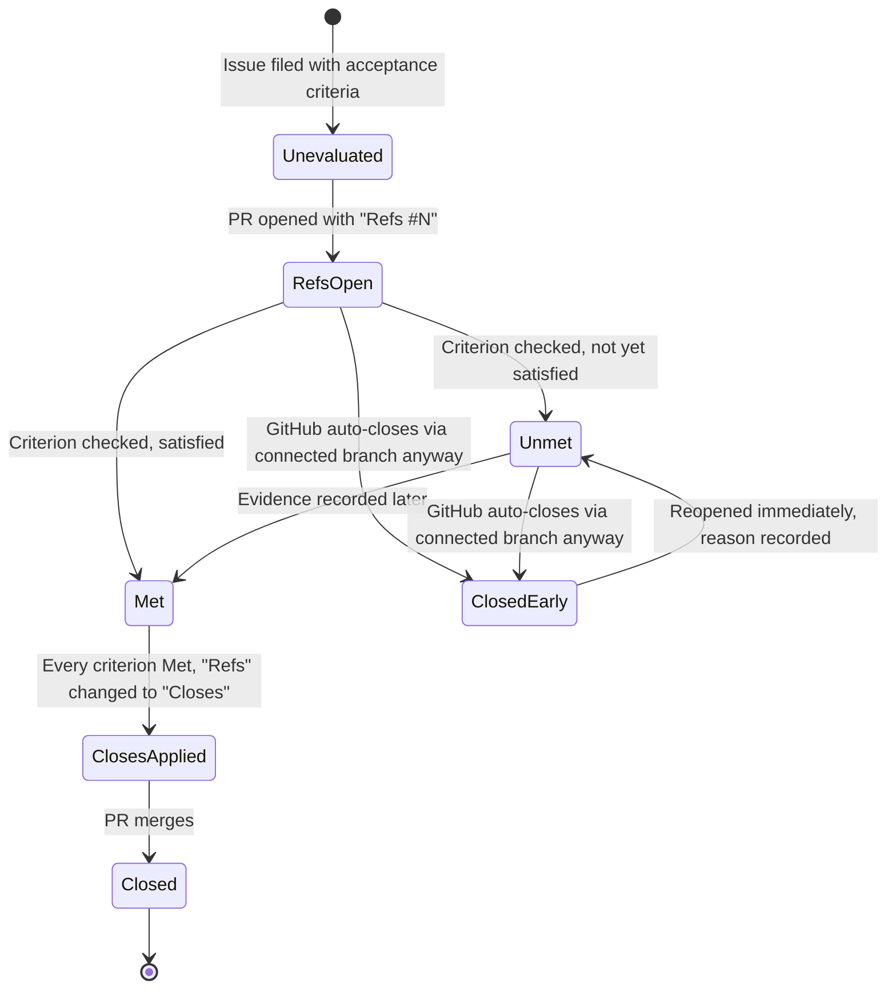
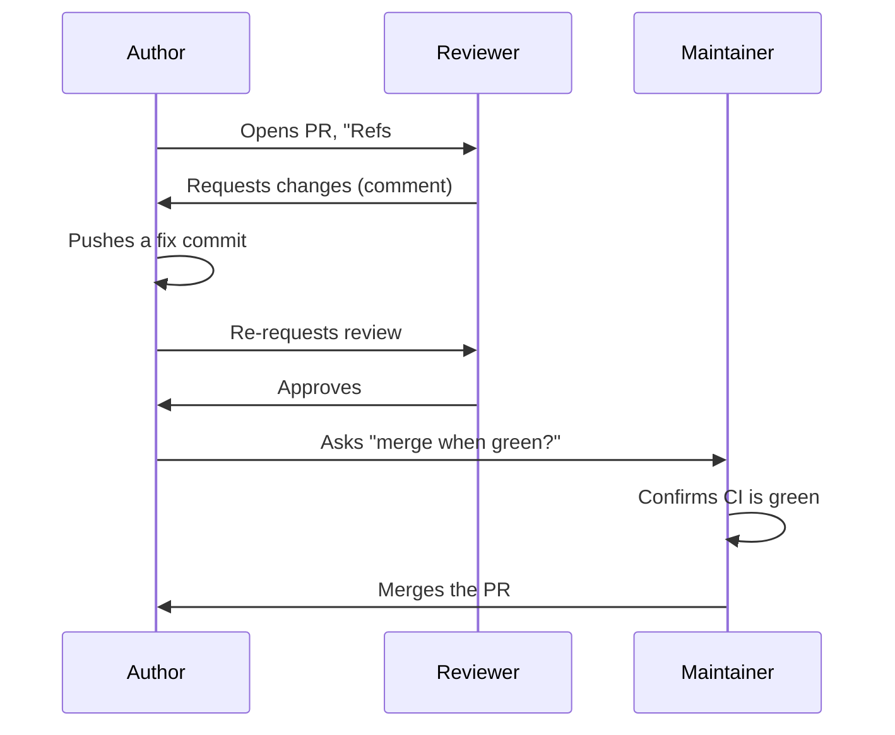
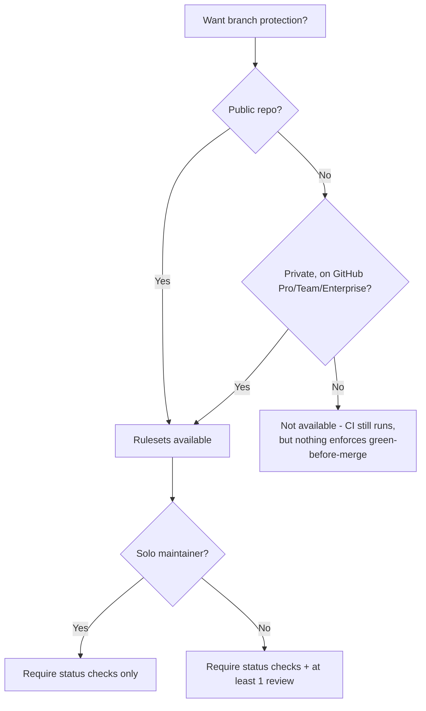
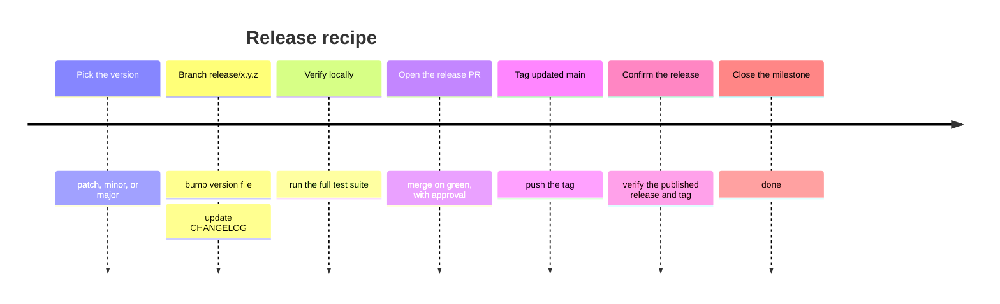
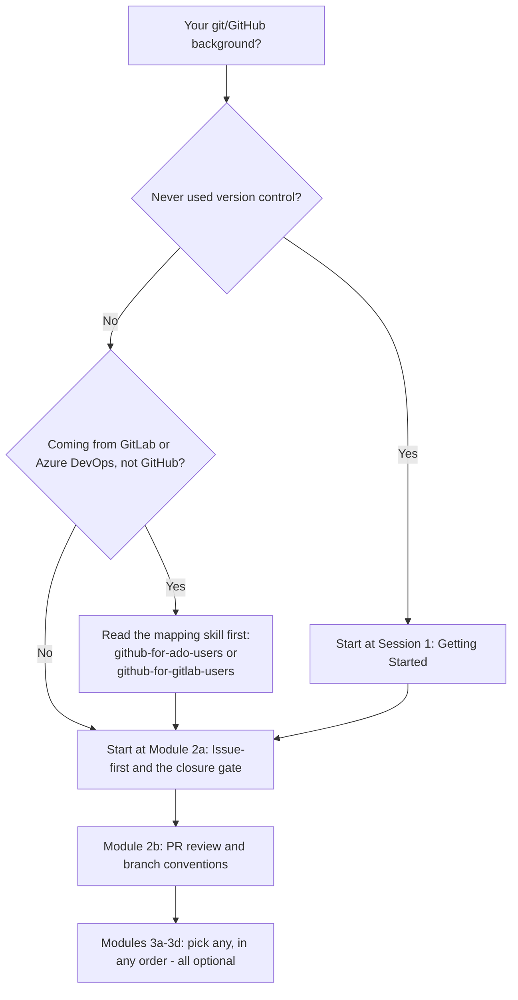
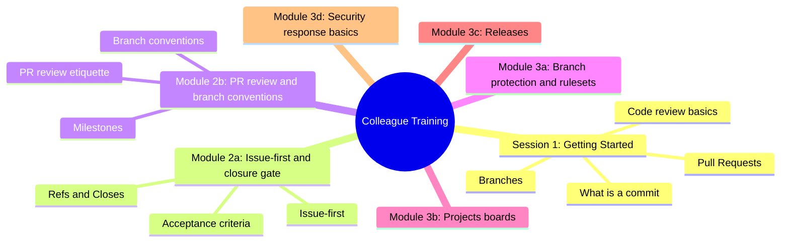

# Education Program v2 — Self-Training Modules Implementation Plan

> **For agentic workers:** REQUIRED SUB-SKILL: Use
> superpowers:subagent-driven-development (recommended) or
> superpowers:executing-plans to implement this plan task-by-task. Steps use
> checkbox (`- [ ]`) syntax for tracking.

**Goal:** Replace the two monolithic, facilitator-narrated `education/`
sessions (Session 2, Session 3) with six self-paced, topic-sized modules —
each with a real hands-on exercise, a self-check, and a feedback prompt —
while keeping facilitator-led delivery as a supported secondary mode via
inline callouts, and update every supporting file and cross-reference to
match.

**Architecture:** Pure content restructuring — no application code, no new
tooling. Six new markdown files replace two old ones; four existing mermaid
diagrams relocate unchanged into their new topical home; `README.md`,
`facilitator-guide.md`, and `CHANGELOG.md` get updated; `cheat-sheet.md` is
checked and left alone unless a stale reference turns up. Correctness is
verified by markdownlint (`.markdownlint-education.jsonc`, only `MD013`
disabled — every other default rule, including `MD033` no-inline-HTML,
applies) and by a repo-wide grep confirming no dangling reference to the
deleted files remains.

**Tech Stack:** Markdown, Mermaid diagrams, markdownlint-cli2, `npm run
check`.

**Spec:**
`docs/superpowers/specs/2026-09-28-education-v2-self-training-design.md`

## Global Constraints

- Every new/edited file under `education/**` must pass `npm run
  lint:markdown:education` — only `MD013` (line length) is disabled; every
  other default markdownlint rule is active, including `MD033`
  (no-inline-HTML). **Do not use raw HTML** (`<details>`, `<summary>`, etc.)
  for facilitator callouts — use the blockquote format defined below.
- **Facilitator-note callout format** (used in every module that needs one):
  a blockquote starting with a bold label, e.g.:

  ```markdown
  > **Facilitator note (optional group activity):** <text>
  ```

  This is plain Markdown (safe under `MD033`), visually distinct, and a
  solo reader naturally skips it without needing JS-driven collapse.
- **Feedback prompt** — reuse this exact block, verbatim, as the closing
  section of all six module files (only the heading level changes to match
  each file's structure, never the wording):

  ```markdown
  ## Feedback

  Something unclear, wrong, or worth improving in this module? Open a
  Discussion in this repo (**Ideas** category). Concrete, actionable
  feedback gets converted into a tracked issue, per this repo's own
  issue-first convention — see `skills/github-issue-first/SKILL.md`'s
  Discussions section.
  ```

- **Self-check pattern** — every module ends its content (before Feedback)
  with a `## Self-check` section: 3-5 bullet questions phrased "Can you
  explain/do X?", followed by one line naming which section to re-read if
  the answer isn't confident. No scoring, no submission.
- Every module file opens with the same header shape used by
  `session-1-getting-started.md`, adapted for self-paced delivery:
  `**Audience:**`, `**Format:** Self-paced — read and do each step
  yourself. Facilitator-note callouts mark optional group activities.`,
  `**Timing:** ~N min.`
- Mermaid diagrams move **unchanged** from their source file into their new
  module file — relocation only, no redesign, no wording edits inside the
  diagram itself.
- `education/beginners/session-1-getting-started.md` is not modified except
  for its one outbound `Next:` link (Task 11).
- Do not touch `skills/**` or any agent-facing policy file — this work is
  entirely inside `education/` plus the cross-reference sweep in Task 11.

## Review Focus

- **A learner without admin access to the sandbox repo hits Module 3a's
  ruleset exercise and can't run it.** The exercise must offer this repo's
  own public "Protect main" ruleset as a live fallback target, not require
  sandbox admin as the only path. (Task 3)
- **A solo self-paced learner reaches Module 2b's paired review roleplay
  expecting to complete it alone.** The full Request-Changes → re-approve
  roleplay must be inside a facilitator-note callout, clearly optional, with
  a separate mechanical exercise (branch naming + milestone-at-filing) as
  the required solo deliverable. (Task 2)
- **Someone has an old bookmark or external link to
  `intermediate/session-2-our-workflow.md` or
  `advanced/session-3-advanced-github.md`.** These paths are being deleted;
  the CHANGELOG entry must state this as a breaking change explicitly, so
  it isn't discovered silently. (Task 10)
- **A relocated mermaid diagram no longer makes sense without its old
  surrounding prose.** Each diagram (state diagram → 2a, sequence diagram →
  2b, decision tree → 3a, timeline → 3c) must be re-introduced with a short
  "what this shows" line in its new file, matching the pattern the old
  files already used, not dropped in bare. (Tasks 1, 2, 3, 5)
- **A new file trips `MD033` (no-inline-HTML) or another default
  markdownlint rule** that the old two-session files never had to satisfy
  in this exact combination (six new files, more mermaid blocks, more
  blockquotes). Every task's verification step runs
  `npm run lint:markdown:education` and requires a clean pass before
  committing. (Tasks 1-9)

---

## Task 1: Module 2a — Issue-first and the closure gate

**Files:**
- Create: `education/intermediate/module-2a-issue-first-and-closure-gate.md`

**Interfaces:**
- Consumes: nothing from other tasks.
- Produces: the file this module links forward to next is
  `education/intermediate/module-2b-pr-review-and-branch-conventions.md`
  (created in Task 2) — the `Next:` link at the bottom of this file must
  use that exact path.

- [ ] **Step 1: Write the module file**

```markdown
# Module 2a: Issue-first and the closure gate

**Audience:** Anyone who's done Session 1, or already knows git/GitHub/
GitLab/Azure DevOps and read the mapping skill as pre-reading.
**Format:** Self-paced — read and do each step yourself. Facilitator-note
callouts mark optional group activities.
**Timing:** ~40 min.

This module covers the two habits everything else in this team's workflow
is built on: filing work as an issue before touching it, and knowing the
one real gotcha in how issues get closed. Every section names the
`skills/*/SKILL.md` file with the full policy — this module is the taught
version, not the source of truth. If something here doesn't answer your
question, the named skill file has the complete, current answer.

## Learning objectives

- Understand why work starts with an issue, not a branch or a PR.
- Understand the acceptance-criteria closure gate and why `Refs`/`Closes`
  matters.
- Be able to recognize — and recover from — GitHub auto-closing an issue
  you only meant to reference.

## Issue-first

**Source:** `skills/github-issue-first/SKILL.md`

The rule, stated plainly: **every piece of work starts as a filed issue —
even small ones.** Not after you've started fixing it, not only when
someone remembers to ask. This matters more than it sounds like it should:
the issue tracker is this team's source of truth for "things we know
about." If a bug or an idea only ever lived in a chat message or a hallway
conversation, it is — for every practical purpose — gone the moment that
conversation ends. Nobody can search for it, link to it, or prove it was
ever raised. Filing it is what makes it durable.

A well-formed issue needs, one piece at a time:

- **A title that states the problem, not the fix.** "Badge falls through to
  the wrong color" is a good title; "Fix badge bug" is not — it tells the
  next reader nothing about what's actually broken.
- **A body with enough context to act on later**, including by the person
  who filed it, six weeks from now, having forgotten the details. What's
  wrong, where, how it was found, roughly what fixing it would involve.
- **Exactly one priority label** (how urgent this is) and **at least one
  category label** (what kind of work it is) — these are two different
  axes, and conflating them is a common early mistake.
- **An assignee.** An unassigned issue is easy to lose track of; someone
  should always own it, even if that someone is "whoever picks it up next."
- **A milestone**, attached at filing time — not as something to backfill
  later once the issue already has momentum.

One exception, named explicitly so this doesn't read as bureaucracy for its
own sake: if someone has said outright "just fix it, don't bother filing an
issue for this," that's fine — skip the ceremony for that one specific
thing. It's a scoped exception for what was actually said, not a blanket
opt-out.

> **Facilitator note (optional group activity):** as a group, pull up 2-3
> real closed issues in this repo and look at them together. For each one,
> ask the group to identify: what's the priority label, what's the category
> label, and what were the acceptance criteria? This works best with issues
> that have some visible back-and-forth in the comments — it makes the
> "durable record" argument concrete rather than abstract.

## The closure gate — `Refs` vs `Closes`

**Source:** `skills/github-hygiene/SKILL.md` (the acceptance-criteria
closure gate section),
`docs/adr/0001-refs-closes-connected-branch-closure.md`

What this diagram shows: the states a piece of work moves through, and the
one gotcha (the right-hand branch) that catches almost everyone the first
time.



Start with the plain-language version of the two keywords, since this is
the single most important habit in this module. A PR body that starts with
`Refs #N` means "this is progress on issue N, not necessarily finished." A
PR body that starts with `Closes #N` means "merging this PR should close
issue N" — it's a promise that every acceptance criterion has already been
checked against real evidence, not a formality you add once the code looks
done.

Now walk the diagram's right-hand branch slowly, because this is the part
that catches almost everyone the first time they hear it: **using
`Refs #N` does not guarantee the issue stays open.** If GitHub created a
"connected branch" link — for example, by using "Create a branch" directly
from the issue, the same way Session 1 did it — merging the PR can
auto-close the linked issue anyway, even though the PR body only ever said
`Refs`, never `Closes`. This isn't a hypothetical edge case: it actually
happened once in this repo's own history (see ADR 0001 for the full
story), and it's the entire reason the next habit exists.

**The habit this creates:** after *every* merge — no exceptions, no "I'm
sure it's fine this time" — check the linked issue's state. If it closed
early while an in-scope criterion was still unmet or unevaluated, reopen it
immediately and write down why, right there on the issue.

Green CI, a merged PR, or a looming deadline are never themselves evidence
that an acceptance criterion is met. "It merged" and "it works" are
different claims. The actual evidence is something concrete and checkable —
a diff, a test run, a screenshot, a reproduction — recorded on the issue
itself, not implied by the fact that the code shipped.

> **Facilitator note (optional group activity):** read ADR 0001's Context
> section together, out loud, as a group. It's short and it's a concrete,
> real story of exactly this gotcha happening — reading it together tends
> to land harder than summarizing it.

## Exercise: trigger the gotcha yourself

This is the module's core hands-on piece — you're going to make the exact
thing described above happen, on purpose, in the sandbox repo, so the habit
is muscle memory instead of a thing you were told about once.

1. File an issue in the sandbox repo. Give it a title, a one-line body, one
   priority label, one category label, and assign it to yourself.
2. From the issue page, click **Create a branch** (this is what creates the
   "connected branch" link — the same mechanic Session 1 used).
3. Make a small edit on that branch (a one-line change to any file is
   enough) and commit it.
4. Open a pull request from that branch. Write the PR body as `Refs #<N>`
   — deliberately not `Closes`, even though this toy change is trivially
   "done."
5. Merge the PR.
6. Go back to the issue. Check its state.

If the issue auto-closed even though the PR body only said `Refs`, you've
just reproduced the gotcha directly. Now practice the actual habit: reopen
the issue with a comment explaining why (something like: "Reopening — this
closed automatically via the connected branch; recording that as expected
practice for Module 2a's exercise, not a real unmet criterion."). The point
isn't that this toy issue had a real unmet criterion — it didn't. The point
is rehearsing the mechanical "check, reopen, record" reflex under real
conditions, so it's already a habit by the time it matters on real work.

## Self-check

- Can you explain, in your own words, why `Refs #N` doesn't guarantee an
  issue stays open?
- What's the very first thing you check after any merge?
- What's the difference between "the PR merged" and "the acceptance
  criterion is met" — and why does that distinction matter?
- If an issue closes early with an unmet criterion, what are the two things
  you do about it?

Not confident on any of these? Re-read "The closure gate — `Refs` vs
`Closes`" above.

## Feedback

Something unclear, wrong, or worth improving in this module? Open a
Discussion in this repo (**Ideas** category). Concrete, actionable
feedback gets converted into a tracked issue, per this repo's own
issue-first convention — see `skills/github-issue-first/SKILL.md`'s
Discussions section.

---

Next: [Module 2b: PR review and branch conventions](module-2b-pr-review-and-branch-conventions.md)
```

- [ ] **Step 2: Lint the new file**

Run: `npm run lint:markdown:education`
Expected: exits 0, no output (clean pass) — confirms the mermaid fence,
blockquote callouts, and headings all satisfy every default rule except
`MD013`.

- [ ] **Step 3: Commit**

```bash
git add education/intermediate/module-2a-issue-first-and-closure-gate.md
git commit -m "docs: add education module 2a (issue-first and closure gate)"
```

---

## Task 2: Module 2b — PR review and branch/milestone conventions

**Files:**
- Create: `education/intermediate/module-2b-pr-review-and-branch-conventions.md`

**Interfaces:**
- Consumes: Task 1's file exists at
  `module-2a-issue-first-and-closure-gate.md` (for the `Next:` link target
  is this file's own concern only going forward, not backward — no
  backward link needed).
- Produces: the `Next:` link target for Task 3
  (`module-3a-branch-protection-and-rulesets.md`, relative path
  `../advanced/module-3a-branch-protection-and-rulesets.md`).

- [ ] **Step 1: Write the module file**

```markdown
# Module 2b: PR review and branch conventions

**Audience:** Anyone who's completed Module 2a.
**Format:** Self-paced — read and do each step yourself. Facilitator-note
callouts mark optional group activities.
**Timing:** ~35 min.

## Learning objectives

- Know the branch and PR-review conventions well enough to follow them
  without checking the skill file every time.
- Understand what a milestone is (and isn't) here.

## PR review etiquette

**Source:** `skills/github-pr-review/SKILL.md`

What this diagram shows: review is a back-and-forth involving three roles,
not a single yes/no gate — and merging is a separate decision from
approving.



Walk the sequence left to right and pause on the detail that surprises most
people coming from a smaller or less formal process: **approving a PR is
not the same as merging it.** In most teams those are two different
people's decisions entirely. Even on a team where the same person sometimes
does both, they're still two separate checks happening one after another —
approval says "this change is good," merging says "and now is the right
time to ship it."

The vocabulary of GitHub's actual review actions, since people often use
them loosely: `Request changes` means "this genuinely can't merge yet" —
it's a real blocker, not a strong suggestion. `Comment` means "I have
questions or thoughts, but this isn't a verdict either way." A common
mistake is reaching for `Comment` when what's actually meant is `Request
changes` — that's an easy habit to fall into, and it quietly weakens the
whole review signal.

A firm, simple rule with no exceptions: never approve your own PR to get
around a required-review rule. If self-approval is technically possible in
a given repo's settings, that's a gap in the settings, not permission to
use it.

> **Facilitator note (optional, requires a partner):** the full review
> loop above is naturally a two-person activity. If you're running this
> with a group, pair people up: one opens a small real PR in the sandbox,
> the other genuinely reviews it — `Request changes` on a real (even
> minor) issue, a fix, a re-request, then `Approve`, then a *separate*
> merge decision from a third person or the same reviewer acting in a
> maintainer capacity. If you're going through this module solo, skip this
> — you can't ethically pair-review your own PR (that's exactly the rule
> two paragraphs up), so the exercise below gives you a solo-appropriate
> substitute instead.

## Branch conventions and milestones

**Source:** `skills/github-hygiene/SKILL.md` (PR flow),
`skills/github-releases/SKILL.md` (milestones)

The branch-naming convention is a practical habit, not an abstract rule:
one branch per issue, named for the kind of work it is (`fix/…` for bug
fixes, `feat/…` for new functionality, `docs/…` for documentation-only
changes, and so on). Branch from an up-to-date `main` every time — pull
first, then branch — and never commit directly to `main`. This is the same
"we don't work directly on `main`" habit from Module 2a's exercise, just
stated as policy now instead of as a click-by-click instruction.

Milestones are the point where most people's mental model needs
correcting: **a milestone is a release bucket, not a sprint or an
iteration.** The question a milestone answers is "what ships in the next
release?" — not "what are we working on this week?" Teams coming from a
background where iterations and delivery buckets were the same object (a
sprint that was also a release) tend to import that assumption here, and it
doesn't hold. If cadence tracking is wanted alongside release tracking,
that's a separate mechanism (a Projects iteration field), not a second
meaning bolted onto milestones.

Same discipline as Module 2a's issue-filing checklist: every issue gets a
milestone at filing time, alongside its priority and category labels — not
as an afterthought once the issue has already been triaged and forgotten.

## Exercise: branch naming and milestone-at-filing

A solo-doable, mechanical exercise — no partner required:

1. In the sandbox repo, file a new issue. Before you do anything else with
   it, attach a milestone (`gh issue edit <N> --milestone "<title>"`, or
   the web UI's milestone field) — practice attaching it *at filing time*,
   not after.
2. From that issue, create a branch. Name it correctly for the kind of
   work it represents: `fix/<short-description>` if it's a bug,
   `feat/<short-description>` if it's new functionality, `docs/<short-
   description>` if it's documentation-only.
3. Confirm you branched from an up-to-date `main` (not a stale local copy)
   before making any change.

If you have a partner or a facilitator running a group session, do the
full paired review roleplay in the callout above as well. If you're solo,
this three-step exercise is the complete, required exercise for this
module.

## Self-check

- Can you explain the difference between `Request changes` and `Comment`,
  and give an example of when each is the right choice?
- Why is approving a PR a separate decision from merging it, even when the
  same person ends up doing both?
- What question does a milestone answer, and what question does it *not*
  answer?
- What's the branch-naming prefix for a documentation-only change?

Not confident on any of these? Re-read "PR review etiquette" or "Branch
conventions and milestones" above.

## Feedback

Something unclear, wrong, or worth improving in this module? Open a
Discussion in this repo (**Ideas** category). Concrete, actionable
feedback gets converted into a tracked issue, per this repo's own
issue-first convention — see `skills/github-issue-first/SKILL.md`'s
Discussions section.

---

Next: [Module 3a: Branch protection and rulesets](../advanced/module-3a-branch-protection-and-rulesets.md)
(all four Module 3 topics are independent — read them in any order, or only
the ones relevant to you)
```

- [ ] **Step 2: Lint the new file**

Run: `npm run lint:markdown:education`
Expected: exits 0, no output.

- [ ] **Step 3: Commit**

```bash
git add education/intermediate/module-2b-pr-review-and-branch-conventions.md
git commit -m "docs: add education module 2b (PR review and branch conventions)"
```

---

## Task 3: Module 3a — Branch protection and rulesets

**Files:**
- Create: `education/advanced/module-3a-branch-protection-and-rulesets.md`

**Interfaces:**
- Consumes: nothing.
- Produces: nothing later tasks depend on structurally (Modules 3a-3d are
  independent and cross-link each other by fixed relative path, all
  created within this plan).

- [ ] **Step 1: Write the module file**

```markdown
# Module 3a: Branch protection and rulesets

**Audience:** Anyone who's completed Module 2b, or is already comfortable
with this team's basic workflow and wants to go deeper. Optional, and
independent of Modules 3b-3d — read in any order.
**Format:** Self-paced — read and do each step yourself. Facilitator-note
callouts mark optional group activities.
**Timing:** ~25 min.

## Learning objectives

- Understand what branch protection/rulesets do and don't guarantee, and
  when they're even available.

**Source:** `skills/github-releases/SKILL.md` (Rulesets section)

What this diagram shows: whether branch protection is even available
depends on plan and visibility before it depends on anything you
configure — a common surprise on private repos.



Walk the decision tree top to bottom before touching any settings, because
this is the surprise that catches people who've configured branch
protection somewhere else before: **availability depends on plan and
visibility first, and on your own choices second.** A ruleset (or classic
branch protection) can require CI to be green and require review before
merge — but only on repos where the feature is actually available in the
first place. A private repo on the free plan simply doesn't have this
option, no matter how it's configured; CI still runs and still reports
results, but nothing in GitHub itself enforces green-before-merge.

Once availability is confirmed, walk the second branch of the tree: solo
maintainer versus more than one. On a solo-maintained repo, requiring your
own review before you can merge your own PR locks you out of your own
repository — unless you add yourself as a bypass actor, which quietly
makes the review requirement advisory rather than real. The right call for
a solo maintainer is to require the status checks and skip the review
requirement entirely, adding it back only once a second maintainer
actually exists to do the reviewing.

A specific tooling gotcha worth knowing by name: `gh ruleset list` can
print nothing back both when nothing is configured *and* when the repo's
plan doesn't support rulesets at all — the empty output looks identical
either way. Always confirm via the API directly rather than trusting the
CLI listing's silence.

## Exercise: inspect real rulesets (read-only)

This exercise is deliberately read-only — rulesets are admin-level
settings, and a shared sandbox shouldn't have every self-paced learner
creating or editing them simultaneously.

1. Check whether the sandbox repo has any rulesets configured:

   ```bash
   gh ruleset list --repo <org>/<sandbox-repo>
   ```

   If that comes back empty, don't assume "none configured" — check the
   API directly to distinguish "none" from "unavailable on this plan":

   ```bash
   gh api repos/<org>/<sandbox-repo>/rulesets
   ```

2. If the sandbox has no rulesets (or you don't have admin access to it),
   use this repo's own public ruleset instead — it's called "Protect
   main" and is visible to anyone:

   ```bash
   gh ruleset list --repo <this-repo-org>/<this-repo-name>
   gh ruleset view <id> --repo <this-repo-org>/<this-repo-name>
   gh ruleset check main --repo <this-repo-org>/<this-repo-name>
   ```

3. Read the output of `gh ruleset view` and identify: is review required?
   Is a status check required? Is force-push blocked? Match what you see
   against the decision tree above — can you tell from the settings alone
   whether this repo is solo-maintained or not?

> **Facilitator note (optional group activity):** as a group, look at two
> or three different real repos' rulesets (this repo's own, plus any
> others people in the room maintain) and compare. It's a fast way to make
> "availability depends on plan" concrete instead of abstract.

## Self-check

- Why might `gh ruleset list` return nothing on a repo that actually wants
  branch protection?
- What's the difference in what you'd configure for a solo-maintained repo
  versus a multi-maintainer one?
- On a private, free-plan repo, what still happens to CI even though
  nothing enforces green-before-merge?

Not confident on any of these? Re-read the decision-tree walkthrough above.

## Feedback

Something unclear, wrong, or worth improving in this module? Open a
Discussion in this repo (**Ideas** category). Concrete, actionable
feedback gets converted into a tracked issue, per this repo's own
issue-first convention — see `skills/github-issue-first/SKILL.md`'s
Discussions section.

---

Next: [Module 3b: Projects boards](module-3b-projects-boards.md)
```

- [ ] **Step 2: Lint the new file**

Run: `npm run lint:markdown:education`
Expected: exits 0, no output.

- [ ] **Step 3: Commit**

```bash
git add education/advanced/module-3a-branch-protection-and-rulesets.md
git commit -m "docs: add education module 3a (branch protection and rulesets)"
```

---

## Task 4: Module 3b — Projects boards

**Files:**
- Create: `education/advanced/module-3b-projects-boards.md`

**Interfaces:**
- Consumes: nothing.
- Produces: nothing later tasks depend on structurally.

- [ ] **Step 1: Write the module file**

```markdown
# Module 3b: Projects boards

**Audience:** Anyone who's completed Module 2b, or is already comfortable
with this team's basic workflow and wants to go deeper. Optional, and
independent of Modules 3a, 3c, 3d — read in any order.
**Format:** Self-paced — read and do each step yourself. Facilitator-note
callouts mark optional group activities.
**Timing:** ~20 min.

## Learning objectives

- Understand how a Projects board relates to issues (and when a team
  actually needs one).

**Source:** `skills/github-projects/SKILL.md`

The one sentence worth repeating any time a Projects board comes up: **a
Projects board is a view over issues, never the source of truth.**
Everything that actually matters — labels, milestones, assignees — lives
on the issue itself; the board is a way of looking at that same
information, not a second place where facts live. If a fact only ever gets
recorded on the board and nowhere else, it's effectively invisible to
anyone reading the repo through the API or through `gh` — which, on this
team, is a real way people work.

When a board is and isn't worth creating — this is where teams most often
over-invest: don't create a board for a solo maintainer. It becomes
unmaintained overhead with genuinely nothing to show for the upkeep it
needs. The right moment to create one is when a second person actually
joins the work, or when work already spans multiple repositories — and in
that multi-repo case, the answer is one shared org-level board, not a
separate board per repository.

A specific failure mode worth naming directly: draft items — board entries
created only on the board, with no linked issue behind them — silently
violate issue-first. They look like real tracked work from the board's own
view, but they're invisible everywhere else in the repo. Every item that
lives on a board should be a real issue or PR first, added to the board
second.

## Exercise: inspect a real board (read-only)

This exercise assumes the sandbox repo has a Projects board already set
up by a facilitator, per `education/facilitator-guide.md`. If it doesn't,
substitute any Projects board you have read access to (including one on
this repo's own org, if it has one) — the inspection questions below don't
require write access.

1. Open the board and find one item on it that also has a visible issue
   number.
2. Open that item's linked issue directly (not through the board).
3. Compare: does the board's Priority field for that item match the
   issue's priority label? Does the board's status column match the
   issue's actual open/closed state?
4. Look for any items on the board with no linked issue number at all —
   these are draft items. If you find one, that's the failure mode named
   above, live.

> **Facilitator note (optional group activity):** if you're running this
> with a group and the sandbox board has none, deliberately create one
> throwaway draft item before the session so participants can find it
> during step 4 — seeing the failure mode rather than just reading about it
> lands harder.

## Self-check

- In one sentence, what is a Projects board, and what is it *not*?
- What are the two conditions under which creating a board is actually
  worth it?
- What's wrong with a "draft item" that has no linked issue?

Not confident on any of these? Re-read the section above.

## Feedback

Something unclear, wrong, or worth improving in this module? Open a
Discussion in this repo (**Ideas** category). Concrete, actionable
feedback gets converted into a tracked issue, per this repo's own
issue-first convention — see `skills/github-issue-first/SKILL.md`'s
Discussions section.

---

Next: [Module 3c: Releases](module-3c-releases.md)
```

- [ ] **Step 2: Lint the new file**

Run: `npm run lint:markdown:education`
Expected: exits 0, no output.

- [ ] **Step 3: Commit**

```bash
git add education/advanced/module-3b-projects-boards.md
git commit -m "docs: add education module 3b (Projects boards)"
```

---

## Task 5: Module 3c — Releases

**Files:**
- Create: `education/advanced/module-3c-releases.md`

**Interfaces:**
- Consumes: nothing.
- Produces: nothing later tasks depend on structurally.

- [ ] **Step 1: Write the module file**

```markdown
# Module 3c: Releases

**Audience:** Anyone who's completed Module 2b, or is already comfortable
with this team's basic workflow and wants to go deeper. Optional, and
independent of Modules 3a, 3b, 3d — read in any order.
**Format:** Self-paced — read and do each step yourself. Facilitator-note
callouts mark optional group activities.
**Timing:** ~25 min.

## Learning objectives

- Walk through the shape of a release, end to end.

**Source:** `skills/github-releases/SKILL.md` (Release recipe)

What this diagram shows: a release is a fixed sequence of one-time steps,
not a branching decision — a timeline fits it better than a flowchart.



Walk the timeline as a literal recipe to follow, not a set of choices to
weigh — most of what the earlier modules covered involved judgment calls.
A release doesn't. The one step people get wrong most often: read the
current version from the repo's actual version file — `package.json`, a
module manifest, whatever this project uses — never from the last git
tag. The two can and do drift apart over time, and trusting the tag
instead of the source file is how a release ends up shipping under the
wrong version number.

Why this team keeps both generated release notes and a hand-written
`CHANGELOG.md`, rather than treating one as redundant with the other: they
serve genuinely different readers. Generated notes (built from merged PR
labels) answer "what merged in this release" — useful for an engineer
auditing exactly what shipped. A hand-written changelog answers "what
changed and why it matters" — useful for anyone who wants the human
summary without reading a list of PR titles. Neither replaces the other.

## Exercise: preview generated release notes (read-only)

1. Read the current version straight from this repo's version file
   (`package.json`'s `"version"` field) — not from the last git tag.
2. Preview what GitHub would generate as release notes for the *next*
   version, without actually creating anything:

   ```bash
   gh api repos/<org>/<repo>/releases/generate-notes -f tag_name=v<next-version> --jq .body
   ```

3. Compare that generated output against the most recent hand-written
   entry in this repo's own `CHANGELOG.md`. Notice the difference in what
   each one tells you — one lists what merged, the other explains what
   changed and why.

## Self-check

- Where should you read the "current version" from, and where should you
  never read it from?
- Why does this team keep both generated release notes and a hand-written
  CHANGELOG, instead of picking one?
- What's the very last step in the release recipe timeline?

Not confident on any of these? Re-read the timeline walkthrough above.

## Feedback

Something unclear, wrong, or worth improving in this module? Open a
Discussion in this repo (**Ideas** category). Concrete, actionable
feedback gets converted into a tracked issue, per this repo's own
issue-first convention — see `skills/github-issue-first/SKILL.md`'s
Discussions section.

---

Next: [Module 3d: Security response basics](module-3d-security-response.md)
```

- [ ] **Step 2: Lint the new file**

Run: `npm run lint:markdown:education`
Expected: exits 0, no output.

- [ ] **Step 3: Commit**

```bash
git add education/advanced/module-3c-releases.md
git commit -m "docs: add education module 3c (releases)"
```

---

## Task 6: Module 3d — Security response basics

**Files:**
- Create: `education/advanced/module-3d-security-response.md`

**Interfaces:**
- Consumes: nothing.
- Produces: nothing later tasks depend on structurally. This is the last
  module in the sequence — its `Next:` section points back to the program
  root instead of forward to another module.

- [ ] **Step 1: Write the module file**

```markdown
# Module 3d: Security response basics

**Audience:** Anyone who's completed Module 2b, or is already comfortable
with this team's basic workflow and wants to go deeper. Optional, and
independent of Modules 3a, 3b, 3c — read in any order.
**Format:** Self-paced — read and do each step yourself. Facilitator-note
callouts mark optional group activities.
**Timing:** ~15 min.

## Learning objectives

- Know the first moves in a security-sensitive situation.

**Source:** `skills/github-security-response/SKILL.md`

The instinct most people have here is backwards, so it's worth naming and
correcting immediately: if a secret gets committed, the first move is to
**rotate it**, not to clean up git history. The credential is compromised
from the moment it was pushed — public repos in particular get scanned by
bots within seconds — so rewriting history afterward is cleanup, not
containment. Rotating first, cleaning up second, is the order that
actually limits damage; doing it the other way around leaves a live,
compromised credential sitting untouched while attention goes to a
lower-priority task.

The disclosure rule, stated plainly and without exception:
vulnerabilities and committed secrets never go into a public issue or a
public PR — filing one is itself a disclosure. Use GitHub's private
vulnerability reporting instead, which exists specifically so a repo has
somewhere for this to go that isn't the public tracker.

A small but important habit: never paste the secret's actual value
anywhere while reporting or discussing it — not in an issue, not in a PR,
not in chat. Reference *where* it was found (the file, the commit, the log
line) rather than *what* it was. The location is enough information for
someone to act on; the value itself is just one more place the secret now
lives.

## Exercise: practice the reporting flow (no real secret involved)

Nothing in this exercise touches a real credential or a real
vulnerability — it's entirely a UI-navigation and writing exercise.

1. Navigate to any repo's **Security** tab (this repo's own is fine) and
   locate **Private Vulnerability Reporting**. Don't submit anything — just
   confirm you can find it and see what fields it asks for.
2. Writing exercise: imagine you found a fake API key accidentally
   committed in `config/settings.example.yml` three commits ago, in a repo
   called `demo-app`. Write one sentence describing *where* it was found,
   suitable for a private security report — without including any
   made-up "value" for the secret itself. For example: "A live-looking API
   key appears in `config/settings.example.yml`, introduced in the third
   most recent commit on `main`." Check your sentence: does it name a
   file, a rough location, and avoid inventing or including any secret
   value? If yes, you've practiced the habit correctly.

## Self-check

- What's the first move when a secret gets committed — rotate, or clean up
  history? Why that order?
- Where do vulnerabilities and committed secrets get reported — and where
  do they never get reported?
- When describing where a secret was found, what do you include, and what
  do you deliberately leave out?

Not confident on any of these? Re-read the section above.

## Feedback

Something unclear, wrong, or worth improving in this module? Open a
Discussion in this repo (**Ideas** category). Concrete, actionable
feedback gets converted into a tracked issue, per this repo's own
issue-first convention — see `skills/github-issue-first/SKILL.md`'s
Discussions section.

---

This is the last of the six modules. From here, the `skills/*/SKILL.md`
files themselves are the reference for anything not covered in this
program. Back to [Education Program overview](../README.md).
```

- [ ] **Step 2: Lint the new file**

Run: `npm run lint:markdown:education`
Expected: exits 0, no output.

- [ ] **Step 3: Commit**

```bash
git add education/advanced/module-3d-security-response.md
git commit -m "docs: add education module 3d (security response basics)"
```

---

## Task 7: Update `education/README.md` routing

**Files:**
- Modify: `education/README.md` (full file — routing flowchart, table, and
  "What's covered" mindmap and Materials list)

**Interfaces:**
- Consumes: the six module file paths created in Tasks 1-6.
- Produces: nothing later tasks depend on structurally.

- [ ] **Step 1: Replace the routing flowchart, table, mindmap, and
  Materials list**

Replace the file's content from the `## Where do I start?` heading through
the end of `## Materials` with:

```markdown
## Where do I start?

What this shows: how your existing background routes you to the right
starting point — nobody needs to sit through material for a background
they don't have.



| Background | Start here |
| --- | --- |
| Never used version control | [Session 1: Getting Started](beginners/session-1-getting-started.md) |
| Some git knowledge, new to this team's process | [Module 2a: Issue-first and the closure gate](intermediate/module-2a-issue-first-and-closure-gate.md) |
| Already know GitLab or Azure DevOps, not GitHub | Read `skills/github-for-ado-users/SKILL.md` (Azure DevOps) or `skills/github-for-gitlab-users/SKILL.md` (GitLab) as pre-reading, then [Module 2a](intermediate/module-2a-issue-first-and-closure-gate.md) |

Modules 2a and 2b build on each other — do 2a first. Modules 3a-3d are
each independent and optional; read any subset, in any order, based on
what's relevant to you. Each module is sized to fit a single sitting
(15-40 minutes) rather than blocking out a full session.

## What's covered

What this shows: the topic areas across all six modules, at a glance, so
you can judge which Module 3 topics are relevant to you without reading
their full content.



## Materials

- [Session 1: Getting Started](beginners/session-1-getting-started.md) — ~60 min, hands-on, no prior experience needed.
- [Module 2a: Issue-first and the closure gate](intermediate/module-2a-issue-first-and-closure-gate.md) — ~40 min, this team's core workflow habit.
- [Module 2b: PR review and branch conventions](intermediate/module-2b-pr-review-and-branch-conventions.md) — ~35 min, review etiquette and branch/milestone conventions.
- [Module 3a: Branch protection and rulesets](advanced/module-3a-branch-protection-and-rulesets.md) — ~25 min, optional.
- [Module 3b: Projects boards](advanced/module-3b-projects-boards.md) — ~20 min, optional.
- [Module 3c: Releases](advanced/module-3c-releases.md) — ~25 min, optional.
- [Module 3d: Security response basics](advanced/module-3d-security-response.md) — ~15 min, optional.
- [Cheat sheet](cheat-sheet.md) — one page, take it with you.
- [Facilitator guide](facilitator-guide.md) — for the superuser running a session, not attendees.
```

- [ ] **Step 2: Lint the edited file**

Run: `npm run lint:markdown:education`
Expected: exits 0, no output.

- [ ] **Step 3: Commit**

```bash
git add education/README.md
git commit -m "docs: route education README into the six new modules"
```

---

## Task 8: Update `education/facilitator-guide.md`

**Files:**
- Modify: `education/facilitator-guide.md`

**Interfaces:**
- Consumes: nothing structurally (this task edits prose sections in place
  by exact string match — see step 1's three edits).
- Produces: nothing later tasks depend on structurally.

- [ ] **Step 1: Make three targeted edits**

First, read the current file to find each exact string before editing
(the plan gives the replacement text; match against the file on disk since
exact surrounding whitespace may differ slightly from what's quoted here).

**Edit A — "Tracking completion" section:** wherever the section currently
tracks completion at the granularity of "Session 1 + 2" or similar
two-session phrasing, change the referenced units to three coarse buckets
instead of the old two: **Session 1** / **Intermediate modules (2a, 2b)** /
**Advanced modules (3a-3d, optional)**. Do not introduce a per-module
checkbox — six checkboxes is more tracking overhead than this section's
own stated principle ("don't build more than this needs") allows. Keep
the tracking mechanism itself (a checkbox on an existing onboarding
checklist) unchanged — only the three bucket names change.

**Edit B — "Extract your org's real settings before Session 2/3"
section heading and any body text naming "Session 2" or "Session 3":**
rename the heading to "Extract your org's real settings before the
advanced modules" and update any body prose that says "Session 2" or
"Session 3" to say "the advanced modules" or "Modules 3a-3d" as
grammatically appropriate. **Preserve the existing warning sentence about
never committing real output from these commands into this public
repository verbatim, word for word** — do not paraphrase or shorten it.

**Edit C — add one new short section** (place it directly after the
"Tracking completion" section, before whatever section currently follows
it) with this exact content:

```markdown
## Facilitator-note callouts in self-paced modules

The six modules under `intermediate/` and `advanced/` are written primarily
for solo, self-paced reading — but they still support a facilitator-led
session. Optional group activities are marked inline as blockquotes
starting with `**Facilitator note`. When running a live session, watch for
these as you go and decide in the moment whether to run the group activity
or let attendees read past it — they're written so either choice works
without breaking the flow of the module. A solo self-paced learner reading
the same file will naturally skip these, since nothing about them is
required to complete the module.
```

- [ ] **Step 2: Lint the edited file**

Run: `npm run lint:markdown:education`
Expected: exits 0, no output.

- [ ] **Step 3: Commit**

```bash
git add education/facilitator-guide.md
git commit -m "docs: update facilitator guide for the module split"
```

---

## Task 9: Review `education/cheat-sheet.md`

**Files:**
- Modify (conditionally): `education/cheat-sheet.md`

**Interfaces:**
- Consumes: nothing.
- Produces: nothing later tasks depend on structurally.

- [ ] **Step 1: Grep the file for any session-number reference**

Run:

```bash
grep -niE "session[- ]?[23]|session 2|session 3" education/cheat-sheet.md
```

Expected, per the spec's own confirmation during design (this file is
already session-agnostic, referencing skill files directly rather than
session numbers): **no matches.** If the command finds no matches, no edit
is needed — proceed straight to Step 3 (there is nothing to lint-check
that didn't already pass before this plan started, but re-run lint anyway
as a fast sanity check per Step 2). If it unexpectedly finds a match, fix
that specific line to reference the correct module instead of the old
session number, matching this plan's naming (`module-2a`, `module-2b`,
`module-3a` through `module-3d`) before proceeding.

- [ ] **Step 2: Lint the file**

Run: `npm run lint:markdown:education`
Expected: exits 0, no output.

- [ ] **Step 3: Commit (only if Step 1 required a change)**

```bash
git add education/cheat-sheet.md
git commit -m "docs: update cheat-sheet references for the module split"
```

If Step 1 found no matches and no file changes were made, skip this commit
— there is nothing to commit, and an empty commit would misrepresent this
task as having changed something it didn't.

---

## Task 10: Add `education/CHANGELOG.md` entry

**Files:**
- Modify: `education/CHANGELOG.md`

**Interfaces:**
- Consumes: nothing.
- Produces: nothing later tasks depend on structurally.

- [ ] **Step 1: Replace the empty `## [Unreleased]` section**

The file currently has an empty `## [Unreleased]` section (line 12,
immediately followed by `## [1.0.0] - 2026-09-26`). Replace just that
empty section with:

```markdown
## [Unreleased]

### Changed

- **Breaking:** `education/intermediate/session-2-our-workflow.md` and
  `education/advanced/session-3-advanced-github.md` are removed. Their
  content is split across six new self-paced modules:
  `education/intermediate/module-2a-issue-first-and-closure-gate.md`,
  `education/intermediate/module-2b-pr-review-and-branch-conventions.md`,
  `education/advanced/module-3a-branch-protection-and-rulesets.md`,
  `education/advanced/module-3b-projects-boards.md`,
  `education/advanced/module-3c-releases.md`, and
  `education/advanced/module-3d-security-response.md`. Any external link
  or bookmark to the old two-session paths will 404 — see issue #65 and
  `docs/superpowers/specs/2026-09-28-education-v2-self-training-design.md`
  for the rationale.
- The program's primary delivery mode is now self-paced/solo, not
  facilitator-narrated; facilitator-led delivery is still supported via
  inline "Facilitator note" callouts in each module.
- `education/README.md`'s routing flowchart, table, and topic mindmap
  updated to route into the six modules.
- `education/facilitator-guide.md` updated for module-aware completion
  tracking and to explain the facilitator-note callout convention.

### Added

- Each of the six new modules includes a hands-on exercise (Module 2a's
  live `Refs`/`Closes` connected-branch gotcha trigger is the centerpiece),
  a self-graded self-check, and a feedback prompt pointing at this repo's
  Discussions (Ideas category).
```

- [ ] **Step 2: Lint the edited file**

Run: `npm run lint:markdown:education`
Expected: exits 0, no output.

- [ ] **Step 3: Commit**

```bash
git add education/CHANGELOG.md
git commit -m "docs: log the education v2 module-split restructure"
```

---

## Task 11: Delete old session files, fix all remaining cross-references, final check

**Files:**
- Delete: `education/intermediate/session-2-our-workflow.md`
- Delete: `education/advanced/session-3-advanced-github.md`
- Modify: `education/beginners/session-1-getting-started.md` (one line —
  the outbound `Next:` link)

**Interfaces:**
- Consumes: all six module files from Tasks 1-6, plus the updated
  `education/README.md` from Task 7, must already exist and be committed —
  this task is the final integration step and should run last.
- Produces: nothing (terminal task).

- [ ] **Step 1: Repo-wide grep for every remaining reference to the old
  paths**

```bash
grep -rn "session-2-our-workflow\|session-3-advanced-github" --include="*.md" .
```

Read the output. Expect matches only in:
- `education/intermediate/session-2-our-workflow.md` and
  `education/advanced/session-3-advanced-github.md` themselves (about to
  be deleted — ignore self-references in files being removed)
- `education/beginners/session-1-getting-started.md` (its `Next:` line —
  fixed in Step 3 below)
- Historical spec/plan files already in the repo from the original
  program's creation (`docs/superpowers/specs/2026-09-26-colleague-
  training-program-design.md`, `docs/superpowers/plans/2026-09-26-
  colleague-training-program.md`, `docs/superpowers/plans/2026-09-26-
  split-release-versioning.md`) — these are immutable historical records
  of already-completed work, per this repo's own convention that
  superpowers spec/plan files are not living documentation. **Do not edit
  these.**
- `education/CHANGELOG.md` — intentionally still names the old paths in
  its `[1.0.0]` historical entry and in the new `[Unreleased]` entry added
  in Task 10 (both describe history/the change itself, not a live link).
  **Do not edit these mentions.**

If the grep surfaces any match outside these expected locations (for
example, a stale reference in root `README.md`, `CLAUDE.md`, or
`docs/GUIDE.md` that a previous grep in this plan's setup didn't catch),
update that reference now to point at the correct new module path before
continuing.

- [ ] **Step 2: Delete the two old session files**

```bash
git rm education/intermediate/session-2-our-workflow.md
git rm education/advanced/session-3-advanced-github.md
```

- [ ] **Step 3: Fix Session 1's outbound link**

In `education/beginners/session-1-getting-started.md`, find the line:

```markdown
Next: [Session 2: Our Workflow](../intermediate/session-2-our-workflow.md)
```

Replace it with:

```markdown
Next: [Module 2a: Issue-first and the closure gate](../intermediate/module-2a-issue-first-and-closure-gate.md)
```

- [ ] **Step 4: Re-run the grep to confirm zero unexpected matches**

```bash
grep -rn "session-2-our-workflow\|session-3-advanced-github" --include="*.md" .
```

Expected: matches only inside `education/CHANGELOG.md` (both entries,
intentional/historical) and inside the three historical
`docs/superpowers/specs/2026-09-26-*` /
`docs/superpowers/plans/2026-09-26-*` files (intentional/historical, not
edited). Zero matches anywhere else, including
`education/beginners/session-1-getting-started.md`.

- [ ] **Step 5: Full lint and check**

```bash
npm run lint:markdown:education
npm run check
```

Expected: both exit 0. `npm run check` additionally re-runs
`npm run validate` and the full `node --test` suite — neither touches
`education/`, so both should be unaffected and green, confirming this
plan's changes didn't break anything outside `education/`.

- [ ] **Step 6: Commit**

```bash
git add education/beginners/session-1-getting-started.md
git commit -m "docs: remove old session-2/session-3 files, fix cross-references

Closes #65"
```

Note: this is the task where the PR body (once opened) becomes safe to
carry `Closes #65` in — every acceptance criterion from the issue should
have recorded evidence by this point (all six modules exist and lint
clean, README/facilitator-guide/CHANGELOG updated, old files removed, no
dangling cross-references, full `npm run check` green). Confirm each
criterion against the issue body directly before flipping any earlier
commit's language or the PR body itself — this step only prepares the
commit message; the actual `Refs`/`Closes` decision on the PR belongs to
the PR body per `github-hygiene`'s closure gate, not to this commit
message alone.

---

## Notes for the executor

- Tasks 1-6 have no interdependencies on each other's *content* — only on
  each other's *link targets* (each module's `Next:` line points at the
  next one by relative path, all of which are fixed strings known up
  front from this plan, not discovered at runtime). They can be done in
  any order, though doing them 1 → 6 matches the reading order a learner
  will actually follow.
- Task 11 must run last — it deletes the files Tasks 1-6 read content
  from (via this plan, not by reading the files again at execution time)
  and depends on Task 7's README update being in place.
- No task in this plan touches `skills/**`, `contracts/**`,
  `scripts/**`, or any test file — `npm run validate` and `node --test`
  are unaffected by this plan and are only re-run in Task 11 as a
  full-repo sanity check, not because this plan changes their inputs.
