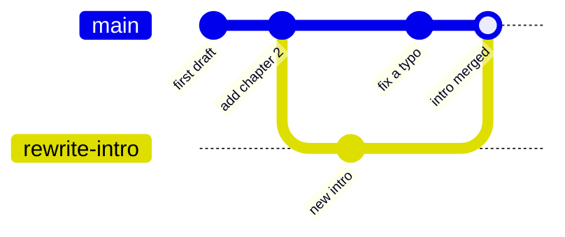

# Module 0.1: What Is Version Control?

**Audience:** Anyone about to start Module 1.1 — including people who've
never touched Git, GitHub, GitLab, or Azure DevOps, and people who've used
one of those tools and want the vocabulary lined up before they touch a
new one.

**Format:** Reading only. No account needed, nothing to click. Module 1.1
is where the hands-on part starts.

**Timing budget:** ~5 minutes.

## Why this exists

This is the first of four short pages that line up the vocabulary before
Module 1.1: version control (this page), [Git](module-0-2-what-is-git.md),
[GitHub](module-0-3-what-is-github.md), and, only if your team is moving from
GitLab, [Coming from GitLab](module-0-4-coming-from-gitlab.md). Module 1.1
teaches you to file an issue, branch, commit, and open a pull request — by
clicking through the real GitHub UI. It assumes you already know, loosely,
what those words mean. This page is that grounding, so Module 1.1 can spend
its time on *doing* instead of *defining*.

If you already know what a commit and a branch are, skip straight to
[Module 0.3](module-0-3-what-is-github.md) (the GitHub-specific part, including
account protection) or to [Module 1.1](../1_beginners/module-1-1-getting-started.md).
If any of the vocabulary below is new, five minutes here saves confusion later.

## What version control actually is

Version control is a history of every saved change to a set of files,
plus a way to work on changes without disturbing anyone else's. Instead of
`report_final.docx`, `report_final_v2.docx`, `report_final_v2_ACTUALLY_FINAL.docx`
emailed back and forth, every change is a recorded, timestamped, attributed
snapshot — and multiple people can work on their own snapshot at the same
time without overwriting each other.

What this shows: one line of history (`main`), with a side line
(`rewrite-intro`) for work in progress that is folded back in when it is ready.
Every dot is a saved change that stays in the history.

## Four words, once, in plain terms

| Term | Plain-language definition |
| --- | --- |
| **Repository** ("repo") | The project's folder, plus its entire saved history. |
| **Commit** | A saved snapshot of a change, with a message explaining what and why. The basic unit of history. |
| **Branch** | Your own copy of the project to work in, so your in-progress change can't disturb anyone else's until it's ready and reviewed. |
| **Merge** | The moment a branch's commits get folded into another branch (usually `main`) after review. |

The next page, [Module 0.2: What Is Git?](module-0-2-what-is-git.md), adds the
words for moving history between your machine and a shared copy.

## Self-check

- In your own words, what's the difference between a commit and a branch?
- Why is one history of saved changes better than several copies of a file
  with `v2` and `final` in the name?
- What happens to a branch's commits when it is merged?

Not confident on any of these? Re-read the section above before moving on.

## Feedback

Something unclear, wrong, or worth improving on this page? Open a
Discussion in this repo (**Ideas** category). Concrete, actionable
feedback gets converted into a tracked issue, per this repo's own
issue-first convention — see `skills/github-issue-first/SKILL.md`'s
Discussions section.

---

Next: [Module 0.2: What Is Git?](module-0-2-what-is-git.md)
