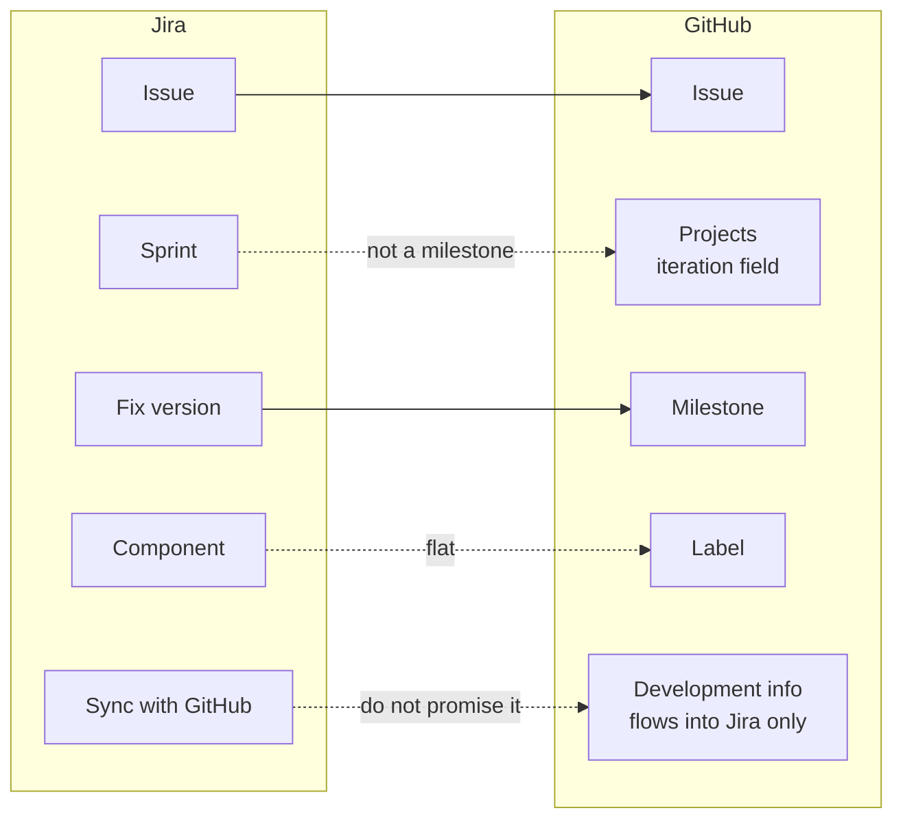

# Module 0.10: Coming from Jira

**Audience:** Anyone on a team that tracks work in Jira today and is moving some
or all of it to GitHub, or who works with such a team. Read
[Module 0.3](module-0-3-what-is-github.md) first. Conditional: skip it if you are
not coming from Jira. Coming from Azure DevOps instead? That is
[Module 0.9](module-0-9-coming-from-azure-devops.md), a page of its own.

**Format:** Reading only. No account needed, nothing to click.

**Timing budget:** ~12 minutes.

## Why this exists

Git does not change when a team moves to GitHub, so your commits, branches and
habits carry over. Jira is a planning tool and holds no code, so the move is
rarely a clean replacement. GitHub keeps the code, the review and its own issues
together, and many teams keep Jira for planning while the code lives in GitHub,
or move planning across a step at a time. This page orients you for either. It
does not repeat the full mapping, which is in the `github-for-ado-users` skill
(`skills/github-for-ado-users/SKILL.md`, "Coming from Jira"), and it does not
cover migrating data.

Atlassian's current documentation says *work item* where this page says Jira
issue, and *space* where it says project; people still use both words, so accept
either.

## What stays the same

Work is tracked as items you can assign and discuss, a change is proposed,
reviewed and then merged, and a Jira issue is, to a first approximation, a GitHub
issue.

What this shows: where each Jira concept lands on GitHub. Solid arrows are
renamed equivalents. Dotted arrows are the places where the word or the shape
differs, and the last one is not a mapping at all: it is the thing people assume
exists and does not.

## The mapping

| Jira | GitHub | What to watch |
| --- | --- | --- |
| Key plus number (`PROJ-123`) | Issue number (`#123`) | There is no project prefix. Across repositories write `owner/repo#123`. |
| Epic, Story, Task, Bug | Issue types (organization only) | GitHub has no built-in "epic" level. Use an issue type or label plus sub-issues. |
| Sub-task | Sub-issue | Up to eight levels and 100 per parent, and it can live in another repository. Do not rebuild more levels than you need. |
| Scrum board and sprint | Projects board plus an **iteration field** | Not a milestone. See the first trap below. |
| Workflow status | A single-select **Status** field on the board | The issue itself is only open or closed; no workflow rules carry over by themselves. |
| Resolution (Done, Won't do, Duplicate) | The close reason: completed, not planned, duplicate | Chosen when you close the issue. |
| Priority | A label | Not a built-in field. |
| Component | A label such as `area:auth` | Flat. |
| Fix version | **Milestone** | A release bucket that closes when it ships. This one matches well. |
| Affects version | An issue-form field or a label | No built-in field. |
| JQL | Issue search and saved views | Qualifiers combined with `AND`, `OR` and parentheses, but no functions. |

## Three traps

### 1. A sprint is not a milestone

A GitHub milestone is a delivery bucket: a release or a phase, closed when the
thing ships. It has a due date, which makes it *look* like a sprint. Put cadence
in a Projects **iteration field**, which has a length in days or weeks, a start
date and optional breaks. Your Jira **fix version** is the part that maps to a
milestone. Using milestones as sprints leaves a graveyard of half-empty
`Sprint 14` milestones.

### 2. Statuses do not carry over

In Jira the workflow decides which status can follow which, and a status change
can trigger rules. On GitHub an issue is open or closed, and a board's Status
field is just a column you choose. Check which workflow rules the team relies
on, such as who can move an item to Done, before you assume anything is
enforced.

### 3. Do not promise a sync

Atlassian describes development information flowing **into** Jira. It does not
describe syncing GitHub issues with Jira items, or carrying statuses between
them. Never tell a colleague the two stay in step. See the next section for what
does link.

## Linking GitHub and Jira

The GitHub for Atlassian app connects a GitHub organization to a Jira Cloud site.
A Jira site administrator and a GitHub organization owner must both approve it.
Once connected, a Jira key in a **branch name, a commit message or a pull request
title** links that work to the Jira item, whose development panel then shows the
branches, commits and pull requests. Smart commits can also comment on an item,
log time or move its status from a commit message; some organizations switch them
off, because a commit can be attributed to someone other than the person who
pushed it.

If planning stays in Jira, keep one source of truth for each piece of work:
planning and status in Jira, code and review in GitHub, the key in the branch name
and the pull request title. Copying every Jira item into a GitHub issue gives you
two records that drift apart. GitHub Enterprise Server connects through a
separate process that this page does not cover.

The closure rule does not change: this team records evidence for each acceptance
criterion before work is called done, wherever the criteria live. See
[Module 2.1](../2_intermediate/module-2-1-issue-first-and-closure-gate.md).

## What people expect and get wrong

| Expectation | What actually happens |
| --- | --- |
| "Our sprints become milestones." | Milestones are releases. Sprints become an iteration field. |
| "Components and priority are fields." | Both are labels on GitHub. |
| "Issue types exist in my repository." | Only if the repository belongs to an organization that defined them. |
| "A status change in GitHub updates Jira." | Only development information goes into Jira; a board status in GitHub is a separate thing. |
| "GitHub issues and Jira items stay in sync." | There is no sync. Choose one source of truth per piece of work. |
| "My JQL queries will work." | Issue search is simpler; plan for less. |

## Where to go next

- The `github-for-ado-users` skill, for any specific concept you are mapping. Its
  "Coming from Jira" section is the full version of this page.
- [Module 3.2: Projects boards](../3_advanced/module-3-2-projects-boards.md), for
  iteration fields and board views, once you have done the beginner modules.
- [Module 1.1: Getting Started](../1_beginners/module-1-1-getting-started.md), the
  hands-on part, once you have read
  [Module 0.5](module-0-5-what-kinds-of-tools-are-these.md) and
  [Module 0.6](module-0-6-what-is-an-llm-assistant.md).

## Sources and dates

Vendor features change, so check a claim before you rely on it for a decision
that is hard to undo. The Jira and GitHub claims on this page were checked
against Atlassian Support and GitHub Docs on 2026-10-10; the pages are listed at
the end of the "Coming from Jira" section of
`skills/github-for-ado-users/SKILL.md`. Not checked here: licensing and plan
limits, Jira Data Center, and GitHub Enterprise Server connections.

## Self-check

- Which Jira concept maps to a milestone, and which one does not?
- Can you tell a colleague that GitHub issues and Jira items stay in sync? Why not?
- Where does a Jira key go so that GitHub work links to the Jira item?

Not confident on any of these? Re-read the section above, or the skill.

## Feedback

Something unclear, wrong, or worth improving on this page? Open a
Discussion in this repo (**Ideas** category). Concrete, actionable
feedback gets converted into a tracked issue, per this repo's own
issue-first convention — see `skills/github-issue-first/SKILL.md`'s
Discussions section.

---

Next: [Module 0.5: What kinds of tools are these?](module-0-5-what-kinds-of-tools-are-these.md),
then [Module 0.6: What Is an LLM Assistant?](module-0-6-what-is-an-llm-assistant.md).
