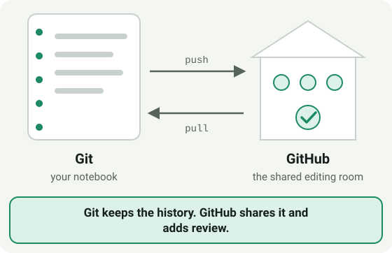
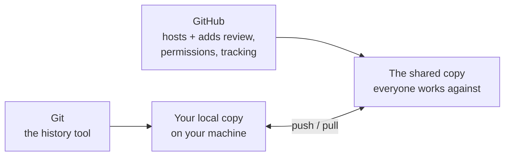

# Module 0.2: What Is Git?

**Audience:** Anyone who has read [Module 0.1](module-0-1-what-is-version-control.md),
or who already knows what a commit and a branch are.

**Format:** Reading only. No account needed, nothing to install yet.

**Timing budget:** ~5 minutes.

## What Git is

**Git** is the tool that keeps the history from Module 0.1 on your machine
(and everyone else's). It is a program, not a website: it works in any folder,
it needs no account and no internet connection, and it was working long before
GitHub existed. Git works without GitHub. GitHub doesn't exist without Git
underneath it.

Two things follow from that:

- **Every copy has the whole history.** When you have a copy of a repository,
  you have every commit in it, not just the latest files.
- **Git does the recording; something else decides who may change what.** Git
  has no idea who is allowed to merge into `main`. That rule-keeping is what a
  hosting service such as GitHub adds (see [Module 0.3](module-0-3-what-is-github.md)).

## Two copies: yours and the shared one

What this shows: Git and GitHub are two different layers. Git is what
records changes; GitHub is where the shared, reviewed copy lives and where
your changes go to be seen by everyone else.

## Three more words

| Term | Plain-language definition |
| --- | --- |
| **Clone** | Make your own local copy of a shared repository, with its whole history. |
| **Push** | Send your local commits up to the shared copy on GitHub. |
| **Pull** | Bring down commits other people pushed, so your local copy catches up. |

You will do each of these for real in [Module 1.2: Local Git Basics](../1_beginners/module-1-2-local-git-basics.md).
Until then, one thing is worth knowing now: Git also needs to know who you are,
a name and an email recorded on every commit you make. You set that once, in
[Module 0.8](module-0-8-connect-vs-code-to-git-github-and-an-llm.md).

## How you will use it

Git is a command-line tool, and editors such as VS Code put buttons on top of
the same commands. This program uses one or the other: for now, all Git
activity in this program is done in **VS Code or on the command line**.

## Self-check

- Where does your history live when you make a commit?
- What do push and pull each do?
- Can you use Git without GitHub? Can you use GitHub without Git?

Not confident on any of these? Re-read the section above.

## Feedback

Something unclear, wrong, or worth improving on this page? Open a
Discussion in this repo (**Ideas** category). Concrete, actionable
feedback gets converted into a tracked issue, per this repo's own
issue-first convention — see `skills/github-issue-first/SKILL.md`'s
Discussions section.

---

Next: [Module 0.3: What Is GitHub?](module-0-3-what-is-github.md)
