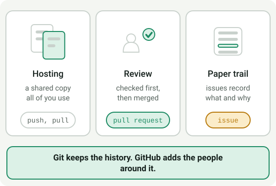
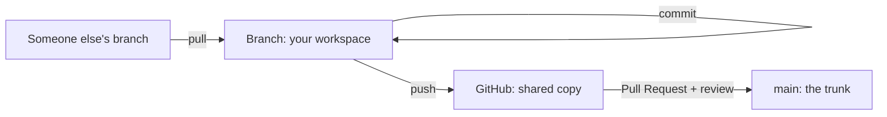

# Module 0.3: What Is GitHub?

**Audience:** Anyone who has read [Module 0.2](module-0-2-what-is-git.md), or
who already knows what Git is and is new to GitHub.

**Format:** Reading, plus a short account-protection checklist you do once
when you have your GitHub account. No other account needed, nothing to click.

**Timing budget:** ~15 minutes, about a third of it the account checklist.

## What GitHub is

**GitHub** is a service that hosts a shared copy of a Git repository online
and adds the collaboration layer on top: who's allowed to change what, how
changes get reviewed before they count, and a paper trail of why. Git records
the history; GitHub is the place where a team agrees on it.

Two words that only exist because of that layer:

| Term | Plain-language definition |
| --- | --- |
| **Pull Request (PR)** | A request to merge one branch's changes into another, with a review step in between. This is where "is this change good?" gets decided. |
| **Issue** | A tracked unit of work — a bug, a task, a question — that a PR usually gets linked to. |

What this shows: the same handful of actions — commit, push, pull, PR,
merge — repeat every time, in this order, on every single change, no
matter how small.

## Protect your account before you need to

This is the one section here that isn't about concepts — it's a checklist,
and it matters before you touch anything else. People do lose GitHub access
after a phone replacement: no recovery codes saved anywhere, and the
authenticator entry didn't carry over automatically. Losing access is
disruptive and avoidable, and GitHub Support cannot restore an account that
has two-factor authentication enabled if you lose your credentials. Do these
once, now:

- **Enable two-factor authentication (2FA) on your own account**, and set up
  **two or more** methods, for example an authenticator app plus a passkey or
  a security key. GitHub recommends more than one, so that losing a single
  device doesn't lock you out.
- **Download your recovery codes and keep them in a password manager**, not
  in a note on the phone you might replace. You can download them again at any
  time after enabling 2FA, so a lost copy is not a lost account. Generating a
  new set *invalidates* the old one, so it is not a way to re-read the codes
  you already have: when you generate new ones, replace the stored copy.
- **Keep your authentication factors and recovery codes to yourself.** They
  belong to your account alone. GitHub's guidance is not to share or
  distribute recovery codes, and that includes colleagues and administrators.
- **Before replacing a device, move or re-register 2FA first.** It does not
  carry over automatically just because you're signed into other services on
  the new phone.
- **GitHub Mobile** (iOS/Android) is a legitimate way to check
  notifications and review or approve PRs from your phone — genuinely
  useful, but approving a merge from a phone deserves the same care as
  from a laptop, not less.

### If you're already locked out

GitHub's recovery options are, in order of convenience: your saved recovery
codes; a passkey or security key you set up earlier; a fallback SMS number if
you added one; and, as a last resort, a one-time password sent to a verified
email address that you confirm with an SSH key, a device you have used before,
or a personal access token. Start from the sign-in page's recovery link, or
from a device where you are still signed in. If none of these works, the
account can't be recovered, although you can unlink its email address and use
it with a new account.

### Who can help, and who can't

- **Your personal account:** only you and GitHub's own recovery flow. Your
  organization's administrators can't recover it or bypass its 2FA, and GitHub's
  documentation treats recovery as the account holder's responsibility.
- **Your organization access:** once your account works again, an
  administrator can help you regain access to the organization's repositories
  and teams. Know who that is before you need them.
- **Managed accounts:** some organizations manage accounts through their own
  sign-in system. If yours does, recovery is handled there and not by the
  personal flow above, so ask your administrator which applies to you.

*Sources, checked against GitHub Docs on 2026-10-01:*
[Configuring two-factor authentication recovery methods](https://docs.github.com/en/authentication/securing-your-account-with-two-factor-authentication-2fa/configuring-two-factor-authentication-recovery-methods)
and
[Recovering your account if you lose your 2FA credentials](https://docs.github.com/en/authentication/securing-your-account-with-two-factor-authentication-2fa/recovering-your-account-if-you-lose-your-2fa-credentials).
GitHub's steps change, so check the current pages before you rely on them.

## How GitHub specifically puts this together

GitHub's shape of the workflow, at the concept level (no clicking yet —
that's Module 1.1):

1. Work starts with an **issue** — what needs to happen, and why.
2. A **branch** is created for that issue, so the change has its own space.
3. Work happens as one or more **commits** on that branch.
4. The branch is **pushed** to GitHub.
5. A **pull request** opens, comparing the branch against `main`.
6. Someone reviews it — comments, requests changes, or approves.
7. Once approved, it's **merged** — the change becomes part of `main`.
8. The linked **issue** closes, because the work it tracked is done.

That's the entire loop. Every session after this one is a deeper look at
one part of it.

## Where this team's process adds rules on top

Git and GitHub give you the *mechanism*. This team adds specific
*conventions* on top of it — when to say `Refs #N` vs `Closes #N`, how
branches get named, what a PR needs before it can merge. Those aren't
universal Git rules; they're this team's habits, and Module 1.1 onward
teaches them hands-on.

**One honest caveat: this level of rigor isn't one-size-fits-all.** The
full issue → branch → PR → review ceremony this program teaches earns its
keep on repos with real stakes — CI, deployed code, multiple contributors
relying on a stable history. A low-stakes repo (no CI, no deployed code, a
handful of people) doesn't automatically need the same weight — but that
doesn't mean no structure at all either; even a light repo benefits from
basic guardrails like branch protection on `main` or a habit of tracking
work somewhere. Don't assume either way on a repo you're new to — ask
whoever maintains it. `docs/repo-settings-snapshot.md` has read-only
commands to check what a repo actually has configured before assuming,
and `skills/github-issue-first/SKILL.md`'s "Scaling ceremony to repo risk"
section is the fuller version of this same judgment call.

## If you're coming from GitLab or Azure DevOps

The mechanism above is the same everywhere; the vocabulary and a few
structural features differ. [Module 0.4: Coming from GitLab](module-0-4-coming-from-gitlab.md)
maps them, and points to the `github-for-gitlab-users` and
`github-for-ado-users` skills for the full detail.

## Self-check

- What does GitHub add on top of Git?
- What has to happen to a branch before its changes become part of `main`?
- Which two or three things should you set up on your GitHub account before
  you rely on it, and why?

Not confident on any of these? Re-read the section above before starting
Module 1.1 — it only gets more concrete from here, not less.

## Feedback

Something unclear, wrong, or worth improving on this page? Open a
Discussion in this repo (**Ideas** category). Concrete, actionable
feedback gets converted into a tracked issue, per this repo's own
issue-first convention — see `skills/github-issue-first/SKILL.md`'s
Discussions section.

---

Next: [Module 0.4: Coming from GitLab](module-0-4-coming-from-gitlab.md) if your
team is moving from GitLab; otherwise the
[Module 0.6: What Is an LLM Assistant?](module-0-6-what-is-an-llm-assistant.md)
(also required reading before Module 1.1 if you'll be using an AI coding
assistant — most colleagues will), then
[Module 1.1: Getting Started](../1_beginners/module-1-1-getting-started.md) —
the hands-on version of everything defined above.
