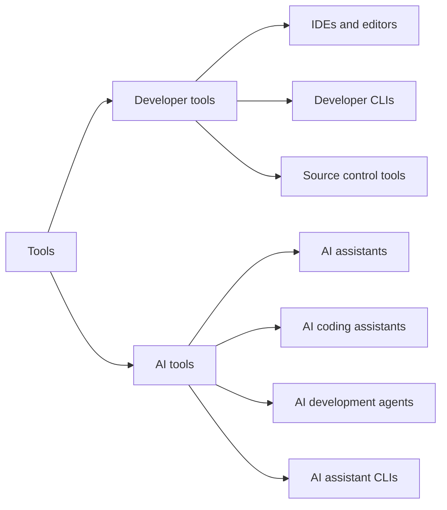

# Module 0.5: What kinds of tools are these?

**Audience:** Anyone who has read [Module 0.3](module-0-3-what-is-github.md) (or
already knows Git and GitHub) and is about to use an editor or an AI tool in this
program. No prior experience assumed.

**Format:** Reading only. Nothing to install, no account needed.

**Timing budget:** ~8 minutes.

## Why this exists

Product names pile up fast: two things called Copilot, a Claude and a Claude
Code, a Codex, a VS Code and a `code` command. This page gives you a small set of
kinds to sort them into, so that "what kind of thing is this?" has a consistent
answer when a new name comes up. It sorts by what a tool *does*, which matters
because that decides how much you need to check what it did ([Module 0.6](module-0-6-what-is-an-llm-assistant.md)).

The long lists of product names, with the dates they were checked, are in the
[developer and AI tooling taxonomy](../examples/ai-tooling-taxonomy.md), a lookup
page. Names change quickly, so look things up there or on the vendor's page rather
than relying on a list in a lesson.

What this shows: two groups, developer tools and AI tools, and the kinds inside
each.

## Developer tools

- **IDEs and editors** are the workspace where you write and run code: editing,
  debugging, extensions, and source control built in. **VS Code** is the one this
  program uses, and [Module 0.7](module-0-7-set-up-vs-code.md) sets it up. An
  **AI-first IDE** (Cursor and Windsurf are the usual examples) is an IDE built
  around AI. The three positions side by side: a traditional IDE is VS Code, an IDE
  with an AI assistant added is VS Code plus GitHub Copilot, and an AI-first IDE is
  Cursor or Windsurf.
- **Developer CLIs** are programs you run from a terminal: `git`, the GitHub CLI
  (`gh`), and the `code` command that opens VS Code from a terminal.
- **Source control tools** are graphical clients for Git, such as GitHub Desktop,
  GitKraken and Sourcetree. They are deliberately not covered here (maintainer
  decision, issue #178): for now, all Git activity in this program is done in
  **VS Code or on the command line**.

## AI tools

| Kind | What it does | Examples |
| --- | --- | --- |
| **AI assistant** | General conversation: answers, drafts, summaries | ChatGPT, Claude |
| **AI coding assistant** | Helps while *you* write code: completion, explanation, refactoring | GitHub Copilot |
| **AI development agent** | Carries out a multi-step piece of engineering work itself: edits several files, runs commands and tests, may open a pull request | Claude Code, Codex, the GitHub Copilot coding agent |
| **AI assistant CLI** | A terminal interface to an assistant or agent | Codex CLI, Claude Code in a terminal, GitHub Copilot CLI |

**The key distinction** is between an assistant and an agent. An assistant mainly
helps while you write. An agent can do a larger piece of work with little human
intervention, which is why the review habits in [Module 0.6](module-0-6-what-is-an-llm-assistant.md)
and Module 2.4 apply with full force to what an agent produces.

**Classify by what it does first, and where it runs second.** "CLI" says where a
tool runs, not what it is. Claude Code is an AI development agent that also has a
terminal interface, so it appears in two rows above.

Two naming traps, as checked on 2026-10-01 (see the taxonomy for the sources):

- **Microsoft Copilot** is a general assistant and **GitHub Copilot** is a coding
  assistant. They are different products with similar names.
- There is no separate "Claude CLI" or "ChatGPT CLI" from the vendors. Anthropic's
  terminal tool is Claude Code, and OpenAI's is Codex CLI.

## What this program covers

Lessons and exercises use VS Code, the command line, GitHub, and GitHub's own
Copilot coding agent ([Module 3.5](../3_advanced/module-3-5-actions-runners-and-agents.md)).
The repository has install guides for Claude, GitHub Copilot and Codex in
`docs/`. Every other product in the taxonomy is classified there but not taught.

## Self-check

- Is Claude Code an assistant or an agent, and why does the difference change how
  you treat what it produces?
- Name the kind of each: VS Code, GitHub Copilot, `gh`, ChatGPT.
- What is the difference between Microsoft Copilot and GitHub Copilot?

Not confident on any of these? Re-read the section above.

## Feedback

Something unclear, wrong, or worth improving on this page? Open a
Discussion in this repo (**Ideas** category). Concrete, actionable
feedback gets converted into a tracked issue, per this repo's own
issue-first convention — see `skills/github-issue-first/SKILL.md`'s
Discussions section.

---

Next: [Module 0.6: What Is an LLM Assistant?](module-0-6-what-is-an-llm-assistant.md)
