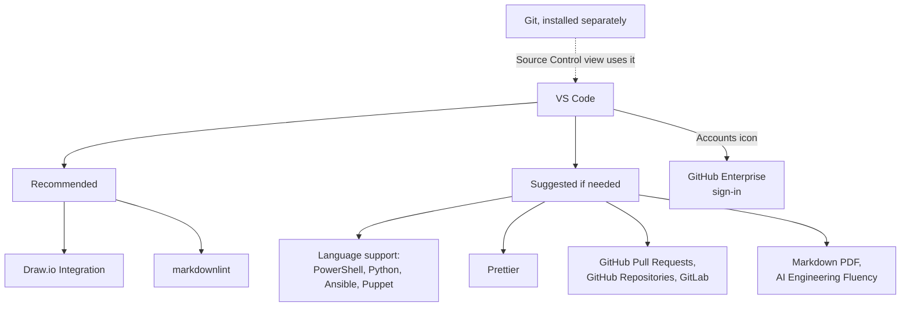

# Module 0.7: Set up VS Code

**Audience:** Anyone who will work in VS Code (this program uses VS Code or the
command line) and does not have it installed yet. Conditional: skip it if
VS Code is already installed and you can find the Extensions view.

**Format:** Hands-on install, done once. Mostly waiting on the installer, not
reading.

**Timing budget:** ~15 minutes, most of it install time.

**Permissions:** permission to install software on your machine (ask your
admin if installs are blocked). No GitHub account is needed for this module.

**Starting state:** VS Code is not installed, or you are not sure it is.

**Success state:** VS Code opens, you can open a folder from a terminal with
`code .`, you can find the Extensions view without help, and the two
recommended extensions are installed.

**Likely errors:**

- `code` is not recognised in a terminal: installers do not update terminal
  windows that are already open, so open a **new** terminal. If it still is not
  found, run the VS Code installer again and accept the option to add the
  command.
- An extension does not show up in the search: use the exact name from the
  table below, and check the publisher shown on its Marketplace page.

**Cleanup:** none needed. Everything installed here is used by later modules.

## Why this exists

[Module 0.5](module-0-5-what-kinds-of-tools-are-these.md) explained what an IDE
is. This module installs the one this program uses and shows you the four places
in it that matter. [Module 0.8](module-0-8-connect-vs-code-to-git-github-and-an-llm.md)
then connects it to Git, GitHub and an AI assistant. This is a conditional
prerequisite, not core reading: you need it only if you do not have VS Code set
up already, and nothing else in the program depends on it beyond what Module 0.8
and the command-line modules assume.

## 1. Install VS Code

Download from [code.visualstudio.com](https://code.visualstudio.com) and
run the installer — default options are fine here too. On first launch,
VS Code offers to install the command-line `code` command; accept it, it's
useful later for opening folders from a terminal (`code .`).

## 2. Four places to know

- **Explorer:** the files in the folder you opened.
- **Source Control:** the view that runs your local Git (installed separately,
  in Module 0.8) for staging, committing, pushing and pulling.
- **Extensions:** the four-squares icon in the left sidebar, or `Ctrl+Shift+X`.
- **Accounts:** the icon in the bottom-left corner, where you sign in to GitHub
  (Module 0.8).

## 3. Recommended extensions

There are two tiers: a short **recommended** list that helps almost everyone
who works with this repository, and a longer **suggested if needed** list you
add only when your work calls for it. The Marketplace links below were checked
on 2026-10-01. Extensions and their status change, so look at the Marketplace
page before you rely on one.

### Recommended

| Extension | Why it earns a spot |
| --- | --- |
| **Draw.io Integration** ([hediet.vscode-drawio](https://marketplace.visualstudio.com/items?itemName=hediet.vscode-drawio)) | Draw and edit diagrams as files in the repository (`.drawio`, `.drawio.svg`) without leaving VS Code, so a diagram can be reviewed in a pull request like any other change. |
| **markdownlint** ([DavidAnson.vscode-markdownlint](https://marketplace.visualstudio.com/items?itemName=DavidAnson.vscode-markdownlint)) | Underlines Markdown problems as you type, using the same kind of rules this repository checks with `npm run lint:markdown`, so you find a problem before CI does. |

### Suggested if needed

| Extension | Use it when | Note |
| --- | --- | --- |
| **PowerShell** ([ms-vscode.PowerShell](https://marketplace.visualstudio.com/items?itemName=ms-vscode.PowerShell)) | You read or write `.ps1` files, such as this repository's `install-skills.ps1` | Adds IntelliSense, debugging, and script analysis |
| **Python** ([ms-python.python](https://marketplace.visualstudio.com/items?itemName=ms-python.python)) | You write Python | Language support with IntelliSense, debugging, and testing |
| **Ansible** ([redhat.ansible](https://marketplace.visualstudio.com/items?itemName=redhat.ansible)) | You write Ansible playbooks or roles | Its Marketplace page also mentions optional AI assistance (Ansible Lightspeed), so check your organization's AI policy before enabling that part |
| **Puppet** ([puppet.puppet-vscode](https://marketplace.visualstudio.com/items?itemName=puppet.puppet-vscode)) | You write Puppet code | Language support, syntax highlighting, and linting |
| **Prettier** ([esbenp.prettier-vscode](https://marketplace.visualstudio.com/items?itemName=esbenp.prettier-vscode)) | You want consistent formatting for JSON, YAML, Markdown, and similar files | Check the repository's formatting rules first, and turn off format-on-save for files you are not changing: a formatter that rewrites a whole file turns a one-line fix into a pull request nobody can review (see Module 2.4) |
| **GitHub Pull Requests** ([GitHub.vscode-pull-request-github](https://marketplace.visualstudio.com/items?itemName=GitHub.vscode-pull-request-github)) | You want to review and manage pull requests and issues from inside VS Code | Pairs with the command-line workflow in Module 1.2 |
| **GitHub Repositories** ([GitHub.remotehub](https://marketplace.visualstudio.com/items?itemName=GitHub.remotehub)) | You need to browse or make a small edit in a remote repository without cloning it | The Marketplace lists it as a pre-release extension that works best with VS Code Insiders, and this program's exercises assume a local clone, so skip it unless you need it |
| **GitLab** ([GitLab.gitlab-workflow](https://marketplace.visualstudio.com/items?itemName=GitLab.gitlab-workflow)) | You also work in GitLab projects (issues, merge requests, pipelines) | The mapping between GitLab and GitHub concepts is in the `github-for-gitlab-users` skill |
| **Markdown PDF** ([yzane.markdown-pdf](https://marketplace.visualstudio.com/items?itemName=yzane.markdown-pdf)) | You want to export a Markdown file to PDF or HTML for offline reading or printing | Not deprecated on the Marketplace page as of the check date |
| **AI Engineering Fluency** ([RobBos.ai-engineering-fluency](https://marketplace.visualstudio.com/items?itemName=RobBos.ai-engineering-fluency)) | You want to see your GitHub Copilot token usage and cost estimates | It reads your local Copilot session logs. According to its Marketplace page it can also send aggregated usage statistics, and optionally session logs, to an Azure backend when you enable that, and it says it does not transmit prompts or conversation content. Leave those options off unless your organization has approved them |

Install any of these from VS Code's Extensions view (the four-squares icon
in the left sidebar, or `Ctrl+Shift+X`) — search the name, click Install.

What this shows: VS Code is the hub, and Git runs underneath it (the Source
Control view calls out to your local Git install). GitHub Enterprise sign-in
connects it to the shared repositories. The two recommended extensions are
for everyone, and the suggested ones are grouped by what they add, so you can
pick only the group your work needs.

## Self-check

- Can you open a folder in VS Code from a terminal with `code .`?
- Can you find the Extensions view without help?
- Are Draw.io Integration and markdownlint installed?

Not confident on any of these? Re-run the relevant numbered step above — each
one is independent, so there is no need to start over.

## Feedback

Something unclear, wrong, or worth improving on this page? Open a
Discussion in this repo (**Ideas** category). Concrete, actionable
feedback gets converted into a tracked issue, per this repo's own
issue-first convention — see `skills/github-issue-first/SKILL.md`'s
Discussions section.

---

Next: [Module 0.8: Connect VS Code to Git, GitHub and an AI assistant](module-0-8-connect-vs-code-to-git-github-and-an-llm.md).
