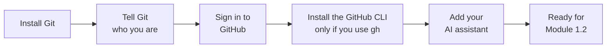
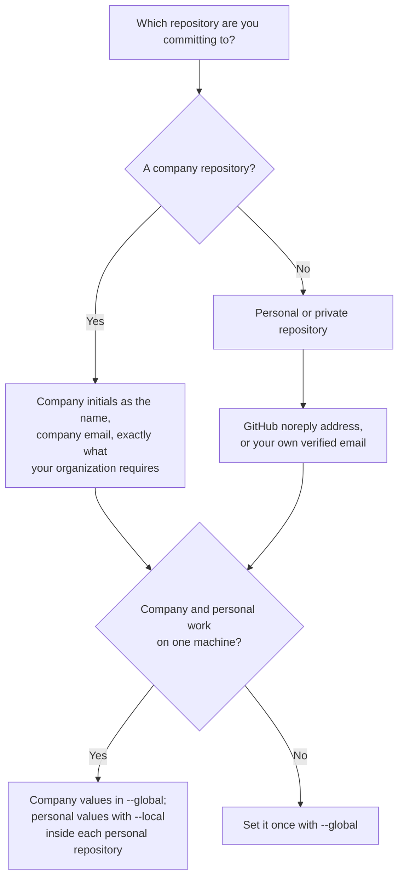

# Module 0.8: Connect VS Code to Git, GitHub and an AI assistant

**Audience:** Anyone with VS Code installed ([Module 0.7](module-0-7-set-up-vs-code.md))
who is about to start Module 1.2 (or any command-line work) without Git
installed yet, without a Git identity set, or without VS Code connected to the
organization's GitHub account. Conditional: skip a step you have already done.

**Format:** Hands-on installs and sign-ins, done once. Mostly waiting on
installers, not reading.

**Timing budget:** ~25 minutes, most of it install time.


**Permissions:** permission to install software on your machine; a GitHub
account (with single sign-on if your organization requires it); for company
repositories, your company initials and company email.

**Starting state:** VS Code is installed (Module 0.7). Git may or may not be.

**Success state:** `git --version` works in a new terminal; `git config --global
user.name` and `user.email` print the values you meant; the Accounts icon in
VS Code shows your GitHub username; if you use the GitHub CLI, `gh auth status`
says you are logged in; and your AI assistant opens in VS Code.

**Likely errors:**

- `git` is not recognised: open a **new** terminal, because installers do not
  update windows that are already open.
- `git commit` says "Author identity unknown", or commits show the wrong author:
  set the identity again as in step 2, and check for a repository-level setting
  that overrides the global one (step 2 shows how).
- VS Code asks for sign-in to the wrong GitHub: sign out of the Accounts icon
  and choose the option your organization uses (github.com or a custom Enterprise
  URL) before signing in again.
- `gh auth status` reports a different account or host than VS Code: they are
  separate sign-ins; run `gh auth login` again and choose the same host.

**Cleanup:** none needed. To remove an identity you set by mistake, run
`git config --global --unset user.name` and `git config --global --unset user.email`.

## Why this exists

Module 1.2 assumes `git` is already installed and working, and that Git knows
who you are. This is where those assumptions get satisfied — install Git, tell
Git your name and email, connect VS Code to GitHub, optionally install the GitHub
CLI, and add the AI assistant your team uses. Git has to come first, because
VS Code's Source Control view calls out to your local Git install underneath.
This is a conditional prerequisite, not core reading: you need it only if you
do not already have these set up.



What this shows: five one-time steps, in order — each one is independent and
skippable if already done, but do them in this order the first time since the
later steps go more smoothly with Git already present and configured. Only the
GitHub CLI step is optional.

## 1. Install Git (Windows)

Fastest path, from a terminal (PowerShell or Command Prompt):

```powershell
winget install --id Git.Git -e --source winget
```

No `winget`, or it fails: download the installer directly from
[git-scm.com/downloads](https://git-scm.com/downloads) and run it — the
default options are fine for everyday use.

Confirm it worked in a **new** terminal window (installers don't update
windows already open):

```bash
git --version
```

## 2. Tell Git who you are

Every commit records an author: the name and email stored in your Git
settings. Set them once. Without them Git refuses to commit ("Author identity
unknown") or records a wrong author, and the commit is not linked to your
GitHub profile, so history cannot show who did what.



What this shows: which name and email to set. The company rule applies to
company repositories, the GitHub noreply address is the default for your own, and
when both live on one machine the personal values go inside each personal
repository.

**For company repositories, follow the company rule:** your name is your
company initials only, and your email is your company email. Use exactly what
your organization requires, not your full name or a personal address.

```powershell
git config --global user.name "XX"
git config --global user.email "xx@company.example"  # replace with your company email (public-scan: allow, placeholder address)
```

Replace `XX` with your company initials and the email with your company email.
Both lines above are placeholders. If you are unsure of either, ask your
facilitator or admin before your first commit.

### Addendum: personal and private repositories

The company rule applies to company repositories. For your own personal or
private repositories, as a rule of thumb **use the GitHub noreply address**, so
your real email is not written into every commit (and so stays out of public
history, where it can be scraped).

| Option | Use it when |
| --- | --- |
| GitHub **noreply** address | Recommended for personal repositories. It links commits to your profile without exposing your real email, and it keeps working if your account blocks pushes that expose a private email. Copy it from **Settings, Emails** on GitHub (it appears under "Keep my email addresses private"). Copy it rather than typing it: the number in it is yours |
| Your own email | It must be a **verified** email on your GitHub account, otherwise your commits are not linked to your profile. It will be visible in the history |

The noreply address has the shape `ID+USERNAME@users.noreply.github.com`. <!-- public-scan: allow (placeholder shape, not a real address) -->

```powershell
git config --global user.name "Your Name"
git config --global user.email "12345678+octocat@users.noreply.github.com"  # replace with yours (public-scan: allow, fake example address)
```

`--global` applies to every repository on this machine. If you use one machine
for both company and personal work, keep the company values in `--global` and
set the personal values inside each personal repository instead:

```powershell
git config --local user.name "Your Name"
git config --local user.email "12345678+octocat@users.noreply.github.com"  # replace with yours (public-scan: allow, fake example address)
```

Check it took:

```powershell
git config --global user.name
git config --global user.email
```

After your first commit, confirm the author with
`git log -1 --format="%an <%ae>"`. Commits you already made keep the old
author; only new commits use the new settings. If new commits still show the
wrong name, a setting inside the repository overrides the global one: run
`git config --local --list` in that repository and remove `user.name` and
`user.email` from it with `git config --local --unset`.

## 3. Connect VS Code to GitHub Enterprise

- Click the **Accounts** icon (bottom-left corner of VS Code).
- **Sign in with GitHub** (or **GitHub Enterprise** if your organization
  uses a custom Enterprise URL rather than github.com — check with your
  facilitator or admin which applies to you before starting this step).
- This opens a browser window to complete sign-in; if your organization
  requires SSO (single sign-on) on top of your GitHub credentials, you'll
  be prompted for that too — same as signing into any other work tool.
- Once signed in, the Accounts icon shows your GitHub username, and VS
  Code's Source Control view can now clone, push, and pull against
  repositories you have access to without re-entering credentials each
  time.

## 4. Install and sign in to the GitHub CLI (only if you use `gh`)

Skip this step if you only work in VS Code. Modules 2.5, 2.7 and 3.1 use the
GitHub CLI (`gh`), and signing in to VS Code does not sign in `gh`; they are
separate.

```powershell
winget install --id GitHub.cli -e --source winget
```

Open a **new** terminal, then sign in and check:

```powershell
gh auth login
gh auth status
```

`gh auth login` asks which GitHub to use and how to sign in. Choose the option
your organization uses (the same one you chose in step 3, ask your
facilitator or admin if unsure) and finish in the browser. `gh auth status`
should report that you are logged in as your own account.

## 5. Add your AI assistant

Which assistant you add depends on what your team uses, so ask your facilitator
or admin before you start. Read [Module 0.6: What Is an LLM Assistant?](module-0-6-what-is-an-llm-assistant.md)
first: it explains what these tools can do on their own and why you check what
they did. The install steps for each tool live in the repository's guides, which
change as the products do, so follow the current guide and not a copy here:

- [docs/claude.md](../../docs/claude.md) for Claude,
- [docs/copilot.md](../../docs/copilot.md) for GitHub Copilot,
- [docs/openai-codex.md](../../docs/openai-codex.md) for Codex, and
- [docs/vscode.md](../../docs/vscode.md) for the VS Code side of installing this
  repository's own skills.

Once it is installed, check three things before you rely on it: it opens inside
VS Code, you know which tools it is allowed to use and which actions need your
approval, and you keep that approval on. Never paste a secret into a prompt.

## Self-check

- Can you open a terminal in VS Code and run `git --version` successfully?
- Do `git config --global user.name` and `git config --global user.email` print
  your company initials and your company email (or, on a personal machine, your
  name and your noreply address)?
- Does the Accounts icon show your GitHub username, not a "Sign in" prompt?
- If you installed the GitHub CLI: does `gh auth status` say you are logged in?
- Can you open your AI assistant in VS Code, and say what it needs your approval for?

Not confident on any of these? Re-run the relevant numbered step above —
each one is independent, so there is no need to start over.

## Feedback

Something unclear, wrong, or worth improving on this page? Open a
Discussion in this repo (**Ideas** category). Concrete, actionable
feedback gets converted into a tracked issue, per this repo's own
issue-first convention — see `skills/github-issue-first/SKILL.md`'s
Discussions section.

---

Next: [Module 1.2: Local Git Basics](../1_beginners/module-1-2-local-git-basics.md)
now that `git` is installed.
