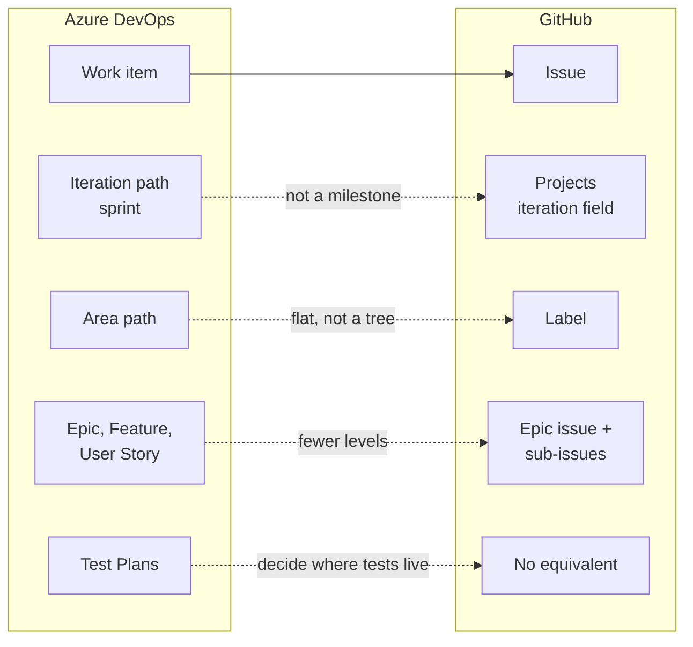

# Module 0.9: Coming from Azure DevOps

**Audience:** Anyone on a team that plans or builds in Azure DevOps today and is
moving to GitHub, in whole or a step at a time, or who works with such a team.
Read [Module 0.3](module-0-3-what-is-github.md) first. Conditional: skip it if
you are not coming from Azure DevOps. Coming from Jira instead? That is
[Module 0.10](module-0-10-coming-from-jira.md), a page of its own.

**Format:** Reading only. No account needed, nothing to click.

**Timing budget:** ~12 minutes.

## Why this exists

Git does not change when a team moves to GitHub, so your commits, branches and
habits carry over. What changes is where the planning lives and what its words
mean. Azure DevOps bundles repositories, boards, pipelines, test plans and a
wiki in one product. GitHub keeps the code, the review and the issues together
and covers the rest with a smaller set of features.

The danger is rarely the feature that is missing, because you notice that at
once. It is the word that *almost* matches, such as an iteration that looks like
a milestone, which quietly breaks the process weeks later. This page orients you;
it does not repeat the full mapping, which is in the `github-for-ado-users` skill
(`skills/github-for-ado-users/SKILL.md`), and it does not cover migrating data.

Many teams move a piece at a time: the code first, the pipelines next, the
planning last or never. That is a normal setup, and the section on keeping Azure
Boards next to GitHub says how the two link. [Module 0.4](module-0-4-coming-from-gitlab.md)
is the same kind of page for GitLab.

If your project uses TFVC rather than Git, start with
[Module 0.1](module-0-1-what-is-version-control.md): renaming nouns does not
bridge a central-lock model and a clone-everything model.

## What stays the same

Work is tracked as items you can assign and discuss, a change is proposed,
reviewed and then merged, and a pipeline runs checks on it. An Azure DevOps work
item is a GitHub issue; an Azure DevOps pull request is a GitHub pull request.

What this shows: where each Azure DevOps concept lands on GitHub. The solid
arrow is a renamed equivalent. Dotted arrows are the places where the word or
the shape differs, or where there is nothing to land on.

## The mapping

| Azure DevOps | GitHub | What to watch |
| --- | --- | --- |
| Work item | Issue | A straight mapping. |
| Work item type (Bug, Task, Feature) | Issue type | Real, but defined **per organization**: a personal account uses labels. |
| Iteration path (sprint) | Projects **iteration field** | Not a milestone. See the first trap below. |
| Area path | Label, such as `area:auth` | Flat. A path is a tree; a label is not. |
| Epic, Feature, User Story, Task | An epic issue with **sub-issues** | Do not rebuild every level; one level of sub-issues usually does. |
| Boards | Projects | A view over issues, not the source of truth. |
| Queries (WIQL) | Issue search and saved Projects views | Much less powerful; plan for that. |
| Pipelines | Actions | A different system. YAML in `.github/workflows/`, no converter. |
| Branch policies | Rulesets | Required reviews and required checks. |
| Pull request | Pull request | A straight mapping. |
| Test Plans | **No equivalent** | Decide where test cases live before you need them. |
| Wiki | `docs/` in the repository | GitHub has a Wiki, but a new one is a trap. |

Which work item types you have depends on the process the project was created
with: Microsoft's documentation lists Agile, Basic, Scrum and CMMI, and each has
a different requirement type (User Story, Issue, Product Backlog Item,
Requirement). So "our User Story" may be someone else's "Issue". Ask which
process your project uses before you map anything.

## Three traps

### 1. An iteration is not a milestone

Azure DevOps iteration paths are time-boxed intervals; Microsoft's documentation
calls them *sprints* and says they can be a flat list or a hierarchy of releases
and sprints. A GitHub **milestone** is a delivery bucket: a release or a phase,
closed when the thing ships. It has a due date, and that is what makes it look
like an iteration.

Put cadence in a Projects **iteration field**, which has a length in days or
weeks, a start date and optional breaks. Keep milestones for releases. Using
milestones as sprints leaves a graveyard of half-empty `Sprint 14` milestones
and removes the one thing milestones answer well: what is in the next release?

### 2. Test Plans has no twin

Azure Test Plans holds manual test cases in plans and suites, with a runner that
records results against them. GitHub has nothing like it. Test cases become files
in the repository, checklist items, or a tool you choose separately; automated
tests move into Actions. Decide this early, because the gap is invisible until
the first release that needs a manual sign-off.

### 3. A new Wiki is a trap, an established one is not

GitHub's Wiki is a separate repository with no pull requests, no review and no
link to the branch that changed the behaviour it documents. For documentation
that matters, `docs/` in the repository is reviewed in the same pull request as
the code. A team arriving with an established, actively used wiki can keep it;
the advice is about *starting* one.

## What GitHub adds

Discussions for open exploration, so that questions and proposals do not sit in
the issue list as tickets that can never close; sub-issues; code owners that
route review by path; and release notes generated from merged pull requests.
[Module 2.6](../2_intermediate/module-2-6-where-does-this-thought-belong.md)
covers where a thought belongs.

## Keeping Azure Boards next to GitHub

If the team keeps Azure Boards for planning, GitHub and Azure Boards link through
the **`AB#` mention**. Put `AB#125` in a commit message, a pull request
description or an issue description, and the work item shows the link in its
Development section. Microsoft's current documentation says a mention in a
*comment* or in a pull request *title* does **not** create the link, so put it
in the description. A word such as `fixes` before the mention can move the work
item to a completed state, but only when the pull request merges into the default
branch.

The closure rule does not change: this team records evidence for each acceptance
criterion before an issue closes. See
[Module 2.1](../2_intermediate/module-2-1-issue-first-and-closure-gate.md).

## What people expect and get wrong

| Expectation | What actually happens |
| --- | --- |
| "Our sprints become milestones." | Milestones are releases. Sprints become an iteration field. |
| "The area path tree comes along." | Labels are flat; encode the area in the name. |
| "Issue types exist in my repository." | Only if the repository belongs to an organization that defined them. |
| "Test Plans has a GitHub twin." | It does not; decide where test cases live. |
| "A pull request that says `Closes #12` is finished work." | It only changes state on merge; record the evidence first. |
| "I can write the pipeline the way I did before." | Actions is a different system, taught in [Module 3.5](../3_advanced/module-3-5-actions-runners-and-agents.md). |

## Where to go next

- The `github-for-ado-users` skill, for any specific concept you are mapping.
- [Module 3.2: Projects boards](../3_advanced/module-3-2-projects-boards.md), for
  iteration fields and board views, once you have done the beginner modules.
- [Module 1.1: Getting Started](../1_beginners/module-1-1-getting-started.md), the
  hands-on part, once you have read
  [Module 0.5](module-0-5-what-kinds-of-tools-are-these.md) and
  [Module 0.6](module-0-6-what-is-an-llm-assistant.md).

## Sources and dates

Vendor features change, so check a claim before you rely on it for a decision
that is hard to undo. The Azure DevOps claims on this page were checked against
Microsoft Learn on 2026-10-11: work item types by process (Agile, Basic, Scrum,
CMMI), area and iteration paths, Azure Test Plans, and the `AB#` link syntax. The
GitHub claims were checked against GitHub Docs on 2026-10-10. Not checked here:
licensing and plan limits, GitHub Enterprise Server connections, and Azure
DevOps Server (on premises) differences.

## Self-check

- What does a GitHub milestone mean, and where does an iteration go instead?
- Where do you put `AB#125`, and where does it not work?
- What is the GitHub equivalent of Azure Test Plans?

Not confident on any of these? Re-read the section above, or the skill.

## Feedback

Something unclear, wrong, or worth improving on this page? Open a
Discussion in this repo (**Ideas** category). Concrete, actionable
feedback gets converted into a tracked issue, per this repo's own
issue-first convention — see `skills/github-issue-first/SKILL.md`'s
Discussions section.

---

Next: [Module 0.5: What kinds of tools are these?](module-0-5-what-kinds-of-tools-are-these.md),
then [Module 0.6: What Is an LLM Assistant?](module-0-6-what-is-an-llm-assistant.md).
