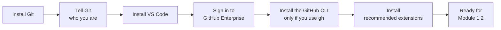
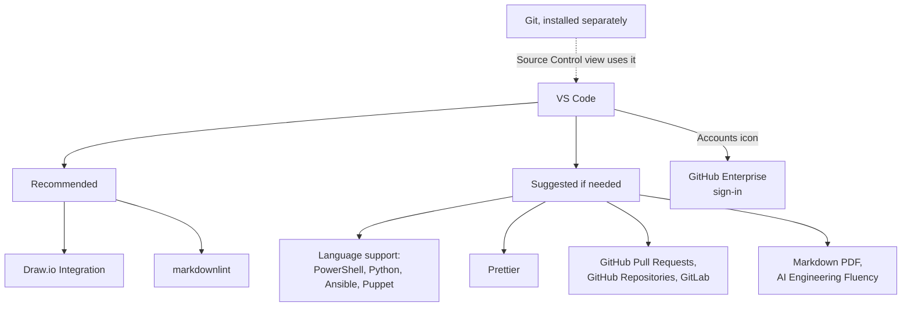

# Setting Up Your Local Dev Environment

**Audience:** Anyone about to start Module 1.2 (or any command-line work)
without Git or VS Code installed yet, without a Git identity set, or without
VS Code connected to the organization's GitHub Enterprise account.

**Format:** Hands-on installs, done once. Mostly waiting on installers, not
reading.

**Timing budget:** ~35 minutes, most of it install time.

## Why this exists

Module 1.2 assumes `git` is already installed and working, and that Git knows
who you are. This is where those assumptions get satisfied — install Git, tell
Git your name and email, install VS Code, connect VS Code to GitHub Enterprise,
optionally install the GitHub CLI, and pick up a few extensions worth having
from day one. This is a conditional prerequisite, not core reading: you
need it only if you don't already have Git and VS Code set up for
command-line work, and nothing else in the program depends on it.



What this shows: six one-time setup steps, in order — each one is
independent and skippable if already done, but do them in this order the
first time since the later steps go more smoothly with Git already present
and configured. Only the GitHub CLI step is optional.

## 1. Install Git (Windows)

Fastest path, from a terminal (PowerShell or Command Prompt):

```powershell
winget install --id Git.Git -e --source winget
```

No `winget`, or it fails: download the installer directly from
[git-scm.com/downloads](https://git-scm.com/downloads) and run it — the
default options are fine for everyday use.

Confirm it worked in a **new** terminal window (installers don't update
windows already open):

```bash
git --version
```

## 2. Tell Git who you are

Every commit records an author: the name and email stored in your Git
settings. Set them once. Without them Git refuses to commit ("Author identity
unknown") or records a wrong author, and the commit is not linked to your
GitHub profile, so history cannot show who did what.

**For company repositories, follow the company rule:** your name is your
company initials only, and your email is your company email. Use exactly what
your organization requires, not your full name or a personal address.

```powershell
git config --global user.name "XX"
git config --global user.email "xx@company.example"  # replace with your company email (public-scan: allow, placeholder address)
```

Replace `XX` with your company initials and the email with your company email.
Both lines above are placeholders. If you are unsure of either, ask your
facilitator or admin before your first commit.

### Addendum: personal and private repositories

The company rule applies to company repositories. For your own personal or
private repositories, as a rule of thumb **use the GitHub noreply address**, so
your real email is not written into every commit (and so stays out of public
history, where it can be scraped).

| Option | Use it when |
| --- | --- |
| GitHub **noreply** address | Recommended for personal repositories. It links commits to your profile without exposing your real email, and it keeps working if your account blocks pushes that expose a private email. Copy it from **Settings, Emails** on GitHub (it appears under "Keep my email addresses private"). Copy it rather than typing it: the number in it is yours |
| Your own email | It must be a **verified** email on your GitHub account, otherwise your commits are not linked to your profile. It will be visible in the history |

The noreply address has the shape `ID+USERNAME@users.noreply.github.com`. <!-- public-scan: allow (placeholder shape, not a real address) -->

```powershell
git config --global user.name "Your Name"
git config --global user.email "12345678+octocat@users.noreply.github.com"  # replace with yours (public-scan: allow, fake example address)
```

`--global` applies to every repository on this machine. If you use one machine
for both company and personal work, keep the company values in `--global` and
set the personal values inside each personal repository instead:

```powershell
git config --local user.name "Your Name"
git config --local user.email "12345678+octocat@users.noreply.github.com"  # replace with yours (public-scan: allow, fake example address)
```

Check it took:

```powershell
git config --global user.name
git config --global user.email
```

After your first commit, confirm the author with
`git log -1 --format="%an <%ae>"`. Commits you already made keep the old
author; only new commits use the new settings. If new commits still show the
wrong name, a setting inside the repository overrides the global one: run
`git config --local --list` in that repository and remove `user.name` and
`user.email` from it with `git config --local --unset`.

## 3. Install VS Code

Download from [code.visualstudio.com](https://code.visualstudio.com) and
run the installer — default options are fine here too. On first launch,
VS Code offers to install the command-line `code` command; accept it, it's
useful later for opening folders from a terminal (`code .`).

## 4. Connect VS Code to GitHub Enterprise

- Click the **Accounts** icon (bottom-left corner of VS Code).
- **Sign in with GitHub** (or **GitHub Enterprise** if your organization
  uses a custom Enterprise URL rather than github.com — check with your
  facilitator or admin which applies to you before starting this step).
- This opens a browser window to complete sign-in; if your organization
  requires SSO (single sign-on) on top of your GitHub credentials, you'll
  be prompted for that too — same as signing into any other work tool.
- Once signed in, the Accounts icon shows your GitHub username, and VS
  Code's Source Control view can now clone, push, and pull against
  repositories you have access to without re-entering credentials each
  time.

## 5. Install and sign in to the GitHub CLI (only if you use `gh`)

Skip this step if you only work in VS Code. Modules 2.5, 2.7 and 3.1 use the
GitHub CLI (`gh`), and signing in to VS Code does not sign in `gh`; they are
separate.

```powershell
winget install --id GitHub.cli -e --source winget
```

Open a **new** terminal, then sign in and check:

```powershell
gh auth login
gh auth status
```

`gh auth login` asks which GitHub to use and how to sign in. Choose the option
your organization uses (the same one you chose in step 4, ask your
facilitator or admin if unsure) and finish in the browser. `gh auth status`
should report that you are logged in as your own account.

## 6. Recommended extensions

There are two tiers: a short **recommended** list that helps almost everyone
who works with this repository, and a longer **suggested if needed** list you
add only when your work calls for it. The Marketplace links below were checked
on 2026-10-01. Extensions and their status change, so look at the Marketplace
page before you rely on one.

### Recommended

| Extension | Why it earns a spot |
| --- | --- |
| **Draw.io Integration** ([hediet.vscode-drawio](https://marketplace.visualstudio.com/items?itemName=hediet.vscode-drawio)) | Draw and edit diagrams as files in the repository (`.drawio`, `.drawio.svg`) without leaving VS Code, so a diagram can be reviewed in a pull request like any other change. |
| **markdownlint** ([DavidAnson.vscode-markdownlint](https://marketplace.visualstudio.com/items?itemName=DavidAnson.vscode-markdownlint)) | Underlines Markdown problems as you type, using the same kind of rules this repository checks with `npm run lint:markdown`, so you find a problem before CI does. |

### Suggested if needed

| Extension | Use it when | Note |
| --- | --- | --- |
| **PowerShell** ([ms-vscode.PowerShell](https://marketplace.visualstudio.com/items?itemName=ms-vscode.PowerShell)) | You read or write `.ps1` files, such as this repository's `install-skills.ps1` | Adds IntelliSense, debugging, and script analysis |
| **Python** ([ms-python.python](https://marketplace.visualstudio.com/items?itemName=ms-python.python)) | You write Python | Language support with IntelliSense, debugging, and testing |
| **Ansible** ([redhat.ansible](https://marketplace.visualstudio.com/items?itemName=redhat.ansible)) | You write Ansible playbooks or roles | Its Marketplace page also mentions optional AI assistance (Ansible Lightspeed), so check your organization's AI policy before enabling that part |
| **Puppet** ([puppet.puppet-vscode](https://marketplace.visualstudio.com/items?itemName=puppet.puppet-vscode)) | You write Puppet code | Language support, syntax highlighting, and linting |
| **Prettier** ([esbenp.prettier-vscode](https://marketplace.visualstudio.com/items?itemName=esbenp.prettier-vscode)) | You want consistent formatting for JSON, YAML, Markdown, and similar files | Check the repository's formatting rules first, and turn off format-on-save for files you are not changing: a formatter that rewrites a whole file turns a one-line fix into a pull request nobody can review (see Module 2.4) |
| **GitHub Pull Requests** ([GitHub.vscode-pull-request-github](https://marketplace.visualstudio.com/items?itemName=GitHub.vscode-pull-request-github)) | You want to review and manage pull requests and issues from inside VS Code | Pairs with the command-line workflow in Module 1.2 |
| **GitHub Repositories** ([GitHub.remotehub](https://marketplace.visualstudio.com/items?itemName=GitHub.remotehub)) | You need to browse or make a small edit in a remote repository without cloning it | The Marketplace lists it as a pre-release extension that works best with VS Code Insiders, and this program's exercises assume a local clone, so skip it unless you need it |
| **GitLab** ([GitLab.gitlab-workflow](https://marketplace.visualstudio.com/items?itemName=GitLab.gitlab-workflow)) | You also work in GitLab projects (issues, merge requests, pipelines) | The mapping between GitLab and GitHub concepts is in the `github-for-gitlab-users` skill |
| **Markdown PDF** ([yzane.markdown-pdf](https://marketplace.visualstudio.com/items?itemName=yzane.markdown-pdf)) | You want to export a Markdown file to PDF or HTML for offline reading or printing | Not deprecated on the Marketplace page as of the check date |
| **AI Engineering Fluency** ([RobBos.ai-engineering-fluency](https://marketplace.visualstudio.com/items?itemName=RobBos.ai-engineering-fluency)) | You want to see your GitHub Copilot token usage and cost estimates | It reads your local Copilot session logs. According to its Marketplace page it can also send aggregated usage statistics, and optionally session logs, to an Azure backend when you enable that, and it says it does not transmit prompts or conversation content. Leave those options off unless your organization has approved them |

Install any of these from VS Code's Extensions view (the four-squares icon
in the left sidebar, or `Ctrl+Shift+X`) — search the name, click Install.



What this shows: VS Code is the hub, and Git runs underneath it (the Source
Control view calls out to your local Git install). GitHub Enterprise sign-in
connects it to the shared repositories. The two recommended extensions are
for everyone, and the suggested ones are grouped by what they add, so you can
pick only the group your work needs.

## Self-check

- Can you open a terminal in VS Code and run `git --version` successfully?
- Do `git config --global user.name` and `git config --global user.email` print
  your company initials and your company email (or, on a personal machine, your
  name and your noreply address)?
- Does the Accounts icon show your GitHub username, not a "Sign in" prompt?
- If you installed the GitHub CLI: does `gh auth status` say you are logged in?
- Can you find the Extensions view without help?

Not confident on any of these? Re-run the relevant numbered step above —
each one is independent, so there's no need to start over.

## Feedback

Something unclear, wrong, or worth improving on this page? Open a
Discussion in this repo (**Ideas** category). Concrete, actionable
feedback gets converted into a tracked issue, per this repo's own
issue-first convention — see `skills/github-issue-first/SKILL.md`'s
Discussions section.

---

Next: [Module 1.2: Local Git Basics](../1_beginners/module-1-2-local-git-basics.md)
now that `git` is installed — or, if you're setting up VS Code specifically
to use this repository's own skills (Claude/Copilot), see
[docs/vscode.md](../../docs/vscode.md) for that install step instead.
