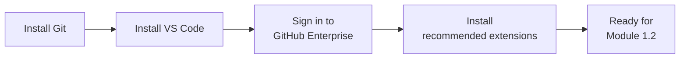
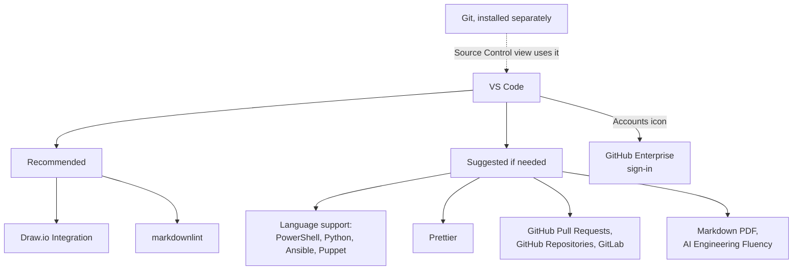

# Extra: Setting Up Your Local Dev Environment

**Audience:** Anyone about to start Module 1.2 (or any command-line work)
without Git or VS Code installed yet, or without VS Code connected to the
company's GitHub Enterprise account.

**Format:** Hands-on installs, done once. Mostly waiting on installers, not
reading.

**Timing budget:** ~30 minutes, most of it install time.

## Why this exists

Module 1.2 assumes `git` is already installed and working. This is where
that assumption gets satisfied — install Git, install VS Code, connect VS
Code to GitHub Enterprise, and pick up a few extensions worth having from
day one. Extra tier, not core curriculum: come back to this whenever you
need it, it doesn't gate anything else in the program.



What this shows: four one-time setup steps, in order — each one is
independent and skippable if already done, but do them in this order the
first time since VS Code's GitHub sign-in step goes more smoothly with Git
already present.

## 1. Install Git (Windows)

Fastest path, from a terminal (PowerShell or Command Prompt):

```powershell
winget install --id Git.Git -e --source winget
```

No `winget`, or it fails: download the installer directly from
[git-scm.com/downloads](https://git-scm.com/downloads) and run it — the
default options are fine for everyday use.

Confirm it worked in a **new** terminal window (installers don't update
windows already open):

```bash
git --version
```

## 2. Install VS Code

Download from [code.visualstudio.com](https://code.visualstudio.com) and
run the installer — default options are fine here too. On first launch,
VS Code offers to install the command-line `code` command; accept it, it's
useful later for opening folders from a terminal (`code .`).

## 3. Connect VS Code to GitHub Enterprise

- Click the **Accounts** icon (bottom-left corner of VS Code).
- **Sign in with GitHub** (or **GitHub Enterprise** if your organization
  uses a custom Enterprise URL rather than github.com — check with your
  facilitator or admin which applies to you before starting this step).
- This opens a browser window to complete sign-in; if your organization
  requires SSO (single sign-on) on top of your GitHub credentials, you'll
  be prompted for that too — same as signing into any other company tool.
- Once signed in, the Accounts icon shows your GitHub username, and VS
  Code's Source Control view can now clone, push, and pull against
  repositories you have access to without re-entering credentials each
  time.

## 4. Recommended extensions

There are two tiers: a short **recommended** list that helps almost everyone
who works with this repository, and a longer **suggested if needed** list you
add only when your work calls for it. The Marketplace links below were checked
on 2026-10-01. Extensions and their status change, so look at the Marketplace
page before you rely on one.

### Recommended

| Extension | Why it earns a spot |
| --- | --- |
| **Draw.io Integration** ([hediet.vscode-drawio](https://marketplace.visualstudio.com/items?itemName=hediet.vscode-drawio)) | Draw and edit diagrams as files in the repository (`.drawio`, `.drawio.svg`) without leaving VS Code, so a diagram can be reviewed in a pull request like any other change. |
| **markdownlint** ([DavidAnson.vscode-markdownlint](https://marketplace.visualstudio.com/items?itemName=DavidAnson.vscode-markdownlint)) | Underlines Markdown problems as you type, using the same kind of rules this repository checks with `npm run lint:markdown`, so you find a problem before CI does. |

### Suggested if needed

| Extension | Use it when | Note |
| --- | --- | --- |
| **PowerShell** ([ms-vscode.PowerShell](https://marketplace.visualstudio.com/items?itemName=ms-vscode.PowerShell)) | You read or write `.ps1` files, such as this repository's `install-skills.ps1` | Adds IntelliSense, debugging, and script analysis |
| **Python** ([ms-python.python](https://marketplace.visualstudio.com/items?itemName=ms-python.python)) | You write Python | Language support with IntelliSense, debugging, and testing |
| **Ansible** ([redhat.ansible](https://marketplace.visualstudio.com/items?itemName=redhat.ansible)) | You write Ansible playbooks or roles | Its Marketplace page also mentions optional AI assistance (Ansible Lightspeed), so check your organization's AI policy before enabling that part |
| **Puppet** ([puppet.puppet-vscode](https://marketplace.visualstudio.com/items?itemName=puppet.puppet-vscode)) | You write Puppet code | Language support, syntax highlighting, and linting |
| **Prettier** ([esbenp.prettier-vscode](https://marketplace.visualstudio.com/items?itemName=esbenp.prettier-vscode)) | You want consistent formatting for JSON, YAML, Markdown, and similar files | Check the repository's formatting rules first, and turn off format-on-save for files you are not changing: a formatter that rewrites a whole file turns a one-line fix into a pull request nobody can review (see Module 2.4) |
| **GitHub Pull Requests** ([GitHub.vscode-pull-request-github](https://marketplace.visualstudio.com/items?itemName=GitHub.vscode-pull-request-github)) | You want to review and manage pull requests and issues from inside VS Code | Pairs with the command-line workflow in Module 1.2 |
| **GitHub Repositories** ([GitHub.remotehub](https://marketplace.visualstudio.com/items?itemName=GitHub.remotehub)) | You need to browse or make a small edit in a remote repository without cloning it | The Marketplace lists it as a pre-release extension that works best with VS Code Insiders, and this program's exercises assume a local clone, so skip it unless you need it |
| **GitLab** ([GitLab.gitlab-workflow](https://marketplace.visualstudio.com/items?itemName=GitLab.gitlab-workflow)) | You also work in GitLab projects (issues, merge requests, pipelines) | The mapping between GitLab and GitHub concepts is in the `github-for-gitlab-users` skill |
| **Markdown PDF** ([yzane.markdown-pdf](https://marketplace.visualstudio.com/items?itemName=yzane.markdown-pdf)) | You want to export a Markdown file to PDF or HTML for offline reading or printing | Not deprecated on the Marketplace page as of the check date |
| **AI Engineering Fluency** ([RobBos.ai-engineering-fluency](https://marketplace.visualstudio.com/items?itemName=RobBos.ai-engineering-fluency)) | You want to see your GitHub Copilot token usage and cost estimates | It reads your local Copilot session logs. According to its Marketplace page it can also send aggregated usage statistics, and optionally session logs, to an Azure backend when you enable that, and it says it does not transmit prompts or conversation content. Leave those options off unless your organization has approved them |

Install any of these from VS Code's Extensions view (the four-squares icon
in the left sidebar, or `Ctrl+Shift+X`) — search the name, click Install.



What this shows: VS Code is the hub, and Git runs underneath it (the Source
Control view calls out to your local Git install). GitHub Enterprise sign-in
connects it to the shared repositories. The two recommended extensions are
for everyone, and the suggested ones are grouped by what they add, so you can
pick only the group your work needs.

## Self-check

- Can you open a terminal in VS Code and run `git --version` successfully?
- Does the Accounts icon show your GitHub username, not a "Sign in" prompt?
- Can you find the Extensions view without help?

Not confident on any of these? Re-run the relevant numbered step above —
each one is independent, so there's no need to start over.

## Feedback

Something unclear, wrong, or worth improving on this page? Open a
Discussion in this repo (**Ideas** category). Concrete, actionable
feedback gets converted into a tracked issue, per this repo's own
issue-first convention — see `skills/github-issue-first/SKILL.md`'s
Discussions section.

---

Next: [Module 1.2: Local Git Basics](../1_beginners/module-1-2-local-git-basics.md)
now that `git` is installed — or, if you're setting up VS Code specifically
to use this repository's own skills (Claude/Copilot), see
[docs/vscode.md](../../docs/vscode.md) for that install step instead.
