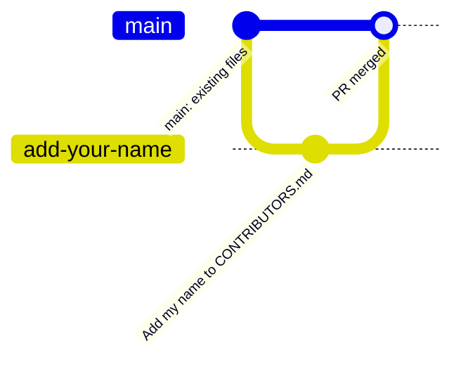
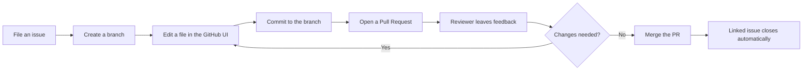

# Module 1.1: Getting Started with GitHub

**Audience:** Never used version control before.
**Format:** Hands-on, in the GitHub web UI — no command line, nothing to install.
**Timing budget:** ~60 minutes total.

## Learning objectives

By the end of this session, you will have:

- Made a commit and understood what one is.
- Created a branch and understood why we don't work directly on `main`.
- Opened a pull request and gone through a review.
- Watched an issue close automatically when your work merged.

## Timing

| Section | Minutes |
| --- | --- |
| Welcome and concepts (what is a commit/branch/PR, in plain terms) | 10 |
| Setup (make sure everyone can access the sandbox repo) | 5 |
| Walkthrough: file an issue, branch, commit, PR, review, merge | 30 |
| Watch the issue close, recap | 10 |
| Buffer / questions | 5 |

## Setup

You need: a GitHub account with access to the sandbox repo (the
facilitator will confirm this before the session starts). Nothing else —
no software to install, no command line.

## The two things happening at once

What this shows: every time you do this workflow, two things are true at
once — what's happening to the *repository* (above) and what you're
actually *clicking* (below). Beginners usually only see the second one;
this session teaches both.



What this shows: the same workflow from the repo's perspective (above), now as a sequence of clicks in the GitHub UI (below).



## Walkthrough

Everyone does this on their own, in the shared sandbox repo, at the same
time — the facilitator narrates each step and checks the room before
moving on.

### 1. File your own issue (5 min)

- Go to the sandbox repo's **Issues** tab → **New issue**.
- Title: `Add <your name> to CONTRIBUTORS.md`.
- Body: one sentence on why, then one **acceptance criterion** — a check
  that says when the work is done. Paste this, with your own name:

  ```text
  Adding myself as a contributor.

  - [ ] CONTRIBUTORS.md contains a line with my name.
  ```

- Click **Submit new issue**. Note your issue number (e.g. `#42`) — you'll need it later.

This is the first habit to build: **work starts with an issue**, not with
editing a file — and the issue says what "done" looks like, so you can prove
it later. `skills/github-issue-first/SKILL.md` is the full policy
behind why — this session is the hands-on version of it.

### 2. Create a branch (5 min)

- From your issue page, look for **Create a branch** (GitHub offers this
  directly from an issue) — or go to the repo's branch dropdown and type
  a new branch name like `add-<your-name>`.
- We never commit directly to `main` — a branch is your own space to work
  in until it's reviewed.

### 3. Edit a file and commit (5 min)

- Navigate to `CONTRIBUTORS.md` in the sandbox repo, **on your branch**.
- Click the pencil (edit) icon.
- Add a line with your name.
- Scroll down to **Commit changes** — make sure "Commit directly to the
  `add-<your-name>` branch" is selected, not `main`.
- Write a short commit message: `Add <your name> to CONTRIBUTORS.md`.
- Click **Commit changes**.

A commit is a saved snapshot of your change, with a message explaining
what and why. You just made one.

### 4. Open a Pull Request (5 min)

- GitHub will offer a **Compare & pull request** button right after your
  commit — click it.
- Title: leave the default or make it clearer.
- Body: type `Refs #<your issue number>` (e.g. `Refs #42`) — this is how
  we link a PR to the issue it's working on. (Full reasoning:
  `skills/github-hygiene/SKILL.md`'s traceability chain — Module 2.1 goes
  deeper on this.)
- Click **Create pull request**.
- Open the **Files changed** tab. The line you added is the *evidence* for
  your criterion: you can see it in the diff.

### 5. Get it reviewed (5 min)

- The facilitator (or a paired colleague) opens your PR, looks at the
  **Files changed** tab, and leaves a comment or an approval.
- If changes are requested: go back to step 3, edit the file again on the
  same branch, commit again — your PR updates automatically.
- If approved: move to step 6.

### 6. Merge (5 min)

- First check your criterion against the evidence. Add a comment on your PR
  (or your issue) saying what you checked, for example: "Criterion met: the
  Files changed tab shows my name added to CONTRIBUTORS.md."
- Only now, change the PR body from `Refs #<your issue number>` to
  `Closes #<your issue number>` — this tells GitHub to close the issue when
  the PR merges. The order matters: **criterion, then evidence, then
  `Closes`.** (Module 2.1 explains exactly when this switch is safe to make.)
- Click **Merge pull request** → **Confirm merge**.

### 7. Watch it close

- Go back to your issue (the one you filed in step 1). It should now show as
  **Closed**, with a note that it was closed by your merged PR.
- Check it the way you'd check any merged work: the issue is closed, **and**
  your criterion is met. Tick the criterion's checkbox (edit the issue, change
  `[ ]` to `[x]`) now that the evidence is recorded.

That's the full loop: **issue → branch → commit → PR → review → merge →
issue closes.** Every contribution on this team follows this shape.

## Wrap-up

You've now done, by hand, the entire workflow this team uses for every
change, from a one-line doc fix to a major feature. Module 2.1 covers the
*why* behind each step in more depth, and the specific conventions
(labels, milestones, the exact wording of `Refs`/`Closes`) that make this
team's process work at scale.

Next: [Module 2.1: Issue-first and the closure gate](../2_intermediate/module-2-1-issue-first-and-closure-gate.md)
