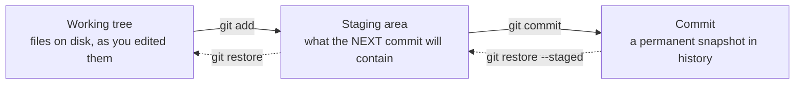

# Module 1.2: Local Git Basics

**Audience:** Anyone who's done Module 1.1 (or already works comfortably in
the GitHub web UI) and is ready to use `git` on the command line.
**Format:** Self-paced, hands-on, in a terminal against the shared sandbox
repo. Facilitator-note callouts mark optional group activities.
**Timing:** ~45 min.

Module 1.1 taught the workflow entirely through the GitHub web UI — no
install, no command line. That's a genuinely valid way to work, and plenty
of people stay there. This session is for when you want (or need) the
command line: it teaches the four things the web UI hides from you that
bite people the first time they hit them for real — staging, conflicts, and
undoing a mistake — plus the everyday clone/push/pull loop.

Nothing later requires it — every module from here on still works entirely
through the web UI. This session is for if and when you want the command
line for yourself; do it before Module 2.1 if you plan to use `git`/`gh`
locally while working through the rest of the program.

## Learning objectives

By the end of this session, you will have:

- Explained the difference between the working tree, the staging area, and
  a commit.
- Cloned a repo, pushed a branch, and pulled someone else's changes.
- Caused and resolved a real merge conflict, on purpose, once, somewhere
  safe.
- Used `git restore`, `git revert`, and `git reset` to undo three different
  kinds of mistake — and knows which one to reach for.

## Setup

You need `git` installed locally and a clone of the sandbox repo. If you
haven't cloned it yet:

```bash
git clone <sandbox-repo-url>
cd <sandbox-repo-name>
```

Everything below happens on your own branch, in your own clone — nothing
here can break `main` or anyone else's work.

## Three things, one file

The single most common point of confusion in git: **working tree**,
**staging area**, and **commit** are three different states, and most
mistakes come from not knowing which one you're looking at.



What this shows: `git add` doesn't save your work — it marks it as "ready
to be included next time you commit." The commit is the only one of the
three that's actually permanent history.

Try it:

```bash
git checkout -b session-2-<your-name>
echo "My scratch line" >> CONTRIBUTORS.md
git status                 # working tree: modified, not staged
git add CONTRIBUTORS.md
git status                 # staged: ready to commit
git commit -m "Scratch line for Module 1.2"
git status                 # working tree clean — it's in history now
```

`git status` at each step is the habit worth keeping — it tells you exactly
which of the three states you're in, every time.

## The everyday loop: clone, push, pull

You already cloned once, in Setup. The other two:

```bash
git push -u origin session-2-<your-name>   # send your branch to GitHub
git pull                                    # bring down changes others pushed
```

`push` only sends what you've committed — staged-but-uncommitted changes
never leave your machine. `pull` is really two steps at once (fetch, then
merge) — worth knowing, because that merge step is exactly where the next
section's conflict comes from.

## Causing (and fixing) a real merge conflict

Conflicts feel alarming the first time only because nobody's shown you one
on purpose yet. Here's a safe one, guaranteed to happen:

1. Make sure `main` is current: `git checkout main && git pull`.
2. Create two branches from it:

   ```bash
   git checkout -b conflict-a
   git checkout main
   git checkout -b conflict-b
   ```

3. On `conflict-a`, edit the **first line** of `CONTRIBUTORS.md`, commit,
   and push it.
4. Switch to `conflict-b` (`git checkout conflict-b`), edit that **same
   first line** to something different, commit, and try to merge
   `conflict-a` into it:

   ```bash
   git merge conflict-a
   ```

5. Git stops and tells you it can't auto-merge. Open `CONTRIBUTORS.md` —
   you'll see conflict markers:

   ```text
   <<<<<<< HEAD
   your version of the line
   =======
   conflict-a's version of the line
   >>>>>>> conflict-a
   ```

6. Edit the file by hand: delete the markers, keep whichever line (or a
   combination) makes sense, save.
7. `git add CONTRIBUTORS.md`, then `git commit` to finish the merge (git
   pre-fills a merge commit message — accepting it is fine).

That's the entire mechanism. A conflict is never git losing data — both
versions exist, in full, right there in the file; it's just asking you to
decide which one (or what combination) survives.

> **Facilitator note (optional group activity):** run this as a pair
> exercise — two people, one conflict, resolving it together over a screen
> share. Seeing someone else's first conflict resolved calmly is worth more
> than reading about it.

## Undoing a mistake: three commands, three different jobs

These get confused because they all "undo" something — but each undoes a
different *kind* of thing, and using the wrong one has different blast
radius.

| Command | Undoes | Rewrites history? | Safe on a pushed/shared branch? |
| --- | --- | --- | --- |
| `git restore <file>` | Uncommitted changes in the working tree | No — nothing was committed yet | Always safe — nothing shared is touched |
| `git revert <commit>` | An already-committed change | No — adds a new commit that undoes the old one | Yes — safe on shared branches |
| `git reset <commit>` | Moves the branch pointer itself | Yes — can discard commits entirely (`--hard`) | Only on a branch nobody else has pulled |

Try each one on your scratch branch from earlier:

```bash
# restore: throw away an uncommitted edit
echo "oops" >> CONTRIBUTORS.md
git restore CONTRIBUTORS.md      # the "oops" line is gone, no trace

# revert: undo a commit that's already there, keeping history honest
git revert HEAD                  # undoes your "Scratch line" commit with a new commit

# reset: move the branch pointer (use --hard only on your own unpushed work)
git reset --hard HEAD~1          # discards the revert commit itself, back one step
```

**The rule of thumb:** if nobody else could possibly have your commit yet,
`reset` is fine. The moment you've pushed it (or think someone might have
pulled it), use `revert` instead — rewriting shared history with `reset
--hard` on a pushed branch is the one git mistake that's genuinely hard to
walk back for everyone else.

## Self-check

- What's the difference between something being in your working tree and
  something being staged?
- If you and a colleague both edit the same line of the same file on
  different branches, what happens when you try to merge one into the
  other?
- You committed something by mistake five minutes ago and haven't pushed
  it yet. Which command do you reach for — `restore`, `revert`, or `reset`?
  What if you'd already pushed it?

Not confident on any of these? Re-read "Three things, one file" or
"Undoing a mistake" above.

## Feedback

Something unclear, wrong, or worth improving in this session? Open a
Discussion in this repo (**Ideas** category). Concrete, actionable
feedback gets converted into a tracked issue, per this repo's own
issue-first convention — see `skills/github-issue-first/SKILL.md`'s
Discussions section.

---

Next: [Module 2.1: Issue-first and the closure gate](../2_intermediate/module-2-1-issue-first-and-closure-gate.md)
