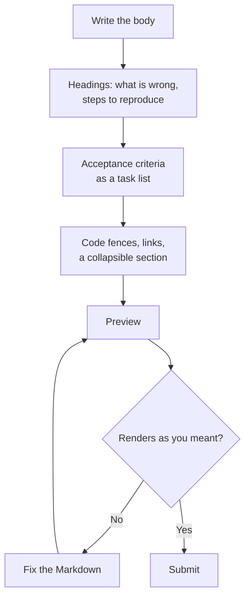

# Module 1.3: Markdown for issues and pull requests

**Audience:** Anyone who's completed Module 1.1. No command line needed;
everything here happens in the GitHub web UI.
**Format:** Self-paced — read and do each step yourself. Facilitator-note
callouts mark optional group activities.
**Timing:** ~20 min.

An issue or pull request is read by someone who has none of your context. The
words matter most, but the formatting decides whether those words can be
scanned, checked off, and followed to the right place. This module teaches the
small slice of Markdown you need for that. For a full syntax reference, keep
[the Markdown formatting showcase](../examples/markdown-formatting-showcase.md)
open in another tab.


## Learning objectives

- Format an issue body with headings, task lists, code fences, and a
  collapsible section.
- Link issues, pull requests, commits, and people with `#N`, commit SHAs, and
  `@name`.
- Preview before submitting and fix what renders wrong.



What this shows: the order the rest of this module follows, and the loop at the
end. Preview is a step you repeat until the page reads the way you meant, not
something you do once.

## Structure: headings, lists, and task lists

**Source:** `education/examples/markdown-formatting-showcase.md`,
`skills/github-hygiene/SKILL.md`

A few headings turn a wall of text into something a reader can scan. In an
issue, three are usually enough:

````markdown
## What is wrong

The badge shows green for a failing build.

## Steps to reproduce

1. Open the status page.
2. Look at the badge for the `main` branch.

## Acceptance criteria

- [ ] The badge shows red when the latest build fails.
- [ ] The badge shows green when the latest build passes.
````

Two list forms matter here. A numbered list (`1.`) is for steps that must
happen in order. A bullet list (`-`) is for things with no order.

The third form, `- [ ]`, is a **task list**. GitHub renders each item as a
checkbox, shows a progress count such as "1 of 2 tasks" on the issue, and lets
you tick a box without editing the text. That makes it the right format for
acceptance criteria, which Module 1.1 and Module 2.1 treat as the list you check
before closing an issue. Tick a box only after you have recorded the evidence
for it. The `github-hygiene` skill covers that rule; if you ever edit a body
from the command line, it also says to do it from a file so the line breaks
survive.

## Code and quoted text

**Source:** `education/examples/markdown-formatting-showcase.md`

Put anything a reader might copy, such as a command, an error message, or a
file's contents, in a **code fence**: three backticks on their own line, the
language (or `text`) right after the opening fence, and three backticks on a
closing line.

````markdown
```text
Error: badge colour lookup failed for status "failing"
```
````

The fence keeps the spacing exactly as you typed it and stops GitHub from
turning characters in your text into formatting or links. For a short word or
file name inside a sentence, use single backticks: `CONTRIBUTORS.md`.

## Collapsible sections

**Source:** `education/examples/markdown-formatting-showcase.md`

A long log makes an issue hard to read, but deleting it removes evidence. Fold
it away instead:

````markdown
<details>
<summary>Full build log</summary>

```text
...forty lines of output...
```

</details>
````

Leave a blank line after `<summary>` and before `</details>`, or the Markdown
inside will not render. The summary line is what the reader sees while it is
folded, so make it say what is inside.

## Links: issues, pull requests, commits, and people

**Source:** `education/examples/markdown-formatting-showcase.md`

GitHub turns some plain text into links automatically:

| You type | It becomes |
| --- | --- |
| `#42` | A link to issue or pull request 42 in the same repository, with its title on hover |
| `a1b2c3d` (at least 7 characters of a commit hash) | A link to that commit |
| `@name` | A link to that person, who is also **notified** |
| `https://...` | A clickable link |

For link text of your own, use `[the text](https://example.com)`.

Two cautions:

- **Mentions send a notification.** `@name` tells that person you want their
  attention. Mention someone because they are needed, never as decoration, and
  not in a large group, since each mention is an interruption.
- **Automatic links only work in normal text.** Inside a code fence or single
  backticks, `#42` stays plain text. If a reference must be clickable, keep it
  outside the code.

A `#N` reference in a pull request or issue also creates a visible "mentioned
in" entry on the target, so the two are connected in both directions. That is
the same mechanism that makes `Refs #N` in a pull request body show up on the
issue (Module 1.1, step 4).

## Preview before you submit

The editor has two tabs, **Write** and **Preview**. Switch to Preview before
you submit and look for the usual problems:

- A list that renders as one run-on paragraph, which usually means a missing
  blank line before it.
- Headings that show a literal `##`, which means there is no space after it.
- Text inside `<details>` that shows raw Markdown, which means a missing blank
  line.
- A fence that never closes, which swallows everything after it.

Fix in Write, preview again, then submit. You can also edit an issue after
submitting, so a mistake is never permanent, but other people may already have
read the unformatted version.

## Exercise: rewrite a bug report

**Permissions:** you need to be able to create and edit issues in the sandbox repository (the Triage or Write role). You do not need access to its settings.

**Starting state:** you have completed Module 1.1 in the sandbox repository, so
you have one closed issue and one merged pull request of your own. Open both in
other tabs and note their numbers and your username.

1. In the sandbox repository, go to **Issues** and choose **New issue**. Use
   the title `Fix the status badge colour`. Paste this into the body exactly as
   it is:

   ```text
   the badge is wrong. when the build fails it still shows green. i looked at
   the status page for the main branch and it said error: badge colour lookup
   failed for status "failing" and then here is the log: line 1 started build
   line 2 fetching status line 3 lookup failed line 4 using default colour.
   same thing happened after my earlier issue. it should be red when failing
   and green when passing.
   ```

2. Rewrite the body in the **Write** tab so that it has:
   - three headings: what is wrong, steps to reproduce, acceptance criteria;
   - the error message in a code fence;
   - the four log lines inside a collapsible section;
   - a task list of two acceptance criteria;
   - a link to your Module 1.1 issue with `#N`, and a link to your Module 1.1
     pull request with `#N`;
   - no `@name` mention of anyone else. To practise the syntax, mention
     yourself once.
3. Open **Preview**. Fix anything that renders wrongly, then submit the issue.
4. On the submitted issue, tick the first checkbox, then check that the issue
   shows "1 of 2 tasks" and that your earlier issue and pull request each show
   a "mentioned in" entry.

**Success state:** the submitted issue shows three headings, a fenced error, a
folded log, two checkboxes (one ticked), and working links to your two earlier
items, and each of those items shows the new issue as a reference.

**Likely errors:**

- The Preview tab shows `<details>` as plain text instead of a fold: a blank line is missing after `</summary>` or before `</details>`. Add the blank lines and preview again.
- Your `#N` shows as plain text, not a link: the number is inside backticks or has a space after the `#`. Remove the backticks and keep `#` attached to the digits.
- The checkbox will not tick on the submitted issue: the list item is missing the exact form `- [ ]` (dash, space, bracket, space, bracket), or you cannot edit the issue. Check the form first, then your role.
- You cannot find a Preview tab: you are in a comment box with a different layout. Use the new-issue form, which has Write and Preview tabs.

**Cleanup:** close the issue as **Not planned** with a short comment saying it
was a practice exercise. Nothing else needs undoing.

> **Facilitator note (optional group activity):** have two attendees swap
> their unformatted and formatted versions and say which one they would rather
> receive on a busy day, and why.

### Model answer

````markdown
## What is wrong

When the build fails, the badge still shows green.

## Steps to reproduce

1. Open the status page for the `main` branch.
2. Read the badge colour and the message under it.

```text
Error: badge colour lookup failed for status "failing"
```

<details>
<summary>Build log</summary>

```text
line 1 started build
line 2 fetching status
line 3 lookup failed
line 4 using default colour
```

</details>

This looks related to #<your earlier issue> and #<your earlier pull request>.

## Acceptance criteria

- [x] The badge shows red when the latest build fails.
- [ ] The badge shows green when the latest build passes.
````

(Your second checkbox stays unticked: that matches how a real issue looks
partway through.)

## Self-check

- Why use a task list for acceptance criteria instead of a plain bullet list?
- A command in your issue is getting mangled when someone copies it. What
  is the fix?
- You want a teammate to see the issue, so you type `@name`. What else does
  that do, and when would you avoid it?
- Your `<details>` section shows raw Markdown when folded open. What is the
  usual cause?
- Why does `#42` inside a code fence not become a link?

Not confident on any of these? Re-read the matching section above, then check
the answers below.

### Self-check answers

- A task list renders checkboxes, shows progress on the issue, and lets you
  record each criterion as checked. Tick a box only after you have recorded the
  evidence.
- Put the command in a code fence. It keeps the spacing and stops GitHub from
  changing the characters.
- It notifies that person. Avoid it when they are not needed, and for large
  groups, because each mention is an interruption.
- A missing blank line after `<summary>` (and before `</details>`).
- Automatic linking only applies to normal text. Inside a fence or backticks,
  the text is shown exactly as typed.

## Feedback

Something unclear, wrong, or worth improving in this module? Open a
Discussion in this repo (**Ideas** category). Concrete, actionable
feedback gets converted into a tracked issue, per this repo's own
issue-first convention — see `skills/github-issue-first/SKILL.md`'s
Discussions section.

---

Next: [Module 1.4: Finding your way around a repository](module-1-4-finding-your-way-around-a-repo.md),
then [Module 2.1: Issue-first and the closure gate](../2_intermediate/module-2-1-issue-first-and-closure-gate.md)
