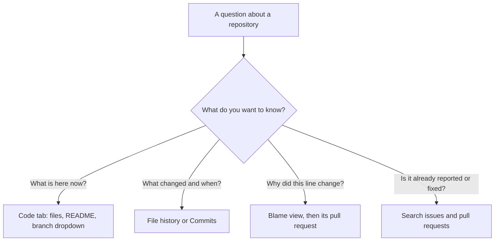

# Module 1.4: Finding your way around a repository

**Audience:** Anyone who's completed Module 1.1. No command line needed;
everything here happens in the GitHub web UI.
**Format:** Self-paced — read and do each step yourself. Facilitator-note
callouts mark optional group activities.
**Timing:** ~25 min.

Most of the time you spend in a repository isn't writing; it's working out what
is already there: what changed, when, why, and whether somebody has already
reported the thing you just found. GitHub keeps the answers, and this module
shows you where. Every answer comes from the trail Module 1.1 taught you to
leave: issues, branches, commits, and pull requests that point at each other.

## Learning objectives

- Read a repository from the Code tab: files, branches, tags, and releases.
- Use file history and the blame view to find when and why a line changed,
  without blaming a person.
- Search issues, pull requests, and code with qualifiers such as
  `is:issue is:open label:bug`.
- Read a pull request: Conversation, Commits, Checks, and Files changed.

## The Code tab

**Source:** `education/1_beginners/module-1-1-getting-started.md`

The **Code** tab is a repository's front page. Four things on it answer most
first questions:

- **The file list and the README below it.** The README says what the project
  is. The file list shows each file with the message of the last commit that
  touched it and how long ago that was.
- **The branch dropdown** (top left, usually showing `main`). It lists the
  branches and switches which one you are looking at. Files you see are always
  the files *on the branch shown there*, so check it before you conclude that a
  file is missing or out of date.
- **Branches and tags.** The branch dropdown has a **Tags** tab. A tag marks
  one commit, usually a released version such as `v1.2.0`.
- **Releases** (right-hand sidebar). If a repository publishes releases, the
  latest appears here with its notes, which are the quickest summary of what
  changed between versions. A repository with no releases shows "No releases
  published", which is normal for a practice repository.

What this diagram shows: the four questions a repository answers and the place
on GitHub to look for each one.

## History and blame: when and why, not who to blame

**Source:** `education/1_beginners/module-1-1-getting-started.md`

Open any file and you will see two buttons near the top right: **History** and
**Blame**.

- **History** lists every commit that changed this file, newest first. Click a
  commit to see exactly what it changed. Use it when you ask "when did this file
  start looking like this?"
- **Blame** shows the file line by line, with the commit that last changed each
  line in the margin. Use it when you ask "why is *this line* like this?"

The word "blame" is unfortunate. You are not looking for someone at fault;
you are looking for the **commit that introduced the line and the reason it
gives**. The useful parts of a blame row are the commit message and the pull
request link next to it. Follow that link: the pull request description and the
issue it references (Module 1.1 taught `Refs #N` for exactly this) usually
explain the decision. The person's name is just an answer to "who can I ask if
the trail doesn't explain it?", which is a fine question and a separate one.

Two habits make blame trustworthy:

- **The last change is not the original change.** A line that was reformatted
  last week shows last week's commit, not the commit that wrote it. Use the
  "View blame prior to this change" control beside a row to step back to the
  version before that commit.
- **A vague commit message is a gap in the trail, not a finding about a
  person.** If the message is "updates" and the pull request is empty, say so
  and ask; don't guess at a reason.

## Searching issues, pull requests, and code

**Source:** `education/1_beginners/module-1-1-getting-started.md`

Before you file an issue, check that nobody has filed it already. The search box
at the top of the **Issues** and **Pull requests** tabs accepts **qualifiers**:
words of the form `name:value` that narrow the results. Separate them with
spaces and they all apply at once.

| Search | Finds |
| --- | --- |
| `is:issue is:open label:bug` | Open issues labelled `bug` |
| `is:pr is:merged` | Merged pull requests |
| `is:issue is:closed "badge"` | Closed issues that mention the word "badge" |
| `author:@me` | Items you created |
| `is:issue no:milestone` | Issues with no milestone |
| `is:pr is:open review-requested:@me` | Open pull requests waiting for your review |

A few notes:

- The default search already includes `is:issue is:open`, which hides closed
  items. If you can't find something you know exists, delete those two words
  first, because the answer may be in a closed issue.
- Put a phrase in quotation marks to match it exactly.
- `-label:bug` (a leading minus) excludes a value.
- To search file contents, use the search bar at the top of the page and
  choose to search code in this repository. Code search looks at the default
  branch, and GitHub's own search help lists the current qualifiers, so check
  it if a qualifier here stops working.

GitHub's search syntax grows over time. Treat the table as a starting set, not
a complete list.

## Reading a pull request

**Source:** `education/1_beginners/module-1-1-getting-started.md`

A pull request page has four tabs:

| Tab | What it answers |
| --- | --- |
| **Conversation** | What is this for, and what has been said? The description, linked issue, review comments, and the merge (or close) event |
| **Commits** | How was the work built up, one commit at a time? |
| **Checks** | Did the automated checks pass? Each failed check links to its log |
| **Files changed** | What is the actual change? Every added and removed line |

Read them in that order. Start on **Conversation** to learn the intent, then open
**Files changed** with that intent in mind, instead of reading a diff cold. If a
repository has no automated checks, the **Checks** tab says so; that is a fact
about the repository, not an error.

On an *issue*, the equivalent is its **timeline**: the list of events below the
description, such as labels added, a branch linked, a pull request that
mentioned it, and who closed it and how. "Which pull request closed this issue?"
is answered there.

## Exercise: five questions about the sandbox

**Starting state:** you have completed Module 1.1 in the sandbox repository, so
you have a closed issue and a merged pull request of your own. You only need to
read; you will not change anything.

Answer each question, and write down *where* you found the answer:

1. **Code tab.** Which branch is shown by default, and how many branches does
   the repository have? Does it have any tags or releases?
2. **History.** Open `CONTRIBUTORS.md` and its **History**. How many commits
   have changed it, and what is the message of the most recent one?
3. **Blame.** Open the **Blame** view of `CONTRIBUTORS.md`. Find the line you
   added in Module 1.1. Which commit does the margin show for it, and which pull
   request does that commit link to?
4. **Search.** In the **Issues** tab, find your own Module 1.1 issue using
   qualifiers only (not scrolling): start from a search that finds closed
   issues you created. Then search for merged pull requests you created.
5. **Pull request.** Open your Module 1.1 pull request. Which issue does its
   description reference, what does the **Checks** tab show, and how many files
   does **Files changed** list?

**Success state:** you have an answer and a location for all five, and for
question 3 the pull request you found is your own Module 1.1 one, and its
description references your Module 1.1 issue.

**Cleanup:** none; nothing was changed.

> **Facilitator note (optional group activity):** after everyone has answered,
> compare answers to question 2. Attendees in the same sandbox will see the
> same history, so any different answers point to someone looking at a
> different branch.

### Model answer

Answers depend on the sandbox's state, so check the *method* and not the
numbers:

1. The branch dropdown shows the default branch (normally `main`) and the
   branch count; its **Tags** tab and the Releases sidebar show tags and
   releases. A practice repository may have none.
2. **History** on the file lists the commits; the newest one's message is the
   answer.
3. **Blame** shows your line with the commit from your Module 1.1 pull
   request, and the link beside it opens that pull request.
4. `is:issue is:closed author:@me` finds your issue, and
   `is:pr is:merged author:@me` finds your pull request.
5. The description contains `Refs #N` or `Closes #N` naming your issue; the
   Checks tab lists the repository's checks or says there are none; the Files
   changed tab lists the files in the diff (for Module 1.1, normally one).

## Self-check

- You want to know why a line in a file looks odd. Which view do you open, and
  what do you follow from it?
- Why can the blame view show a commit that didn't originally write the line?
- You searched for an issue you're sure exists and found nothing. What do you
  check first?
- In what order would you read a pull request's four tabs, and why?
- A blame row's commit message just says "updates" and its pull request has no
  description. What do you do?

Not confident on any of these? Re-read the matching section above, then check
the answers below.

### Self-check answers

- Open **Blame**, then follow the pull request link beside the line to its
  description and linked issue.
- Blame shows the *last* commit to touch each line. A later reformat or move
  replaces the original. Use "View blame prior to this change" to step back.
- Whether the search still includes `is:open`: the item may be closed. Also
  check the spelling, and that you are in the right repository.
- Conversation first to learn the intent, then Files changed to read the diff
  with that intent in mind; Commits and Checks as needed.
- Treat it as a gap in the trail and ask the author or a maintainer, rather
  than guessing a reason.

## Feedback

Something unclear, wrong, or worth improving in this module? Open a
Discussion in this repo (**Ideas** category). Concrete, actionable
feedback gets converted into a tracked issue, per this repo's own
issue-first convention — see `skills/github-issue-first/SKILL.md`'s
Discussions section.

---

Next: [Module 1.5: What never goes in a repository](module-1-5-what-never-goes-in-a-repo.md)
(needs the command line from Module 1.2), then
[Module 2.1: Issue-first and the closure gate](../2_intermediate/module-2-1-issue-first-and-closure-gate.md)
