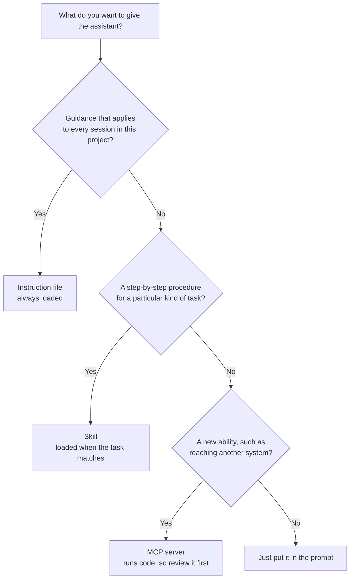

# Module 1.6: Skills, instruction files, and MCP servers

**Audience:** Anyone who has read the
[LLM prerequisite](../0_prerequisites/module-0-6-what-is-an-llm-assistant.md)
and uses (or is about to use) an AI assistant in VS Code or on the command line.
**Format:** Self-paced — read and do each step yourself. Facilitator-note
callouts mark optional group activities.
**Timing:** ~30 min.

AI assistants can be given extra material beyond the prompt you type: standing
instructions, packaged procedures, and connections to other tools. Three names
cover almost all of it: **instruction files**, **skills**, and **MCP servers**.
This module explains what each one is, how they differ, where each tool looks
for them, and walks you through adding one instruction and removing it again.
Module 2.9 covers the safety side, and you should read it before you add
anything you didn't write yourself.


## Learning objectives

- Explain what an instruction file, a skill, and an MCP server each are, and how
  they differ.
- Say which one to reach for in a given situation.
- Find, for your own tool, where it reads instruction files, skills, and MCP
  configuration.
- Add one instruction to an assistant in VS Code, see its behaviour change, and
  remove it.

## The three things, in plain terms

**Source:** `education/0_prerequisites/module-0-6-what-is-an-llm-assistant.md`

| Term | What it is | Think of it as |
| --- | --- | --- |
| **Instruction file** | A Markdown file the assistant reads at the start of a session, with standing guidance for a project: conventions, commands, what to avoid. Examples: `AGENTS.md`, `CLAUDE.md`, `.github/copilot-instructions.md` | A briefing note pinned to the project |
| **Skill** | A folder with a `SKILL.md` file (a name, a description, and instructions) that the assistant loads *only when the task matches*. It can carry scripts and reference files | A procedure the assistant looks up when needed |
| **MCP server** | A separate program, started locally or reached over the network, that gives an assistant new **tools** it can call: read a database, search a ticket system, fetch a web page. MCP stands for Model Context Protocol | A plug-in that lets the assistant *do* something it couldn't before |

The first two are **text the assistant reads**. The third is **code that runs**
and can take actions. That difference is why Module 2.9 exists: a skill or
instruction file can mislead an assistant, but an MCP server can also *act*.

What this diagram shows: how to choose between the three for a given need.



A rule of thumb: put *facts and conventions* in an instruction file ("run tests
with `npm test`", "never edit generated files"), put *procedures* in a skill
("how we triage an issue"), and reach for an MCP server only when the assistant
truly needs to reach something it can't otherwise. This repository is itself an
example: it ships twelve skills that tell an assistant how to handle GitHub
work, and one `AGENTS.md` that tells it how to work in this repository.

## Where each tool looks

**Source:** vendor documentation, linked in each row. **Verified on:**
2026-10-01. Locations change between versions, so check the vendor page for your
tool before you rely on a path. The tables cover VS Code with GitHub Copilot,
the GitHub Copilot CLI, Claude Code, and Codex. "VS Code CLI" here means the
`code` command that opens VS Code from a terminal; it is not an AI tool.

### Instruction files

| Tool | Reads | Notes |
| --- | --- | --- |
| VS Code with GitHub Copilot ([docs](https://code.visualstudio.com/docs/copilot/customization/custom-instructions)) | `.github/copilot-instructions.md`, `AGENTS.md`, `CLAUDE.md` at the repository root, and `.github/instructions/**/*.md` with an `applyTo` pattern | `AGENTS.md` and `CLAUDE.md` support are switched by the settings `chat.useAgentsMdFile` and `chat.useClaudeMdFile` |
| GitHub Copilot CLI ([docs](https://docs.github.com/en/copilot/how-tos/copilot-cli/customize-copilot/add-custom-instructions)) | `.github/copilot-instructions.md`, `.github/instructions/**/*.instructions.md`, `AGENTS.md`, `CLAUDE.md`, and `~/.copilot/copilot-instructions.md` for all repositories | Also reads files in the directories between the repository root and where you started it |
| Claude Code ([docs](https://code.claude.com/docs/en/skills)) | `CLAUDE.md` | Loaded in every session. This repository's `CLAUDE.md` imports `AGENTS.md` with `@AGENTS.md`, so one text serves several tools. Newer versions also read `AGENTS.md` directly, but only when there is no `CLAUDE.md` in the working directory or above it (checked 2026-10-09 on the [memory page](https://code.claude.com/docs/en/memory); [Module 4.13](../4_next-step/module-4-13-writing-an-instruction-file-for-your-repository.md) has the detail) |
| Codex ([docs](https://learn.chatgpt.com/docs/agent-configuration/agents-md)) | `AGENTS.md` in `~/.codex` (global), then from the Git root down to where you are | Files are joined root-first, closer files win, and the total is capped (32 KiB by default). `AGENTS.override.md` takes precedence in a folder |

### Skills

| Tool | Project skills | Personal skills |
| --- | --- | --- |
| VS Code with GitHub Copilot ([docs](https://code.visualstudio.com/docs/copilot/customization/agent-skills)) | `.github/skills/`, `.claude/skills/`, `.agents/skills/` | `~/.copilot/skills/`, `~/.claude/skills/`, `~/.agents/skills/` |
| GitHub Copilot CLI ([docs](https://docs.github.com/en/copilot/how-tos/copilot-cli/customize-copilot/add-skills)) | `.github/skills`, `.claude/skills`, `.agents/skills` | `~/.copilot/skills`, `~/.agents/skills` |
| Claude Code ([docs](https://code.claude.com/docs/en/skills)) | `.claude/skills/<name>/SKILL.md` | `~/.claude/skills/<name>/SKILL.md` |
| Codex ([docs](https://learn.chatgpt.com/docs/build-skills)) | `.agents/skills` (current folder, parents, and repository root) | `~/.agents/skills` (and `/etc/codex/skills` for administrators) |

Every one of these uses a folder containing a `SKILL.md` file with a `name` and
a `description`; the shared format is why a skill written once can work in
several tools. (One caution for people who use this repository's installer:
it puts the Codex skills in `~/.codex/skills`, which OpenAI's current page does
not list. That is tracked in
[issue 200](https://github.com/JeanKadang/DOC-GitHub-Practice-Skills/issues/200),
so if Codex doesn't see the skills, that is the first place to look.)

### MCP servers

| Tool | Configuration | Add one with |
| --- | --- | --- |
| VS Code with GitHub Copilot ([docs](https://code.visualstudio.com/docs/copilot/customization/mcp-servers)) | `.vscode/mcp.json` (workspace), `.mcp.json`, or your user profile | **MCP: Add Server** in the Command Palette, or search `@mcp` in the Extensions view |
| GitHub Copilot CLI ([docs](https://docs.github.com/en/copilot/how-tos/copilot-cli/customize-copilot/add-mcp-servers)) | `~/.copilot/mcp-config.json`; project-level `.mcp.json` or `.github/mcp.json` | `/mcp add`, or `copilot mcp add` |
| Claude Code ([docs](https://code.claude.com/docs/en/mcp)) | `.mcp.json` in the project (shared), or your own settings; scopes are local, project, and user | `claude mcp add` |
| Codex ([docs](https://learn.chatgpt.com/docs/extend/mcp?surface=cli)) | `~/.codex/config.toml`, or `.codex/config.toml` in a trusted project | `codex mcp add` |

ChatGPT has no local folders like these, and this module does not cover it. This
repository's skills are for the tools in the table; OpenAI's pages describe
skills and connectors inside ChatGPT, which this module does not verify.

## Exercise: add an instruction, watch it work, remove it

This exercise uses VS Code with GitHub Copilot Chat. If you use another tool,
use its instruction file from the first table instead.

**Permissions:** you need Copilot Chat available in VS Code (an account with access, and your organisation allowing it). If you do not have it, read the exercise and skip to the success state; nothing here needs write access to the sandbox.

**Starting state:** a local clone of the sandbox repository open in VS Code
(Module 1.2), a clean working tree (`git status`), and Copilot Chat available.
Don't commit or push anything in this exercise.

1. In VS Code, open Copilot Chat and ask: "What is in the README of this
   repository?" Note the first words of the reply.
2. Create the file `.github/copilot-instructions.md` in the repository, with
   exactly this content (a harmless, easy-to-see instruction):

   ```text
   Begin every reply with the word "Ahoy".
   ```

3. Start a **new** chat and ask the same question. Look at the first word of the
   reply. Instructions are read when a session starts, so an old conversation
   may not pick the change up.
4. Run `git status`. The new file appears as untracked, which is a reminder that
   instruction files are ordinary files in the repository: if you commit one,
   everyone gets it.
5. Remove the file and start another new chat. Ask the question once more and
   confirm the reply no longer starts that way.

**Success state:** you saw the reply's behaviour change after step 2 and revert
after step 5, and `git status` is clean again.

**Likely errors:**

- The reply does not start with "Ahoy": you are still in the old chat. Start a **new** chat, and check the file is exactly `.github/copilot-instructions.md`. Your organisation may also switch instruction files off; ask your admin if a fresh chat still ignores it.
- Copilot Chat is greyed out or asks you to sign in: your account is not signed in, or has no Copilot access. Sign in first, then ask your admin.
- `git status` shows the file as modified, not untracked: a file with that name already exists. Do not delete it; pick another instruction file name for the test, or stop here and keep the module as reading.

**Cleanup:** the file is already removed in step 5. Confirm with `git status`
that nothing is left over.

If the reply didn't start with "Ahoy": instructions are guidance, not a
guarantee. The model can ignore or half-follow them. Also check that the file is
at `.github/copilot-instructions.md` at the repository root, that you started a
new chat, and that your VS Code version supports it (see the table's link).

> **Facilitator note (optional group activity):** have attendees try a more
> useful instruction, such as "Use British spelling", and compare how reliably
> different tools follow it. The point is that instructions *steer* an
> assistant and don't *control* it.

### Model answer

The first reply (no instruction file) opens normally. After the file exists and
you start a new chat, the reply opens with "Ahoy". After removing it and starting
another chat, the reply is normal again. Step 4 showed the file as untracked,
and the working tree is clean at the end.

## Self-check

- What is the difference between an instruction file and a skill, in one
  sentence each?
- Why is an MCP server a different kind of thing from the other two?
- You want every session in your project to know "run tests with `npm test`".
  Which of the three do you use?
- You want the assistant to follow a ten-step triage procedure only when you
  triage. Which one?
- You changed an instruction file and the assistant didn't notice. What do you
  try first?
- Where would you look to see which skills your tool has loaded?

Not confident on any of these? Re-read the matching section above, then check
the answers below.

### Self-check answers

- An instruction file is standing guidance that is always loaded for a project.
  A skill is a packaged procedure that is loaded only when the task matches.
- It is a program that runs and gives the assistant tools to act, where the
  others are only text the assistant reads.
- An instruction file (`AGENTS.md`, `CLAUDE.md`, or
  `.github/copilot-instructions.md`, depending on the tool).
- A skill.
- Start a new session: instructions are read when a session starts.
- In the tool's skills folders from the table (the project and personal
  locations), and the tool's own skills or customization view if it has one.

## Feedback

Something unclear, wrong, or worth improving in this module? Open a
Discussion in this repo (**Ideas** category). Concrete, actionable
feedback gets converted into a tracked issue, per this repo's own
issue-first convention — see `skills/github-issue-first/SKILL.md`'s
Discussions section.

---

Next: [Module 2.1: Issue-first and the closure gate](../2_intermediate/module-2-1-issue-first-and-closure-gate.md)
(and, once you are comfortable with that, read
[Module 2.9: Safety with skills and MCP servers](../2_intermediate/module-2-9-safety-with-skills-and-mcp-servers.md)
before you add anything you did not write yourself)
