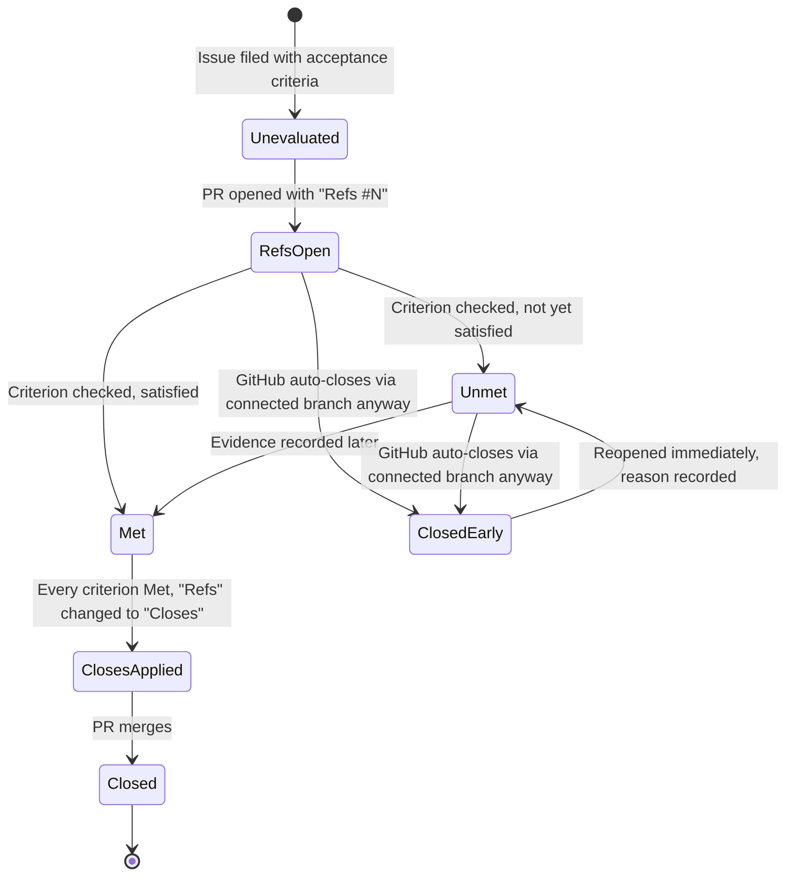

# Module 2.1: Issue-first and the closure gate

**Audience:** Anyone who's done Module 1.1, or already knows git/GitHub/
GitLab/Azure DevOps and read the mapping skill as pre-reading.
**Format:** Self-paced — read and do each step yourself. Facilitator-note
callouts mark optional group activities.
**Timing:** ~50 min.

This module covers the two habits everything else in this team's workflow
is built on: filing work as an issue before touching it, and knowing the
one real gotcha in how issues get closed. Every section names the
`skills/*/SKILL.md` file with the full policy — this module is the taught
version, not the source of truth. If something here doesn't answer your
question, the named skill file has the complete, current answer.

## Learning objectives

- Understand why work starts with an issue, not a branch or a PR.
- Understand the acceptance-criteria closure gate and why `Refs`/`Closes`
  matters.
- Be able to recognize — and recover from — GitHub auto-closing an issue
  you only meant to reference.

## Issue-first

**Source:** `skills/github-issue-first/SKILL.md`

The rule, stated plainly: **every piece of work starts as a filed issue —
even small ones.** Not after you've started fixing it, not only when
someone remembers to ask. This matters more than it sounds like it should:
the issue tracker is this team's source of truth for "things we know
about." If a bug or an idea only ever lived in a chat message or a hallway
conversation, it is — for every practical purpose — gone the moment that
conversation ends. Nobody can search for it, link to it, or prove it was
ever raised. Filing it is what makes it durable.

A well-formed issue needs, one piece at a time:

- **A title that states the problem, not the fix.** "Badge falls through to
  the wrong color" is a good title; "Fix badge bug" is not — it tells the
  next reader nothing about what's actually broken.
- **A body with enough context to act on later**, including by the person
  who filed it, six weeks from now, having forgotten the details. What's
  wrong, where, how it was found, roughly what fixing it would involve.
- **Exactly one priority label** (how urgent this is) and **at least one
  category label** (what kind of work it is) — these are two different
  axes, and conflating them is a common early mistake.
- **An assignee.** An unassigned issue is easy to lose track of; someone
  should always own it, even if that someone is "whoever picks it up next."
- **A milestone**, attached at filing time — not as something to backfill
  later once the issue already has momentum.

One exception, named explicitly so this doesn't read as bureaucracy for its
own sake: if someone has said outright "just fix it, don't bother filing an
issue for this," that's fine — skip the ceremony for that one specific
thing. It's a scoped exception for what was actually said, not a blanket
opt-out.

> **Facilitator note (optional group activity):** as a group, pull up 2-3
> real closed issues in this repo and look at them together. For each one,
> ask the group to identify: what's the priority label, what's the category
> label, and what were the acceptance criteria? This works best with issues
> that have some visible back-and-forth in the comments — it makes the
> "durable record" argument concrete rather than abstract.

## The closure gate — `Refs` vs `Closes`

**Source:** `skills/github-hygiene/SKILL.md` (the acceptance-criteria
closure gate section),
`docs/adr/0001-refs-closes-connected-branch-closure.md`

What this diagram shows: the states a piece of work moves through, and the
one gotcha (the right-hand branch) that catches almost everyone the first
time.



Start with the plain-language version of the two keywords, since this is
the single most important habit in this module. A PR body that starts with
`Refs #N` means "this is progress on issue N, not necessarily finished." A
PR body that starts with `Closes #N` means "merging this PR should close
issue N" — it's a promise that every acceptance criterion has already been
checked against real evidence, not a formality you add once the code looks
done.

Now walk the diagram's right-hand branch slowly, because this is the part
that catches almost everyone the first time they hear it: **using
`Refs #N` does not guarantee the issue stays open.** If GitHub created a
"connected branch" link — for example, by using "Create a branch" directly
from the issue, the same way Module 1.1 did it — merging the PR can
auto-close the linked issue anyway, even though the PR body only ever said
`Refs`, never `Closes`. This isn't a hypothetical edge case: it actually
happened once in this repo's own history (see ADR 0001 for the full
story), and it's the entire reason the next habit exists.

**The habit this creates:** after *every* merge — no exceptions, no "I'm
sure it's fine this time" — check the linked issue's state. If it closed
early while an in-scope criterion was still unmet or unevaluated, reopen it
immediately and write down why, right there on the issue.

Green CI, a merged PR, or a looming deadline are never themselves evidence
that an acceptance criterion is met. "It merged" and "it works" are
different claims. The actual evidence is something concrete and checkable —
a diff, a test run, a screenshot, a reproduction — recorded on the issue
itself, not implied by the fact that the code shipped.

> **Facilitator note (optional group activity):** read ADR 0001's Context
> section together, out loud, as a group. It's short and it's a concrete,
> real story of exactly this gotcha happening — reading it together tends
> to land harder than summarizing it.

## Exercise: trigger the gotcha yourself

**Permissions:** you need write access and the Triage role in the sandbox: to file and label issues, create branches, merge pull requests, and reopen an issue.

**Starting state:** the sandbox has priority and category labels and an open milestone, and `CONTRIBUTORS.md` exists on `main`.

**Success state:** your practice issue is closed, both criteria are ticked with an evidence comment each, and the milestone is still set.

**Likely errors:**

- The issue does not auto-close after the first merge: the branch was not created from the issue page. That is fine for the exercise. Continue, record the evidence anyway, and create the second branch from the issue.
- There is no **Create a branch** option on the issue: create the branch from the command line with `gh issue develop <N> --name <branch> --checkout`.
- You cannot reopen the issue: you lack the Triage role. Ask for it, or comment on the issue and ask the owner to reopen it.
- The merge is blocked by a required check: wait for it to finish, and do not bypass it.

**Cleanup:** delete your two branches from the repository's branch list, and leave the issue closed.

This is the module's core hands-on piece — you're going to make the exact
thing described above happen, on purpose, in the sandbox repo, so the habit
is muscle memory instead of a thing you were told about once.

1. File an issue in the sandbox repo. Give it a title, one priority label,
   one category label, the sandbox's open milestone, and assign it to
   yourself. Write the body with **two** acceptance criteria, for example:

   ```text
   Add my name and a one-line note to CONTRIBUTORS.md.

   - [ ] CONTRIBUTORS.md contains a line with my name.
   - [ ] CONTRIBUTORS.md contains a line that says what I'm learning.
   ```

2. From the issue page, click **Create a branch** (this is what creates the
   "connected branch" link — the same mechanic Module 1.1 used).
3. On that branch, do **only the first criterion**: add the line with your
   name, and commit it. Leave the second criterion for later on purpose.
4. Open a pull request from that branch. Write the PR body as `Refs #<N>`,
   plus one line saying which criterion this PR covers and where the
   evidence is (the diff).
5. Merge the PR.
6. Go back to the issue. Check its state, **and** check the criteria.

The issue probably auto-closed even though the PR body only said `Refs`. This
time the criterion you left undone is *really* unmet, so you've reproduced
the gotcha for a real reason. Now do the habit: reopen the issue with a
comment saying which criterion is still unmet and that the closure was
automatic. Tick the first criterion's checkbox and record its evidence in a
comment (a link to the merged PR's diff).

Finish the work properly:

1. Create a second branch from the issue, add the second line, and commit.
2. Open a second pull request with `Refs #<N>`. Record the evidence for the
   second criterion in a comment, tick the box, and only then change the PR
   body to `Closes #<N>`.
3. Merge it and audit again: the issue should be closed, both boxes ticked,
   each with recorded evidence, and the milestone still attached.

**Final state of your practice issue:** closed, both criteria checked with
evidence comments, milestone set. Delete your two branches from the
repository's branch list afterwards. Leave the issue closed: don't reopen it
again. The point is the reflex — "check the state, check the criteria,
reopen and record if one is unmet" — rehearsed on a criterion that was
really pending, so it's already a habit by the time it matters on real
work.

## Self-check

- Can you explain, in your own words, why `Refs #N` doesn't guarantee an
  issue stays open?
- What's the very first thing you check after any merge?
- What's the difference between "the PR merged" and "the acceptance
  criterion is met" — and why does that distinction matter?
- If an issue closes early with an unmet criterion, what are the two things
  you do about it?

Not confident on any of these? Re-read "The closure gate — `Refs` vs
`Closes`" above.

## Feedback

Something unclear, wrong, or worth improving in this module? Open a
Discussion in this repo (**Ideas** category). Concrete, actionable
feedback gets converted into a tracked issue, per this repo's own
issue-first convention — see `skills/github-issue-first/SKILL.md`'s
Discussions section.

---

Next: [Module 2.2: PR review and branch conventions](module-2-2-pr-review-and-branch-conventions.md)
