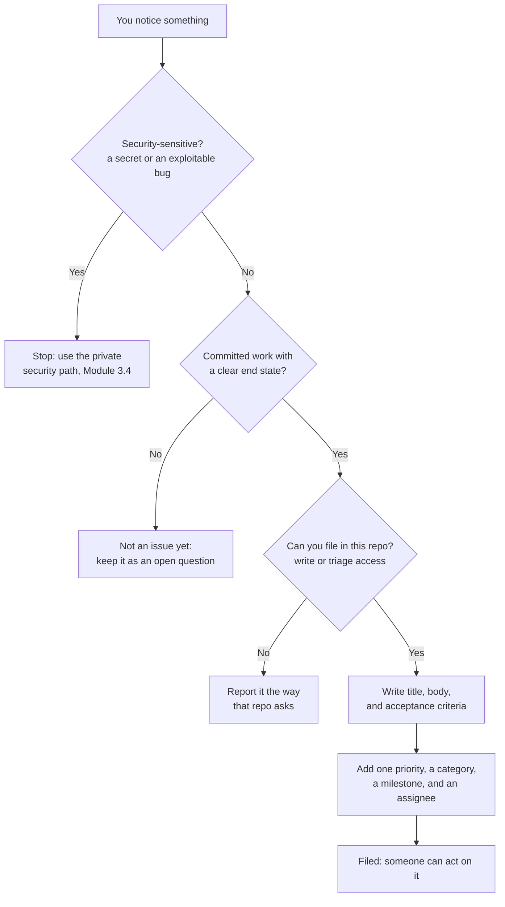

# Module 2.3: Writing a good issue

**Audience:** Anyone who's completed Module 2.1, and everyone who files issues
for other people — or an AI assistant — to act on.
**Format:** Self-paced — read and do each step yourself. Facilitator-note
callouts mark optional group activities.
**Timing:** ~30 min.

This module is the "why" behind this team's issue-filing skill,
`github-issue-first`. Module 2.1 taught that work starts as an issue and how
an issue closes. Here you learn how to *write* one and, for each rule, the
specific failure it exists to prevent. A rule you understand is a rule you
keep following when nobody is checking.

## Learning objectives

- Write a title that states the problem, and a body someone can act on six
  weeks later.
- Write acceptance criteria as observable outcomes that can be checked with
  evidence.
- Explain, for each of priority, category, milestone, and assignee, the
  failure it prevents.
- Recognize when something should not be filed as an issue, or not filed by
  you.

## What a good issue is for

**Source:** `skills/github-issue-first/SKILL.md`

An issue is a message to a reader who has none of your context: a teammate
next month, you in six weeks, or an AI assistant picking it up cold. It is
also the contract for when the work counts as done, which is what Module 2.1's
closure gate checks. If the message is vague, both jobs fail at once.

What this diagram shows: the decisions you make between noticing something
and having a filed issue. Two of them send you *away* from filing, and that
is deliberate.



## The anatomy of an issue, and what each part prevents

**Source:** `skills/github-issue-first/SKILL.md`

| Part | Do this | The failure it prevents |
| --- | --- | --- |
| Title | State the problem, not the task | A backlog of "Fix X" titles nobody can tell apart or search |
| Body | What is wrong, where, how you found it, roughly what a fix involves | The next reader re-deriving your finding, or giving up |
| Acceptance criteria | Observable outcomes you can check with evidence | "Done" becomes an opinion, and Module 2.1's closure gate has nothing to check |
| Priority (exactly one of P0-P3) | How urgent and important it is | Everything looks equally urgent, or urgency is argued in comments |
| Category (at least one) | What kind of work it is | Nothing to filter or group by, and release notes land in "Other" |
| Milestone | Which release it ships in, set at filing time | "What's in the next release?" can't be answered (see Module 2.2) |
| Assignee | One named owner | An unassigned finding is easy to lose, because nobody owns it |

### The title

State the problem, not the fix. "Badge falls through to the wrong color" tells
the next reader what is broken. "Fix badge bug" tells them nothing, and two
such titles in a list look identical. The skill puts it plainly: the title
states the defect or gap, not the task of fixing it.

### The body

Give enough that someone can act without asking you: what is wrong, where it
is (a file, a page, a line), how you found it, and roughly how big the fix
is. Here is a body that passes the six-weeks test:

```text
What's wrong: Contributors with the "Reviewer" role show the default grey
badge instead of the teal one.
Where: the role badge in the "Roles" table on the Team page.
How found: noticed while updating the roster; reproduced by viewing the
page as a newly added Reviewer.
Scope of the fix: one new mapping entry, plus a fallback that names the
role when it is unknown.
```

If the repository has issue templates or forms, fill in the fields they
define instead of writing free-form text. A repo that asks for a
reproduction and a version wants them on every issue, including yours.

### Acceptance criteria

A criterion is good when a stranger could check it. Ask of each one: what
would I *look at* to know this is true? The answer is the evidence: a diff, a
test, a CI run, a document, a screenshot, or a reproduction. Module 2.1
explains why "merged" or "green CI" alone is not evidence for a criterion it
never tested.

| Weak criterion | Observable version |
| --- | --- |
| The badge works correctly | A Reviewer shows a teal badge on the Team page (screenshot attached) |
| Improve the install page | The install page states the required Node version, and `npm run check` passes |
| Make the check faster | The validation check finishes in under 60 seconds on the default runner (CI run linked) |

An issue that only investigates something or asks for a decision still gets
exit criteria: the evidence it must produce, or the decision it must record.

### Two label axes: priority and category

Priority answers "how important is this?" and category answers "what kind of
work is it?" They are different questions, and mixing them is the most
common early mistake: a label like `urgent-bug` tries to answer both and
answers neither well. Give every issue exactly one priority and at least one
category.

| Priority | Meaning |
| --- | --- |
| P0 | Critical bug, security risk, data-loss risk, broken build, or production blocker |
| P1 | Important quality, reliability, or user-facing improvement |
| P2 | Valuable enhancement, cleanup, documentation, testing, or developer-experience work |
| P3 | Nice-to-have polish or a future idea |

If a repository already has its own priority scheme, match it. Two competing
schemes in one repo are worse than either one.

### Milestone and assignee

Attach the milestone when you file, not later. A milestone is a release
bucket (Module 2.2), and an issue with none is as incomplete as one with no
priority. Assign the issue to a person for the same reason: the skill's rule
is that an unassigned finding is easy to lose track of. "Whoever picks it up
next" is a fine owner; nobody is not.

### Dependencies, and one issue per item

Record a real dependency on the issues themselves: a comment such as
"Blocked by #12, because it adds the library this needs." Chat scrolls away;
issue comments stay. Only record dependencies that are real. Don't invent one
to seem thorough. A blocker that holds up several other issues can move up a
priority tier, and you say so in a comment so the reasoning is visible.

File one issue per distinct actionable item. A mega-issue becomes a second
copy of whatever document you started from, and it can only be closed all at
once. If five sub-points will obviously be fixed together in one pull
request, that is one issue, not five.

### Three things that change the rules

- **Security findings are never a public issue.** A secret or an exploitable
  defect goes through the private path instead: see Module 3.4. Filing it
  publicly is disclosure.
- **You file only where you can.** Our skill checks that you have write or
  triage permission first, and confirms once per repository per session
  before the first filing, because an issue on a public repository is public.
  In a repository you only read, report the problem the way that repository
  asks. [Module 2.7](module-2-7-contributing-to-someone-elses-repo.md) covers
  contributing to someone else's repository.
- **"Just fix it" is scoped.** If someone says to skip the issue for one
  specific thing, skip it for that thing only. It is not a blanket opt-out for
  the rest of the session.

## A worked example: before and after

Here is an issue that looks fine to the person who wrote it:

```text
Title: Fix the badge bug
Body: it's broken sometimes
Labels: (none)
Milestone: (none)
Assignee: (none)
```

It fails every row of the table above. The title names a task, not a
problem. "Sometimes" gives no way to reproduce it. There is no criterion, so
nobody can say when it is done. There is no priority, category, milestone, or
owner, so it will sit unseen.

Here is the same issue rewritten:

```text
Title: Badge falls through to the wrong color for the Reviewer role

What's wrong: Contributors with the "Reviewer" role show the default grey
badge instead of the teal one.
Where: the role badge in the "Roles" table on the Team page.
How found: noticed while updating the roster; reproduced by viewing the
page as a newly added Reviewer.

Acceptance criteria:
- [ ] A Reviewer shows a teal badge on the Team page (screenshot attached).
- [ ] A role with no color mapping shows its name, not a blank badge (diff
      or test linking the fallback).

Labels: P2, bug
Milestone: the next release
Assignee: you
```

Every line answers a question the first version left open, and every change
maps to a row of the anatomy table.

## Exercise: rewrite a vague issue

**Permissions:** you need to edit issues in the sandbox, set labels and a milestone, and assign yourself (the Triage or Write role).

**Starting state:** the facilitator has seeded the sandbox repo with an issue
titled "Fix the badge bug" whose body says "it's broken sometimes". The
priority labels, a category label, and an open milestone already exist (the
same setup Modules 2.1 and 2.2 use).

1. Open the seeded issue. Before you change anything, write down three
   questions you would need answered to act on it.
2. The sandbox is a practice repo, so invent plausible answers. Edit the
   issue: a title that states the problem, a body with what, where, how
   found, and scope, and two or three acceptance criteria.
3. Set exactly one priority, at least one category, a milestone, and assign
   it to yourself.
4. Check your issue against this list: the title names a problem and not a
   fix; the body says where and how it was found; every criterion names the
   evidence you would look at; one priority and a category are set; a
   milestone is set; it has an assignee.
5. Scroll down to the model answer only now, and compare.

**Success state:** your issue passes all six checks.

**Likely errors:**

- The label or milestone pickers are empty or missing the ones you need: you lack the role, or the facilitator has not created them yet. Ask for the Triage role, or for the missing label or milestone.
- You cannot assign yourself: you are not a collaborator on the sandbox. Ask for access.
- Your edit does not appear: you edited a comment instead of the issue body. Use the pencil on the issue's first post.

**Cleanup:** close the issue as *not planned* with a short comment saying it
was a practice issue. A closed issue with a stated reason is what the skill
asks for; the facilitator resets the sandbox between cohorts.

> **Facilitator note (optional group activity):** swap issues with a partner
> and have them "pick up" yours with no other context. Every question they
> have to ask you is a gap in the issue. This is the six-weeks test, run in
> six minutes.

### Model answer

A strong answer to the exercise looks like the rewritten issue in the worked
example above. Yours does not need the same words. It needs the same
properties: a problem title, a body a stranger can act on, observable
criteria that name their evidence, and the five pieces of metadata set.

## Self-check

- Why should a title state the problem rather than the fix?
- Write one observable acceptance criterion for "make the install page
  better", and say what evidence would prove it.
- What question does a priority answer, and what question does a milestone
  answer? Why must they not be merged into one label?
- Why are dependencies recorded on the issues themselves rather than in chat?
- Name two situations where you should not file an issue yourself.

Not confident on any of these? Re-read "The anatomy of an issue, and what each
part prevents" above, then check the answers below.

### Self-check answers

- A problem title tells a future reader what is broken, so they can search for
  it and tell it apart from its neighbours. A task title ("Fix X") carries no
  information and makes a backlog unreadable.
- For example: "The install page states the required Node version, and
  `npm run check` passes." The evidence is the page text in the diff plus the
  passing check run.
- Priority answers "how important is this?" and a milestone answers "which
  release does it ship in?". Merging them makes important work wait for a
  release label, or makes release scope look like urgency.
- Chat scrolls away and is invisible to anyone reading the issue through the
  tracker, the API, or `gh`. A comment on the issue stays with the work.
- When the finding is security-sensitive (it goes through the private path),
  and when you only have read access to the repository (you report it the way
  that repository asks). An open question with no end state is also not an
  issue yet.

## Feedback

Something unclear, wrong, or worth improving in this module? Open a
Discussion in this repo (**Ideas** category). Concrete, actionable
feedback gets converted into a tracked issue, per this repo's own
issue-first convention — see `skills/github-issue-first/SKILL.md`'s
Discussions section.

---

Next: [Module 2.4: Writing a reviewable pull request](module-2-4-writing-a-reviewable-pr.md),
then the optional [Module 3.1: Branch protection and rulesets](../3_advanced/module-3-1-branch-protection-and-rulesets.md)
(Modules 3.1 to 3.6 are independent — read them in any order, or only the
ones relevant to you)
