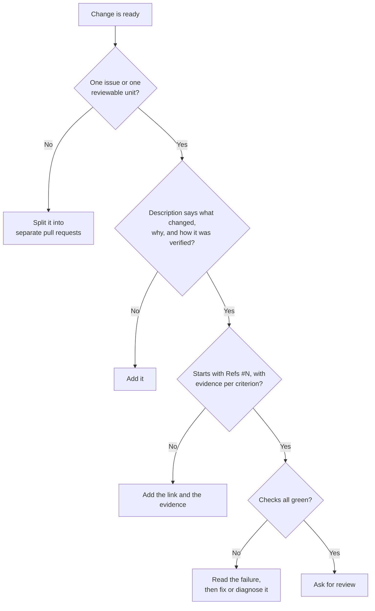

# Module 2.4: Writing a reviewable pull request

**Audience:** Anyone who's completed Modules 2.1 and 2.2, and who opens pull
requests that other people — or an AI assistant — will review.
**Format:** Self-paced — read and do each step yourself. Facilitator-note
callouts mark optional group activities.
**Timing:** ~30 min.

Module 2.1 taught how an issue closes and Module 2.2 taught how a review
works. This module is the author's side: how to write a pull request that a
reviewer can actually review. It explains the reasons behind the pull-request
rules in `github-hygiene` and `github-pr-review`, because a reviewer's time is
the scarcest thing in the process, and most of these habits exist to protect
it.

## Learning objectives

- Keep a pull request to one issue or one independently reviewable unit.
- Start with `Refs #N`, state how the change was verified, and explain when
  `Closes #N` is allowed.
- Use the pull-request template and give evidence for each acceptance
  criterion.
- Explain why a green check is not the same as a merge decision, and what to
  do when a check goes red.

## What a reviewable pull request is for

**Source:** `skills/github-hygiene/SKILL.md`, `skills/github-pr-review/SKILL.md`

A reviewer opens your pull request cold and has to answer three questions, in
this order: does it match a filed issue, is it bigger than its stated scope,
and how was it verified? Your job as the author is to answer all three before
they ask. A pull request that makes the reviewer dig for those answers gets a
slower, shallower review, and a shallow review is how defects reach the main
branch.

What this diagram shows: the checks to run on your own pull request before you
ask anyone to look at it. Every "No" sends you back to fix the pull request,
not forward to the reviewer.



## The anatomy of a reviewable pull request, and what each part prevents

**Source:** `skills/github-hygiene/SKILL.md`, `skills/github-pr-review/SKILL.md`

| Part | Do this | The failure it prevents |
| --- | --- | --- |
| Scope | One issue, or one independently reviewable unit | A bundled refactor hides inside a fix, and the whole thing can only be reverted together |
| Branch | Create it from the issue with `gh issue develop` | The link between work and issue falls back to human memory |
| Title and commits | A conventional prefix (`fix:`, `feat:`, `docs:`), a short subject, a body that says why | A history nobody can scan, and commits whose reason is lost |
| Description | What changed and how it was verified | "Tests pass" with no new test on a bug fix, so the bug can quietly return |
| `Refs #N` first | Reference the issue without promising completion | GitHub closes the issue on merge before its criteria are met |
| Evidence per criterion | Point at a diff, test, run, document, screenshot, or reproduction | "Merged" and "green" get mistaken for "done" |
| Checks | Green on every leg before merge; read a red before acting | Merging on red, or re-running until it happens to pass |
| Out-of-scope findings | Become new issues, not extra changes here | A focused pull request turning into a grab bag |

### Scope: one issue, or one reviewable unit

An unrelated refactor bundled into a bug fix is the most common reason a pull
request should be split. The reviewer can't tell which lines fix the bug and
which are "while I was in there", and if one part turns out to be wrong, the
other part can't be reverted on its own. Split by asking: could a reviewer
approve the first part without having read the second? If yes, they are two
pull requests.

Something you notice while working that is not part of this change becomes an
issue (see Module 2.3), not an extra edit in this pull request.

### The description, the title, and the commits

The pull request body states what changed and how it was verified. "Fixed it"
is neither. A bug fix with no new test is worth flagging for your own sake: the
reviewer's first question will be "what stops this coming back?".

Commit messages use a conventional prefix and a subject of about fifty
characters, and the body says *why*, because the diff already shows what.

Compare these two pull-request descriptions for the same change:

```text
Weak:   Fixed the badge.

Better: fix: show the Reviewer badge in teal

        Reviewers fell through to the default grey badge because the role
        had no entry in the color map (issue: badge falls through to the
        wrong color).

        Verified: added a mapping test for Reviewer and an unknown role; the
        test failed before the change and passes after.
```

### `Refs #N`, `Closes #N`, and evidence

Start the body with `Refs #N`. As Module 2.1 explained, that links the pull
request to its issue without promising the issue is finished, and it does not
by itself guarantee the issue stays open: after every merge you check the
issue. Switch to `Closes #N` only when every acceptance criterion has recorded
evidence.

Evidence is concrete and checkable. The pull-request template asks for it per
criterion, which is the cheapest consistency win a repository has:

| Criterion | Evidence | Result |
| --- | --- | --- |
| A Reviewer shows a teal badge | Screenshot attached; mapping test in the diff | Met |
| An unknown role shows its name | Fallback test; CI run linked | Met |
| The Team page docs mention roles | Not done in this pull request | Unmet, so `Refs` stays |

A row that says "Unmet" is honest, and it is the reason to keep `Refs #N` and
leave the issue open. Partial pull requests are fine; pretending they are
complete is not.

### Checks: green before merge, and what to do when one goes red

Never merge on a red or pending check, and never bypass a required check with
an administrator merge. A merge also needs the maintainer's explicit
approval: approving a pull request and merging it are separate decisions, as
Module 2.2 showed.

If the repository allows auto-merge, remember that switching it on *is* the
merge approval, because GitHub merges the moment the required checks pass. Only
the maintainer turns it on, only when the evidence for every criterion is
already recorded, and never on a pull request with `Closes #N` unless every
criterion is met. Otherwise an auto-merge closes the issue before anyone can
check it.

When a check goes red, read the failure before doing anything else. The
failing step's log tells you which of three situations you are in:

- **A genuine failure** (a test, a lint rule, the build): fix it on the same
  branch with its own commit. It is the same unit of work, so it rides the
  existing pull request and needs no new issue.
- **A flake** (a network blip, a runner timeout): re-run only the failed
  jobs. If the same job flakes twice, that is a real defect in the test suite:
  file an issue rather than re-running a third time.
- **An infrastructure or configuration break** (a missing secret, an expired
  token, a removed action): file it as its own issue. It will hit every future
  pull request, not just yours.

Re-running a red job in the hope it turns green is the one thing the skill
rules out, because it teaches everyone to ignore red.

### A pull request written by an AI assistant is held to the same bar

If an assistant drafted the change, you are still its author. The same
questions apply: is it one unit, does the description say how it was verified,
does the evidence match the criteria. An assistant's confident summary is a
claim to check (see the [LLM prerequisite](../0_prerequisites/prerequisite-what-is-an-llm-assistant.md)), not evidence.

## A worked example: before and after

Here is a pull request that feels finished to the person who opened it:

```text
Title: updates
Body: fixed stuff, also cleaned up a few things
Changes: a bug fix, an unrelated rename across six files, and a new
         config option
```

A reviewer cannot answer any of the three opening questions. There is no
issue, the scope is three unrelated things, and there is no verification. The
honest fix is to split it into three pull requests, each with a title like the
"Better" example above, its own `Refs #N`, and its own evidence table. The
rename can be reviewed quickly and reverted on its own; the bug fix carries the
test; the config option gets its own discussion.

## Exercise: split an oversized change and describe each part

**Permissions:** you need write access to the sandbox, to push branches and open pull requests, and `git` and `gh` installed and signed in.

**Starting state:** the facilitator has created a branch called
`practice/oversized` in the sandbox repo. It has one commit that changes two
unrelated files: it fixes a typo in `README.md` and adds a line to
`CONTRIBUTORS.md`. The repo also has a pull-request template, the usual
priority and category labels, an open milestone, and at least one open issue
you can reference.

1. Look at the commit: `git log practice/oversized -1 --stat`. Note that one
   commit mixes two unrelated changes.
2. Make a branch for the typo fix and take only that file from the oversized
   branch:

   ```bash
   git checkout -b docs/fix-readme-typo-<your-name> main
   git checkout practice/oversized -- README.md
   git commit -m "docs: fix typo in README"
   git push -u origin docs/fix-readme-typo-<your-name>
   ```

3. Do the same for the other change, on its own branch:

   ```bash
   git checkout -b docs/add-contributor-line-<your-name> main
   git checkout practice/oversized -- CONTRIBUTORS.md
   git commit -m "docs: add contributor line"
   git push -u origin docs/add-contributor-line-<your-name>
   ```

4. Open a pull request for each branch. In each description write what
   changed, why, and how you verified it, start with `Refs #N` using an open
   issue, and fill in one row of the evidence table.
5. Check each pull request against this list: one unit only; the description
   says what, why, and how verified; it starts with `Refs #N`; there is an
   evidence row with a named piece of evidence; nothing unrelated is in the
   diff.

**Success state:** two small pull requests, each passing all five checks.

**Likely errors:**

- `git checkout practice/oversized -- README.md` says the pathspec did not match: you have not fetched the branch. Run `git fetch origin` first.
- `git push` is rejected because the branch exists: another run used the same name. The branch names here include your name; if you already have one from an earlier try, add `-2`.
- Your pull request shows both changes: you branched from the wrong place. Create the branch from `main`, as in the commands.
- The description box is empty, with no template: the template is not on the default branch of the sandbox. Write the three parts yourself.

**Cleanup:** close both pull requests without merging and delete their
branches (`git push origin --delete <branch>` or the button on the closed pull
request). The facilitator resets the sandbox between cohorts.

> **Facilitator note (optional group activity):** have each person swap one of
> their pull requests with a partner and review it with the three opening
> questions from "What a reviewable pull request is for". Count how many
> questions the reviewer had to ask that the description should have
> answered.

### Model answer

Each pull request touches exactly one file, has a conventional title (`docs:
fix typo in README`, `docs: add contributor line`), a description that
says what changed, why, and how it was verified (for the typo, "read the
rendered README" is honest evidence), begins with `Refs #N`, and lists its
evidence. Your wording can differ; the properties must not.

## Self-check

- Name the three questions a reviewer asks when they open your pull request,
  in order.
- Why does a pull request start with `Refs #N` rather than `Closes #N`, and
  what has to be true before you switch?
- A check goes red on your pull request. What do you do first, and what are
  the three situations you might be in?
- Why is re-running a red job "to see if it passes" discouraged?
- You notice an unrelated bug while fixing another one. What do you do with
  it?

Not confident on any of these? Re-read "The anatomy of a reviewable pull
request, and what each part prevents" above, then check the answers below.

### Self-check answers

- Does it match a filed issue? Is it bigger than its stated scope? How was it
  verified?
- `Refs` links the pull request to the issue without promising the issue is
  finished, and it does not guarantee the issue stays open, so you check the
  issue after the merge. You switch to `Closes #N` only when every acceptance
  criterion has recorded evidence.
- Read the failure first. It is a genuine failure (fix it on the same branch),
  a flake (re-run the failed jobs, and file an issue if it flakes twice), or an
  infrastructure or configuration break (file it as its own issue).
- It teaches everyone to ignore red, and it hides a real problem when the job
  happens to pass. Reading the log is what tells you whether the failure is
  yours.
- File it as a new issue. Do not fold it into the current pull request.

## Feedback

Something unclear, wrong, or worth improving in this module? Open a
Discussion in this repo (**Ideas** category). Concrete, actionable
feedback gets converted into a tracked issue, per this repo's own
issue-first convention — see `skills/github-issue-first/SKILL.md`'s
Discussions section.

---

Next: [Module 2.5: Triage and backlog hygiene](module-2-5-triage-and-backlog-hygiene.md),
then the optional [Module 3.1: Branch protection and rulesets](../3_advanced/module-3-1-branch-protection-and-rulesets.md)
(Modules 3.1 to 3.6 are independent — read them in any order, or only the
ones relevant to you)
