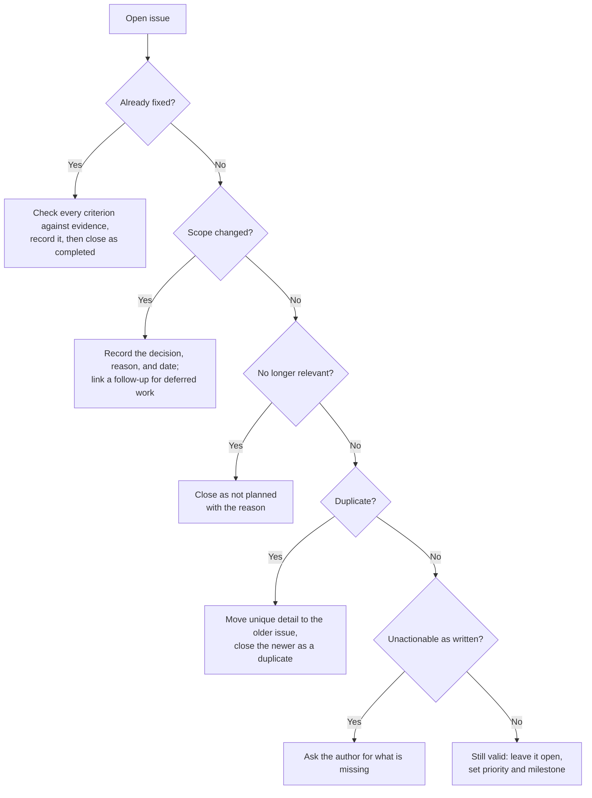
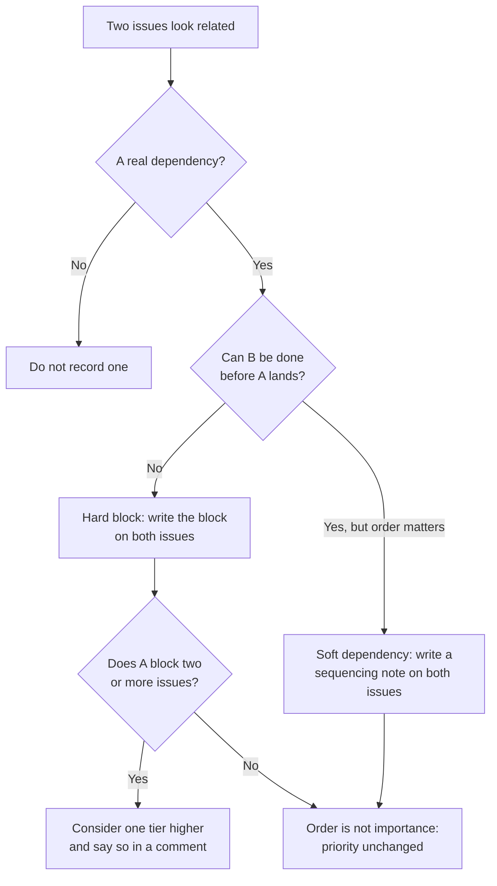

# Module 2.5: Triage and backlog hygiene

**Audience:** Anyone who's completed Modules 2.1 and 2.3, and who helps decide
what happens to issues after they are filed.
**Format:** Self-paced — read and do each step yourself. Facilitator-note
callouts mark optional group activities.
**Timing:** ~30 min.

Module 2.3 was about filing an issue well. This module is about what happens
next. A backlog only stays useful if someone keeps it honest, and "triage" is
that work: deciding how important each open issue is, what blocks what, and
which issues should be closed. It explains the reasons behind the triage rules
in `github-issue-first` and `github-releases`.


## Learning objectives

- Separate priority (how important) from milestone (which release), and explain
  why they must not be merged into one thing.
- Record real dependencies on the issues themselves, and let a blocker that
  holds up several others rise one priority tier, saying so on the issue.
- Close an issue with a reason a human can read, and explain why a stale bot is
  discouraged.

## What triage is for

**Source:** `skills/github-issue-first/SKILL.md`

A backlog that only ever grows stops being a source of truth and turns into a
graveyard nobody reads. Filing well is half the discipline and pruning is the
other half. Triage is the moment you look at open issues and act: rank them,
link them, close the ones that are done, duplicated, or obsolete, and
leave the rest alone.

What this diagram shows: the questions you ask of one open issue during
triage. Most end in a specific action, and the last branch is "leave it
alone", which is a legitimate outcome.



## Priority and milestone answer different questions

**Source:** `skills/github-issue-first/SKILL.md`, `skills/github-releases/SKILL.md`

| | Priority | Milestone |
| --- | --- | --- |
| Question it answers | How important is this? | Which release does it ship in? |
| Values | P0 to P3 | A release or delivery bucket |
| Changes when | Importance changes | The release plan changes |
| If you confuse it with the other | Release scope starts to look like urgency | Important work waits for a release label |

Priority is one of four levels. P0 is a critical bug, security risk,
data-loss risk, or broken build. P1 is important quality or reliability work.
P2 is valuable enhancement, cleanup, or documentation. P3 is nice-to-have
polish or a future idea. Give every issue exactly one.

A milestone is a release bucket, not a sprint (Module 2.2). Before you create
one, look at what already exists, including closed milestones, because the
naming scheme may live there, and two schemes in one repository are worse than
either. Attach the milestone when an issue is filed, and close the milestone
right after the release it describes is published.

### Connecting an issue to a milestone, and why

**Source:** `skills/github-releases/SKILL.md`, `skills/github-issue-first/SKILL.md`

To connect an issue to a milestone, set its Milestone field in the issue's
sidebar on the web, or use the command line:

```bash
gh issue edit <N> --milestone "<title>"
gh issue create --title "..." --body "..." --milestone "<title>"
```

Do it when the issue is filed. If the right milestone doesn't exist yet, create
it then rather than leaving the issue unbucketed, and also attach issues that
are already closed if they ship in that release. Why bother:

- **It answers "what's in the next release?"** Filter by the milestone and you
  have the list. Without it someone reconstructs the answer from memory.
- **It shows progress.** A milestone counts its open and closed issues, so
  "how close are we?" has a real answer instead of a guess.
- **It keeps the traceability chain intact.** An issue with a milestone feeds
  the release: the pull requests that close it land in that release's notes.
- **An issue without one is as incomplete as one without a priority.** That is
  the skill's own rule, and it is why the milestone is set at filing time and
  not "when we get round to it".

Connecting is not the same as prioritising. An issue can be urgent (P0) and
sit in next week's release, or be P3 and sit in a release months away.
Changing the release does not change the priority, and the reverse.

## Dependencies and priority

**Source:** `skills/github-issue-first/SKILL.md`

Dependencies come in two kinds. A **hard block** means issue B cannot be done
until issue A lands, for example A adds a library B needs. A **soft
dependency** means A and B touch the same files, or B's quality depends on A's
content being current, so doing them in the wrong order means redoing work.
Only record dependencies that are real. Inventing one to seem thorough adds
noise.

Record the dependency on the issues, not just in chat:

```text
On the blocked issue:   Blocked by #12. It adds the library this needs.
On the blocker:         Sequencing note: do before #15, because #15 depends on it.
```

Chat scrolls away and issue comments stay. Linking by number makes GitHub
connect the two issues automatically.



What this shows: how a dependency is recorded and when it may change priority.
Only a blocker that holds up several issues earns a higher tier; sequencing alone
never does.

Dependencies can also change priority, but carefully. An issue that blocks two
or more others is a reasonable candidate for one tier higher, even if its own
content looks minor, so it does not sit at the bottom of the queue while
everything downstream waits. When you bump a priority for this reason, say so
in a comment so the reasoning is visible and not just the label change.

The reverse does not hold. "Do A before B" is about order, not importance.
Sequencing alone is never a reason to raise a priority; only real blocking of
several issues is.

## Closing issues well

**Source:** `skills/github-issue-first/SKILL.md`

Each situation in the diagram above has its own way of closing, and every close
carries a reason a human can read:

| Situation | What you do |
| --- | --- |
| Already fixed | Evaluate every acceptance criterion against evidence, record it in a completion comment, check the satisfied boxes, then close as completed. If even one criterion is unmet or unevaluated, keep it open |
| Scope changed | Record the decision, the rationale, and the date on the issue before closing; mark a removed criterion as removed, never as delivered; link a follow-up for deferred work |
| No longer relevant | Close it with the reason, such as the feature being removed or the approach abandoned |
| Duplicate | Move any unique detail into the older issue first, then close the newer one pointing at it |
| Unactionable as written | Ask the author for what is missing; close only if nothing comes back and nobody could act on it |
| Stale but still valid | Do nothing. Age is not a reason to close |

Closing as completed, as not planned, and as a duplicate are different states
for a reason, and only *completed* means the work was delivered. Module 2.1 is
the place to revisit why "merged" or "green" alone is never the evidence.

### Why not a stale bot

A bot that closes issues after a period of silence feels like hygiene and
works like data loss. It destroys real reports and teaches contributors that
filing is pointless. The skill's position is that an issue that is still true
stays open. If something sits untouched for a year and is P3, the signal is
that its priority was wrong, not that it should vanish. For the same reason,
never bulk-close issues to make a number smaller.

## A worked example: before and after

Here are the six open issues in the sandbox, all priority P2 with no milestone:

| # | Title | What triage finds |
| --- | --- | --- |
| A | Support the legacy browser | The browser was dropped last release, so there is nothing left to do |
| B | Add CSV export | The same request as C, filed later |
| C | Export data as CSV | The older, real request |
| D | Upgrade the parsing library | Both E and F need the new version |
| E | Add JSON export | Needs the upgrade in D |
| F | Add scheduled exports | Needs the upgrade in D |

After triage: A is closed as not planned with a short reason. B's unique
details are copied into C, and B is closed as a duplicate of C. D blocks two
issues, so it moves from P2 to P1 with a comment saying why. E and F stay P2
and each carries a "Blocked by #D" comment. All four open issues get a
milestone. Nothing was closed without a reason, and nothing was closed just
for being quiet.

## Exercise: triage six issues

**Permissions:** you need the Triage or Write role in the sandbox, and the GitHub CLI signed in (`gh auth status`).

**Starting state:** the facilitator has seeded the six issues above in the
sandbox repo, all priority P2 with no milestone. The priority labels and at
least one open milestone exist.

1. List the six issues: `gh issue list --state open`.
2. For each one, write one line naming which situation from the diagram
   applies and what you will do. Do this before touching anything.
3. Close issue A as not planned, with a reason:
   `gh issue close <A> --reason "not planned" -c "The legacy browser was dropped, so there is nothing to build."`
4. Copy anything unique from issue B into issue C with a comment, then close B
   as a duplicate: `gh issue close <B> -c "Duplicate of #<C>."`
5. Record the dependency. On E and F comment `Blocked by #<D>` with a one-line
   reason, and on D add a sequencing note. Then raise D one tier, for example
   `gh issue edit <D> --add-label P1 --remove-label P2`, and comment on D
   that it blocks two issues.
6. Set a milestone on every issue that is still open:
   `gh issue edit <N> --milestone "<title>"`.
7. Check: every open issue has exactly one priority and a milestone; D is one
   tier above E and F with a comment explaining why; E and F carry blocked-by
   comments; A and B are closed with readable reasons; nothing was closed for
   age.

**Success state:** the six-issue backlog matches the checks in step 7.

**Likely errors:**

- `gh` says authentication is required: run `gh auth login`, then retry.
- `gh issue edit --milestone` cannot find the milestone: the title must match exactly. List the titles with `gh api repos/{owner}/{repo}/milestones --jq '.[].title'`.
- `gh issue edit --add-label P1` fails: the label does not exist yet. Ask the facilitator, or create it only if you own the sandbox.
- `gh issue close --reason` is rejected: your `gh` is older than the flag. Update `gh`, or close the issue in the web UI with the same reason.

**Cleanup:** none needed; the facilitator recreates the six seeded issues for
the next cohort.

> **Facilitator note (optional group activity):** run the triage as a
> group and let people disagree about D's priority. The point is that the
> reason is written on the issue, so the next person can see and challenge it.

### Model answer

A is closed as not planned with a reason. B is closed as a duplicate of C after
its unique detail is moved across. C stays P2 and is scheduled. D goes from P2
to P1 because it blocks two issues, with a comment stating that. E and F stay
P2 with blocked-by comments. The four open issues each have a milestone.
Wording will differ; every decision above has a written reason.

## Self-check

- What question does a priority answer, and what question does a milestone
  answer? Why must they not be one label?
- A low-priority issue blocks three others. What do you do, and what must you
  write down?
- Is "A should be done before B" enough to raise A's priority? Why or why not?
- Name three situations where closing an issue is right, and what each one
  needs recorded.
- Why is a bot that closes issues after a year of silence discouraged?

Not confident on any of these? Re-read "Priority and milestone answer different
questions" or "Closing issues well" above, then check the answers below.

### Self-check answers

- Priority answers "how important is this?" and a milestone answers "which
  release does it ship in?". Merging them makes important work wait on a
  release label, or makes release scope look like urgency.
- Raise its priority one tier, record the dependencies on the issues
  themselves, and write a comment saying you raised it because it blocks
  several others.
- No. Sequencing is about order, not importance. Only real blocking of two or
  more issues is a reason to raise a priority.
- Any three of: already fixed (every criterion evaluated and evidenced),
  scope changed (decision, reason, and date recorded; removed criteria marked
  removed), no longer relevant (the reason), duplicate (unique detail moved to
  the older issue, then a pointer to it), unactionable (the author asked first).
- It closes issues that are still true, which destroys real reports and teaches
  contributors that filing is pointless. Age is not a reason to close.

## Feedback

Something unclear, wrong, or worth improving in this module? Open a
Discussion in this repo (**Ideas** category). Concrete, actionable
feedback gets converted into a tracked issue, per this repo's own
issue-first convention — see `skills/github-issue-first/SKILL.md`'s
Discussions section.

---

Next: [Module 2.6: Where does this thought belong?](module-2-6-where-does-this-thought-belong.md),
then the optional [Module 3.1: Branch protection and rulesets](../3_advanced/module-3-1-branch-protection-and-rulesets.md)
(Modules 3.1 to 3.6 are independent — read them in any order, or only the
ones relevant to you)
