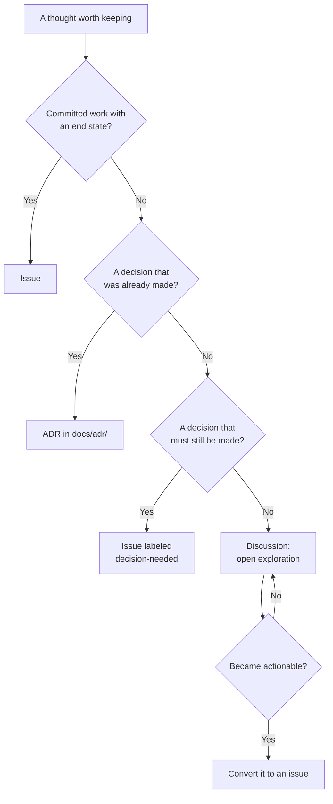

# Module 2.6: Where does this thought belong?

**Audience:** Anyone who's completed Module 2.1, and everyone who has ever
wondered whether something deserves an issue.
**Format:** Self-paced — read and do each step yourself. Facilitator-note
callouts mark optional group activities.
**Timing:** ~25 min.

Not every durable thought is an issue. Three different kinds of thought get
confused, and putting all of them in the issue tracker is what turns a backlog
into noise. This module explains the reasons behind the "what does not belong
in an issue" rules in `github-issue-first`: where each kind of thought lives,
and why.

## Learning objectives

- Choose between an issue (committed work), a Discussion (open exploration),
  and an architecture decision record (a decision that was made).
- Convert a Discussion to an issue at the moment it becomes actionable.
- Write a short decision record with context, decision, and consequences, and
  explain why it is never edited to reverse it.

## Four homes for four kinds of thought

**Source:** `skills/github-issue-first/SKILL.md`

| Kind of thought | Home | Why it lives there |
| --- | --- | --- |
| Committed work | An **issue** | It has an assignee, a priority, and an end state |
| Open exploration | A **Discussion** | It is threaded and votable, with no "when is this done" |
| A decision that was made | An **ADR** in `docs/adr/` | It is an immutable record, versioned with the code it constrains |
| A decision that must be made | An **issue labeled `decision-needed`** | It is real work: someone has to decide |

The last two rows trip people up. A decision that *has been made* is history,
so it goes in a record that never changes. A decision that *must still be
made* is work, so it gets an owner and an end state like any other issue.

What this diagram shows: the questions that route a thought to its home, and
the one path that moves a thought from exploration to commitment.



## Why an issue is the wrong home for exploration

**Source:** `skills/github-issue-first/SKILL.md`

An issue carries a promise: it has an owner and an end state, and a backlog is
only trustworthy if every open issue keeps that promise. An idea with no end
state breaks it. It sits there, never closeable, getting older, and everyone
learns to skim past it. A Discussion has no such promise. It is threaded,
votable, and an answer can be marked, so exploration can wander without
polluting the list of committed work.

The skill lists four Discussion categories and says to create only the ones a
repository actually needs:

| Category | For |
| --- | --- |
| Ideas | An unshaped proposal, "what if we..." that may never converge |
| Q&A | A question with one right answer, which gets an accepted answer |
| RFC | A proposal specific enough to have real trade-offs, which converges to a decision |
| Announcements | One-way news such as a deprecation; use sparingly, and don't duplicate the changelog |

### Converting a Discussion to an issue

The moment a Discussion becomes actionable is the boundary between exploring
and committing, and it is the whole reason to keep the two separate. There is
no single command for it, so you do it by hand in three steps:

1. File the issue normally, with a title, body, labels, assignee, and
   milestone as in Module 2.3, and add a line linking back:
   `Converted from discussion #<N>.`
2. Comment on the Discussion linking forward: `Converted to #<N>.` so anyone
   landing there later finds the live work.
3. Mark the Discussion's status: an RFC that converged gets its outcome noted,
   or is closed. Don't abandon it mid-thread once the issue exists.

Never let a Discussion silently duplicate an issue that already tracks the same
work. Link them the moment you notice.

## Decisions: one immutable file each

**Source:** `skills/github-issue-first/SKILL.md`

A decision record, or ADR, captures *why* something was decided, evidence
included. The rule is one file per decision:

```text
docs/adr/0001-use-postgres-over-mongo.md
docs/adr/0014-move-session-store-to-redis.md
```

A single growing `decisions.md` is the anti-pattern: it only ever grows, it is
unreadable, and edits silently rewrite a record that was supposed to be
permanent. Each record has four parts: **Context** (the situation and
evidence), **Decision** (what was decided, stated plainly), **Consequences**
(what this makes easier or harder), and **Status** (`Proposed`, `Accepted`, or
`Superseded by 0014`).

The rule that makes the whole thing work: **never edit a decided ADR to
reverse it.** Write a new one that supersedes it, and set the old one's
status. The history of what you believed, and when, is the point. You can see a
real example in this repository's own
[ADR 0001](../../docs/adr/0001-refs-closes-connected-branch-closure.md), which
records why the `Refs`/`Closes` habit from Module 2.1 exists.

Here is the smallest record that does the job:

```text
# ADR 0001: Use PostgreSQL for the service data

## Status

Accepted (2026-09-30).

## Context

We need transactions across orders and payments. The prototype used a
document store and lost updates under concurrent writes.

## Decision

Store service data in PostgreSQL.

## Consequences

Transactions and constraints come for free. We take on running a relational
database and writing migrations.
```

Why `docs/adr/` in the repository, and not the GitHub Wiki? The Wiki is a
separate repository with no pull requests, no review, and no coupling to the
branch that changed the behaviour. A record in the repository branches and
merges with the change that motivated it.

### The lifecycle of a decision

The same records fit the GitHub workflow cleanly:

1. The question arises: file an issue labeled `decision-needed`, because it
   needs a human, not code.
2. Options are explored in a Discussion, or in a draft pull request whose ADR
   says `Status: Proposed`.
3. The pull request that adds the ADR is the deliberation record: its review
   comments are the debate, preserved and linked.
4. It merges with `Status: Accepted`, and its body says
   `Closes #<the decision-needed issue>`.
5. If it is reversed later, a new ADR supersedes it, and the old file's
   status is updated; its reasoning is never rewritten.

## A worked example: one thought, three homes

Someone writes: "What if we required two approvals on the main branch?" That is
open exploration, so it goes in a Discussion (Ideas). People reply, the
trade-offs become concrete, and it turns into an RFC. The team decides, but
nobody has the job yet, so a `decision-needed` issue is filed to record who
will decide and by when. The decision lands in an ADR pull request that closes
that issue. A year later the team changes course: a new ADR supersedes the
first, and the first keeps its text with a new status. One thought touched all
three homes, each at the moment it fit.

## Exercise: sort eight statements, then write one record

**Permissions:** you need write access to push a branch and open a pull request in the sandbox. Step 3 also needs Discussions to be enabled there.

**Starting state:** the sandbox repo has a `decision-needed` label. If
Discussions is enabled there, it has the Ideas category (the facilitator
guide lists both).

1. For each statement below, decide which home it belongs in: issue,
   Discussion (and which category), ADR, or `decision-needed` issue. Write your
   answer down before reading the model answer.

   | # | Statement |
   | --- | --- |
   | 1 | The login page shows a typo in the footer |
   | 2 | What if we moved the docs to a separate site? |
   | 3 | We chose PostgreSQL over a document store because we need transactions |
   | 4 | We must pick a licence before the first release |
   | 5 | How do I run the tests locally? |
   | 6 | Proposal: require two approvals on main, with the trade-offs listed |
   | 7 | The old API will be retired next quarter |
   | 8 | We are reversing the PostgreSQL decision in favour of a hosted service |

2. Write the record for statement 3 in the sandbox. Create a branch
   `docs/adr-0001-postgresql-<your-name>`, add `docs/adr/0001-use-postgresql.md` with the
   four parts from the example above, commit it, push it, and open a **draft**
   pull request titled `docs: ADR 0001, use PostgreSQL` whose body says
   `Status: Proposed`.
3. If Discussions is enabled, post statement 2 as a Discussion in Ideas.
   Practise the hand conversion: file an issue that says
   `Converted from discussion #<N>.`, then comment `Converted to #<M>.` on the
   Discussion.

**Success state:** your sorting matches the model answer, the draft pull
request contains a four-part record, and (if you did step 3) the Discussion and
the issue link to each other.

**Likely errors:**

- There is no Discussions tab or no Ideas category: Discussions is off in this sandbox. Skip step 3; the rest of the exercise does not depend on it.
- You cannot open the pull request as a draft: some plans do not offer draft pull requests on private repositories. Open it normally and start the title with `Draft:`.
- `git push` is rejected because the branch exists: the branch name includes your name; if you already have one from an earlier try, add `-2`.

**Cleanup:** close the draft pull request without merging it and delete the
branch. Close the practice issue as *not planned* with a short comment, and
leave the Discussion; the facilitator resets the sandbox between cohorts.

> **Facilitator note (optional group activity):** argue about statements 4 and
> 6 as a group. Statement 4 is work that needs a decision, and 6 is exploration
> that may become one. The disagreement is the lesson.

### Model answer

| # | Home | Why |
| --- | --- | --- |
| 1 | Issue | Committed work with an end state |
| 2 | Discussion (Ideas) | An unshaped proposal |
| 3 | ADR | A decision that was made |
| 4 | Issue labeled `decision-needed` | A decision that must still be made, and it blocks a release |
| 5 | Discussion (Q&A) | A question with one right answer |
| 6 | Discussion (RFC) | A proposal with real trade-offs that should converge to a decision |
| 7 | Discussion (Announcements) | One-way news |
| 8 | A new ADR that supersedes the one from statement 3 | The old record keeps its text and gets the status `Superseded by 0002` |

## Self-check

- Why is an idea with no end state a poor fit for an issue?
- What is the difference between a decision that was made and one that must be
  made, and where does each live?
- What are the three steps to convert a Discussion to an issue?
- Why is a decided ADR never edited to reverse it?
- Why do decision records live in `docs/adr/` and not the Wiki?

Not confident on any of these? Re-read "Four homes for four kinds of thought"
or "Decisions: one immutable file each" above, then check the answers below.

### Self-check answers

- An issue promises an owner and an end state. An idea with neither sits
  forever, can never be closed, and teaches everyone to skim the backlog.
- A decision that was made is history, so it goes in an ADR that never changes.
  A decision that must still be made is work, so it is an issue labeled
  `decision-needed` with an owner.
- File the issue with a line `Converted from discussion #N`, comment
  `Converted to #M` on the Discussion, and mark the Discussion's status instead
  of abandoning it.
- The history of what was believed, and when, is the point. Reversing it
  means a new record that supersedes the old one, and the old one's status is
  updated.
- The Wiki is a separate repository with no pull requests, no review, and no
  coupling to the branch that changed the behaviour. A record in the repository
  travels with the change.

## Feedback

Something unclear, wrong, or worth improving in this module? Open a
Discussion in this repo (**Ideas** category). Concrete, actionable
feedback gets converted into a tracked issue, per this repo's own
issue-first convention — see `skills/github-issue-first/SKILL.md`'s
Discussions section.

---

Next: [Module 2.7: Contributing to someone else's repository](module-2-7-contributing-to-someone-elses-repo.md),
then the optional [Module 3.1: Branch protection and rulesets](../3_advanced/module-3-1-branch-protection-and-rulesets.md)
(Modules 3.1 to 3.6 are independent — read them in any order, or only the
ones relevant to you)
