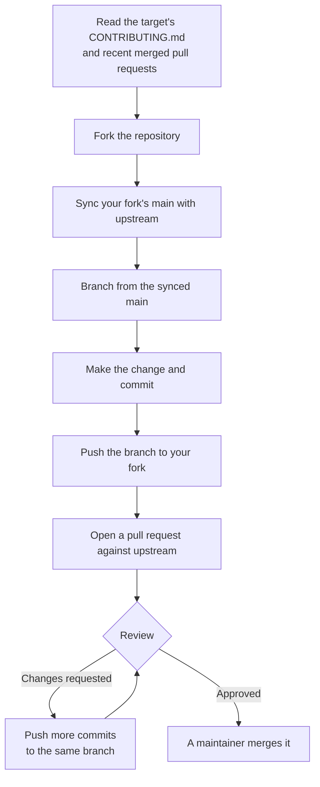

# Module 2.7: Contributing to someone else's repository

**Audience:** Anyone who's completed Modules 2.1 and 2.4, and who wants to
propose a change to a repository they do not maintain.
**Format:** Self-paced — read and do each step yourself. Facilitator-note
callouts mark optional group activities.
**Timing:** ~30 min.

Every other module so far assumes you are a maintainer: you can merge, tag,
and release. This one is the other side. You are proposing a change to a
repository you don't own, and the rules flip: the *target* repository's
habits govern, not this team's. This module explains the reasons behind
`github-contributing`, the skill that covers it.


## Learning objectives

- Fork a repository, keep the fork's default branch in sync with upstream, and
  branch from the synced copy every time.
- Follow the target repository's own contributing rules, not this team's
  `Refs`/`Closes` habit, and say why.
- Open a pull request against upstream (not your own fork), and use a draft
  pull request to ask for early feedback.
- Explain why a fork pull request's workflows have a read-only token and no
  secrets, and why that is expected.
- Respond to review on your own pull request without rewriting its history.

## Who decides, and why it changes everything

**Source:** `skills/github-contributing/SKILL.md`

In your own repository you decide how issues, branches, and pull requests look.
In someone else's, the maintainers do, and they wrote it down in a
`CONTRIBUTING.md`, in their issue and pull-request templates, and in the
pull requests they have already merged. Read those before you open anything.
Arriving with a different habit, however good, is the fastest way to slow your
own change down.

The same idea applies before you even write code. If you only have read access
to a repository, a bug you hit or a mistake you spot in its docs is reported
the way *that repository* asks. Our own issue-filing habit deliberately stops
at repositories you can write to or triage (see Module 2.3), so don't open an
issue in someone else's tracker out of reflex.

What this diagram shows: one contribution from start to finish, including the
two moments where you wait on someone else.



## Fork, sync, and branch

**Source:** `skills/github-contributing/SKILL.md`

One command forks the repository, clones your fork, and wires up both remotes:

```bash
gh repo fork <owner>/<repo> --clone --remote
cd <repo>
git remote -v        # origin = your fork, upstream = the source
```

`origin` is your copy and `upstream` is the original. If you cloned another
way, add the second remote yourself with
`git remote add upstream https://github.com/<owner>/<repo>.git`.

Before you start any new work, bring your fork's default branch up to date:

```bash
git fetch upstream
git checkout main
git merge upstream/main
git push origin main
```

Do this before *every* new branch, not just once. A fork that drifts weeks
behind upstream turns an easy pull request into a painful rebase. Then branch
from that synced `main` with a descriptive name such as
`fix/<short-description>`.

## Submitting the pull request

**Source:** `skills/github-contributing/SKILL.md`

```bash
git push -u origin fix/<short-description>
gh pr create --repo <owner>/<repo> --title "..." --body "..."
```

The `--repo` flag matters. Run from inside your fork, `gh pr create` without it
can target your own fork, and your pull request then goes nowhere useful. Naming
the upstream repository explicitly is the cheap way to avoid that.

Write the title and description the way the *target* repository asks. Do not
bring this team's `Refs #N` and `Closes #N` discipline to a repository that
doesn't use it: look at its contributing file and its merged pull requests and
match them. The habits from Modules 2.1 and 2.4 still help (a focused change,
a clear description of how you verified it), but the format is theirs.

A **draft pull request** (`gh pr create --draft`) says "this is work in
progress" or "please look at the approach before I finish". Use one when you
want early feedback, and mark it ready with `gh pr ready <N>` when it is
complete.

## What you don't control

**Source:** `skills/github-contributing/SKILL.md`, `skills/github-pr-review/SKILL.md`

Three things are outside your hands, and all three are normal:

- **Your pull request's workflows have a read-only token and no secrets.** When
  a fork's pull request triggers the target's automation, GitHub gives it a
  read-only token and withholds secrets, so the maintainers' own repository
  can't be attacked through a pull request. A job that needs a secret will skip
  or fail on yours. That is expected, not a defect in your change, and it is
  not something to fix by asking a maintainer to change their workflow. The
  review skill describes the same rule from the maintainer's side.
- **You can't merge your own pull request.** You have no write access, and you
  shouldn't ask to be added as a maintainer just to self-merge. That would
  defeat the review the process exists for.
- **A maintainer may push to your branch.** If you left "Allow edits by
  maintainers" on (the default), expect commits from them on your branch.
  Run `git pull` before you push again, or your histories will diverge.

## Responding to review

**Source:** `skills/github-contributing/SKILL.md`

Treat each review comment as a claim to check. Verify it technically before you
act, push back with evidence when a suggestion is wrong, and never make a
change you can't explain. Reply to every thread, and resolve it only once the
fix is pushed.

Push *additional* commits to the same branch rather than force-pushing over the
review history, so reviewers can see what changed since they last looked. The
one exception is when the maintainers' conventions ask for a squashed history
before merge; their contributing file or a question will tell you.

## A worked example: two habits, one change

Suppose the target's `CONTRIBUTING.md` says pull request titles start with
`[docs]`, asks for one sentence of description, and says nothing about issue
numbers. A contributor used to this team writes:

```text
Title: docs: fix typo in install page
Body:  Refs #12 ...long evidence table...
```

It is a good pull request by *our* rules and the wrong one for *their* rules: it
ignores the title format, cites an issue number that means nothing in their
tracker, and buries a one-sentence request under a table. The matching version:

```text
Title: [docs] Fix typo in install page
Body:  Fixes the misspelled "installation" in the install page.
```

Same change, same care, their format.

## Exercise: fork, sync, and open a pull request upstream

**Permissions:** any GitHub account can fork a public repository, so you need no access to the training sandbox. You need `git` and `gh` installed and signed in (`gh auth status`).

**Starting state:** the facilitator has created a public practice repository
called `practice-contributions` (named below as `<owner>/practice-contributions`).
It has a `CONTRIBUTORS.md`, and a `CONTRIBUTING.md` whose rules differ from this
team's habits (for example, a title prefix and no issue reference). The private
training sandbox can't normally be forked, which is why this exercise uses a
separate public repository.

1. Read the practice repository's `CONTRIBUTING.md`. Write down two rules that
   differ from what you would do in our own repository.
2. Fork and clone it: `gh repo fork <owner>/practice-contributions --clone --remote`.
   Confirm with `git remote -v` that `origin` is your fork and `upstream` is the
   original.
3. Sync your fork: `git fetch upstream`, `git checkout main`,
   `git merge upstream/main`, then `git push origin main`.
4. Create a branch, `git checkout -b fix/add-my-line`, add one line with your
   name to `CONTRIBUTORS.md`, commit it, and push with
   `git push -u origin fix/add-my-line`.
5. Open a **draft** pull request against the original repository, following its
   contributing file:
   `gh pr create --draft --repo <owner>/practice-contributions --title "..." --body "..."`.
   Then mark it ready with `gh pr ready <N>`.
6. Open the pull request's Checks tab. If the facilitator seeded a job that
   needs a secret, notice that it is skipped or fails, and recognise that as
   the expected behaviour described above.

**Success state:** a pull request is open against the *original* repository
(not your fork), it follows the practice repository's rules and not ours, and
you can say why a secret-dependent job didn't run.

**Likely errors:**

- `gh repo fork` fails: you are not signed in, or you already have a fork. Run `gh auth status`; if the fork exists, clone it instead.
- `git remote -v` shows no `upstream`: you cloned without `--remote`. Add it with `git remote add upstream <original-url>`.
- `git merge upstream/main` says "Already up to date": that is the expected answer when nothing changed upstream.
- Your pull request opened against your own fork: you did not name the original. Close it, and rerun with `--repo <owner>/practice-contributions`.

**Cleanup:** close the pull request without merging it (you couldn't merge it
anyway) and delete the branch from your fork. You may keep the fork; if you
remove it, do that from its Settings page.

> **Facilitator note (optional group activity):** play maintainer for one
> submission. Request a change, let the attendee push a fix as an additional
> commit, and notice together what a force-push would have done to the review
> history.

### Model answer

The pull request's title and description match the practice repository's
contributing file (for example, the required prefix and a one-sentence
description, with no `Refs` line). It targets the original repository's `main`,
not your fork's. The fork's `main` was synced before the branch was made. The
secret-dependent job, if present, did not run, and that is correct.

## Self-check

- Why do you follow the target repository's contributing file instead of this
  team's `Refs`/`Closes` habit?
- Why do you sync your fork before every new branch?
- What does `--repo` protect you from when you run `gh pr create`?
- A job that needs a secret fails on your fork pull request. Should you ask a
  maintainer to change the workflow? Why or why not?
- A maintainer pushed a commit to your pull request branch. What do you do
  before you push again?
- You only have read access and you found a bug. Where do you report it?

Not confident on any of these? Re-read "Fork, sync, and branch", "Submitting
the pull request", or "What you don't control" above, then check the answers
below.

### Self-check answers

- In their repository the maintainers decide the conventions, and arriving with
  a different habit slows your change down. Our `Refs`/`Closes` discipline may
  mean nothing in their tracker.
- A fork that drifts behind upstream turns an easy pull request into a painful
  rebase, and you may build on code that has already changed.
- Run from inside your fork, `gh pr create` without it can open the pull
  request against your own fork instead of upstream.
- No. Fork pull requests get a read-only token and no secrets by design, so a
  skipped or failed secret-dependent job is expected. It is not a defect in your
  change.
- Run `git pull` so your branch includes their commit, otherwise your histories
  diverge.
- Through that repository's own channels, as its contributing file describes,
  not by filing an issue with our habit. Our issue-filing rule stops at
  repositories you can write to or triage.

## Feedback

Something unclear, wrong, or worth improving in this module? Open a
Discussion in this repo (**Ideas** category). Concrete, actionable
feedback gets converted into a tracked issue, per this repo's own
issue-first convention — see `skills/github-issue-first/SKILL.md`'s
Discussions section.

---

Next: [Module 2.8: Why the rules exist](module-2-8-why-the-rules-exist.md),
then the optional [Module 3.1: Branch protection and rulesets](../3_advanced/module-3-1-branch-protection-and-rulesets.md)
(Modules 3.1 to 3.6 are independent — read them in any order, or only the
ones relevant to you)
