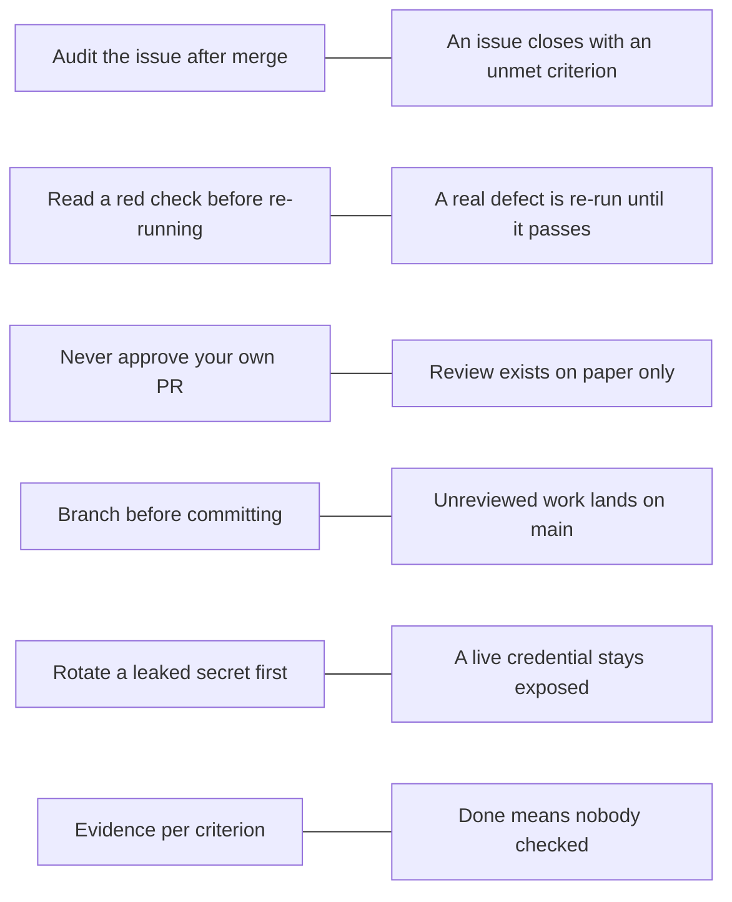

# Module 2.8: Why the rules exist

**Audience:** Anyone who's completed Modules 2.1 and 2.2, and who has ever
thought "this rule is just ceremony".
**Format:** Self-paced — read and work through each step yourself.
Facilitator-note callouts mark optional group activities. No sandbox needed.
**Timing:** ~35 min.

Every rule in this team's skills is a scar. Someone skipped a step, something
broke, and the rule is what was written down afterwards. A rule you know the
failure behind is one you keep following when nobody is checking, and one you
can bend sensibly when the situation really is different. This module walks
through the rules that new people question most and names the failure each one
prevents.

## Learning objectives

- Trace at least six rules to the incident or mistake behind them.
- Explain the cost of skipping each rule in concrete terms.
- Decide when a lighter process is reasonable, using the "scale ceremony to
  repo risk" guidance.

## A note on the stories

One story below really happened in this repository and is recorded in an
architecture decision record. The others are **illustrative**: composites of the
mistake each rule guards against, written to be neutral and not drawn from any
particular team. Each names the skill that holds the rule, which is the
authoritative text. If a story here and the skill ever disagree, the skill wins.

## Six rules and the failures behind them

What this diagram shows: each rule, the shortcut that tempts people, and what
follows from taking it.

### 1. After every merge, audit the issue

**Source:** `skills/github-hygiene/SKILL.md`,
`docs/adr/0001-refs-closes-connected-branch-closure.md` (this repository only)

*What happened (real).* The workflow once assumed that a pull request body with
`Refs #N` could not close the issue. In this repository, a bootstrap issue
closed the moment its linked pull request merged, even though the PR said only
`Refs` and a release criterion was still unchecked. GitHub's "connected branch"
link, created when you start from **Create a branch** on the issue, closes the
issue on merge no matter what the PR body says.

*Cost of skipping the rule.* An issue that says "closed" while a criterion is
unmet is a false report of progress. Nobody looks at closed issues, so the
missing work is forgotten.

*The rule.* After every merge, check the issue's state and its criteria. If it
closed with a criterion unmet, reopen it and write down why (Module 2.1 had you
rehearse exactly this).

### 2. Read a red check before you re-run it

**Source:** `skills/github-hygiene/SKILL.md`

*What happens.* A check fails. The author re-runs it, it passes, and the pull
request merges. Two weeks later the same failure appears on someone else's pull
request, and then on a third. The first failure was a real intermittent defect
in a test, and each re-run hid it a little longer.

*Cost of skipping the rule.* A genuine failure gets treated as noise, and the
noise gets merged. The skill's rule is to read the log first. Re-run a failure
you have *diagnosed* as a flake, and when the same job flakes twice, file it as a
defect instead of re-running a third time.

### 3. Never approve your own pull request

**Source:** `skills/github-pr-review/SKILL.md`

*What happens.* A repository requires one approving review. The only person
available is the author, so the author approves their own pull request to get
past the rule. The rule is satisfied, and nobody else has looked at the change.

*Cost of skipping the rule.* A review requirement exists to put a second pair of
eyes on a change. An approval that no second person gave defeats that purpose
while appearing to meet it, and it makes the repository's history claim a safety
check that never happened. The skill's advice is to say honestly that the pull
request is unreviewed.

### 4. Branch before you commit

**Source:** `skills/github-hygiene/SKILL.md`

*What happens.* Someone makes a quick fix directly on `main`, commits, and
pushes. It was meant to be small. It broke the build for everyone who pulled it,
and because it never went through a pull request, no check ran before it landed
and no reviewer saw it.

*Cost of skipping the rule.* `main` is the version everyone builds on. Work
reaches it only through a branch and a pull request so that checks and review
happen first. (If it does happen by accident, the skill gives the repair: branch
from the commit, then reset `main` to the remote.)

### 5. Rotate a leaked secret before you clean up

**Source:** `skills/github-security-response/SKILL.md`

*What happens.* A key is committed and pushed by mistake. The author deletes the
file, rewrites history to hide the commit, and then reports it. The key was
copied by an automated scanner within moments of the push and used before any of
that finished. The history rewrite took an hour, and the key was never revoked.

*Cost of skipping the rule.* The credential was compromised the moment it was
pushed, and cleanup does nothing about copies that already exist. Revoking it at
its source is what stops the damage. Rewriting history is a destructive step
that needs the maintainer's go-ahead and comes after. (Module 1.5 gives the
short version, Module 3.4 the full procedure.)

### 6. Every criterion needs evidence

**Source:** `skills/github-hygiene/SKILL.md`

*What happens.* An issue had three acceptance criteria. The pull request merged
with green checks, and the issue was closed with "done". Months later someone
discovers that one criterion was never met. Nothing recorded it as checked, and
nothing could be pointed to as proof.

*Cost of skipping the rule.* "It merged" and "CI is green" prove only that the
code merged and that the checks exercised something. A criterion is met when you
can point to a diff, a test, a run, or a screenshot that shows it. Without that,
"done" is an opinion, and you can't tell a finished issue from an abandoned one.

## When a lighter process is reasonable

**Source:** `skills/github-issue-first/SKILL.md`

Not every repository carries the same risk. The skill separates two kinds. A
repository with **no CI, no branch protection, and nothing built, deployed, or
tested** (a static page, a notes repository) is low-stakes. A repository with
real checks, protection, or deployment is not.

For the low-stakes kind, the skill says to **ask the maintainer once, up front**,
whether they want the full issue, branch, and pull-request routine or a lighter
touch such as a direct edit with a clear commit message. It does not let you
decide that on your own, and it does not ask again once they have answered for
that repository. A repository with CI, tests, deployment, or branch protection
keeps the full routine without asking.

Two things make this tolerable rather than a loophole:

- **The decision is the maintainer's**, and it is made with evidence: the
  read-only checks in the skill show which kind of repository you are in.
- **The reasons above still hold.** A lighter process drops steps whose failure
  is cheap here. It does not make a leaked secret less urgent or a false "done"
  less misleading.

Related point from `skills/github-releases/SKILL.md`: on some plans, required
checks are only advisory, so nothing *enforces* green-before-merge. Then your own
discipline is the only control there is. That is the clearest case for knowing
the reason behind the rule, since no tool will stop you.

## Exercise: name the rule and the early warning

**Permissions:** none needed; this is a reading and writing exercise.

**Starting state:** none; this is a reading and writing exercise. Have a pen or
a text file open.

For each story below, write two things: **which rule would have prevented it**
(one of the six, or the lighter-process rule), and **what evidence would have
shown the problem early**.

1. A pull request used `Refs #30`. After it merged the issue showed "Closed", and
   the author moved on. The issue's second criterion, a docs update, was never
   written.
2. A required check failed on a pull request. The author clicked re-run twice
   until it passed, then asked for a merge.
3. A maintainer was away, so a colleague approved their own pull request so it
   could merge on time.
4. A developer fixed a typo directly on `main`. The fix included a stray
   character that broke the build.
5. A token was found in a committed file. The author removed the file and wrote
   "fixed" on the issue.
6. A static team-notes repository has no checks, no protection, and no code. A
   new contributor asks whether they really need an issue and branch to fix a
   typo.

**Success state:** you have a rule and an early-warning signal for each of the
six stories, and your answer to story 6 depends on the maintainer's decision, not
on your preference.

**Likely errors:**

- You name a rule but not the early-warning signal: add what you would have seen, such as a failing check, an unchecked criterion, or a scan alert.
- Two rules seem to fit one story: pick the one that would have stopped the problem earliest, and mention the other as a backup.
- You answer story 6 from your own preference: the answer depends on what the maintainer has decided for that repository, so say what you would ask.

**Cleanup:** none.

> **Facilitator note (optional group activity):** ask each attendee to bring one
> real near-miss, with names and private details removed, and match it to a rule
> in the same way. The stories attendees recognise tend to be the ones they now
> follow.

### Model answer

1. **Rule 1 (audit after merge) and rule 6 (evidence).** Early warning: the
   post-merge audit shows the issue closed with an unchecked criterion, so it
   gets reopened right away.
2. **Rule 2 (read a red check).** Early warning: the failure log, which would
   show whether it was a diagnosed flake or a real defect. A job that flakes
   twice should be filed as a defect.
3. **Rule 3 (never approve your own pull request).** Early warning: the review
   record shows one approver who is also the author. Say the pull request is
   unreviewed instead.
4. **Rule 4 (branch before committing).** Early warning: a check running on a
   pull request would have caught the stray character before it reached `main`.
5. **Rule 5 (rotate first).** Early warning: secret scanning or push protection
   flagging the token, and the rule's first step, which is revoking it at its
   source. Deleting the file leaves the old commit and the live token in place.
6. **The lighter-process rule.** The skill's checks (no CI, no protection, no
   tests) suggest a low-stakes repository, so the answer is to ask the
   maintainer once whether they want the full routine or a lighter touch, then
   follow their answer.

## Self-check

- Why can an issue close even when the pull request said only `Refs`?
- A check failed once and passes on re-run. Under what condition is re-running
  acceptable, and what do you do if it happens again?
- Why does approving your own pull request defeat the purpose of a review
  rule?
- After a secret leaks, why is revoking it more urgent than rewriting history?
- Who decides that a repository can use a lighter process, and what evidence
  informs the decision?
- "CI is green" is not evidence that a criterion is met. What is?

Not confident on any of these? Re-read the matching section above, then check
the answers below.

### Self-check answers

- GitHub's connected-branch link, made when you start from the issue, closes it
  on merge regardless of the pull request text. Audit the issue after every
  merge.
- Re-run only after you have read the log and diagnosed it as a flake. If the
  same job flakes twice, file it as a defect instead of re-running again.
- The rule exists to put a second person's eyes on the change. Your own approval
  adds none, but makes the record claim that review happened.
- The credential is compromised from the moment it was pushed, and rewriting
  history doesn't affect copies that already exist. Revoking it at its source is
  what stops the damage.
- The maintainer decides, after the skill's read-only checks show whether the
  repository has CI, protection, or tests. You ask once and follow their answer.
- A concrete, checkable artifact: a diff, a test, a run, or a screenshot, recorded
  against that criterion.

## Feedback

Something unclear, wrong, or worth improving in this module? Open a
Discussion in this repo (**Ideas** category). Concrete, actionable
feedback gets converted into a tracked issue, per this repo's own
issue-first convention — see `skills/github-issue-first/SKILL.md`'s
Discussions section.

---

Next: [Module 2.9: Safety with skills and MCP servers](module-2-9-safety-with-skills-and-mcp-servers.md)
(if you use an AI assistant), then the optional [Module 3.1: Branch protection and rulesets](../3_advanced/module-3-1-branch-protection-and-rulesets.md)
(Modules 3.1 to 3.6 are independent — read them in any order, or only the
ones relevant to you)
