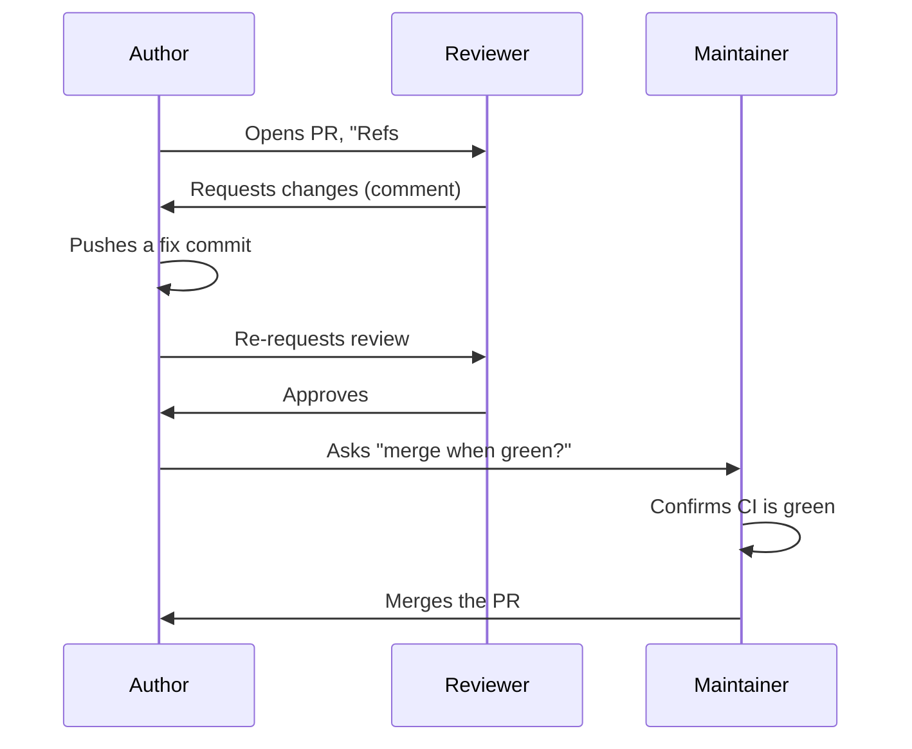

# Module 2b: PR review and branch conventions

**Audience:** Anyone who's completed Module 2a.
**Format:** Self-paced — read and do each step yourself. Facilitator-note
callouts mark optional group activities.
**Timing:** ~35 min.

## Learning objectives

- Know the branch and PR-review conventions well enough to follow them
  without checking the skill file every time.
- Understand what a milestone is (and isn't) here.

## PR review etiquette

**Source:** `skills/github-pr-review/SKILL.md`

What this diagram shows: review is a back-and-forth involving three roles,
not a single yes/no gate — and merging is a separate decision from
approving.

Walk the sequence left to right and pause on the detail that surprises most
people coming from a smaller or less formal process: **approving a PR is
not the same as merging it.** In most teams those are two different
people's decisions entirely. Even on a team where the same person sometimes
does both, they're still two separate checks happening one after another —
approval says "this change is good," merging says "and now is the right
time to ship it."

The vocabulary of GitHub's actual review actions, since people often use
them loosely: `Request changes` means "this genuinely can't merge yet" —
it's a real blocker, not a strong suggestion. `Comment` means "I have
questions or thoughts, but this isn't a verdict either way." A common
mistake is reaching for `Comment` when what's actually meant is `Request
changes` — that's an easy habit to fall into, and it quietly weakens the
whole review signal.

A firm, simple rule with no exceptions: never approve your own PR to get
around a required-review rule. If self-approval is technically possible in
a given repo's settings, that's a gap in the settings, not permission to
use it.

> **Facilitator note (optional, requires a partner):** the full review
> loop above is naturally a two-person activity. If you're running this
> with a group, pair people up: one opens a small real PR in the sandbox,
> the other genuinely reviews it — `Request changes` on a real (even
> minor) issue, a fix, a re-request, then `Approve`, then a *separate*
> merge decision from a third person or the same reviewer acting in a
> maintainer capacity. If you're going through this module solo, skip this
> — you can't ethically pair-review your own PR (that's exactly the rule
> two paragraphs up), so the exercise below gives you a solo-appropriate
> substitute instead.

## Branch conventions and milestones

**Source:** `skills/github-hygiene/SKILL.md` (PR flow),
`skills/github-releases/SKILL.md` (milestones)

The branch-naming convention is a practical habit, not an abstract rule:
one branch per issue, named for the kind of work it is (`fix/…` for bug
fixes, `feat/…` for new functionality, `docs/…` for documentation-only
changes, and so on). Branch from an up-to-date `main` every time — pull
first, then branch — and never commit directly to `main`. This is the same
"we don't work directly on `main`" habit from Module 2a's exercise, just
stated as policy now instead of as a click-by-click instruction.

Milestones are the point where most people's mental model needs
correcting: **a milestone is a release bucket, not a sprint or an
iteration.** The question a milestone answers is "what ships in the next
release?" — not "what are we working on this week?" Teams coming from a
background where iterations and delivery buckets were the same object (a
sprint that was also a release) tend to import that assumption here, and it
doesn't hold. If cadence tracking is wanted alongside release tracking,
that's a separate mechanism (a Projects iteration field), not a second
meaning bolted onto milestones.

Same discipline as Module 2a's issue-filing checklist: every issue gets a
milestone at filing time, alongside its priority and category labels — not
as an afterthought once the issue has already been triaged and forgotten.

## Exercise: branch naming and milestone-at-filing

A solo-doable, mechanical exercise — no partner required:

1. In the sandbox repo, file a new issue. Before you do anything else with
   it, attach a milestone (`gh issue edit <N> --milestone "<title>"`, or
   the web UI's milestone field) — practice attaching it *at filing time*,
   not after.
2. From that issue, create a branch. Name it correctly for the kind of
   work it represents: `fix/<short-description>` if it's a bug,
   `feat/<short-description>` if it's new functionality,
   `docs/<short-description>` if it's documentation-only.
3. Confirm you branched from an up-to-date `main` (not a stale local copy)
   before making any change.

If you have a partner or a facilitator running a group session, do the
full paired review roleplay in the callout above as well. If you're solo,
this three-step exercise is the complete, required exercise for this
module.

## Self-check

- Can you explain the difference between `Request changes` and `Comment`,
  and give an example of when each is the right choice?
- Why is approving a PR a separate decision from merging it, even when the
  same person ends up doing both?
- What question does a milestone answer, and what question does it *not*
  answer?
- What's the branch-naming prefix for a documentation-only change?

Not confident on any of these? Re-read "PR review etiquette" or "Branch
conventions and milestones" above.

## Feedback

Something unclear, wrong, or worth improving in this module? Open a
Discussion in this repo (**Ideas** category). Concrete, actionable
feedback gets converted into a tracked issue, per this repo's own
issue-first convention — see `skills/github-issue-first/SKILL.md`'s
Discussions section.

---

Next: [Module 3a: Branch protection and rulesets](../3_advanced/module-3a-branch-protection-and-rulesets.md)
(all four Module 3 topics are independent — read them in any order, or only
the ones relevant to you)
