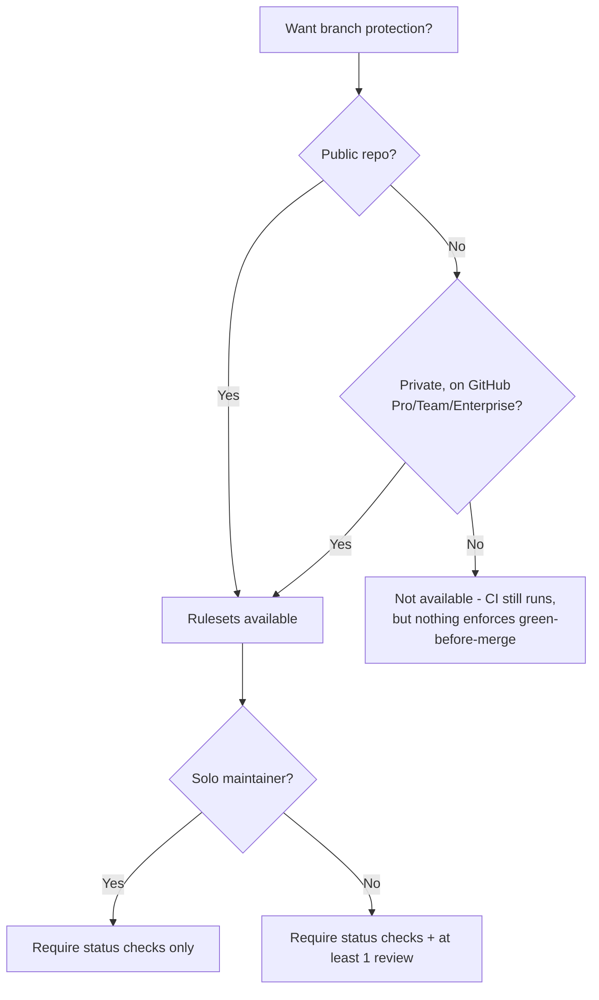

# Module 3.1: Branch protection and rulesets

**Audience:** Anyone who's completed Module 2.2, or is already comfortable
with this team's basic workflow and wants to go deeper. Optional, and
independent of Modules 3.2-3.6 — read in any order.
**Format:** Self-paced — read and do each step yourself. Facilitator-note
callouts mark optional group activities.
**Timing:** ~25 min.

## Learning objectives

- Understand what branch protection/rulesets do and don't guarantee, and
  when they're even available.

## Branch protection and rulesets

**Source:** `skills/github-releases/SKILL.md` (Rulesets section)

What this diagram shows: whether branch protection is even available
depends on plan and visibility before it depends on anything you
configure — a common surprise on private repos.



Walk the decision tree top to bottom before touching any settings, because
this is the surprise that catches people who've configured branch
protection somewhere else before: **availability depends on plan and
visibility first, and on your own choices second.** A ruleset (or classic
branch protection) can require CI to be green and require review before
merge — but only on repos where the feature is actually available in the
first place. A private repo on the free plan simply doesn't have this
option, no matter how it's configured; CI still runs and still reports
results, but nothing in GitHub itself enforces green-before-merge.

Once availability is confirmed, walk the second branch of the tree: solo
maintainer versus more than one. On a solo-maintained repo, requiring your
own review before you can merge your own PR locks you out of your own
repository — unless you add yourself as a bypass actor, which quietly
makes the review requirement advisory rather than real. The right call for
a solo maintainer is to require the status checks and skip the review
requirement entirely, adding it back only once a second maintainer
actually exists to do the reviewing.

A specific tooling gotcha worth knowing by name: `gh ruleset list` can
print nothing back both when nothing is configured *and* when the repo's
plan doesn't support rulesets at all — the empty output looks identical
either way. Always confirm via the API directly rather than trusting the
CLI listing's silence.

## Exercise: inspect real rulesets (read-only)

**Permissions:** read access to the sandbox is enough for steps 1, 3, and 4. Step 2 needs admin access, so skip it if you do not have that.

**Starting state:** `gh` is installed and signed in (`gh auth status`), and you have replaced `<org>/<sandbox-repo>` with the real names.

**Success state:** you can say whether review is required, whether a status check is required, and whether force-push is blocked on `main`, and whether the settings look like a solo or a team repository.

**Likely errors:**

- The command returns 404: the organisation or repository name is wrong, or you have no access. Check the spelling with `gh repo view <org>/<sandbox-repo>`.
- `gh ruleset list` says nothing or "Resource not accessible": you lack admin access. That is expected; use step 1's command instead.
- `gh ruleset list` is empty: that does not prove no rules exist. Run the API command in the step to tell "none" from "not available on this plan".
- The rules output is empty: no rule applies to that branch. That is a valid answer; note it.

**Cleanup:** none; this exercise is read-only and changed nothing.

This exercise is deliberately read-only — rulesets are admin-level
settings, and a shared sandbox shouldn't have every self-paced learner
creating or editing them simultaneously.

1. Check the rules actually enforced on the sandbox repo's `main` branch.
   This works with plain read access — no admin permission needed:

   ```bash
   gh api repos/<org>/<sandbox-repo>/rules/branches/main
   ```

   This lists every rule any ruleset applies to that branch (required
   reviews, required status checks, force-push restrictions, and so on)
   without needing permission to see the ruleset definitions themselves.

2. If you have admin access to the sandbox (or a facilitator confirms you
   do), you can also inspect the full ruleset definitions — this step
   does need admin, unlike step 1:

   ```bash
   gh ruleset list --repo <org>/<sandbox-repo>
   ```

   If that comes back empty, don't assume "none configured" — check the
   API directly to distinguish "none" from "unavailable on this plan":

   ```bash
   gh api repos/<org>/<sandbox-repo>/rulesets
   ```

3. If you don't have admin access anywhere, use this repo's own branch
   rules as a live example — step 1's command works here too, since it
   only needs read access:

   ```bash
   gh api repos/<this-repo-org>/<this-repo-name>/rules/branches/main
   ```

4. Read the output and identify: is review required? Is a status check
   required? Is force-push blocked? Match what you see against the
   decision tree above — can you tell from the settings alone whether a
   repo is solo-maintained or not?

> **Facilitator note (optional group activity):** as a group, look at two
> or three different real repos' rulesets (this repo's own, plus any
> others people in the room maintain) and compare. It's a fast way to make
> "availability depends on plan" concrete instead of abstract.

## Self-check

- Why might `gh ruleset list` return nothing on a repo that actually wants
  branch protection?
- What's the difference in what you'd configure for a solo-maintained repo
  versus a multi-maintainer one?
- On a private, free-plan repo, what still happens to CI even though
  nothing enforces green-before-merge?

Not confident on any of these? Re-read "Branch protection and rulesets"
above.

## Feedback

Something unclear, wrong, or worth improving in this module? Open a
Discussion in this repo (**Ideas** category). Concrete, actionable
feedback gets converted into a tracked issue, per this repo's own
issue-first convention — see `skills/github-issue-first/SKILL.md`'s
Discussions section.

---

Next: [Module 3.2: Projects boards](module-3-2-projects-boards.md)
