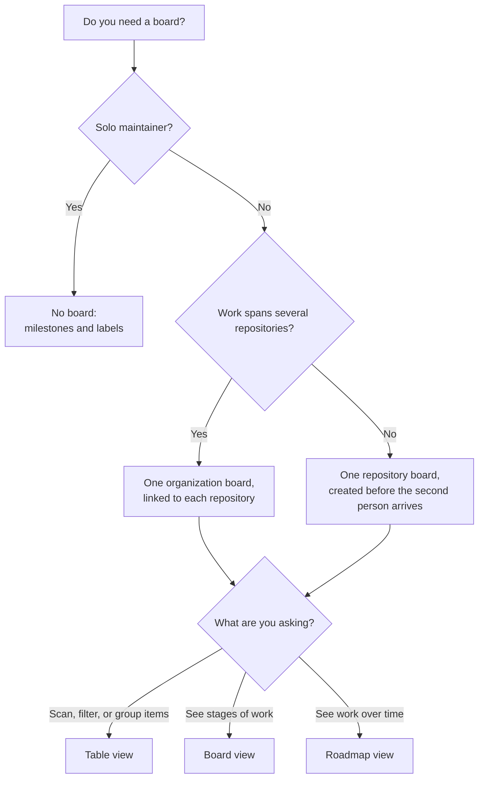

# Module 3.2: Projects boards

**Audience:** Anyone who's completed Module 2.2 (and ideally Module 2.5), or is
already comfortable with this team's basic workflow and wants to go deeper.
Optional, and independent of Modules 3.1 and 3.3-3.6 — read in any order.
**Format:** Self-paced — read and do each step yourself. Facilitator-note
callouts mark optional group activities.
**Timing:** ~35 min.

## Learning objectives

- Understand how a Projects board relates to issues, and which side is the
  source of truth.
- Show issues and milestones on a board, and filter or group a view by
  milestone.
- Choose between no board, a repository board, and an organization board, and
  between the Table, Board, and Roadmap views.
- Recognise two failure modes: draft items standing in for issues, and board
  fields that disagree with the issue.

## A board is a view, not a source of truth

**Source:** `skills/github-projects/SKILL.md`

The one sentence worth repeating any time a Projects board comes up: **a
Projects board is a view over issues, never the source of truth.**
Everything that actually matters — labels, milestones, assignees — lives
on the issue itself; the board mirrors it so several people can see who is
doing what without opening every issue. If a fact only ever gets recorded on
the board and nowhere else, it's effectively invisible to anyone reading the
repo through the Issues tab, the API, or `gh` — which, on this team, is a real
way people work.

## Getting issues onto a board, and what the board mirrors

**Source:** `skills/github-projects/SKILL.md`

Every item on a board should be a real issue or pull request, **added to the
board second**. You can add one from the board's own "Add item" box, or turn on
the board's auto-add workflow so new issues land there without anyone
remembering (the skill recommends this).

Once an issue is on the board, two kinds of information show up beside it:

| Kind | Examples | Where the truth lives |
| --- | --- | --- |
| **Built-in fields** that mirror the issue | Assignees, Labels, Milestone | On the issue. Change it there |
| **Board-only fields** you add to the board | Status, Priority, Effort, Target date | On the board, *except* where the issue has an equivalent (see below) |

GitHub's documentation lists assignee, milestone, and labels as built-in
metadata, and lets a project add up to 50 fields in total, including custom
ones such as Date, Number, Single select, Text, and Iteration fields.

The overlap is where trouble starts. Priority is a good example: this team
records priority as a **label** on the issue (`P0` to `P3`), and a board can
also have a **Priority** field. They are two copies of one fact. The skill's
rule is that the board field mirrors the label, and **when they disagree, the
label wins**. Fix the field, not the label. When you change an issue's priority
label, change the board's field in the same breath.

## Showing milestones on a board

**Source:** `skills/github-projects/SKILL.md`,
`skills/github-releases/SKILL.md`

Milestone is one of the built-in fields, so it can be shown as a column in the
**Table** view. If you don't see it, open the view's menu, choose **Fields**,
and tick **Milestone**. Two things then become possible:

- **Filter** the view to one milestone. In the filter box, type
  `milestone:"v0.4.0"` (quotation marks are required around the name). Combine
  filters with spaces, for example `milestone:"v0.4.0" -status:done`, where a
  leading `-` excludes a value.
- **Group** the view by milestone. In the view's menu, choose **Group by**, then
  **Milestone**, and the table splits into one section per milestone.

The **issue's own milestone stays the source of truth** (Module 2.5). A
milestone says which release an issue ships in, and the release notes, the
milestone's progress bar, and `gh issue list --milestone` all read it from the
issue, not from the board. Don't use a board column in its place, and don't
treat the board's grouping as a second milestone scheme. A good habit: change
an issue's milestone on the issue, then glance at the board to confirm it moved.

One thing to be careful with: in a grouped table, dragging an item to another
group changes that item's value for the field you grouped by. For a board-only
field such as Status that is exactly what you want. For Milestone it changes the
issue's own metadata, so do it deliberately, not by accident while tidying.

## Which board, and which view

**Source:** `skills/github-projects/SKILL.md`

First decide whether a board is warranted at all:

| Situation | Board? |
| --- | --- |
| Solo maintainer | **None.** Milestones and labels are the whole system, and an unmaintained board is worse than none |
| A second maintainer is joining, or an outside contributor will pick up issues | A **repository board**, created *before* they arrive so it is populated on day one |
| Several maintainers, and work already spans several repositories | **One organization board** linked to each repository, not one board per repository |
| The maintainer explicitly asks for one | Create it, and say what the ongoing upkeep is |

Never create a board silently as part of some other task: boards are visible
and shared, and annoying to unwind. On a board that spans repositories, keep the
built-in **Repository** field visible in every view, because nothing else shows
which repository an item belongs to.

Then choose a **view** for the question you're asking. GitHub offers three
layouts, switched from the view's menu under **Layout**:

| View | Good for | Needs |
| --- | --- | --- |
| **Table** | Scanning and editing many items; filtering and grouping, for example "everything in milestone `v0.4.0` that isn't done" | Nothing special |
| **Board** | Seeing work move through stages as columns (a Kanban board), for example Todo, In Progress, Done | A single-select field, usually Status, to make the columns |
| **Roadmap** | Seeing work laid out on a timeline | A Date field or an Iteration field to place items |

A board that nobody updates is **cosmetic overhead**: the usual signs are
columns that don't match the issues' real state and items nobody owns. If you
see that, the fix is the skill's hygiene list (every item a real issue, every
item assigned, finished items archived), or retiring the board.

What this diagram shows: how to choose, starting from your situation.

## Two failure modes

**Source:** `skills/github-projects/SKILL.md`

**Three kinds of item, told apart by their icon and number.** An **issue**
item shows an issue icon and an issue number such as `#12`. A **pull request**
item shows a pull request icon and a pull request number, which is also written
`#34`, so a missing issue number does not mean a draft. A **draft** item shows a
draft icon and has no number at all, because it exists only on the board. Open
the item: an issue or pull request opens its own page in the repository, and a
draft opens only inside the board.

**A draft item is not a substitute for an issue.** A draft is a board entry
created only on the board, with no linked issue. It has no labels, no assignee,
no URL, and is invisible to `gh issue list`. It looks like tracked work from the
board's own view and is invisible everywhere else, which silently breaks
issue-first. Every item on a board should be a real issue or PR first.

**A board field that disagrees with the issue.** A Priority field that says P1
on an issue labelled `P2`, or a Status that says In Progress on an issue that
closed last week, is a lie the board tells. The label and the issue's real state
win, and the board gets corrected. Automation helps here: the skill recommends
turning on the board's "item closed" and "pull request merged" workflows so the
board stops lying the moment an issue closes.

## Exercise: inspect a real board (read-only)

This exercise assumes the sandbox repo has a Projects board already set
up by a facilitator, per `education/facilitator-guide.md`. If it doesn't,
substitute any Projects board you have read access to; the questions below
don't require write access. Don't change anything you find.

**Permissions:** read access to the project and its repository is enough. Filtering and grouping affect only your own view unless you save them, so do not save.

**Starting state:** the board is open in its **Table** view, and you have the
Issues tab open in another tab.

1. Open the board and find one item that also has a visible issue number.
2. Open that item's linked issue directly (not through the board).
3. Compare: does the board's Priority field for that item match the issue's
   priority label? Does the board's status match the issue's actual open or
   closed state?
4. Find the item's **milestone**. If the Milestone column isn't visible, show it
   from the view's menu under **Fields**. Check that it matches the milestone on
   the issue itself.
5. **Filter** the view to that milestone by typing `milestone:"<its name>"`. How
   many items remain? Compare with the milestone's own page under the
   repository's Issues, Milestones. The counts should agree for the issues the
   board contains.
6. Clear the filter, then **group** the view by Milestone and note the sections.
   Then remove the grouping.
7. Look for any item that has no number at all and shows the draft icon. That is
   a draft item, the first failure mode, live. An item with a pull request icon
   and a number is a pull request, not a draft.

**Success state:** you have answers to three questions: do the board's Priority
and Status agree with the issue, does the board's milestone match the issue's,
and does the board contain any draft item.

**Likely errors:**

- The Milestone column is not shown: add it from the view's menu under **Fields**.
- The filter returns no items: the milestone name needs the exact spelling inside quotes, or that milestone has no items on this board. Check the spelling first.
- The board's count and the milestone page disagree: the board may also contain draft items or items from other repositories. Subtract those before deciding something is wrong.
- You find no draft item: that is a valid result. Say so, and note that a board with no drafts is the healthy case.

**Cleanup:** clear your filter and remove the grouping, so the view is as you
found it. Nothing else changed.

> **Facilitator note (optional group activity):** if the sandbox board has no
> draft item, deliberately create one throwaway draft item before the session,
> and make sure at least one item has a milestone and a Priority value that
> disagrees with its label, so participants find each failure mode rather than
> just reading about it. Remove them afterwards.

### Model answer

Expect the milestone on the board to equal the issue's (it mirrors it). Priority
and Status should agree too unless the facilitator seeded a mismatch; if they
disagree, the label and the issue's real state are the correct values. The
filtered count equals the number of board items in that milestone, which may be
smaller than the milestone's total if some of its issues aren't on the board.
Only an item with no number at all, shown with the draft icon, is a draft item;
an item with a pull request number is a pull request.

## Self-check

- In one sentence, what is a Projects board, and what is it *not*?
- A board's Priority field says P1, but the issue is labelled `P2`. Which one is
  right, and what do you fix?
- How do you show only the issues in one milestone on a board's Table view?
- A solo maintainer asks for a board. What do you say?
- Which view would you use to see work laid out over time, and what does it
  need?
- What's wrong with a "draft item" that has no linked issue?

Not confident on any of these? Re-read the matching section above, then check
the answers below.

### Self-check answers

- A view over issues. It is not where the facts live: labels, milestones, and
  assignees stay on the issue.
- The label is right. Fix the board field to match it.
- Type `milestone:"<name>"` in the view's filter box (quotes required), or group
  by Milestone to see one section per milestone.
- Don't create one: milestones and labels are the whole system for a solo
  repository, and a board would be unmaintained overhead. Confirm with the
  maintainer if they still want it.
- The Roadmap view, which needs a Date field or an Iteration field to place
  items on the timeline.
- It exists only on the board, so it has no labels, assignee, or URL and is
  invisible to the Issues tab and `gh`. File a real issue and add that.

## Feedback

Something unclear, wrong, or worth improving in this module? Open a
Discussion in this repo (**Ideas** category). Concrete, actionable
feedback gets converted into a tracked issue, per this repo's own
issue-first convention — see `skills/github-issue-first/SKILL.md`'s
Discussions section.

---

Next: [Module 3.3: Releases](module-3-3-releases.md)
