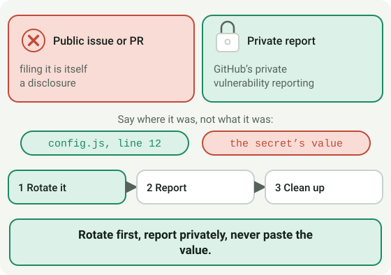
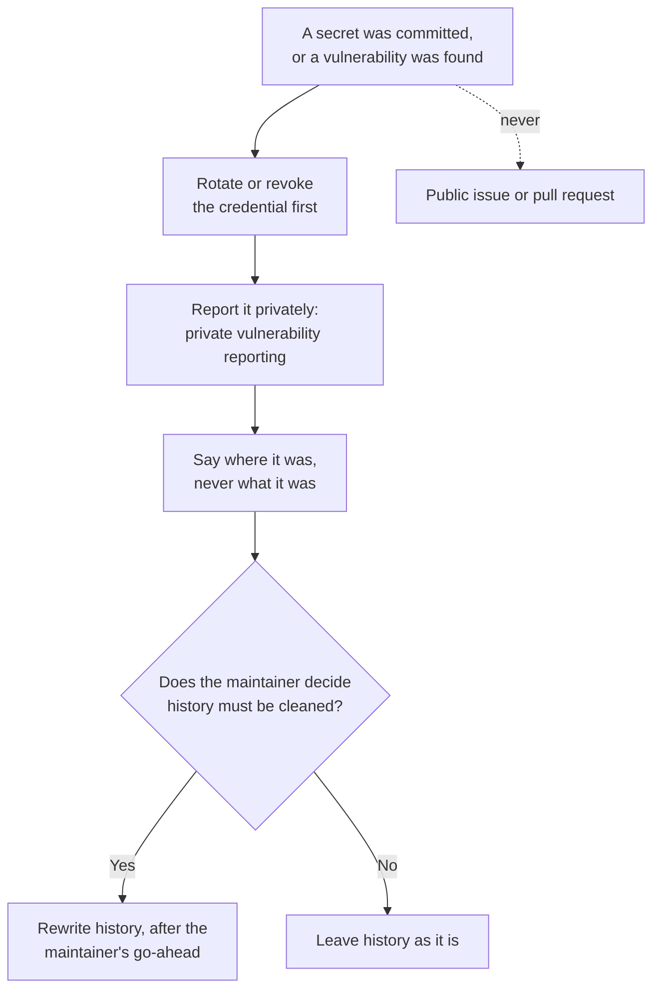

# Module 3.4: Security response basics

**Audience:** Anyone who's completed Module 2.2, or is already comfortable
with this team's basic workflow and wants to go deeper. Optional, and
independent of Modules 3.1-3.3, 3.5, and 3.6 — read in any order.
**Format:** Self-paced — read and do each step yourself. Facilitator-note
callouts mark optional group activities.
**Timing:** ~15 min.

## Learning objectives

- Know the first moves in a security-sensitive situation.

## Security response basics

**Source:** `skills/github-security-response/SKILL.md`

The instinct most people have here is backwards, so it's worth naming and
correcting immediately: if a secret gets committed, the first move is to
**rotate it**, not to clean up git history. The credential is compromised
from the moment it was pushed — public repos in particular get scanned by
bots within seconds — so rewriting history afterward is cleanup, not
containment. Rotating first, cleaning up second, is the order that
actually limits damage; doing it the other way around leaves a live,
compromised credential sitting untouched while attention goes to a
lower-priority task.

The disclosure rule, stated plainly and without exception:
vulnerabilities and committed secrets never go into a public issue or a
public PR — filing one is itself a disclosure. Use GitHub's private
vulnerability reporting instead, which exists specifically so a repo has
somewhere for this to go that isn't the public tracker.

A small but important habit: never paste the secret's actual value
anywhere while reporting or discussing it — not in an issue, not in a PR,
not in chat. Reference *where* it was found (the file, the commit, the log
line) rather than *what* it was. The location is enough information for
someone to act on; the value itself is just one more place the secret now
lives.

What this shows: the order of the first moves. Rotating comes first because the
credential is compromised from the moment it was pushed. The dotted line is the
one door that stays closed: a vulnerability or committed secret never goes into
a public issue or pull request.

## Exercise: practice the reporting flow (no real secret involved)

**Permissions:** you need read access to a repository's Security tab. You must not submit a report.

**Starting state:** a browser, and a repository to look at (this one's is fine).

**Success state:** you found where private vulnerability reporting is, saw what it asks for, and wrote a one-sentence description that names a file and a rough location and contains no secret value.

**Likely errors:**

- There is no **Report a vulnerability** button: private vulnerability reporting is switched off for that repository. Read its security policy for the contact route instead.
- You cannot see the Security tab: you lack access to that repository. Use this repository's own.
- Your sentence includes a made-up key or password: remove it. The report names where the secret is, never what it is.

**Cleanup:** if you opened the report form, close it without submitting.

Nothing in this exercise touches a real credential or a real
vulnerability — it's entirely a UI-navigation and writing exercise.

1. Navigate to any repo's **Security** tab (this repo's own is fine) and
   locate **Private Vulnerability Reporting**. Don't submit anything — just
   confirm you can find it and see what fields it asks for.
2. Writing exercise: imagine you found a fake API key accidentally
   committed in `config/settings.example.yml` three commits ago, in a repo
   called `demo-app`. Write one sentence describing *where* it was found,
   suitable for a private security report — without including any
   made-up "value" for the secret itself. For example: "A live-looking API
   key appears in `config/settings.example.yml`, introduced in the third
   most recent commit on `main`." Check your sentence: does it name a
   file, a rough location, and avoid inventing or including any secret
   value? If yes, you've practiced the habit correctly.

## Self-check

- What's the first move when a secret gets committed — rotate, or clean up
  history? Why that order?
- Where do vulnerabilities and committed secrets get reported — and where
  do they never get reported?
- When describing where a secret was found, what do you include, and what
  do you deliberately leave out?

Not confident on any of these? Re-read "Security response basics" above.

## Feedback

Something unclear, wrong, or worth improving in this module? Open a
Discussion in this repo (**Ideas** category). Concrete, actionable
feedback gets converted into a tracked issue, per this repo's own
issue-first convention — see `skills/github-issue-first/SKILL.md`'s
Discussions section.

---

Next: [Module 3.5: Actions, runners, and the Copilot coding agent](module-3-5-actions-runners-and-agents.md),
or back to [Education Program overview](../README.md). From here, the
`skills/*/SKILL.md` files themselves are the reference for anything not
covered in this program.
