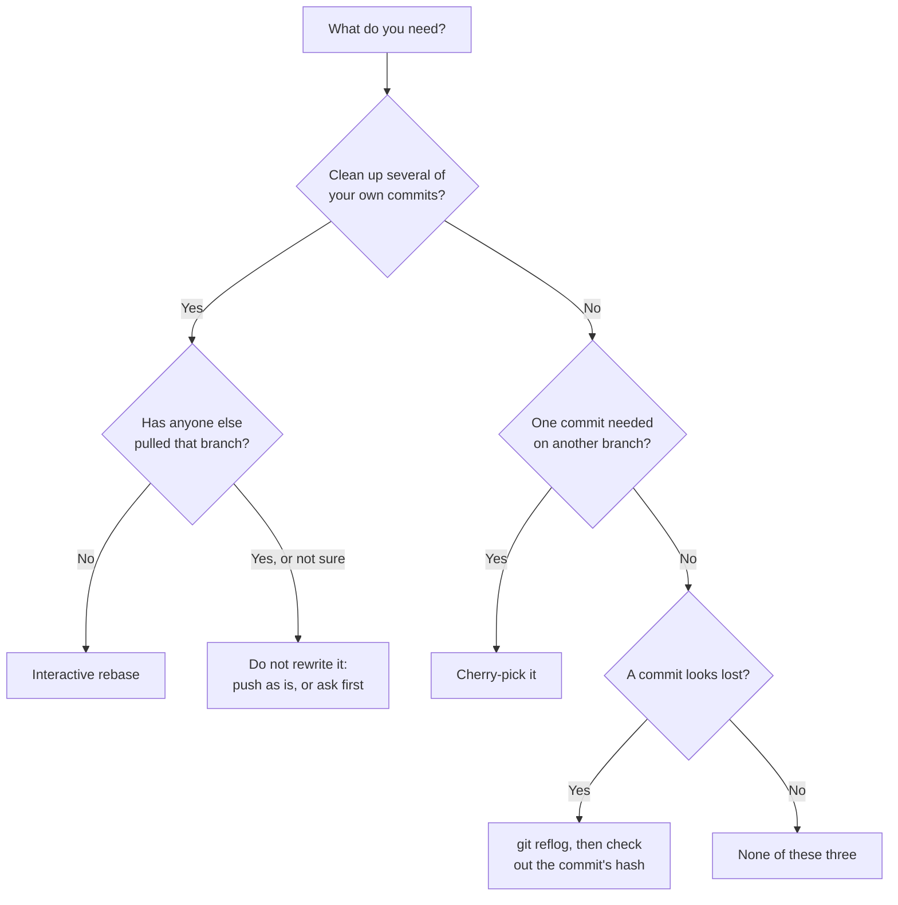
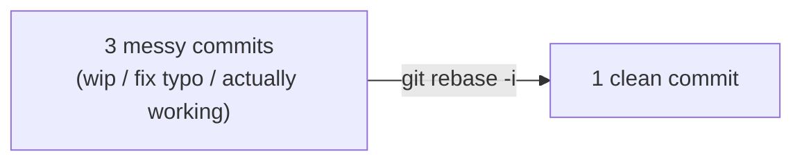
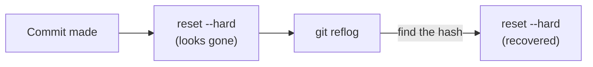

# Module 3.6: Rebase, Cherry-Pick, and Reflog Recovery

**Audience:** Anyone who's done Module 1.2 (local git basics) and wants the
next level of git mechanics — cleaning up commit history, moving a single
commit between branches, and recovering from a mistake that looks
unrecoverable. Optional, and independent of Modules 3.1-3.5 — read in any
order.

**Format:** Self-paced, hands-on, in a terminal against the shared sandbox
repo.

**Timing:** ~25 min.


## Learning objectives

- Use interactive rebase to clean up a messy commit history — safely,
  because you'll know exactly when it's safe.
- Use cherry-pick to move one specific commit from one branch to another.
- Use `git reflog` to recover a commit that looks lost after a bad
  `reset` or rebase.

## The one rule that makes all three of these safe

Module 1.2 introduced this rule for `git reset --hard`; it applies with
even more force here, because rebase *rewrites commit history* by design:
**only rewrite history that hasn't been pushed, or that you're certain
nobody else has pulled.** Every technique in this module changes commit
history, not just file content. Used on your own unpushed branch, that's
completely safe — you're the only one who's ever seen those commits.
Used on a branch someone else has already pulled, it creates two
diverging versions of "the same" history that don't reconcile cleanly.

If you're not sure whether a branch is safe to rewrite, it isn't — push
what you have as-is, or ask first.



What this shows: which tool fits, with the safety rule applied first. Rewriting
history is only for commits nobody else has.

## Before you start

**Permissions:** you need `git` installed and a local clone of the sandbox. You only push if a step tells you to, so write access to the sandbox is not needed for the rest.

**Starting state:** a clean `git status` on `main`, and the scratch branch `module-3-6-<your-name>` does not exist yet.

**Success state:** you cleaned three commits into one with an interactive rebase, moved a single commit with cherry-pick, and recovered a commit that looked lost, using `git reflog`.

**Likely errors:**

- `git rebase -i` opens an editor you cannot use: in vim type `:wq`, in nano press Ctrl+X. If you want to abandon the rebase, run `git rebase --abort`.
- A rebase stops with a conflict: fix the file, `git add` it, and `git rebase --continue`, or `git rebase --abort` to go back to before you started.
- `git checkout -b module-3-6-<your-name>` says the branch exists: use a new name, or switch to it with `git checkout`.
- A commit seems gone after `git reset --hard`: it is not. Run `git reflog`, find the commit's hash, and use `git checkout -b recovered <hash>`.

**Cleanup:** when you are done, return to `main` and delete your scratch branches locally with `git branch -D <name>`. Do not push them; if you did, remove them with `git push origin --delete <name>`.

## Interactive rebase: cleaning up commit history

You made three commits while figuring something out — `"wip"`, `"fix
typo"`, `"actually working now"` — and you'd rather the history read as
one clean commit before anyone reviews it.

```bash
git checkout -b module-3-6-<your-name>
git status                      # checkpoint: clean working tree, on your new branch

echo "draft" >> CONTRIBUTORS.md
git add CONTRIBUTORS.md         # a commit records only what you've staged
git commit -m "wip"
echo "draft fixed" >> CONTRIBUTORS.md
git add CONTRIBUTORS.md
git commit -m "fix typo"
echo "final" >> CONTRIBUTORS.md
git add CONTRIBUTORS.md
git commit -m "actually working now"

git log --oneline -3            # checkpoint: exactly three new commits

git rebase -i HEAD~3
```

Without the `git add` lines, `git commit` refuses: git only commits what
you've staged (Module 1.2, "Three things, one file").

This opens your editor with the three commits listed, oldest first, each
prefixed `pick`. To squash the last two into the first:

```text
pick a1b2c3d wip
squash e4f5g6h fix typo
squash i7j8k9l actually working now
```

Change `pick` to `squash` (or `s`) on the second and third lines, save and
close. Git then opens a second editor to write the combined commit
message — write one that describes the end result, not the journey:
`"Add name to CONTRIBUTORS.md"`, not `"wip, fix typo, actually working"`.



What this shows: interactive rebase doesn't add new content — it replaces
a sequence of commits with a cleaner sequence telling the same story.

## Cherry-pick: moving one commit to another branch

Cherry-pick applies a single commit's changes onto your current branch,
as a new commit — useful when a fix landed on the wrong branch, or when
one specific change from someone else's branch is needed without the rest
of it. The original commit stays where it is, and nothing already pushed is
rewritten: the copy is a new commit with a new hash, so cherry-picking is
safe on a shared branch. (The "rewrite only unpushed history" rule above
applies to rebase and `reset`, not to this.) If the original branch is later
merged too, the same change can show up twice, which is worth knowing before
you do both.

```bash
git log other-branch --oneline    # find the commit hash you need
git checkout your-branch
git cherry-pick <commit-hash>
```

If the cherry-picked change conflicts with something already on your
branch, git stops exactly like a merge conflict (Module 1.2 covered
resolving these) — fix the file, `git add`, then `git cherry-pick
--continue`.

## Reflog: recovering from "I think I just lost my work"

`git reflog` is the safety net underneath every other command in this
module (and underneath `reset --hard` from Module 1.2). Git doesn't
actually delete a commit the moment nothing points at it anymore — it
keeps a log of every place `HEAD` has pointed, recently, even commits no
branch currently references.

```bash
# Simulate "losing" a commit
git commit --allow-empty -m "a commit about to get lost"
git reset --hard HEAD~1        # this looks like it deleted the commit above

git reflog                      # shows every recent HEAD position, including the "lost" one
git reset --hard <hash-from-reflog>   # restores it
```



What this shows: `reset --hard` moves where your branch *points*; it
doesn't immediately erase the commit itself. `reflog` is how you find
your way back before git eventually garbage-collects it. Reflog entries
expire: by default, 90 days for entries still reachable from the branch tip
and 30 days for entries that aren't (like your "lost" commit). Both are
configurable, and `git gc` can prune sooner, so treat these as defaults and
not a guarantee — recover promptly.

This only works for work you **committed**. A change that was never committed
(an uncommitted edit wiped by `reset --hard` or `restore`) was never in the
reflog, and there is nothing to recover. Also, the reflog is local to your
clone: it isn't pushed, and a fresh clone doesn't have it.

## Self-check

- Why is it safe to rebase a branch you haven't pushed, but not one
  someone else has already pulled?
- What's the difference between `merge` and `cherry-pick` — what does
  each one actually bring over?
- If you ran `git reset --hard` and think you lost a commit, what's the
  first command you run?

Not confident on any of these? Re-read the relevant section above.

## Feedback

Something unclear, wrong, or worth improving in this module? Open a
Discussion in this repo (**Ideas** category). Concrete, actionable
feedback gets converted into a tracked issue, per this repo's own
issue-first convention — see `skills/github-issue-first/SKILL.md`'s
Discussions section.

---

Back to [Education Program overview](../README.md).
