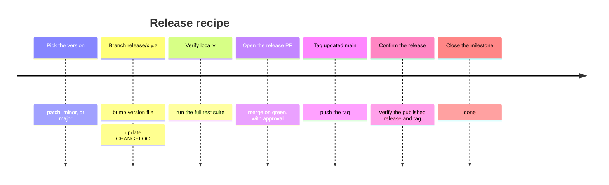

# Module 3c: Releases

**Audience:** Anyone who's completed Module 2b, or is already comfortable
with this team's basic workflow and wants to go deeper. Optional, and
independent of Modules 3a, 3b, 3d — read in any order.
**Format:** Self-paced — read and do each step yourself. Facilitator-note
callouts mark optional group activities.
**Timing:** ~25 min.

## Learning objectives

- Walk through the shape of a release, end to end.

## Releases

**Source:** `skills/github-releases/SKILL.md` (Release recipe)

What this diagram shows: a release is a fixed sequence of one-time steps,
not a branching decision — a timeline fits it better than a flowchart.



Walk the timeline as a literal recipe to follow, not a set of choices to
weigh — most of what the earlier modules covered involved judgment calls.
A release doesn't. The one step people get wrong most often: read the
current version from the repo's actual version file — `package.json`, a
module manifest, whatever this project uses — never from the last git
tag. The two can and do drift apart over time, and trusting the tag
instead of the source file is how a release ends up shipping under the
wrong version number.

Why this team keeps both generated release notes and a hand-written
`CHANGELOG.md`, rather than treating one as redundant with the other: they
serve genuinely different readers. Generated notes (built from merged PR
labels) answer "what merged in this release" — useful for an engineer
auditing exactly what shipped. A hand-written changelog answers "what
changed and why it matters" — useful for anyone who wants the human
summary without reading a list of PR titles. Neither replaces the other.

## Exercise: read a real release, end to end (read-only)

This exercise runs against the `DOC-GitHub-Practice-Skills` repo itself —
the one this training program lives in. It's public, so every step below
works with no special access, and it has a real version file and a real
hand-written changelog to compare against.

1. Read the current version straight from its version file
   (`package.json`'s `"version"` field) — not from the last git tag.
2. Open its most recent published release on the **Releases** page
   (`github.com/<owner>/<repo>/releases`) and read the generated notes
   GitHub built for it. If you have the `gh` CLI, you can also preview
   what generated notes would look like for a hypothetical next version,
   without creating anything (this command needs push access to the
   repo it targets, so it only works here, not against a repo you're a
   read-only guest on):

   ```bash
   gh api repos/<owner>/<repo>/releases/generate-notes -f tag_name=v<next-version> --jq .body
   ```

3. Compare that generated output against the matching entry in
   `CHANGELOG.md` for the same version. Notice the difference in what
   each one tells you — one lists what merged, the other explains what
   changed and why.

## Self-check

- Where should you read the "current version" from, and where should you
  never read it from?
- Why does this team keep both generated release notes and a hand-written
  CHANGELOG, instead of picking one?
- What's the very last step in the release recipe timeline?

Not confident on any of these? Re-read "Releases" above.

## Feedback

Something unclear, wrong, or worth improving in this module? Open a
Discussion in this repo (**Ideas** category). Concrete, actionable
feedback gets converted into a tracked issue, per this repo's own
issue-first convention — see `skills/github-issue-first/SKILL.md`'s
Discussions section.

---

Next: [Module 3d: Security response basics](module-3d-security-response.md)
