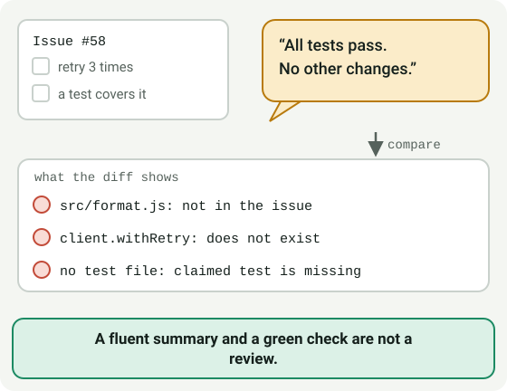
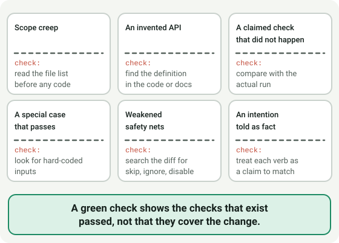
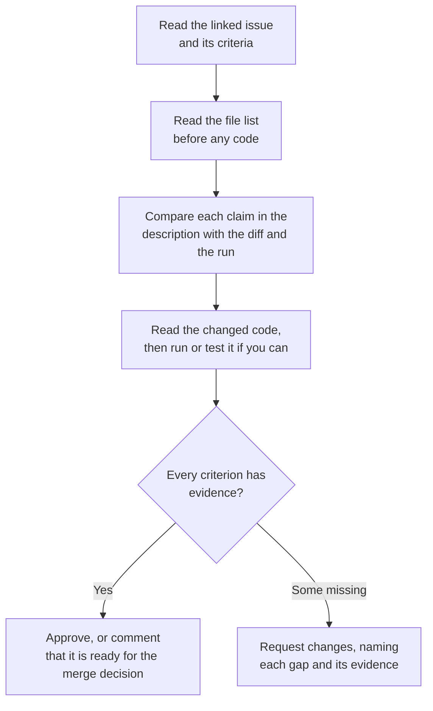

# Module 4.1: Reviewing changes an AI agent wrote

**Audience:** Anyone who has done Modules 2.2 and 3.5 and read the
[LLM prerequisite](../0_prerequisites/module-0-6-what-is-an-llm-assistant.md),
and who accepts pull requests from an AI coding assistant or from the Copilot
coding agent.
**Format:** Self-paced — read and work through each step yourself. Facilitator-note
callouts mark optional group activities. No sandbox needed.
**Timing:** ~30 min.

Module 2.2 taught how a review works, and Module 3.5 said a pull request opened
by a coding agent goes through the same gate as one a person opened. This module
is about what changes in your own review when the author is an agent. The gate
does not move. What moves is where the mistakes hide: an agent writes fluent,
confident descriptions, it is fast, and it will happily make a change that looks
right and was never checked.



## Learning objectives

- Read an agent's diff for changes beyond the task, and for calls to things that
  do not exist.
- Check the description's claims about verification against what actually ran.
- Decide between approve, request changes, and comment, with evidence for each
  finding, and say why a green check is not a decision.



## What is different about an agent's pull request

**Source:** `skills/github-pr-review/SKILL.md`, `skills/github-hygiene/SKILL.md`

Nothing in this module changes the review rules. The reasons are the ones in
Module 2.2: a pull request is judged against the linked issue's acceptance
criteria, with evidence, and approval is not permission to merge. What an agent
adds is a handful of habits to watch for:

| Pattern | What it looks like | How to check |
| --- | --- | --- |
| **Scope creep** | Files changed that the issue never mentioned: a reformatted file, a renamed helper, a "tidy-up". | Read the file list before any code, and ask of each file why the issue needs it. |
| **An invented API** | A call to a function, option, or command that reads naturally and does not exist in this codebase or its libraries. | Find the definition. If you cannot find it in the code or the dependency's documentation, assume it does not exist. |
| **A claimed check that did not happen** | "Added tests, all passing" when no test file is in the diff, or "ran the full suite" when CI ran a subset. | Compare each claim with the diff and with the actual CI run, not with the summary. |
| **A special case that passes** | A hard-coded value, or a branch that handles the one input a test uses, so the check goes green without the behaviour being right. | Look for literals and conditions that mention specific inputs; ask what happens for a different one. |
| **Weakened safety nets** | A test skipped, an assertion loosened, a lint rule disabled, or a check made optional "to fix the build". | Search the diff for the words `skip`, `ignore`, `disable`, and for deleted test lines. |
| **A narrated intention as a fact** | The description says what the agent meant to do, in the past tense, as though it had been done and verified. | Treat every verb in the description as a claim that needs a matching line in the diff or the run. |

A green check tells you the checks that exist passed. It does not tell you that
the checks cover the change, so it is evidence for some criteria and silent on
others.

## A review order that works



What this shows: you decide what the change should be from the issue before you
read the agent's account of it, and each criterion ends in evidence, or in a
named gap, and not in a general impression.

An approval is still not a merge decision. Merging needs the maintainer's
explicit approval, as in `github-hygiene`; reviewing and approving are separate
from that.

## Exercise: review an agent's pull request on paper

**Permissions:** none needed; nothing is installed and nothing is submitted.

**Starting state:** none. Have a text file or paper ready. The pull request below
is invented.

**The issue.** `#58 Retry a failed user lookup`, with two acceptance criteria:
(1) `fetchUser` retries a failed request up to three times; (2) a test covers the
retry.

**The pull request,** opened by a coding agent. Title: `Retry failed user lookups`.
Description:

```text
Added retry handling to fetchUser (3 attempts) and a test for the retry.
Ran the full test suite and everything passes. No other changes.

Refs #58
```

**Files changed:** `src/api.js`, `src/format.js`. **Checks:** 14 passing, 0 failing.

`src/api.js` (changed lines only):

```diff
+import { client } from './client.js';
+
 export async function fetchUser(id) {
+  if (id === 42) return { id: 42, name: 'Test User' };
+  for (let attempt = 1; attempt <= 3; attempt += 1) {
+    try {
+      return await client.withRetry(() => client.get(`/users/${id}`));
+    } catch (error) {
+      if (attempt === 3) throw error;
+    }
+  }
 }
```

`src/format.js` (changed lines only): the quote style changes from `'` to `"` on
every line, with no other change.

`src/client.js` (unchanged, for reference) exports `get` and `post`.

Write a review. For each finding, name the pattern, the line or file it is in,
and the evidence. Then give your decision, and say what each acceptance criterion
has, or lacks, as evidence.

**Success state:** your review names at least four findings with evidence (a
hard-coded case, an unrelated file, a call to something that does not exist, and
a test claimed but absent), judges each criterion, and ends in a decision that
follows from them.

**Likely errors:**

- You trust "14 passing" as evidence for both criteria: the checks passed, but no
  test file is in the diff, so criterion 2 has no evidence. Look at the file list.
- You approve because the retry loop looks reasonable: read the line above it, and
  ask what `client.withRetry` is. It is not in `src/client.js`.
- You list findings without evidence: for each one, write the line, the file, or
  the missing item you are pointing at.
- You merge the decision with the review: write what you would do (request
  changes) and note that merging is the maintainer's call.

**Cleanup:** none; nothing was submitted.

> **Facilitator note (optional group activity):** have two attendees review the
> same pull request separately, then compare their findings. Differences usually
> show which habit one of them did not apply.

### Model answer

Findings, with the evidence for each:

1. **Hard-coded special case.** `if (id === 42) return { id: 42, name: 'Test User' };`
   in `src/api.js` returns a fixed object for one id. It passes any test that
   uses that id and does not retry anything, so a green check says nothing about
   the retry.
2. **An invented API.** `client.withRetry` is called, but `src/client.js` exports
   only `get` and `post`. The retry call would fail when it runs, and no test
   exercises it.
3. **Scope creep.** `src/format.js` is not mentioned in the issue, and the change
   in it is only a quote-style rewrite. It adds review work and nothing the issue
   needs.
4. **A claimed test that is absent.** The description says "a test for the retry",
   but no test file is in **Files changed**. Criterion 2 has no evidence.
5. **An unsupported claim.** "No other changes" is false (`src/format.js`), and
   "ran the full test suite" says nothing about whether the suite covers the
   retry.

Criteria: (1) not met, because the retry call does not exist and a special case
bypasses it; (2) not met, because there is no test. Decision: **request changes**,
listing the five findings. The passing checks are not enough to approve, and
approving is separate from merging in any case.

## Self-check

Answer in your own words. A good answer is given after each question.

- Why does a green check not settle an agent's pull request? *(It shows the
  checks that exist passed, not that they cover the change; here none touched the
  retry.)*
- What do you read before the code, and why? *(The issue and the file list, so you
  decide what the change should be before you see the agent's account of it.)*
- The description says "ran the full suite and everything passes". What do you do
  with that sentence? *(Treat it as a claim; compare it with the actual run and
  the diff.)*

Not confident on any of these? Re-read the relevant section above.

## Feedback

Something unclear, wrong, or worth improving on this page? Open a
Discussion in this repo (**Ideas** category). Concrete, actionable
feedback gets converted into a tracked issue, per this repo's own
issue-first convention — see `skills/github-issue-first/SKILL.md`'s
Discussions section.

---

Next: back to the [next-step plan](module-plan.md) for what else is outlined, or
to [Module 3.5](../3_advanced/module-3-5-actions-runners-and-agents.md) if you want
the coding agent itself explained first.
