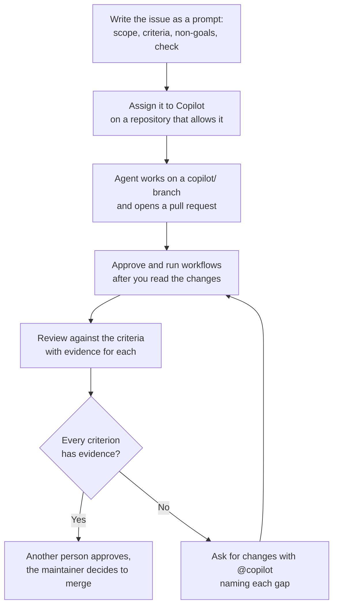

# Module 4.10: Assigning issues to the Copilot coding agent

**Audience:** Maintainers who have done Modules 2.1 and 3.5 and want to hand a
well-specified issue to an agent. Read Module 2.3 first if you have not written
acceptance criteria before.
**Format:** Self-paced — read and work through each step yourself. The exercise
needs agent access in the sandbox, and has a paper path for when you do not have
it. Facilitator-note callouts mark optional group activities.
**Timing:** ~40 min.

Module 3.5 explained what the Copilot coding agent is and said that nothing about
this team's review process changes because the author is an agent. Module 4.1
taught how to review what an agent wrote. This module covers the step before
that: writing an issue an agent can act on, handing it over, and running the
closure gate on the result. It does not repeat the review habits of Module 4.1 and
it does not cover installing an assistant (Module 0.8).


## Learning objectives

- Write an issue an agent can act on: scope, observable acceptance criteria,
  non-goals, and how to verify.
- Assign it, follow the pull request the agent opens, and tell what the agent can
  and cannot do with this repository's permissions and branch rules.
- Run the closure gate from Module 2.1 on the agent's pull request, with evidence
  for each criterion, and reject scope creep.

## What the vendor documentation says

**Source:** `skills/github-hygiene/SKILL.md`, `skills/github-pr-review/SKILL.md`

These facts were checked against GitHub's documentation on **2026-10-09**. The
product changes quickly, so re-check the pages in the table before you rely on a
detail. GitHub's documentation now calls the feature the **Copilot cloud agent**;
this team's pages, including Module 3.5, use the older name, **Copilot coding
agent**. They are the same feature.

| Topic | What the documentation says | Source |
| --- | --- | --- |
| Availability | Available features depend on your plan and organization policies. The cloud agent is not in the Free plan and is in the paid individual and organization plans (Pro, Pro+, Business and Enterprise among them). Repository owners and administrators can disable it for a particular repository even when the plan and policy allow it. | [GitHub: Copilot plans](https://docs.github.com/en/copilot/get-started/plans), [About the cloud agent](https://docs.github.com/en/copilot/concepts/agents/cloud-agent/about-cloud-agent) |
| How it is assigned | From an issue on GitHub.com (open **Assignees** and choose **Copilot**), from the agents panel, or from a chat. | [GitHub: Copilot cloud agent](https://docs.github.com/en/copilot/concepts/agents/coding-agent/about-coding-agent) |
| What it works on | It works only in the repository specified when you start a task, on one branch at a time, and opens one pull request per task. Each session has a maximum execution time of 59 minutes. | [About the cloud agent](https://docs.github.com/en/copilot/concepts/agents/cloud-agent/about-cloud-agent) |
| Branches and rules | It creates a `copilot/` branch and can only push to that branch. If a ruleset or branch protection rule is incompatible with the agent, access to the agent is blocked, and a repository administrator can add Copilot as a bypass actor to allow it. | [Risks and mitigations](https://docs.github.com/en/copilot/concepts/agents/cloud-agent/risks-and-mitigations), [About the cloud agent](https://docs.github.com/en/copilot/concepts/agents/cloud-agent/about-cloud-agent) |
| Network and input | Its internet access is restricted by a firewall. Hidden characters, such as HTML comments in an issue, are filtered out before the input reaches the agent. | [Risks and mitigations](https://docs.github.com/en/copilot/concepts/agents/cloud-agent/risks-and-mitigations) |
| Review and approval | "Your approval of a Copilot pull request won't count toward the required number. Another reviewer must approve the pull request before it can be merged." Ask for changes by mentioning `@copilot` in a comment, or push commits to the branch. | [GitHub: review Copilot pull requests](https://docs.github.com/en/copilot/how-tos/use-copilot-agents/cloud-agent/review-copilot-prs) |
| Workflows | By default, GitHub Actions workflows do not run automatically on Copilot's contributions: you click **Approve and run workflows** in the merge box after inspecting the changes. Take particular care with changes under `.github/workflows/`. | the same review page |
| Writing the issue | Think of the issue you assign as a prompt. A good one has a clear problem description, complete acceptance criteria, and directions on which files need changes. Suited tasks include bug fixes, test coverage, documentation updates and accessibility work; leave broad refactors, production and security issues, authentication, and ambiguous work to people. | [GitHub: get the best results](https://docs.github.com/en/copilot/tutorials/coding-agent/get-the-best-results) |

What was **not** checked: the cost of a task (premium requests and Actions
minutes), the exact wording and layout of the assignment dialog today, the names of
the organization policy settings, and whether the pull request opens as a draft in
every case. The assignment steps come from a search summary of GitHub's pages, not
from a page I read through, so confirm them in the interface.

## What is different about an issue an agent reads

**Source:** `skills/github-issue-first/SKILL.md`

Module 2.3 says an issue is a message to a reader with none of your context.
An agent is that reader taken to the limit: it has the issue, the repository, and
nothing else, and it will not ask what you meant. It fills each gap with a guess
and presents the guess as the result. A vague issue therefore produces a
pull request you cannot judge, because nothing says what done looks like.

Four things make an issue usable as a prompt:

| Part | What to write | What goes wrong without it |
| --- | --- | --- |
| **Scope** | The one change, and the file or place where it belongs | The agent picks the place, or touches several |
| **Acceptance criteria** | Observable outcomes you can check with evidence (Module 2.1) | "Done" is an opinion, and the closure gate has nothing to check |
| **Non-goals** | What must not change ("touch no other file") | A tidy-up, a reformat, or a rename arrives with the change |
| **How to verify** | The evidence you will look for: the diff, a test, a CI run | You cannot tell a claimed check from a real one |



What this shows: the loop is the same one a person's pull request goes through. The
agent only changes who writes the first draft; the issue is what you review it
against, and a person other than the requester still approves.

## Exercise: one vague issue, one specific issue

**Permissions:** you need the Write role on the sandbox repository, the Triage role
to label issues and set a milestone, and the Copilot cloud agent turned on for the
sandbox (your plan includes it and the repository allows it). If the sandbox needs an
approving review before a merge, you need a second person, because your own approval
of an agent pull request does not count. If you have no agent access, do the paper
path at the end of this section instead.

**Starting state:** `CONTRIBUTORS.md` exists on `main` in the sandbox, the sandbox
has its priority and category labels and an open milestone (as in Module 2.1), and no
issue titled "Update CONTRIBUTORS.md" or "Add a learning line to CONTRIBUTORS.md" is
open.

**Step 1: file the vague issue.** Title `Update CONTRIBUTORS.md`, body
`Make the contributors file better.` Add one priority label, one category label, and
the milestone, as Module 2.1 taught.

**Step 2: file the specific issue.** Title
`CONTRIBUTORS.md has no line saying what each person is learning`, with this body
(replace `<your name>`):

```text
What's wrong: CONTRIBUTORS.md lists names but not what each person is learning.
Scope: add one line for <your name> at the end of CONTRIBUTORS.md, in the form
"<your name> - learning how to hand an issue to an agent". One file only.

- [ ] CONTRIBUTORS.md contains exactly one new line, and it names <your name>.
- [ ] No file other than CONTRIBUTORS.md is changed.
- [ ] The existing lines in CONTRIBUTORS.md are unchanged.

Non-goals: no reformatting, no sorting, no other files.
How to verify: the pull request's "Files changed" tab shows one file and one
added line; the CI run, once approved, is green.
```

Add the same labels and milestone.

**Step 3: assign both to Copilot.** On each issue, open **Assignees** and choose
**Copilot**. Wait for each pull request to appear; a session can take several
minutes and has a 59 minute limit.

**Step 4: compare the two pull requests.** For each one, write down: the files
changed, whether the description's claims match the diff, and, for each acceptance
criterion, what evidence exists. For the vague issue, write down what you *would*
have checked, and notice that you cannot.

**Step 5: run the closure gate on the better pull request.** Click **Approve and run
workflows** only after you have read the diff, and check that nothing under
`.github/workflows/` changed. Make sure the pull request body says `Refs #<N>`, not
`Closes #<N>`. Write one evidence comment per criterion on the issue (the diff, the
CI run). Ask another person to approve it if the sandbox requires an approval.
Switch the body to `Closes #<N>` only when every criterion has evidence, then merge.

**Step 6: audit the issue.** After the merge, check the issue's state and
criteria, as in Module 2.1. If it closed while a criterion has no evidence, reopen it
and record why.

**Success state:** the specific issue's pull request changed one file and added one
line, each of its three criteria has an evidence comment, and the issue is closed with
the evidence recorded; you can say, in one sentence each, why the vague issue's pull
request could not be judged and which of the four issue parts would have fixed that.

**Likely errors:**

- **Copilot is not in the Assignees list:** your plan, the organization policy, or the
  repository setting does not allow it, or the repository has a rule that blocks it
  (a repository administrator can add Copilot as a bypass actor). Ask the sandbox
  owner, or do the paper path.
- **The pull request has no checks:** workflows do not run on the agent's work until
  you click **Approve and run workflows**. Read the diff first.
- **You cannot approve the pull request:** you asked for it, so your approval does not
  count. Ask someone else.
- **The vague issue's pull request touches several files, or none:** that is the
  point of the comparison, not a fault in the exercise.
- **The agent stops or asks a question in the pull request:** answer by mentioning
  `@copilot`, or close the pull request and rewrite the issue more tightly.
- **The issue closed when the pull request merged:** it was linked to a branch. Audit
  its criteria and reopen it if one has no evidence (Module 2.1).

**Cleanup:** close the vague issue's pull request without merging and delete its
`copilot/` branch, close the vague issue with a one-line comment saying it was the
comparison case, delete the specific issue's branch after the merge, and remove
yourself and Copilot as assignees from any issue you leave open.

> **Facilitator note (optional group activity):** before anyone assigns anything, have
> pairs swap their specific issues and say what an agent would have to guess. Every
> guess is a missing criterion or non-goal.

### The paper path, without agent access

Use this when Copilot is not available to you. Two invented pull requests, one for
each issue above:

- **Pull request for the vague issue.** Files changed: `CONTRIBUTORS.md`,
  `README.md`. In `CONTRIBUTORS.md` the lines are sorted alphabetically and a heading
  is added; in `README.md` a sentence is reworded. Description: "Improved the
  contributors file and tidied the README. All checks pass."
- **Pull request for the specific issue.** Files changed: `CONTRIBUTORS.md` with one
  added line naming the person. Description: "Added one line to CONTRIBUTORS.md.
  Refs #41." Checks: not yet run, waiting for approval to run workflows.

Write the evidence table for the specific issue's three criteria, say what is still
missing before `Closes` is allowed, and say why the first pull request cannot be
judged at all.

### Model answer

The vague issue has no criteria, so its pull request has nothing to be judged
against: sorting the list and rewording the README may each be fine or unwanted, and
the issue cannot say. That is a failure of the issue, not only of the agent.

For the specific issue:

| Criterion | Evidence | Status |
| --- | --- | --- |
| One new line naming the person | the diff of `CONTRIBUTORS.md` | met once you read the diff |
| No other file changed | the **Files changed** tab lists one file | met |
| Existing lines unchanged | the diff shows one added line and no removed ones | met |

What is missing before `Closes`: the CI run has not run, because workflows need
**Approve and run workflows**, and a reviewer other than the requester has to approve.
"All checks pass" in a description is a claim, not evidence (Module 4.1). Merging
stays the maintainer's decision.

## Self-check

Answer in your own words. A good answer is given after each question.

- Why does a vague issue produce a pull request you cannot judge? *(No criteria say
  what done looks like, so every choice the agent made is a guess you cannot check.)*
- What are the four parts of an issue written as a prompt? *(Scope, acceptance
  criteria, non-goals, and how to verify.)*
- You asked Copilot for the pull request and it looks right. Can you approve it so it
  merges? *(Your approval does not count toward the required number; another reviewer
  must approve, and merging is still the maintainer's call.)*

Not confident on any of these? Re-read the relevant section above.

## Feedback

Something unclear, wrong, or worth improving on this page? Open a
Discussion in this repo (**Ideas** category). Concrete, actionable
feedback gets converted into a tracked issue, per this repo's own
issue-first convention — see `skills/github-issue-first/SKILL.md`'s
Discussions section.

---

Next: [Module 4.1: Reviewing changes an AI agent wrote](module-4-1-reviewing-changes-an-ai-agent-wrote.md)
for the review habits, or back to the [next-step plan](module-plan.md).
