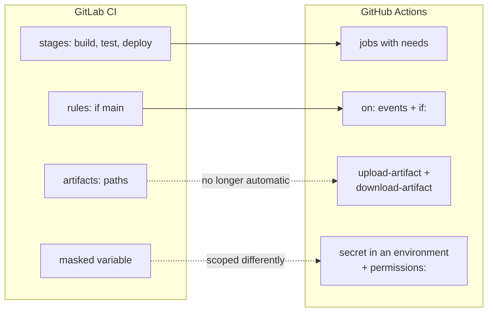

# Module 4.12: Moving a GitLab pipeline to GitHub Actions

**Audience:** Anyone on a team that uses GitLab CI today and is moving to
GitHub, who has done [Module 0.4](../0_prerequisites/module-0-4-coming-from-gitlab.md),
Module 1.1, and Module 3.5. Conditional: skip it if you are not coming from
GitLab.
**Format:** Self-paced — read and work through each step yourself. Facilitator-note
callouts mark optional group activities.
**Timing:** ~40 min.

Module 0.4 and the `github-for-gitlab-users` skill both say the same thing: a
`.gitlab-ci.yml` is a pipeline rewrite, not a file rename. Module 3.5 explained
what a workflow is. This module teaches the rewrite itself, on a pipeline small
enough to hold in your head: its stages, a variable, a masked token, and a deploy
job that must only run on `main`.


## Learning objectives

- Map a small GitLab pipeline (stages, variables, a deploy job with rules) onto a
  GitHub Actions workflow, and say what each part became.
- Choose the triggers (`on:`), the job order (`needs:`), and the least-privilege
  `permissions:` for the workflow, instead of copying GitLab's defaults.
- Move a variable and a masked token to Actions variables and secrets, and say who
  can read each one.
- Read a failed run's log and find the cause before changing anything.

## What the vendor documentation says

**Source:** `skills/github-for-gitlab-users/SKILL.md`

These facts were checked against the official GitHub and GitLab documentation on
**2026-10-09**. Vendor products change, so re-check the pages in the table before
you plan real work.

| Topic | What the documentation says | Source |
| --- | --- | --- |
| Migration tooling | GitHub Actions Importer can read a GitLab project and convert pipelines. Its commands are `audit`, `forecast`, `dry-run` and `migrate`; `dry-run` writes the workflow YAML and opens nothing, `migrate` opens a pull request. `audit` needs an organization account. It needs Docker, the GitHub CLI, a GitHub classic token with the `workflow` scope, and a GitLab token with the `read_api` scope. | [GitHub: migrate from GitLab with Actions Importer](https://docs.github.com/en/actions/tutorials/migrate-to-github-actions/automated-migrations/gitlab-migration) |
| What it does not finish | `stages`, `needs`, `variables`, `script` and `image` convert as supported. `rules`, `only`/`except` and `environment` are only partly supported. Masked project or group variable values and artifact reports must be migrated by hand. Automatic caching between jobs of different workflows is not supported. | the same page |
| Concept mapping | `script` becomes `run`; `image` becomes `container`; `rules` becomes `if`; stage order is rebuilt with `needs`; `cache` becomes the `actions/cache` action; `artifacts` becomes `actions/upload-artifact`. | [GitHub: migrate from GitLab CI/CD](https://docs.github.com/en/actions/tutorials/migrate-to-github-actions/manual-migrations/migrate-from-gitlab-cicd) |
| Job order | GitLab: "Jobs in the same stage run in parallel. Jobs in the next stage run after the jobs from the previous stage complete successfully." GitHub: jobs listed in `needs` must complete successfully before the dependent job runs. | [GitLab CI/CD YAML reference](https://docs.gitlab.com/ci/yaml/), [GitHub workflow syntax](https://docs.github.com/en/actions/reference/workflows-and-actions/workflow-syntax) |
| Sharing files between jobs | GitLab: "By default, later jobs fetch a copy of all artifacts from jobs in earlier stages." GitHub: use `upload-artifact` and `download-artifact` to share data between jobs. | [GitLab job artifacts](https://docs.gitlab.com/ci/jobs/job_artifacts/), [GitHub: store and share data](https://docs.github.com/en/actions/tutorials/store-and-share-data) |
| Variables and secrets | GitLab variables exist at project, group and instance level, with protected (only on protected branches or tags) and masked options. GitHub secrets and variables exist at repository, environment and organization level; environment secrets reach a job only if the job names the environment. A variable is not masked in logs, a secret is. | [GitLab CI/CD variables](https://docs.gitlab.com/ci/variables/), [GitHub: use secrets](https://docs.github.com/en/actions/how-tos/write-workflows/choose-what-workflows-do/use-secrets), [GitHub: use variables](https://docs.github.com/en/actions/how-tos/write-workflows/choose-what-workflows-do/use-variables) |
| Secret limits and forks | A secret is limited to 48 KB; up to 100 per repository and per environment, up to 1,000 per organization. Secrets, except `GITHUB_TOKEN`, are not passed to the runner when a workflow is triggered from a forked repository. | [GitHub: secrets reference](https://docs.github.com/en/actions/reference/security/secrets), [GitHub: use secrets](https://docs.github.com/en/actions/how-tos/write-workflows/choose-what-workflows-do/use-secrets) |
| Token permissions | The `permissions` key modifies the access of `GITHUB_TOKEN` for a workflow or a single job. If you specify the access for any permission, all permissions you do not specify are set to `none`. | [GitHub workflow syntax](https://docs.github.com/en/actions/reference/workflows-and-actions/workflow-syntax) |

What was **not** checked: the exact default `GITHUB_TOKEN` permissions for your
organization (they are set in its settings, so look there), plan-specific limits on
Actions minutes and concurrency, and how the Importer behaves on a pipeline that
uses `include:` templates or `workflow:rules`. The GitHub Actions Importer page
does not promise a complete conversion, and neither does this module.

## The mapping, in one picture



What this shows: three of the four ideas have a near neighbour. The two dotted
arrows are where a straight translation goes wrong: GitLab passes artifacts to later
jobs for you, and GitHub does not; and a masked variable is not the same boundary as
a secret.

## Three things that change meaning

**1. Triggers are events, not pipeline rules.** A GitLab pipeline is created for a
commit and its jobs then choose themselves with `rules:`. A workflow starts only
when an event in its `on:` list happens (`push`, `pull_request`, a schedule, a manual
run), and `if:` then filters a job. A pipeline that "ran on every merge request" does
not run on pull requests until you add `pull_request` to `on:`.

**2. A job starts on a fresh machine.** In GitLab, a job in a later stage receives
the artifacts of earlier stages without being asked. In Actions each job starts on its
own clean runner (Module 3.5), so a file one job wrote is gone unless it is uploaded
and downloaded again. This is the most common reason a mechanically translated
pipeline fails on its first run.

**3. Secrets are scoped by repository, environment and organization.** A GitLab
variable can be protected so that only protected branches see it. In GitHub the
comparable boundary is an **environment**: put the deploy token in an environment
secret, and only a job that names that environment can read it. Fork pull requests do
not receive secrets at all, so a workflow that needs one cannot run the same way on a
fork.

## Exercise: translate a pipeline and fix it from the log

**Permissions:** you need the Write role on the sandbox repository (you push a
branch and open a pull request), and permission to create an environment and a secret
on it. If you cannot create environments, ask whoever manages the sandbox; do not
use a real credential in its place.

**Starting state:** a clean `main` in your local clone of the sandbox, no
`.github/workflows/` file named `pipeline.yml`, and no environment called `staging`.
This is the GitLab pipeline you are translating. It is invented; nothing in it
deploys anywhere real:

```yaml
stages: [build, test, deploy]

variables:
  APP_NAME: hello-app

build-job:
  stage: build
  script:
    - mkdir -p dist
    - echo "Built $APP_NAME" > dist/app.txt
  artifacts:
    paths: [dist/]

test-job:
  stage: test
  script:
    - grep -q "Built" dist/app.txt

deploy-job:
  stage: deploy
  script:
    - test -n "$DEPLOY_TOKEN" && echo "Would deploy $APP_NAME"
  rules:
    - if: '$CI_COMMIT_BRANCH == "main"'
  environment: staging
```

`DEPLOY_TOKEN` is a masked project variable in GitLab.

**Step 1: plan before you type.** On paper, write one line for each of the four
things in the picture: what replaces `stages`, `rules`, `artifacts`, and the masked
variable. Then decide the workflow's `permissions:` (this pipeline only reads code,
so `contents: read` is enough).

**Step 2: set up the environment.** In the sandbox repository, go to
**Settings → Environments → New environment**, name it `staging`, and add a secret
named `DEPLOY_TOKEN` with the value `not-a-real-token`.

**Step 3: write the first translation, exactly as a rename-minded person would.**
Create a branch `module-4-12-<your-name>` and add `.github/workflows/pipeline.yml`:

```yaml
name: pipeline
on:
  push:
    branches: [main]
  pull_request:
permissions:
  contents: read
env:
  APP_NAME: hello-app
jobs:
  build:
    runs-on: ubuntu-latest
    steps:
      - uses: actions/checkout@v4
      - run: |
          mkdir -p dist
          echo "Built $APP_NAME" > dist/app.txt
      - uses: actions/upload-artifact@v4
        with:
          name: dist
          path: dist/
  test:
    needs: build
    runs-on: ubuntu-latest
    steps:
      - run: grep -q "Built" dist/app.txt
  deploy:
    needs: test
    if: github.ref == 'refs/heads/main'
    runs-on: ubuntu-latest
    environment: staging
    steps:
      - env:
          DEPLOY_TOKEN: ${{ secrets.DEPLOY_TOKEN }}
        run: test -n "$DEPLOY_TOKEN" && echo "Would deploy $APP_NAME"
```

Push the branch and open a pull request. The `test` job fails; that is deliberate.

**Step 4: read before you change.** Open the pull request's **Checks** tab, then the
failed `test` job, and read the log from the top. Write down, before touching the
file: which step failed, the exact error line, and what you think caused it. Do not
re-run the job and do not edit anything yet.

**Step 5: fix the cause, not the symptom.** Make the file available in the `test`
job by adding a `download-artifact` step before `grep` (with `name: dist` and
`path: dist/`), then push. Check that `build` and `test` pass. The `deploy` job is
skipped on the pull request because of its `if:`, which is what you want.

**Step 6: confirm the deploy job's boundary.** Merge the pull request (in the
sandbox you merge your own, as in Module 1.1; in a real repository merging is the
maintainer's call). On `main`, check that `deploy` runs, that its log shows the line
`Would deploy hello-app`, and that the token's value is not printed.

**Success state:** the workflow passes on the pull request with `deploy` skipped and
on `main` with `deploy` running; your Step 4 notes name the failed step, the error
line, and the cause (the file was not there on the fresh runner) *before* the fix;
and you can say what each of the four GitLab ideas became.

**Likely errors:**

- The `test` job fails with `grep: dist/app.txt: No such file or directory`. That is
  the deliberate failure. Read it, then do Step 5.
- The `deploy` job waits forever or fails on approval: the `staging` environment has a
  required reviewer. Remove the protection rule in the sandbox, or approve the run.
- `deploy` runs but the token test fails: the secret is on the repository, not the
  `staging` environment, or its name differs (names use letters, digits and
  underscores only, and are case-insensitive). Check both.
- You copy a real credential into `DEPLOY_TOKEN`: stop, delete the secret, and
  rotate that credential (see Module 3.4). Use the placeholder value only.
- Nothing runs on the pull request: the file is not in `.github/workflows/`, or
  `pull_request` is missing from `on:`.

**Cleanup:** close the pull request without merging if you did not merge it, delete
your `module-4-12-<your-name>` branch (`git push origin --delete module-4-12-<your-name>`
and `git branch -D module-4-12-<your-name>`), delete the `staging` environment
and its secret, and remove `.github/workflows/pipeline.yml` from `main` if you merged
it.

> **Facilitator note (optional group activity):** before anyone fixes it, have
> pairs read the failed log aloud and say the cause in one sentence. The usual wrong
> answers ("the grep is wrong", "re-run it") show who read the log and who guessed.

### Model answer

The four lines from Step 1:

- `stages: [build, test, deploy]` became three jobs ordered with `needs: build` and
  `needs: test`. Without `needs`, the jobs would run in parallel.
- `rules: if main` became `if: github.ref == 'refs/heads/main'` on the deploy job,
  while `on:` decides which events start the workflow at all.
- `artifacts: paths: [dist/]` became an `upload-artifact` step in `build` and a
  `download-artifact` step in `test`, because each job runs on a clean machine.
- The masked `DEPLOY_TOKEN` became a secret on the `staging` environment, read by
  the `deploy` job because that job names the environment.

The failure: the `test` job's log shows the checkout, then `grep: dist/app.txt: No such
file or directory`. The cause is not the grep. The `build` job wrote `dist/app.txt` on
its own runner, and the `test` job started on a fresh one. The fix is the missing
download step.

## When the Importer helps, and when it does not

GitHub Actions Importer is worth running as a starting point on a larger pipeline:
`audit` shows how much of an organization's CI it can handle, and `dry-run` writes a
workflow you can read without opening anything. Treat its output as a draft, not an
answer. The documentation lists `rules`, `only`/`except` and `environment` as partly
supported and masked variables and artifact reports as manual work, so the three
things this module teaches are exactly what you must still check by hand. There is
still no reliable one-to-one converter, which is why the rewrite is budgeted as real
work (see the `github-for-gitlab-users` skill).

## Self-check

Answer in your own words. A good answer is given after each question.

- A job in a later GitLab stage reads a file the build job made, and it works. The
  same job fails in Actions. Why? *(GitLab passes earlier artifacts on by default; an
  Actions job starts on a fresh runner and must download what an earlier job
  uploaded.)*
- What replaces GitLab's `rules:` on a deploy job? *(`on:` chooses which events start
  the workflow, and `if:` on the job filters it, for example by branch.)*
- Where do you put a deploy token, and what do you do first when a job fails? *(In a
  secret on the environment the deploy job names; read the failed log from the top
  and find the cause before editing or re-running.)*

Not confident on any of these? Re-read the relevant section above.

## Feedback

Something unclear, wrong, or worth improving on this page? Open a
Discussion in this repo (**Ideas** category). Concrete, actionable
feedback gets converted into a tracked issue, per this repo's own
issue-first convention — see `skills/github-issue-first/SKILL.md`'s
Discussions section.

---

Next: back to the [next-step plan](module-plan.md) for what else is outlined, or
to [Module 3.5](../3_advanced/module-3-5-actions-runners-and-agents.md) for the
runner model this module relies on.
