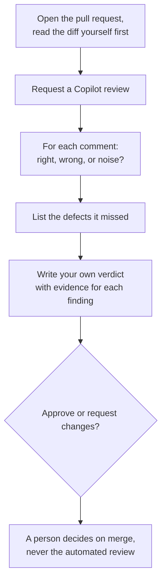

# Module 4.9: Using Copilot as a pull request reviewer

**Audience:** Reviewers and authors who have done Modules 2.2 and 3.5 and want an
automated first-pass review before a person looks.
**Format:** Self-paced — read and work through each step yourself. The exercise
needs Copilot code review in the sandbox, and has a paper path for when you do not
have it. Facilitator-note callouts mark optional group activities.
**Timing:** ~30 min.

Module 2.2 taught how a review works and that approving is not merging. Copilot can
now leave a first-pass review on a pull request before any person opens it. That is
useful when you read it critically and harmful when you let it stand in for the
review. This module teaches how to ask for one, how to judge what comes back, how to
make it follow this team's conventions, and where it stops: it is input to your
verdict, never the verdict and never the merge approval.


## Learning objectives

- Request a Copilot review on a pull request and read its comments critically.
- Tell a useful finding from noise or a confident wrong answer, and list what it
  missed.
- Write repository custom instructions so the review follows the team's conventions,
  and know where Copilot reads them from.
- Keep the rule: an automated review is input to your verdict, never the verdict or
  the merge approval.

## What the vendor documentation says

**Source:** `skills/github-pr-review/SKILL.md`

These facts were checked against GitHub's documentation on **2026-10-09**. The
product changes quickly, so re-check the pages in the table before you rely on a
detail.

| Topic | What the documentation says | Source |
| --- | --- | --- |
| Plans and surfaces | Available with the paid Copilot plans (Pro, Pro+, Business and Enterprise among them). Organizations can enable it for members without a Copilot license if they meet the policy requirements. It is offered on GitHub.com, GitHub CLI, GitHub Mobile, VS Code, Visual Studio, Xcode and JetBrains IDEs, and in public preview for Azure DevOps. | [GitHub: Copilot code review](https://docs.github.com/en/copilot/concepts/agents/code-review) |
| What it reviews | It reviews pull requests and the code changes within them. The documentation does not describe reviewing an issue, so do not plan on it. | the same page |
| Requesting a review | On a pull request, open **Reviewers** in the right sidebar and choose Copilot with **Request**. A review typically finishes in under 30 seconds. Comments are labeled **High**, **Medium** or **Low**. | [GitHub: use Copilot code review](https://docs.github.com/en/copilot/how-tos/use-copilot-agents/request-a-code-review/use-code-review) |
| It is not an approval | "By default, Copilot leaves a 'Comment' review, not an 'Approve' review or a 'Request changes' review." Its reviews do not count toward required approvals, even when approvals are required. | both pages above |
| It can be wrong | "Copilot is not guaranteed to spot all problems or issues in a pull request. Sometimes it will make mistakes. Always validate Copilot's feedback carefully." | the code review page |
| Re-review | After new commits you must request a re-review yourself (the refresh icon beside Copilot in **Reviewers**). "Copilot may repeat the same comments again, even if they have been dismissed." | the use-code-review page |
| Suggested changes | You can accept a suggestion, batch several into one commit, or choose **Fix with Copilot** to hand a comment to the Copilot cloud agent (Module 4.10), which can commit to the pull request or open a new one. | the use-code-review page |
| Custom instructions | Repository-wide instructions go in `.github/copilot-instructions.md`. Path-specific instructions go in `.github/instructions/NAME.instructions.md` with an `applyTo` glob in the frontmatter; an optional `excludeAgent` keyword excludes a file from `"code-review"` or `"cloud-agent"`. Organization instructions are supported for Copilot code review on GitHub.com. | [GitHub: repository custom instructions](https://docs.github.com/en/copilot/how-tos/configure-custom-instructions/add-repository-instructions), [response customization](https://docs.github.com/en/copilot/concepts/prompting/response-customization) |
| Where instructions are read from | "When reviewing a pull request, Copilot reads repository custom instructions, agent instructions, and agent skills from the head branch" (the branch with the changes), so a change to the instructions can be tested in the same pull request. | the response customization page |
| Drafts and automatic reviews | Copilot can review a draft pull request if configured. Organizations can turn on automatic reviews for all pull requests, and people can for their own. | the code review page |

What was **not** checked: what a review costs (premium requests), whether any
character limit applies to instruction files (the pages read state none, but another
page may), how the IDE and command-line surfaces behave, the names of the
organization policy settings, and the exact plan names today. Some pages were read
through a summarising fetch.

## Reading a Copilot review critically

A Copilot comment is one of four things, and your job is to sort them:

| Judgment | What it means | What you do |
| --- | --- | --- |
| **Right** | It names a real defect, or a real risk | Keep it, and say what the fix is |
| **Wrong** | It is mistaken, or confidently asserts something false | Dismiss it with a reason, once, in a reply |
| **Noise** | True but harmless, or a style choice this team does not enforce | Dismiss it, and consider telling Copilot through the instructions file |
| **Missing** | A real defect it did not mention | Add your own comment; the lack of a comment is not evidence of no problem |

The last row is the one people forget. A review with three comments and no mention
of a fourth defect looks thorough, and it is not. The severity label (High, Medium,
Low) is Copilot's guess about importance, and you may rank it differently.



What this shows: you read the diff before you read Copilot's account of it, you judge
every comment and list what is missing, and the verdict is yours. The automated review
feeds step E, and nothing else.

## Instructions, and a pull request that can change them

**Source:** `skills/github-pr-review/SKILL.md`

An instructions file turns your team's conventions into things Copilot checks. A few
short lines work better than a long document: say what to flag, what to ignore, and how
to word a finding. For example:

```text
Flag any loop whose bound can read past the end of an array.
Flag any function that accepts a number but does not check its range.
Do not comment on the length of parameter names or on quote style.
```

Because Copilot reads the instructions file from the pull request's head branch, a
pull request that edits `.github/copilot-instructions.md` changes how that very pull
request is reviewed. That is useful for testing an instruction and it is also a reason
to review the instructions file like any other change, with the same care you give
a workflow file (Module 3.5): a one-line "ignore security comments" in an author's own
branch would quiet the review of that branch. This is a consequence of where the
documentation says the file is read from, so confirm it on your own repository before
you rely on it.

## Exercise: judge a Copilot review against known defects

**Permissions:** you need the Write role on the sandbox repository, and Copilot code
review available to you there (your plan or organization includes it, and nothing in
the repository blocks it). You do not need approval rights, because you do not merge
this pull request. If you do not have Copilot review, do the paper path at the end of
this section.

**Starting state:** a clean `main` in your local clone of the sandbox, no file
`src/price.js`, and no branch named `module-4-9-<your-name>`.

**Step 1: plant the defects and write the answer key first.** Create the branch
`module-4-9-<your-name>` and add `src/price.js`:

```js
export function applyDiscount(price, p) {
  return price - price * p / 100;
}

export function totalWithTax(prices, r) {
  let total = 0;
  for (let i = 0; i <= prices.length; i++) {
    total += prices[i];
  }
  return total * (1 + r);
}
```

Before you request any review, write your answer key: **defect 1**, the loop bound
`<=` reads one step past the end, so the total is `NaN`; **defect 2**, `applyDiscount`
does not check `p`, so a discount over 100 gives a negative price; and one **harmless
choice**, the one-letter parameter names `p` and `r`. Commit the file, push the
branch, and open a pull request titled `Add price helpers (module 4.9 practice, do not
merge)`.

**Step 2: request the review.** On the pull request, open **Reviewers** and choose
Copilot with **Request**. Wait for it to finish.

**Step 3: judge every comment.** For each Copilot comment, write one line: right,
wrong or noise, and the evidence (the line, and what it does). Then list the defects
from your answer key that no comment mentioned: those are missing.

**Step 4: add one instruction and ask again.** On your branch add
`.github/copilot-instructions.md` with the three lines above, push, and request a
re-review with the refresh icon. Note what changed: new comments, fewer comments, or
the same ones repeated. Do not assume it improved; compare it with your answer key.

**Step 5: give your own verdict.** Write a review as Module 2.2 taught: request
changes, with each finding and its evidence, as if you had to justify it to the
author. Say in one sentence why Copilot's review was not the verdict. Do not
approve and do not merge.

**Success state:** you have a table of every Copilot comment judged right, wrong or
noise with evidence, a list of what it missed, a note on what the instructions file
changed, and a written verdict of your own that does not rely on Copilot's review
as its reason.

**Likely errors:**

- **Copilot does not appear under Reviewers:** your plan, the organization policy or
  the repository setting does not allow it. Ask the sandbox owner or do the paper path.
- **The review says nothing about one of the defects:** that is the *missing* case,
  not an error. Record it.
- **The re-review repeats a comment you already dismissed:** the documentation says
  this can happen. Reply once with your reason and move on.
- **Copilot confidently proposes a wrong fix:** do not accept the suggestion because
  it is one click. Check it against the code first, then dismiss it with a reason.
- **You cannot tell whether a comment is right:** run the code, or write the failing
  input. A comment you cannot check is not yet a finding.
- **You treat "no High comments" as approval:** severity is a guess, and the review
  is never an approval. Go back to your answer key.

**Cleanup:** close the pull request without merging, delete the branch locally
(`git branch -D module-4-9-<your-name>`) and on the remote
(`git push origin --delete module-4-9-<your-name>`), and remove
`.github/copilot-instructions.md` if it somehow reached `main`.

> **Facilitator note (optional group activity):** have each person judge the same
> Copilot review separately, then compare. The disagreements are usually about whether
> a comment is wrong or only noise, which is exactly the judgment the module trains.

### The paper path, without Copilot review

Use this when Copilot review is not available to you. Take the code from Step 1 and the
answer key you wrote. Here is an invented Copilot review of it:

1. **High**, `totalWithTax`: "The loop condition `i <= prices.length` reads past the
   end of the array; use `<`."
2. **Medium**, `applyDiscount`: "The parameter names `p` and `r` are not descriptive;
   rename them."
3. **Low**, `totalWithTax`: "`1 + r` is wrong: the tax should be added as `total + r`,
   not multiplied."

Judge each comment right, wrong or noise, list what is missing, and write your own
verdict.

### Model answer

- **Comment 1: right.** It matches defect 1: the last iteration reads `undefined`, and
  the total becomes `NaN`. The fix is `<`.
- **Comment 2: noise.** The one-letter names are the harmless choice in your answer
  key. A rename is a style preference this team can ignore, or silence in the
  instructions file.
- **Comment 3: wrong, and confident.** `total * (1 + r)` is the usual way to add a
  percentage rate; `total + r` would add the rate as an amount. Accepting this
  suggestion would introduce a defect. Dismiss it with that reason.
- **Missing:** defect 2. Nothing in the review says `applyDiscount` returns a negative
  price when `p` is over 100. A quiet review is not a clean one.

Verdict: **request changes**: fix the loop bound, validate `p`, and add a test for each.
The automated review contributed one right finding, and the rest of the verdict came
from reading the diff against the answer key. Merging is the maintainer's decision.

## Self-check

Answer in your own words. A good answer is given after each question.

- Copilot's review shows no High comments. Can you approve on that basis? *(No: its
  review is a comment review and does not count toward required approvals, severity is
  a guess, and it can miss defects. The verdict is yours.)*
- What are the four things a Copilot comment can turn out to be? *(Right, wrong,
  noise, or, for what it left out, missing.)*
- Where does Copilot read the instructions file from during a review, and why does that
  matter? *(From the pull request's head branch, so a pull request can change how it is
  itself reviewed; review the instructions file like any other change.)*

Not confident on any of these? Re-read the relevant section above.

## Feedback

Something unclear, wrong, or worth improving on this page? Open a
Discussion in this repo (**Ideas** category). Concrete, actionable
feedback gets converted into a tracked issue, per this repo's own
issue-first convention — see `skills/github-issue-first/SKILL.md`'s
Discussions section.

---

Next: [Module 4.1: Reviewing changes an AI agent wrote](module-4-1-reviewing-changes-an-ai-agent-wrote.md)
for the habits that apply when the author is an agent, or back to the
[next-step plan](module-plan.md).
