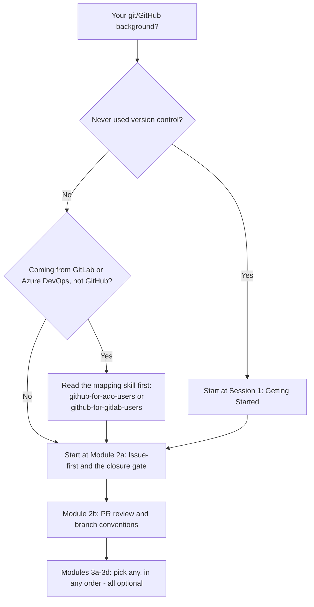
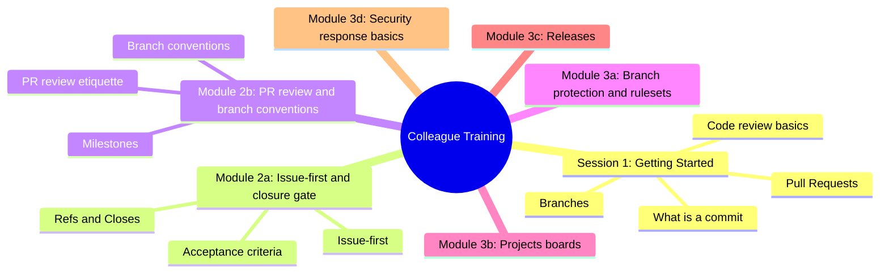

# Colleague GitHub Training Program

This is training material **for people** — colleagues learning how to use
GitHub and how this team specifically works. It's a different surface from
`skills/*/SKILL.md`, which teaches an AI coding agent the same workflow.
Where this program describes a policy the skills already state precisely
(the closure gate, issue-first, branch conventions), it points at the
relevant skill file by name rather than restating it, so the two can't
silently drift apart.

## Where do I start?

What this shows: how your existing background routes you to the right
starting point — nobody needs to sit through material for a background
they don't have.

| Background | Start here |
| --- | --- |
| Never used version control | [Session 1: Getting Started](beginners/session-1-getting-started.md) |
| Some git knowledge, new to this team's process | [Module 2a: Issue-first and the closure gate](intermediate/module-2a-issue-first-and-closure-gate.md) |
| Already know GitLab or Azure DevOps, not GitHub | Read `skills/github-for-ado-users/SKILL.md` (Azure DevOps) or `skills/github-for-gitlab-users/SKILL.md` (GitLab) as pre-reading, then [Module 2a](intermediate/module-2a-issue-first-and-closure-gate.md) |

Modules 2a and 2b build on each other — do 2a first. Modules 3a-3d are
each independent and optional; read any subset, in any order, based on
what's relevant to you. Each module is sized to fit a single sitting
(15-40 minutes) rather than blocking out a full session.

This program is primarily self-paced: work through it solo, at your own
pace, with the modules above as your only guide. A facilitator-led session
is still fully supported — modules mark optional group activities inline,
so either mode works from the same files. Modules 2a, 2b, 3a and 3b
include hands-on steps in a shared **sandbox practice repo** (a throwaway
repo set up for exactly this purpose, never a real project). Ask your
team's facilitator or onboarding buddy for access to it before you start
one of those modules — `education/facilitator-guide.md` has their setup
checklist if you're the one setting it up.

## What's covered

What this shows: the topic areas across all six modules, at a glance, so
you can judge which Module 3 topics are relevant to you without reading
their full content.

## Materials

- [Session 1: Getting Started](beginners/session-1-getting-started.md) — ~60 min, hands-on, no prior experience needed.
- [Module 2a: Issue-first and the closure gate](intermediate/module-2a-issue-first-and-closure-gate.md) — ~40 min, this team's core workflow habit.
- [Module 2b: PR review and branch conventions](intermediate/module-2b-pr-review-and-branch-conventions.md) — ~35 min, review etiquette and branch/milestone conventions.
- [Module 3a: Branch protection and rulesets](advanced/module-3a-branch-protection-and-rulesets.md) — ~25 min, optional.
- [Module 3b: Projects boards](advanced/module-3b-projects-boards.md) — ~20 min, optional.
- [Module 3c: Releases](advanced/module-3c-releases.md) — ~25 min, optional.
- [Module 3d: Security response basics](advanced/module-3d-security-response.md) — ~15 min, optional.
- [Cheat sheet](cheat-sheet.md) — one page, take it with you.
- [Facilitator guide](facilitator-guide.md) — for the superuser running a session, not attendees.
