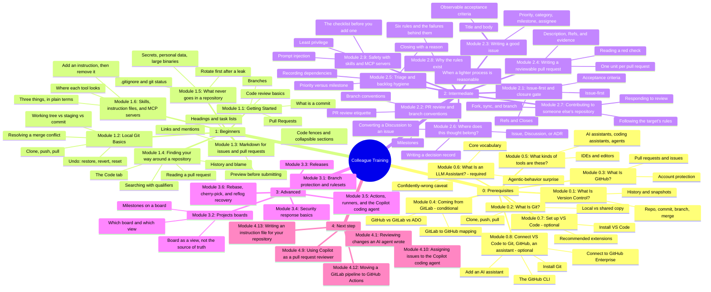

# Colleague GitHub Training Program

This is training material **for people** — colleagues learning how to use
GitHub and how this team specifically works. It's a different surface from
`skills/*/SKILL.md`, which teaches an AI coding agent the same workflow.
Where this program describes a policy the skills already state precisely
(the closure gate, issue-first, branch conventions), it points at the
relevant skill file by name rather than restating it, so the two can't
silently drift apart. Moving or releasing `education/` on its own means
bundling the specific skill files it references alongside it, not copying
this repo's `skills/` folder wholesale or rewriting their content into
education prose — see ADR 0008. `node scripts/package-education.mjs --out
<folder>` builds that bundle, with a manifest of versions, licence, source
commit, and file hashes (ADR 0013).

**Folder numbers signal reading order** (per ADR 0009, refining ADR 0007):
`0_prerequisites/` → `1_beginners/` → `2_intermediate/` → `3_advanced/`.
`0_prerequisites/` holds required reading (Modules 0.1 to 0.3 on version
control, Git and GitHub, Module 0.5 on the kinds of tools, and Module 0.6 on LLM
assistants — most colleagues use an AI coding assistant, so that page is no
longer optional) plus three conditional pages (Module 0.4 for teams moving from
GitLab, and Modules 0.7 and 0.8 to set up VS Code, Git, GitHub and an AI
assistant, only if you don't already have them). [`4_next-step/`](4_next-step/module-plan.md) holds a plan for content beyond
Module 3.6, and the modules built from it so far, Modules 4.1, 4.9, 4.10, 4.12 and 4.13. `examples/`,
`cheat-sheet.md`, and `facilitator-guide.md` sit outside the numbered
sequence — lookup references, not steps to work through in order.

**Tools:** for now, all Git activity in this program is done in **VS Code or on
the command line**. Every lesson and exercise assumes one of those two. GitHub
Desktop and other Git clients are deliberately not covered (maintainer decision,
issue #178), so if you use one, switch to VS Code or the command line while
you work through the program.

## Where do I start?

What this shows: how your existing background routes you to the right
starting point — nobody needs to sit through material for a background
they don't have. Modules 0.5 (kinds of tools) and 0.6 (LLM assistants) are
required for everyone, regardless of background, which is why every branch below
converges into them before Module 1.1.

```mermaid
flowchart TD
    Start[Your git/GitHub background?] --> Q1{Never used version control,<br/>or want the vocabulary lined up first?}
    Q1 -- Yes --> S0[Module 0.1: What Is Version Control?]
    S0 --> S0b[Module 0.2: What Is Git?]
    S0b --> S0c[Module 0.3: What Is GitHub?]
    Q1 -- No --> Q2{Coming from GitLab or Azure DevOps, not GitHub?}
    Q2 -- Yes --> GL3[Module 0.3: What Is GitHub?]
    GL3 --> GL4[Module 0.4: Coming from GitLab<br/>then the mapping skill:<br/>github-for-gitlab-users or<br/>github-for-ado-users]
    Q2 -- No --> T5[Module 0.5: What kinds of tools are these?]
    GL4 --> T5
    S0c --> T5
    T5 --> LLM0[Module 0.6: What Is an LLM Assistant?<br/>required for everyone]
    LLM0 --> S1[Module 1.1: Getting Started]
    S1 --> S3[Module 1.3: Markdown for issues and pull requests]
    S3 --> S4[Module 1.4: Finding your way around a repository]
    S4 --> Q3{Want the command line,<br/>not just the web UI?}
    Q3 -- Yes --> Q4{Git and VS Code<br/>already installed?}
    Q3 -- No --> M2a[Module 2.1: Issue-first and the closure gate]
    Q4 -- No --> Extra[Modules 0.7 and 0.8:<br/>set up VS Code, Git, GitHub, an assistant]
    Q4 -- Yes --> S2[Module 1.2: Local Git Basics]
    Extra --> S2
    S2 --> S5[Module 1.5: What never goes in a repository]
    S5 --> S6[Module 1.6: Skills, instruction files, and MCP servers]
    S6 --> M2a
    M2a --> M2b[Module 2.2: PR review and branch conventions]
    M2b --> M2c[Module 2.3: Writing a good issue]
    M2c --> M2d[Module 2.4: Writing a reviewable pull request]
    M2d --> M2e[Module 2.5: Triage and backlog hygiene]
    M2e --> M2f[Module 2.6: Where does this thought belong?]
    M2f --> M2g[Module 2.7: Contributing to someone else's repository]
    M2g --> M2h[Module 2.8: Why the rules exist]
    M2h --> M2i[Module 2.9: Safety with skills and MCP servers]
    M2i --> M3[Modules 3.1-3.6: pick any, in any order - all optional]
```

| Background | Start here |
| --- | --- |
| Never used version control | [Module 0.1: What Is Version Control?](0_prerequisites/module-0-1-what-is-version-control.md), [Module 0.2: What Is Git?](0_prerequisites/module-0-2-what-is-git.md) and [Module 0.3: What Is GitHub?](0_prerequisites/module-0-3-what-is-github.md), then [Module 1.1: Getting Started](1_beginners/module-1-1-getting-started.md) |
| You write issues or pull requests and want them to read well | [Module 1.3: Markdown for issues and pull requests](1_beginners/module-1-3-markdown-for-issues-and-prs.md) |
| You want to find out what changed in a repository, and why, or whether something is already reported | [Module 1.4: Finding your way around a repository](1_beginners/module-1-4-finding-your-way-around-a-repo.md) |
| You are about to commit files and want to know what must never go in a repository | [Module 1.5: What never goes in a repository](1_beginners/module-1-5-what-never-goes-in-a-repo.md) (do Module 1.2 first) |
| Comfortable in the GitHub web UI, ready for the command line, Git/VS Code already installed | [Module 1.2: Local Git Basics](1_beginners/module-1-2-local-git-basics.md) |
| Ready for the command line but no Git or VS Code installed yet, or Git has no name and email set | [Module 0.7: Set up VS Code](0_prerequisites/module-0-7-set-up-vs-code.md) and [Module 0.8: Connect VS Code to Git, GitHub and an AI assistant](0_prerequisites/module-0-8-connect-vs-code-to-git-github-and-an-llm.md), then [Module 1.2](1_beginners/module-1-2-local-git-basics.md) |
| Some git knowledge, new to this team's process | [Module 2.1: Issue-first and the closure gate](2_intermediate/module-2-1-issue-first-and-closure-gate.md) |
| Comfortable with the workflow, want your issues to be easier for others to act on | [Module 2.3: Writing a good issue](2_intermediate/module-2-3-writing-a-good-issue.md) |
| You open pull requests and want them to be quick to review | [Module 2.4: Writing a reviewable pull request](2_intermediate/module-2-4-writing-a-reviewable-pr.md) |
| You help keep the backlog in order: ranking, linking, and closing issues | [Module 2.5: Triage and backlog hygiene](2_intermediate/module-2-5-triage-and-backlog-hygiene.md) |
| You are unsure whether something is an issue, a Discussion, or a recorded decision | [Module 2.6: Where does this thought belong?](2_intermediate/module-2-6-where-does-this-thought-belong.md) |
| You want to propose a change to a repository you do not maintain | [Module 2.7: Contributing to someone else's repository](2_intermediate/module-2-7-contributing-to-someone-elses-repo.md) |
| You want the reasons behind this team's rules, to follow them with judgment | [Module 2.8: Why the rules exist](2_intermediate/module-2-8-why-the-rules-exist.md) |
| You use an AI assistant and want to know about skills, instruction files, and MCP servers | [Module 1.6: Skills, instruction files, and MCP servers](1_beginners/module-1-6-skills-instructions-and-mcp.md) (after the LLM prerequisite) |
| You are about to add a skill or an MCP server you did not write | [Module 2.9: Safety with skills and MCP servers](2_intermediate/module-2-9-safety-with-skills-and-mcp-servers.md) (after Module 1.6) |
| You want an assistant to follow this repository's conventions (test command, commit format, off-limits files) | [Module 4.13: Writing an instruction file for your repository](4_next-step/module-4-13-writing-an-instruction-file-for-your-repository.md) (after Module 1.6 and Module 2.9) |
| You review pull requests that an AI assistant or coding agent wrote | [Module 4.1: Reviewing changes an AI agent wrote](4_next-step/module-4-1-reviewing-changes-an-ai-agent-wrote.md) (after the LLM prerequisite, Module 2.2, and Module 3.5) |
| Your team's CI is a `.gitlab-ci.yml` and you must move it to GitHub Actions | [Module 4.12: Moving a GitLab pipeline to GitHub Actions](4_next-step/module-4-12-moving-a-gitlab-pipeline-to-actions.md) (after Module 0.4, Module 1.1, and Module 3.5) |
| Already know GitLab or Azure DevOps, not GitHub | [Module 0.3: What Is GitHub?](0_prerequisites/module-0-3-what-is-github.md) (including account protection), then [Module 0.4: Coming from GitLab](0_prerequisites/module-0-4-coming-from-gitlab.md) with its GitLab/ADO comparison table for a quick orientation, then `skills/github-for-gitlab-users/SKILL.md` (GitLab) or `skills/github-for-ado-users/SKILL.md` (Azure DevOps) for the full mapping |

**Whatever your background: read [Module 0.5: What kinds of tools are these?](0_prerequisites/module-0-5-what-kinds-of-tools-are-these.md)
and [Module 0.6: What Is an LLM Assistant?](0_prerequisites/module-0-6-what-is-an-llm-assistant.md)
before Module 1.1 too.** They are required, not optional — most colleagues end
up using an AI coding assistant, and Module 0.6 covers the two things that have
actually surprised people so far.

Planning to work from the command line at all? Do [Module 1.2: Local Git
Basics](1_beginners/module-1-2-local-git-basics.md) before Module 2.1 — it
covers staging, conflicts, and undoing a mistake, none of which the web-UI
path in Module 1.1 touches.

Modules 2.1 and 2.2 build on each other — do 2.1 first. Modules 2.3 to 2.9 build on
2.1 and are best read after 2.2. Modules 3.1-3.6 are
each independent and optional; read any subset, in any order, based on
what's relevant to you. Each module is sized to fit a single sitting
(15-50 minutes) rather than blocking out a full session.

This program is primarily self-paced: work through it solo, at your own
pace, with the modules above as your only guide. A facilitator-led session
is still fully supported — modules mark optional group activities inline,
so either mode works from the same files. Modules 1.2 to 1.6 and Modules 2.1, 2.2, 2.3,
2.4, 2.5, 2.6, 3.1, 3.2, and 3.6 include hands-on steps in a shared **sandbox practice repo** (a
throwaway repo set up for exactly this purpose, never a real project). Ask
your team's facilitator or onboarding buddy for access to it before you
start one of those modules — `education/facilitator-guide.md` has their
setup checklist if you're the one setting it up. Module 2.7 instead uses a
separate public practice repository, because a private sandbox can't normally
be forked.

## What's covered

What this shows: the topic areas grouped by tier, at a glance, so you can
judge which Module 3 topics are relevant to you without reading their
full content.

## Materials

- [Module 0.1: What Is Version Control?](0_prerequisites/module-0-1-what-is-version-control.md) — ~5 min, reading only, history, commit, branch, merge in plain terms.
- [Module 0.2: What Is Git?](0_prerequisites/module-0-2-what-is-git.md) — ~5 min, reading only, the history tool on your machine, and clone, push, pull.
- [Module 0.3: What Is GitHub?](0_prerequisites/module-0-3-what-is-github.md) — ~15 min, reading plus a one-time account-protection checklist, pull requests, issues, and how this team's process sits on top.
- [Module 0.4: Coming from GitLab](0_prerequisites/module-0-4-coming-from-gitlab.md) — ~10 min, reading only, conditional: for teams moving from GitLab (or Azure DevOps) to GitHub.
- [Module 0.5: What kinds of tools are these?](0_prerequisites/module-0-5-what-kinds-of-tools-are-these.md) — ~8 min, reading only, the kinds of developer and AI tools (IDEs, assistants, coding assistants, agents), rewritten from the taxonomy.
- [Module 0.6: What Is an LLM Assistant?](0_prerequisites/module-0-6-what-is-an-llm-assistant.md) — ~25 min (about 15 reading, 10 on a paper practice), **required** for everyone: the vocabulary and the two surprises that have caught people.
- [Module 0.7: Set up VS Code](0_prerequisites/module-0-7-set-up-vs-code.md) — ~15 min, mostly install time. Installing VS Code, the four places to know, recommended extensions. Optional — only needed if you don't already have it.
- [Module 0.8: Connect VS Code to Git, GitHub and an AI assistant](0_prerequisites/module-0-8-connect-vs-code-to-git-github-and-an-llm.md) — ~25 min, mostly install time. Installing Git, telling Git your name and email, connecting to GitHub Enterprise, the GitHub CLI (optional), adding your AI assistant. Optional — only needed if you don't already have these.
- [Module 1.1: Getting Started](1_beginners/module-1-1-getting-started.md) — ~60 min, hands-on, no prior experience needed.
- [Module 1.2: Local Git Basics](1_beginners/module-1-2-local-git-basics.md) — ~45 min, hands-on command-line git — staging, conflicts, and undoing a mistake.
- [Module 1.3: Markdown for issues and pull requests](1_beginners/module-1-3-markdown-for-issues-and-prs.md) — ~20 min, hands-on, web UI only. Headings, task lists, code fences, links, and previewing.
- [Module 1.4: Finding your way around a repository](1_beginners/module-1-4-finding-your-way-around-a-repo.md) — ~25 min, hands-on, web UI only. The Code tab, history and blame, search qualifiers, and reading a pull request.
- [Module 1.5: What never goes in a repository](1_beginners/module-1-5-what-never-goes-in-a-repo.md) — ~20 min, hands-on, needs Git from Module 1.2. What stays out, `.gitignore`, and rotating first after a leaked secret.
- [Module 1.6: Skills, instruction files, and MCP servers](1_beginners/module-1-6-skills-instructions-and-mcp.md) — ~30 min, hands-on in VS Code. What each is, where each tool reads them (verified 2026-10-01), and adding one instruction.
- [Module 2.1: Issue-first and the closure gate](2_intermediate/module-2-1-issue-first-and-closure-gate.md) — ~50 min, this team's core workflow habit.
- [Module 2.2: PR review and branch conventions](2_intermediate/module-2-2-pr-review-and-branch-conventions.md) — ~35 min, review etiquette and branch/milestone conventions.
- [Module 2.3: Writing a good issue](2_intermediate/module-2-3-writing-a-good-issue.md) — ~30 min, hands-on, the reasons behind each rule in `github-issue-first`.
- [Module 2.4: Writing a reviewable pull request](2_intermediate/module-2-4-writing-a-reviewable-pr.md) — ~30 min, hands-on, the reasons behind the pull-request rules in `github-hygiene` and `github-pr-review`.
- [Module 2.5: Triage and backlog hygiene](2_intermediate/module-2-5-triage-and-backlog-hygiene.md) — ~30 min, hands-on, the reasons behind the triage rules in `github-issue-first` and `github-releases`.
- [Module 2.6: Where does this thought belong?](2_intermediate/module-2-6-where-does-this-thought-belong.md) — ~25 min, hands-on, the issue-versus-Discussion-versus-decision rules in `github-issue-first`.
- [Module 2.7: Contributing to someone else's repository](2_intermediate/module-2-7-contributing-to-someone-elses-repo.md) — ~30 min, hands-on, the reasons behind `github-contributing`.
- [Module 2.8: Why the rules exist](2_intermediate/module-2-8-why-the-rules-exist.md) — ~35 min, reading and a short writing exercise, the failure behind each of six rules.
- [Module 2.9: Safety with skills and MCP servers](2_intermediate/module-2-9-safety-with-skills-and-mcp-servers.md) — ~25 min, reading and a short review exercise, what to check before adding a skill or MCP server.
- [Module 3.1: Branch protection and rulesets](3_advanced/module-3-1-branch-protection-and-rulesets.md) — ~25 min, optional.
- [Module 3.2: Projects boards](3_advanced/module-3-2-projects-boards.md) — ~35 min, optional. What a board mirrors, showing and filtering by milestone, which board and view to use when.
- [Module 3.3: Releases](3_advanced/module-3-3-releases.md) — ~25 min, optional.
- [Module 3.4: Security response basics](3_advanced/module-3-4-security-response.md) — ~15 min, optional.
- [Module 3.5: Actions, runners, and the Copilot coding agent](3_advanced/module-3-5-actions-runners-and-agents.md) — ~15-20 min, optional.
- [Module 3.6: Rebase, cherry-pick, and reflog recovery](3_advanced/module-3-6-rebase-cherry-pick-and-reflog.md) — ~25 min, hands-on, in a terminal (needs Git and Module 1.2), optional.
- [Module 4.1: Reviewing changes an AI agent wrote](4_next-step/module-4-1-reviewing-changes-an-ai-agent-wrote.md) — ~30 min, a paper review of an invented agent pull request, optional. Scope creep, invented APIs, claimed checks, and why a green check is not a decision.
- [Module 4.9: Using Copilot as a pull request reviewer](4_next-step/module-4-9-using-copilot-as-a-pull-request-reviewer.md) — ~30 min, hands-on in the sandbox (with a paper path if you have no Copilot review), optional. Judge each Copilot comment right, wrong or noise, list what it missed, and give your own verdict.
- [Module 4.10: Assigning issues to the Copilot coding agent](4_next-step/module-4-10-assigning-issues-to-the-copilot-coding-agent.md) — ~40 min, hands-on in the sandbox (with a paper path if you have no agent access), optional. Write an issue an agent can act on, hand it over, and run the closure gate on the result.
- [Module 4.12: Moving a GitLab pipeline to GitHub Actions](4_next-step/module-4-12-moving-a-gitlab-pipeline-to-actions.md) — ~40 min, hands-on in the sandbox, conditional (for teams moving from GitLab CI), optional. Translate a small pipeline, then fix the first failed run from its log.
- [Module 4.13: Writing an instruction file for your repository](4_next-step/module-4-13-writing-an-instruction-file-for-your-repository.md) — ~35 min, hands-on in a local clone (a review-only path if you have no assistant), optional. Decide what belongs in the file, keep one source for several tools, test it, and review a bad change.
- [Next-step module plan](4_next-step/module-plan.md) — a plan of candidate advanced modules; Modules 4.1, 4.9, 4.10, 4.12 and 4.13 are built.
- [At a glance](at-a-glance.md) — one picture and one sentence for every lesson page, the five-minute version, with a "do not skip" line where a rule matters. Generated from the graphics index; the module text wins.
- [Cheat sheet](cheat-sheet.md) — one page, take it with you.
- [Facilitator guide](facilitator-guide.md) — for the superuser running a session, not attendees.
- [Examples: Markdown formatting showcase](examples/markdown-formatting-showcase.md) — lookup reference, not a lesson.
- [Examples: Markdown showcase document](examples/markdown-showcase.md) — one sample document that uses every kind of Markdown formatting together, to compare your own output against; the companion to the lookup reference.
- [Examples: Developer and AI tooling taxonomy](examples/ai-tooling-taxonomy.md) — which kind of tool is which (IDEs, CLIs, AI assistants, coding assistants, agents), with product names checked on a stated date, lookup reference.
- [Examples: Mermaid diagram types showcase](examples/mermaid-diagram-types-showcase.md) — every documented diagram type, established and newer, including the ten added in Mermaid 12, lookup reference.

## Explainer graphics

Every module page opens with one explainer graphic (a few modules have a second one for a section that needs it): a
single idea drawn as an everyday picture, to read before the module. Each is a
standalone SVG in `education/graphics/` that follows your light or dark
theme, and each has an entry in `education/graphics/index.json`, from which the
[at-a-glance page](at-a-glance.md) is generated. A graphic only summarises; the module text is the source of truth, so if
a graphic and a module ever disagree, the module wins and the graphic gets
fixed. `tests/education-graphics.test.mjs` checks that every page embeds its
graphic and that each file has a title and description and no script.

- [One history, not ten copies](graphics/module-0-1-what-is-version-control.svg) — Module 0.1.
- [Git is the notebook, GitHub the editing room](graphics/module-0-2-what-is-git.svg) — Module 0.2.
- [What GitHub adds to Git](graphics/module-0-3-what-is-github.svg) — Module 0.3.
- [Protect the account before you need to](graphics/module-0-3-what-is-github-account-protection.svg) — Module 0.3.
- [Same Git, new names](graphics/module-0-4-coming-from-gitlab.svg) — Module 0.4.
- [Sort a tool by what it does](graphics/module-0-5-what-kinds-of-tools-are-these.svg) — Module 0.5.
- [Tools and permission decide what it can do](graphics/module-0-6-what-is-an-llm-assistant.svg) — Module 0.6.
- [VS Code is the hub](graphics/module-0-7-set-up-vs-code.svg) — Module 0.7.
- [Git first, then the connections](graphics/module-0-8-connect-vs-code-to-git-github-and-an-llm.svg) — Module 0.8.
- [Edit a photocopy, merge after review](graphics/module-1-1-getting-started.svg) — Module 1.1.
- [Three undos, three different jobs](graphics/module-1-2-local-git-basics-undo.svg) — Module 1.2 (undo).
- [Add packs the box. Commit seals it.](graphics/module-1-2-local-git-basics.svg) — Module 1.2.
- [Write for someone who was not there](graphics/module-1-3-markdown-for-issues-and-prs.svg) — Module 1.3.
- [Read a repository like a library](graphics/module-1-4-finding-your-way-around-a-repo.svg) — Module 1.4.
- [Change the lock before the cleanup](graphics/module-1-5-what-never-goes-in-a-repo.svg) — Module 1.5.
- [A .gitignore is a net, not a vault](graphics/module-1-5-what-never-goes-in-a-repo-gitignore.svg) — Module 1.5.
- [House rules, recipe cards, a delivery hatch](graphics/module-1-6-skills-instructions-and-mcp.svg) — Module 1.6.
- [Merged is not done](graphics/module-2-1-issue-first-and-closure-gate.svg) — Module 2.1.
- [Approving is not merging](graphics/module-2-2-pr-review-and-branch-conventions.svg) — Module 2.2.
- [A milestone is a release bucket, not a sprint](graphics/module-2-2-pr-review-and-branch-conventions-milestones.svg) — Module 2.2.
- [An issue is a labeled parcel](graphics/module-2-3-writing-a-good-issue.svg) — Module 2.3.
- [Show your work](graphics/module-2-4-writing-a-reviewable-pr.svg) — Module 2.4.
- [Sort every open issue into one tray](graphics/module-2-5-triage-and-backlog-hygiene.svg) — Module 2.5.
- [Four thoughts, four homes](graphics/module-2-6-where-does-this-thought-belong.svg) — Module 2.6.
- [Your copy, their rules](graphics/module-2-7-contributing-to-someone-elses-repo.svg) — Module 2.7.
- [Each rule exists to stop one mistake](graphics/module-2-8-why-the-rules-exist.svg) — Module 2.8.
- [A note under the door can steer your assistant](graphics/module-2-9-safety-with-skills-and-mcp-servers.svg) — Module 2.9.
- [Seven questions before you add one](graphics/module-2-9-safety-with-skills-and-mcp-servers-checklist.svg) — Module 2.9.
- [A gate that exists only on some plans](graphics/module-3-1-branch-protection-and-rulesets.svg) — Module 3.1.
- [The board is a window onto issues](graphics/module-3-2-projects-boards.svg) — Module 3.2.
- [A release is a checklist, not a choice](graphics/module-3-3-releases.svg) — Module 3.3.
- [Report it through the private door](graphics/module-3-4-security-response.svg) — Module 3.4.
- [Rented runner or your own](graphics/module-3-5-actions-runners-and-agents.svg) — Module 3.5.
- [Tidy, copy, recover](graphics/module-3-6-rebase-cherry-pick-and-reflog.svg) — Module 3.6.
- [Inspect the work, not the summary](graphics/module-4-1-reviewing-changes-an-ai-agent-wrote.svg) — Module 4.1.
- [Six patterns in an agent’s pull request](graphics/module-4-1-reviewing-changes-an-ai-agent-wrote-patterns.svg) — Module 4.1.
- [Copilot comments, you decide](graphics/module-4-9-using-copilot-as-a-pull-request-reviewer.svg) — Module 4.9.
- [Write the issue like a prompt](graphics/module-4-10-assigning-issues-to-the-copilot-coding-agent.svg) — Module 4.10.
- [Rewrite, do not rename](graphics/module-4-12-moving-a-gitlab-pipeline-to-actions.svg) — Module 4.12.
- [What goes in an instruction file](graphics/module-4-13-writing-an-instruction-file-for-your-repository.svg) — Module 4.13.
