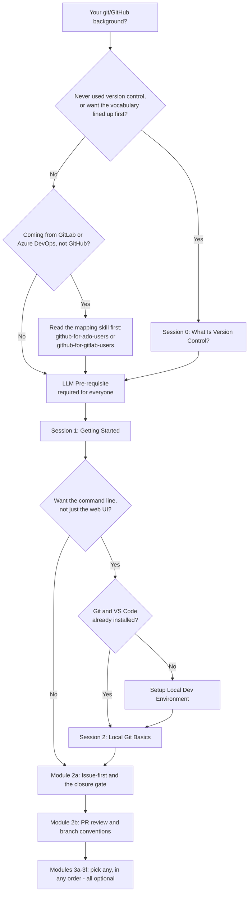
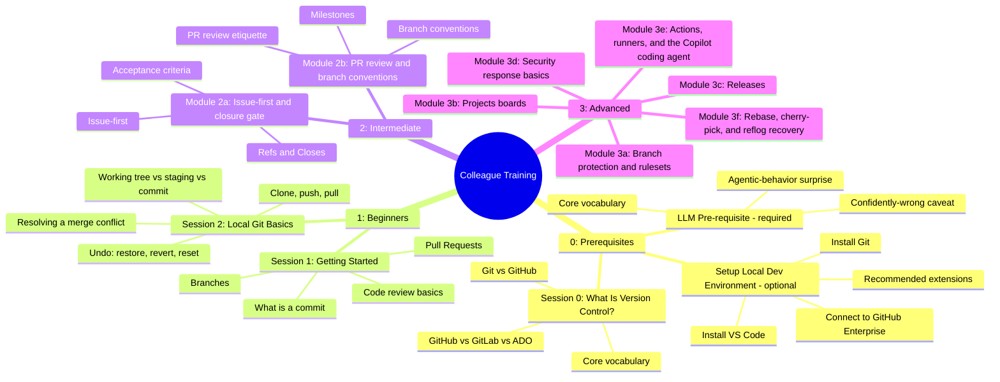

# Colleague GitHub Training Program

This is training material **for people** — colleagues learning how to use
GitHub and how this team specifically works. It's a different surface from
`skills/*/SKILL.md`, which teaches an AI coding agent the same workflow.
Where this program describes a policy the skills already state precisely
(the closure gate, issue-first, branch conventions), it points at the
relevant skill file by name rather than restating it, so the two can't
silently drift apart. Moving or releasing `education/` on its own means
bundling the specific skill files it references alongside it, not copying
this repo's `skills/` folder wholesale or rewriting their content into
education prose — see ADR 0008 (the bundling mechanism itself is a
separate, not-yet-built follow-up).

**Folder numbers signal reading order** (per ADR 0009, refining ADR 0007):
`0_prerequisites/` → `1_beginners/` → `2_intermediate/` → `3_advanced/`.
`0_prerequisites/` holds required reading (Session 0, and the LLM track's
Pre-requisite page — most colleagues use an AI coding assistant, so that
page is no longer optional) plus one conditional page (local dev
environment setup, only if you don't already have Git/VS Code). A future
`4_next-level/` tier is reserved for content beyond today's Module 3f —
not created yet; its content is a separate decision. `examples/`,
`cheat-sheet.md`, and `facilitator-guide.md` sit outside the numbered
sequence — lookup references, not steps to work through in order.

## Where do I start?

What this shows: how your existing background routes you to the right
starting point — nobody needs to sit through material for a background
they don't have. The LLM Pre-requisite page is required for everyone,
regardless of background, which is why both branches below converge into
it before Session 1.

| Background | Start here |
| --- | --- |
| Never used version control | [Session 0: What Is Version Control?](0_prerequisites/session-0-what-is-version-control.md), then [Session 1: Getting Started](1_beginners/session-1-getting-started.md) |
| Comfortable in the GitHub web UI, ready for the command line, Git/VS Code already installed | [Session 2: Local Git Basics](1_beginners/session-2-local-git-basics.md) |
| Ready for the command line but no Git or VS Code installed yet | [Setting Up Your Local Dev Environment](0_prerequisites/setup-local-dev-environment.md), then [Session 2](1_beginners/session-2-local-git-basics.md) |
| Some git knowledge, new to this team's process | [Module 2a: Issue-first and the closure gate](2_intermediate/module-2a-issue-first-and-closure-gate.md) |
| Already know GitLab or Azure DevOps, not GitHub | [Session 0](0_prerequisites/session-0-what-is-version-control.md)'s GitLab/ADO comparison table for a quick orientation, then `skills/github-for-ado-users/SKILL.md` (Azure DevOps) or `skills/github-for-gitlab-users/SKILL.md` (GitLab) for full depth, then [Module 2a](2_intermediate/module-2a-issue-first-and-closure-gate.md) |

**Whatever your background: read the [LLM Track — Pre-requisite: What Is
an LLM Assistant?](0_prerequisites/prerequisite-what-is-an-llm-assistant.md)
page before Session 1 too.** It's required, not optional — most colleagues
end up using an AI coding assistant, and it covers the two things that
have actually surprised people so far.

Planning to work from the command line at all? Do [Session 2: Local Git
Basics](1_beginners/session-2-local-git-basics.md) before Module 2a — it
covers staging, conflicts, and undoing a mistake, none of which the web-UI
path in Session 1 touches.

Modules 2a and 2b build on each other — do 2a first. Modules 3a-3f are
each independent and optional; read any subset, in any order, based on
what's relevant to you. Each module is sized to fit a single sitting
(15-40 minutes) rather than blocking out a full session.

This program is primarily self-paced: work through it solo, at your own
pace, with the modules above as your only guide. A facilitator-led session
is still fully supported — modules mark optional group activities inline,
so either mode works from the same files. Session 2 and Modules 2a, 2b, 3a,
3b, and 3f include hands-on steps in a shared **sandbox practice repo** (a
throwaway repo set up for exactly this purpose, never a real project). Ask
your team's facilitator or onboarding buddy for access to it before you
start one of those modules — `education/facilitator-guide.md` has their
setup checklist if you're the one setting it up.

## What's covered

What this shows: the topic areas grouped by tier, at a glance, so you can
judge which Module 3 topics are relevant to you without reading their
full content.

## Materials

- [Session 0: What Is Version Control?](0_prerequisites/session-0-what-is-version-control.md) — ~15 min, reading only, plain-terms vocabulary plus a GitHub/GitLab/ADO comparison.
- [LLM Track — Pre-requisite: What Is an LLM Assistant?](0_prerequisites/prerequisite-what-is-an-llm-assistant.md) — ~15 min, reading only, **required**. Core vocabulary, the agentic-behavior surprise, and the confidently-wrong caveat. First page of the LLM track (ADR 0007); its later tiers are still being written and stay optional.
- [Setting Up Your Local Dev Environment](0_prerequisites/setup-local-dev-environment.md) — ~30 min, mostly install time. Installing Git and VS Code, connecting to GitHub Enterprise, recommended extensions. Optional — only needed if you don't already have these.
- [Session 1: Getting Started](1_beginners/session-1-getting-started.md) — ~60 min, hands-on, no prior experience needed.
- [Session 2: Local Git Basics](1_beginners/session-2-local-git-basics.md) — ~45 min, hands-on command-line git — staging, conflicts, and undoing a mistake.
- [Module 2a: Issue-first and the closure gate](2_intermediate/module-2a-issue-first-and-closure-gate.md) — ~40 min, this team's core workflow habit.
- [Module 2b: PR review and branch conventions](2_intermediate/module-2b-pr-review-and-branch-conventions.md) — ~35 min, review etiquette and branch/milestone conventions.
- [Module 3a: Branch protection and rulesets](3_advanced/module-3a-branch-protection-and-rulesets.md) — ~25 min, optional.
- [Module 3b: Projects boards](3_advanced/module-3b-projects-boards.md) — ~20 min, optional.
- [Module 3c: Releases](3_advanced/module-3c-releases.md) — ~25 min, optional.
- [Module 3d: Security response basics](3_advanced/module-3d-security-response.md) — ~15 min, optional.
- [Module 3e: Actions, runners, and the Copilot coding agent](3_advanced/module-3e-actions-runners-and-agents.md) — ~15-20 min, optional.
- [Module 3f: Rebase, cherry-pick, and reflog recovery](3_advanced/module-3f-rebase-cherry-pick-and-reflog.md) — ~25 min, hands-on, optional.
- [Cheat sheet](cheat-sheet.md) — one page, take it with you.
- [Facilitator guide](facilitator-guide.md) — for the superuser running a session, not attendees.
- [Examples: Markdown formatting showcase](examples/markdown-formatting-showcase.md) — lookup reference, not a lesson.
- [Examples: Mermaid diagram types showcase](examples/mermaid-diagram-types-showcase.md) — every documented diagram type, established and newer, lookup reference.
