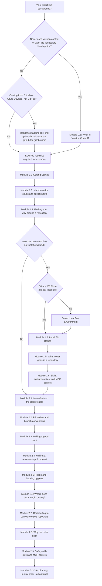
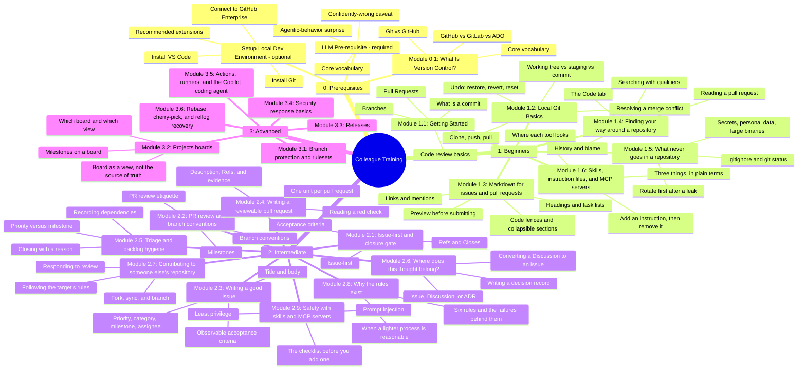

# Colleague GitHub Training Program

This is training material **for people** — colleagues learning how to use
GitHub and how this team specifically works. It's a different surface from
`skills/*/SKILL.md`, which teaches an AI coding agent the same workflow.
Where this program describes a policy the skills already state precisely
(the closure gate, issue-first, branch conventions), it points at the
relevant skill file by name rather than restating it, so the two can't
silently drift apart. Moving or releasing `education/` on its own means
bundling the specific skill files it references alongside it, not copying
this repo's `skills/` folder wholesale or rewriting their content into
education prose — see ADR 0008. `node scripts/package-education.mjs --out
<folder>` builds that bundle, with a manifest of versions, licence, source
commit, and file hashes (ADR 0013).

**Folder numbers signal reading order** (per ADR 0009, refining ADR 0007):
`0_prerequisites/` → `1_beginners/` → `2_intermediate/` → `3_advanced/`.
`0_prerequisites/` holds required reading (Module 0.1, and the LLM track's
Pre-requisite page — most colleagues use an AI coding assistant, so that
page is no longer optional) plus one conditional page (local dev
environment setup, only if you don't already have Git/VS Code). A future
[`4_next-step/`](4_next-step/module-plan.md) holds a plan for content beyond
today's Module 3.6 — candidate modules, none built yet. `examples/`,
`cheat-sheet.md`, and `facilitator-guide.md` sit outside the numbered
sequence — lookup references, not steps to work through in order.

**Tools:** for now, all Git activity in this program is done in **VS Code or on
the command line**. Every lesson and exercise assumes one of those two. GitHub
Desktop and other Git clients are deliberately not covered (maintainer decision,
issue #178), so if you use one, switch to VS Code or the command line while
you work through the program.

## Where do I start?

What this shows: how your existing background routes you to the right
starting point — nobody needs to sit through material for a background
they don't have. The LLM Pre-requisite page is required for everyone,
regardless of background, which is why both branches below converge into
it before Module 1.1.

| Background | Start here |
| --- | --- |
| Never used version control | [Module 0.1: What Is Version Control?](0_prerequisites/module-0-1-what-is-version-control.md), then [Module 1.1: Getting Started](1_beginners/module-1-1-getting-started.md) |
| You write issues or pull requests and want them to read well | [Module 1.3: Markdown for issues and pull requests](1_beginners/module-1-3-markdown-for-issues-and-prs.md) |
| You want to find out what changed in a repository, and why, or whether something is already reported | [Module 1.4: Finding your way around a repository](1_beginners/module-1-4-finding-your-way-around-a-repo.md) |
| You are about to commit files and want to know what must never go in a repository | [Module 1.5: What never goes in a repository](1_beginners/module-1-5-what-never-goes-in-a-repo.md) (do Module 1.2 first) |
| Comfortable in the GitHub web UI, ready for the command line, Git/VS Code already installed | [Module 1.2: Local Git Basics](1_beginners/module-1-2-local-git-basics.md) |
| Ready for the command line but no Git or VS Code installed yet | [Setting Up Your Local Dev Environment](0_prerequisites/setup-local-dev-environment.md), then [Module 1.2](1_beginners/module-1-2-local-git-basics.md) |
| Some git knowledge, new to this team's process | [Module 2.1: Issue-first and the closure gate](2_intermediate/module-2-1-issue-first-and-closure-gate.md) |
| Comfortable with the workflow, want your issues to be easier for others to act on | [Module 2.3: Writing a good issue](2_intermediate/module-2-3-writing-a-good-issue.md) |
| You open pull requests and want them to be quick to review | [Module 2.4: Writing a reviewable pull request](2_intermediate/module-2-4-writing-a-reviewable-pr.md) |
| You help keep the backlog in order: ranking, linking, and closing issues | [Module 2.5: Triage and backlog hygiene](2_intermediate/module-2-5-triage-and-backlog-hygiene.md) |
| You are unsure whether something is an issue, a Discussion, or a recorded decision | [Module 2.6: Where does this thought belong?](2_intermediate/module-2-6-where-does-this-thought-belong.md) |
| You want to propose a change to a repository you do not maintain | [Module 2.7: Contributing to someone else's repository](2_intermediate/module-2-7-contributing-to-someone-elses-repo.md) |
| You want the reasons behind this team's rules, to follow them with judgment | [Module 2.8: Why the rules exist](2_intermediate/module-2-8-why-the-rules-exist.md) |
| You use an AI assistant and want to know about skills, instruction files, and MCP servers | [Module 1.6: Skills, instruction files, and MCP servers](1_beginners/module-1-6-skills-instructions-and-mcp.md) (after the LLM prerequisite) |
| You are about to add a skill or an MCP server you did not write | [Module 2.9: Safety with skills and MCP servers](2_intermediate/module-2-9-safety-with-skills-and-mcp-servers.md) (after Module 1.6) |
| Already know GitLab or Azure DevOps, not GitHub | [Module 0.1](0_prerequisites/module-0-1-what-is-version-control.md)'s GitLab/ADO comparison table for a quick orientation, then `skills/github-for-ado-users/SKILL.md` (Azure DevOps) or `skills/github-for-gitlab-users/SKILL.md` (GitLab) for full depth, then [Module 2.1](2_intermediate/module-2-1-issue-first-and-closure-gate.md) |

**Whatever your background: read the [LLM Track — Pre-requisite: What Is
an LLM Assistant?](0_prerequisites/prerequisite-what-is-an-llm-assistant.md)
page before Module 1.1 too.** It's required, not optional — most colleagues
end up using an AI coding assistant, and it covers the two things that
have actually surprised people so far.

Planning to work from the command line at all? Do [Module 1.2: Local Git
Basics](1_beginners/module-1-2-local-git-basics.md) before Module 2.1 — it
covers staging, conflicts, and undoing a mistake, none of which the web-UI
path in Module 1.1 touches.

Modules 2.1 and 2.2 build on each other — do 2.1 first. Modules 2.3 to 2.9 build on
2.1 and are best read after 2.2. Modules 3.1-3.6 are
each independent and optional; read any subset, in any order, based on
what's relevant to you. Each module is sized to fit a single sitting
(15-50 minutes) rather than blocking out a full session.

This program is primarily self-paced: work through it solo, at your own
pace, with the modules above as your only guide. A facilitator-led session
is still fully supported — modules mark optional group activities inline,
so either mode works from the same files. Modules 1.2 to 1.6 and Modules 2.1, 2.2, 2.3,
2.4, 2.5, 2.6, 3.1, 3.2, and 3.6 include hands-on steps in a shared **sandbox practice repo** (a
throwaway repo set up for exactly this purpose, never a real project). Ask
your team's facilitator or onboarding buddy for access to it before you
start one of those modules — `education/facilitator-guide.md` has their
setup checklist if you're the one setting it up. Module 2.7 instead uses a
separate public practice repository, because a private sandbox can't normally
be forked.

## What's covered

What this shows: the topic areas grouped by tier, at a glance, so you can
judge which Module 3 topics are relevant to you without reading their
full content.

## Materials

- [Module 0.1: What Is Version Control?](0_prerequisites/module-0-1-what-is-version-control.md) — ~15 min, reading only, plain-terms vocabulary plus a GitHub/GitLab/ADO comparison.
- [LLM Track — Pre-requisite: What Is an LLM Assistant?](0_prerequisites/prerequisite-what-is-an-llm-assistant.md) — ~15 min, reading only, **required**. Core vocabulary, the agentic-behavior surprise, and the confidently-wrong caveat. First page of the LLM track (ADR 0007); its later tiers are still being written and stay optional.
- [Setting Up Your Local Dev Environment](0_prerequisites/setup-local-dev-environment.md) — ~30 min, mostly install time. Installing Git and VS Code, connecting to GitHub Enterprise, recommended extensions. Optional — only needed if you don't already have these.
- [Module 1.1: Getting Started](1_beginners/module-1-1-getting-started.md) — ~60 min, hands-on, no prior experience needed.
- [Module 1.2: Local Git Basics](1_beginners/module-1-2-local-git-basics.md) — ~45 min, hands-on command-line git — staging, conflicts, and undoing a mistake.
- [Module 1.3: Markdown for issues and pull requests](1_beginners/module-1-3-markdown-for-issues-and-prs.md) — ~20 min, hands-on, web UI only. Headings, task lists, code fences, links, and previewing.
- [Module 1.4: Finding your way around a repository](1_beginners/module-1-4-finding-your-way-around-a-repo.md) — ~25 min, hands-on, web UI only. The Code tab, history and blame, search qualifiers, and reading a pull request.
- [Module 1.5: What never goes in a repository](1_beginners/module-1-5-what-never-goes-in-a-repo.md) — ~20 min, hands-on, needs Git from Module 1.2. What stays out, `.gitignore`, and rotating first after a leaked secret.
- [Module 1.6: Skills, instruction files, and MCP servers](1_beginners/module-1-6-skills-instructions-and-mcp.md) — ~30 min, hands-on in VS Code. What each is, where each tool reads them (verified 2026-10-01), and adding one instruction.
- [Module 2.1: Issue-first and the closure gate](2_intermediate/module-2-1-issue-first-and-closure-gate.md) — ~50 min, this team's core workflow habit.
- [Module 2.2: PR review and branch conventions](2_intermediate/module-2-2-pr-review-and-branch-conventions.md) — ~35 min, review etiquette and branch/milestone conventions.
- [Module 2.3: Writing a good issue](2_intermediate/module-2-3-writing-a-good-issue.md) — ~30 min, hands-on, the reasons behind each rule in `github-issue-first`.
- [Module 2.4: Writing a reviewable pull request](2_intermediate/module-2-4-writing-a-reviewable-pr.md) — ~30 min, hands-on, the reasons behind the pull-request rules in `github-hygiene` and `github-pr-review`.
- [Module 2.5: Triage and backlog hygiene](2_intermediate/module-2-5-triage-and-backlog-hygiene.md) — ~30 min, hands-on, the reasons behind the triage rules in `github-issue-first` and `github-releases`.
- [Module 2.6: Where does this thought belong?](2_intermediate/module-2-6-where-does-this-thought-belong.md) — ~25 min, hands-on, the issue-versus-Discussion-versus-decision rules in `github-issue-first`.
- [Module 2.7: Contributing to someone else's repository](2_intermediate/module-2-7-contributing-to-someone-elses-repo.md) — ~30 min, hands-on, the reasons behind `github-contributing`.
- [Module 2.8: Why the rules exist](2_intermediate/module-2-8-why-the-rules-exist.md) — ~35 min, reading and a short writing exercise, the failure behind each of six rules.
- [Module 2.9: Safety with skills and MCP servers](2_intermediate/module-2-9-safety-with-skills-and-mcp-servers.md) — ~25 min, reading and a short review exercise, what to check before adding a skill or MCP server.
- [Module 3.1: Branch protection and rulesets](3_advanced/module-3-1-branch-protection-and-rulesets.md) — ~25 min, optional.
- [Module 3.2: Projects boards](3_advanced/module-3-2-projects-boards.md) — ~35 min, optional. What a board mirrors, showing and filtering by milestone, which board and view to use when.
- [Module 3.3: Releases](3_advanced/module-3-3-releases.md) — ~25 min, optional.
- [Module 3.4: Security response basics](3_advanced/module-3-4-security-response.md) — ~15 min, optional.
- [Module 3.5: Actions, runners, and the Copilot coding agent](3_advanced/module-3-5-actions-runners-and-agents.md) — ~15-20 min, optional.
- [Module 3.6: Rebase, cherry-pick, and reflog recovery](3_advanced/module-3-6-rebase-cherry-pick-and-reflog.md) — ~25 min, hands-on, in a terminal (needs Git and Module 1.2), optional.
- [Next-step module plan](4_next-step/module-plan.md) — a plan of candidate advanced modules, none built yet.
- [Cheat sheet](cheat-sheet.md) — one page, take it with you.
- [Facilitator guide](facilitator-guide.md) — for the superuser running a session, not attendees.
- [Examples: Markdown formatting showcase](examples/markdown-formatting-showcase.md) — lookup reference, not a lesson.
- [Examples: Developer and AI tooling taxonomy](examples/ai-tooling-taxonomy.md) — which kind of tool is which (IDEs, CLIs, AI assistants, coding assistants, agents), with product names checked on a stated date, lookup reference.
- [Examples: Mermaid diagram types showcase](examples/mermaid-diagram-types-showcase.md) — every documented diagram type, established and newer, lookup reference.
