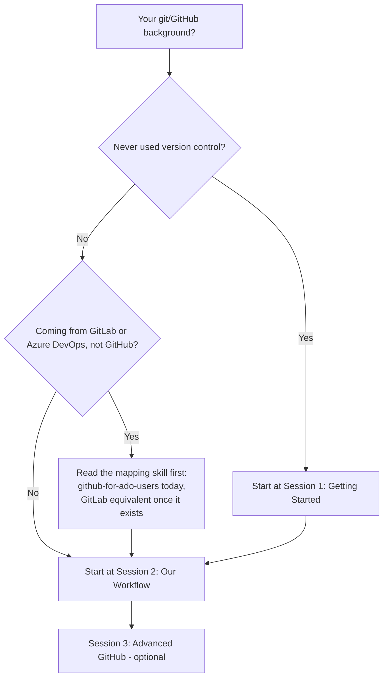
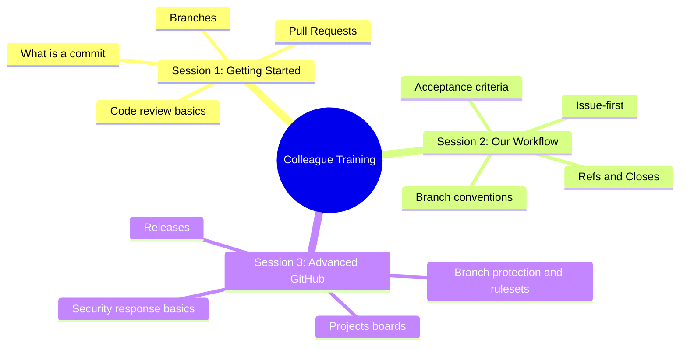

# Colleague GitHub Training Program

This is training material **for people** — colleagues learning how to use
GitHub and how this team specifically works. It's a different surface from
`skills/*/SKILL.md`, which teaches an AI coding agent the same workflow.
Where this program describes a policy the skills already state precisely
(the closure gate, issue-first, branch conventions), it points at the
relevant skill file by name rather than restating it, so the two can't
silently drift apart.

## Where do I start?

What this shows: how your existing background routes you to the right
starting point — nobody needs to sit through material for a background
they don't have.

| Background | Start here |
| --- | --- |
| Never used version control | [Session 1: Getting Started](beginners/session-1-getting-started.md) |
| Some git knowledge, new to this team's process | [Session 2: Our Workflow](intermediate/session-2-our-workflow.md) |
| Already know GitLab or Azure DevOps, not GitHub | Read `skills/github-for-ado-users/SKILL.md` (Azure DevOps mapping; a GitLab-specific equivalent doesn't exist yet — see #35) as pre-reading, then [Session 2](intermediate/session-2-our-workflow.md) |

Session 3 is optional and for anyone who wants to go deeper — attend it
whenever, in any order relative to your own comfort level.

## What's covered

What this shows: the topic areas across all three sessions, at a glance,
so you can judge whether Session 3 is relevant to you without reading its
full script.

## Materials

- [Session 1: Getting Started](beginners/session-1-getting-started.md) — ~60 min, hands-on, no prior experience needed.
- [Session 2: Our Workflow](intermediate/session-2-our-workflow.md) — ~1-2 hr, this team's specific conventions.
- [Session 3: Advanced GitHub](advanced/session-3-advanced-github.md) — ~1-2 hr, optional, deeper topics.
- [Cheat sheet](cheat-sheet.md) — one page, take it with you.
- [Facilitator guide](facilitator-guide.md) — for the superuser running a session, not attendees.
