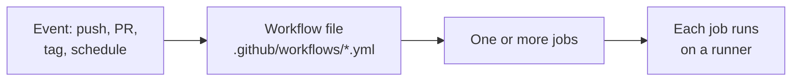
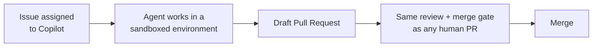

# Module 3e: GitHub Actions, runners, and the Copilot coding agent

**Audience:** Anyone who's completed Module 2b, or is already comfortable
with this team's basic workflow and wants to go deeper. Optional, and
independent of Modules 3a-3d — read in any order.
**Format:** Self-paced — read and do each step yourself.
**Timing:** ~15-20 min.

## Learning objectives

- Know what a GitHub Actions workflow is and where it lives.
- Know the difference between a GitHub-hosted runner and a self-hosted
  one, and the security tradeoff that comes with the second.
- Know what GitHub's Copilot coding agent does — and doesn't — change
  about this team's review process.

## What a GitHub Actions workflow is

A **workflow** is a YAML file in `.github/workflows/` that runs one or
more jobs in response to an event — a push, a pull request, a schedule, a
manual trigger. This repository's own workflows are a real, already
-familiar example: `validate.yml` runs on every PR and push to `main`,
`release.yml` runs when a `v*` tag is pushed. Nothing about a workflow file
is special-cased — it's plain YAML, reviewed in a PR like any other change,
same as everything else this team's process covers.

What this shows: an event triggers a workflow, a workflow runs jobs, and
each job needs somewhere to actually execute — that's the runner, covered
next.

## Runners: GitHub-hosted vs. self-hosted

A **runner** is the machine that actually executes a job's steps.

- **GitHub-hosted runners** (`ubuntu-latest`, `windows-latest`,
  `macos-latest` — this repo's own CI matrix uses all three) are
  short-lived virtual machines GitHub provisions, runs your job on, and
  destroys afterward. No setup, no maintenance, and each job starts from a
  clean environment — the default choice, and the right one unless you have
  a specific reason not to.
- **Self-hosted runners** are machines *you* provide and maintain —
  necessary for things GitHub-hosted runners can't do (reaching a private
  internal network, specific hardware, licensed software already installed
  locally). The tradeoff: you own patching, security, and availability, and
  there's a real risk worth naming explicitly — **a self-hosted runner on a
  public repository is a known attack surface** (anyone who can open a PR
  can potentially get their workflow code executed on it, unlike a
  GitHub-hosted runner that's destroyed after each job). This repo's own
  `github-repo-review` skill flags exactly this as something to check for
  in any repository audit.

Default to GitHub-hosted unless something specific forces self-hosted, and
never point a self-hosted runner at a public repo without understanding
that tradeoff first.

## GitHub's Copilot coding agent

Separate from Actions, but related: GitHub offers a **Copilot coding
agent** — assign an issue to Copilot (where your organization's plan
supports it) instead of a person, and it works autonomously in a sandboxed
environment to produce a change, opening a **draft pull request** when
done.

The important thing to know, and the reason this is only a short section
here rather than its own module: **nothing about this team's review
process changes because the author is an agent.** The resulting PR still
needs a real review (`github-pr-review`), still goes through the same
merge gate (`github-hygiene`), and still needs its linked issue's
acceptance criteria evaluated with actual evidence before anything gets
marked `Closes #N` — a PR opened by an agent is not exempt from any of
that, and treating "an AI wrote it" as automatic trust is exactly the
mistake this team's process is designed to prevent regardless of who (or
what) opened the PR.

What this shows: the agent's work enters the exact same pipeline a human
contributor's PR would — the only thing that's different is who opened it.

## Self-check

- Where does a GitHub Actions workflow file live, and what triggers it?
- Why is a self-hosted runner on a public repo a real risk, specifically —
  what's different about it compared to a GitHub-hosted one?
- If Copilot's coding agent opens a PR for an issue, does it skip this
  team's normal review and closure-gate process? Why or why not?

Not confident on any of these? Re-read the relevant section above.

## Feedback

Something unclear, wrong, or worth improving in this module? Open a
Discussion in this repo (**Ideas** category). Concrete, actionable
feedback gets converted into a tracked issue, per this repo's own
issue-first convention — see `skills/github-issue-first/SKILL.md`'s
Discussions section.

---

Back to [Education Program overview](../README.md).
