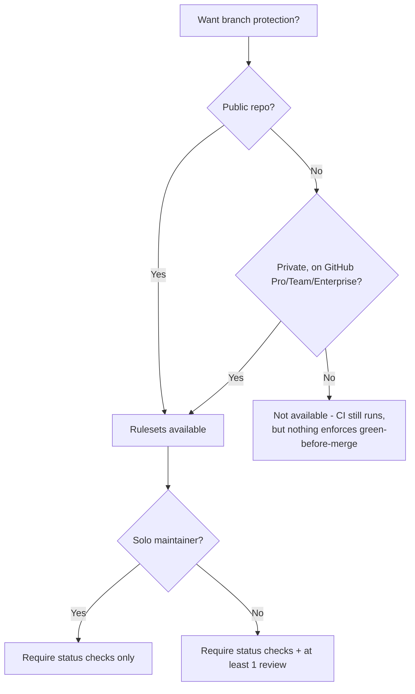
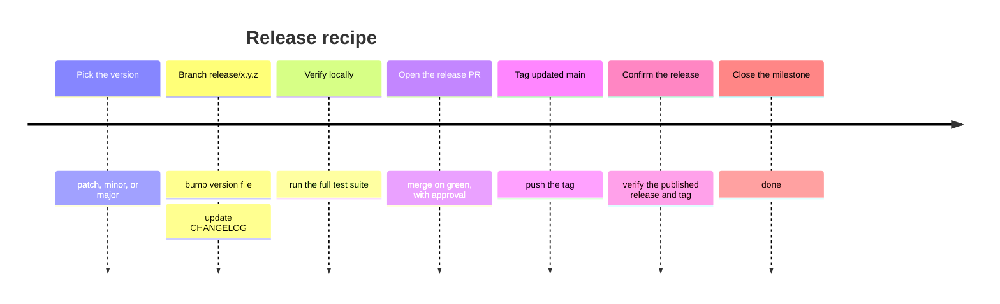

# Session 3: Advanced GitHub

**Audience:** Anyone who's completed Session 2 (or already comfortable with this team's basic workflow) and wants to go deeper. Optional.
**Format:** Outline and talking points for the facilitator.
**Timing budget:** ~1-2 hours (can be split across two shorter sessions if preferred).

## Learning objectives

- Understand what branch protection/rulesets do and don't guarantee, and
  when they're even available.
- Understand how a Projects board relates to issues (and when a team
  actually needs one).
- Walk through the shape of a release, end to end.
- Know the first moves in a security-sensitive situation.

## Section 1: Branch protection and rulesets (~25 min)

**Source:** `skills/github-releases/SKILL.md` (Rulesets section)

What this shows: whether branch protection is even available depends on
plan and visibility before it depends on anything you configure — a
common surprise on private repos.

Talking points:

- A ruleset (or classic branch protection) can require CI to be green and
  require review before merge — but only where it's available (see the
  decision tree above).
- On a solo-maintained repo, requiring your own review locks you out of
  your own repo unless you're a bypass actor — which makes the rule
  effectively advisory. Add the review requirement once a second
  maintainer exists.
- `gh ruleset list` can look like "nothing configured" both when nothing
  is configured *and* when the plan doesn't support it — always confirm
  via the API, not just the CLI's list output.

## Section 2: Projects boards (~20 min)

**Source:** `skills/github-projects/SKILL.md`

Talking points:

- A Projects board is a **view over issues**, never the source of truth.
  Labels, milestones, and assignees on the issue itself are authoritative
  — if a fact only lives on the board, it's invisible to anyone reading
  the repo through the API or `gh`.
- Don't create a board for a solo maintainer — it's unmaintained overhead
  with nothing to show for it. Create one when a second person joins, or
  when work already spans multiple repos (one org-level board, not one
  per repo).
- Draft items (created only on the board, with no linked issue) silently
  violate issue-first — every board item should be a real issue or PR.

## Section 3: Releases (~25 min)

**Source:** `skills/github-releases/SKILL.md` (Release recipe)

What this shows: a release is a fixed sequence of one-time steps, not a
branching decision — a timeline fits it better than a flowchart.

Talking points:

- Read the current version from the repo's actual version file
  (`package.json`, a module manifest, etc.) — never from the last git
  tag, since the two can drift apart.
- Generated release notes (from merged PR labels) and a hand-written
  `CHANGELOG.md` serve different readers — keep both.

## Section 4: Security response basics (~15 min)

**Source:** `skills/github-security-response/SKILL.md`

Talking points:

- If a secret gets committed: **rotate it first.** History rewriting is
  cleanup, not containment — the credential is compromised the moment it
  was pushed, regardless of what you do to git history afterward.
- Vulnerabilities and committed secrets never go into a public issue —
  that's a disclosure. Use private vulnerability reporting instead.
- Never paste the secret's actual value anywhere while reporting it —
  reference where it was, not what it was.

## Wrap-up (~5 min)

This session covered the topics that come up once a team's usage matures
past the basics: protecting `main`, coordinating visibility across
several repos, shipping a release, and handling something sensitive
safely. There's no "Session 4" — from here, the `skills/*/SKILL.md` files
themselves are the reference for anything not covered live.
