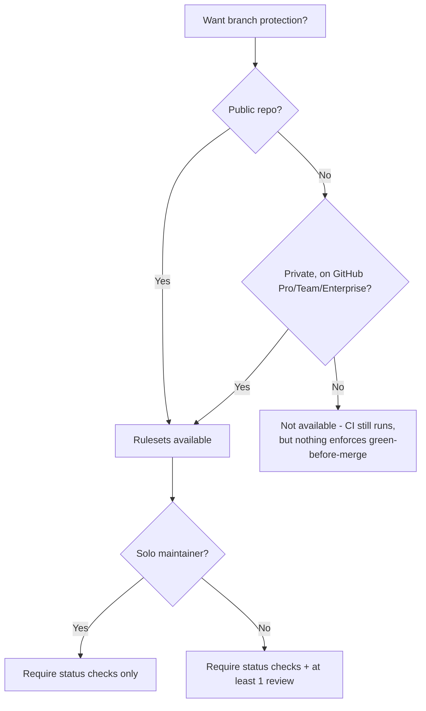
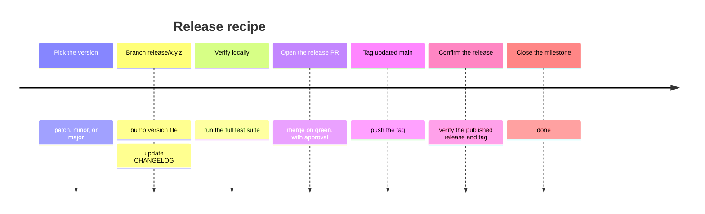

# Session 3: Advanced GitHub

**Audience:** Anyone who's completed Session 2 (or already comfortable with this team's basic workflow) and wants to go deeper. Optional.
**Format:** Full script — read it closely, adapt the phrasing to your own voice, but the content and order are deliberate.
**Timing budget:** ~1-2 hours (can be split across two shorter sessions if preferred).

## Learning objectives

- Understand what branch protection/rulesets do and don't guarantee, and
  when they're even available.
- Understand how a Projects board relates to issues (and when a team
  actually needs one).
- Walk through the shape of a release, end to end.
- Know the first moves in a security-sensitive situation.

## Section 1: Branch protection and rulesets (~25 min)

**Source:** `skills/github-releases/SKILL.md` (Rulesets section)

What this shows: whether branch protection is even available depends on
plan and visibility before it depends on anything you configure — a
common surprise on private repos.

Walk the decision tree top to bottom before touching any settings, because
this is the surprise that catches people who've configured branch
protection somewhere else before: **availability depends on plan and
visibility first, and on your own choices second.** A ruleset (or classic
branch protection) can require CI to be green and require review before
merge — but only on repos where the feature is actually available in the
first place. A private repo on the free plan simply doesn't have this
option, no matter how it's configured; CI still runs and still reports
results, but nothing in GitHub itself enforces green-before-merge. That's
a real limitation to plan around, not a settings screen to keep hunting
through.

Once availability is confirmed, walk the second branch of the tree: solo
maintainer versus more than one. On a solo-maintained repo, requiring your
own review before you can merge your own PR locks you out of your own
repository — unless you add yourself as a bypass actor, which quietly
makes the review requirement advisory rather than real. The right call for
a solo maintainer is to require the status checks and skip the review
requirement entirely, adding it back only once a second maintainer
actually exists to do the reviewing.

Close with a specific tooling gotcha worth calling out by name, since it's
easy to draw the wrong conclusion from it: `gh ruleset list` can print
nothing back both when nothing is configured *and* when the repo's plan
doesn't support rulesets at all — the empty output looks identical either
way. Always confirm via the API directly rather than trusting the CLI
listing's silence.

## Section 2: Projects boards (~20 min)

**Source:** `skills/github-projects/SKILL.md`

Open with the one sentence that should be repeated any time a Projects
board comes up: **a Projects board is a view over issues, never the
source of truth.** Everything that actually matters — labels, milestones,
assignees — lives on the issue itself; the board is a way of looking at
that same information, not a second place where facts live. If a fact
only ever gets recorded on the board and nowhere else, it's effectively
invisible to anyone reading the repo through the API or through `gh` —
which, on this team, is a real way people work.

Spend real time on when a board is and isn't worth creating, because this
is where teams most often over-invest: don't create a board for a solo
maintainer. It becomes unmaintained overhead with genuinely nothing to
show for the upkeep it needs. The right moment to create one is when a
second person actually joins the work, or when work already spans
multiple repositories — and in that multi-repo case, the answer is one
shared org-level board, not a separate board per repository.

Finish on a specific failure mode worth naming directly: draft items —
board entries created only on the board, with no linked issue behind
them — silently violate issue-first. They look like real tracked work
from the board's own view, but they're invisible everywhere else in the
repo. Every item that lives on a board should be a real issue or PR
first, added to the board second.

## Section 3: Releases (~25 min)

**Source:** `skills/github-releases/SKILL.md` (Release recipe)

What this shows: a release is a fixed sequence of one-time steps, not a
branching decision — a timeline fits it better than a flowchart.

Walk the timeline as a literal recipe to follow, not a set of choices to
weigh — that's deliberate, and worth saying out loud, since most of what
this session has covered so far has involved judgment calls. A release
doesn't. Point out the one step people get wrong most often: read the
current version from the repo's actual version file — `package.json`, a
module manifest, whatever this project uses — never from the last git
tag. The two can and do drift apart over time, and trusting the tag
instead of the source file is how a release ends up shipping under the
wrong version number.

Close with the reason this team keeps both generated release notes and a
hand-written `CHANGELOG.md`, rather than treating one as redundant with
the other: they serve genuinely different readers. Generated notes (built
from merged PR labels) answer "what merged in this release" — useful for
an engineer auditing exactly what shipped. A hand-written changelog
answers "what changed and why it matters" — useful for anyone who wants
the human summary without reading a list of PR titles. Neither replaces
the other.

## Section 4: Security response basics (~15 min)

**Source:** `skills/github-security-response/SKILL.md`

Open this section by naming that the instinct most people have here is
backwards, and correcting it immediately: if a secret gets committed, the
first move is to **rotate it**, not to clean up git history. The
credential is compromised from the moment it was pushed — public repos in
particular get scanned by bots within seconds — so rewriting history
afterward is cleanup, not containment. Rotating first, cleaning up
second, is the order that actually limits damage; doing it the other way
around leaves a live, compromised credential sitting untouched while
attention goes to a lower-priority task.

State the disclosure rule plainly and without exception: vulnerabilities
and committed secrets never go into a public issue or a public PR — filing
one is itself a disclosure. Use GitHub's private vulnerability reporting
instead, which exists specifically so a repo has somewhere for this to go
that isn't the public tracker.

Close on a small but important habit: never paste the secret's actual
value anywhere while reporting or discussing it — not in an issue, not in
a PR, not in chat. Reference *where* it was found (the file, the commit,
the log line) rather than *what* it was. The location is enough
information for someone to act on; the value itself is just one more
place the secret now lives.

## Wrap-up (~5 min)

This session covered the topics that come up once a team's usage matures
past the basics: protecting `main`, coordinating visibility across
several repos, shipping a release, and handling something sensitive
safely. There's no "Session 4" — from here, the `skills/*/SKILL.md` files
themselves are the reference for anything not covered live.
