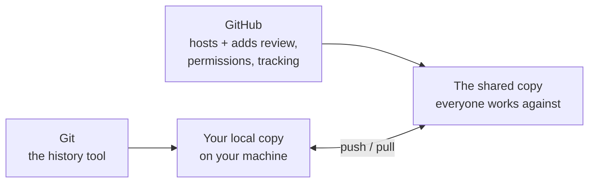
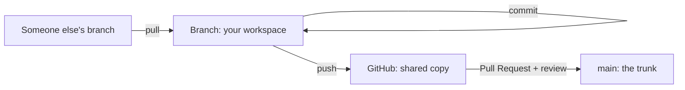

# Session 0: What Is Version Control?

**Audience:** Anyone about to start Session 1 — including people who've
never touched Git, GitHub, GitLab, or Azure DevOps, and people who've used
one of those tools and want the vocabulary lined up before they touch a
new one.

**Format:** Reading only. No account needed, nothing to click. Session 1
is where the hands-on part starts.

**Timing budget:** ~15 minutes.

## Why this exists

Session 1 teaches you to file an issue, branch, commit, and open a pull
request — by clicking through the real GitHub UI. It assumes you already
know, loosely, what those words mean. This page is that grounding, so
Session 1 can spend its time on *doing* instead of *defining*.

If you already know what a commit and a branch are, skip straight to
[Session 1](session-1-getting-started.md). If any of the vocabulary below
is new, five minutes here saves confusion later.

## Protect your account before you need to

This is the one section here that isn't about concepts — it's a checklist,
and it matters before you touch anything else. A colleague recently lost
GitHub access after a phone replacement: no recovery codes saved anywhere,
and the authenticator entry didn't carry over automatically. Losing account
access is disruptive and avoidable; do these once, now:

- **Enable two-factor authentication (2FA)**, and add GitHub to your
  authenticator app — on a company device, use the company's shared/managed
  authenticator setup (e.g. Microsoft Authenticator), not a personal-only
  arrangement nobody else could help recover.
- **Save your recovery codes somewhere durable and independent of any
  single device** — a password manager, not a note on the phone you might
  replace. GitHub shows these once, at 2FA setup; there's no second chance
  to view the same set later.
- **Before replacing a device, transfer or re-register 2FA first.** It does
  not carry over automatically just because you're signed into other
  services on the new phone.
- **GitHub Mobile** (iOS/Android) is a legitimate way to check
  notifications and review or approve PRs from your phone — genuinely
  useful, but approving a merge from a phone deserves the same care as
  from a laptop, not less.
- **If you're already locked out**, use GitHub's account recovery flow
  (Settings → Password and authentication → recovery options, from a
  device where you're still signed in, or the sign-in page's "recover
  account" link if not). For an organization-owned repo, your org's admin
  can also help re-establish access — know who that is before you need it.

## What version control actually is

Version control is a history of every saved change to a set of files,
plus a way to work on changes without disturbing anyone else's. Instead of
`report_final.docx`, `report_final_v2.docx`, `report_final_v2_ACTUALLY_FINAL.docx`
emailed back and forth, every change is a recorded, timestamped, attributed
snapshot — and multiple people can work on their own snapshot at the same
time without overwriting each other.

**Git** is the tool that keeps that history on your machine (and everyone
else's). **GitHub** is a service that hosts a shared copy of that history
online and adds the collaboration layer on top: who's allowed to change
what, how changes get reviewed before they count, and a paper trail of why.
Git works without GitHub. GitHub doesn't exist without Git underneath it.

What this shows: Git and GitHub are two different layers. Git is what
records changes; GitHub is where the shared, reviewed copy lives and where
your changes go to be seen by everyone else.

## The vocabulary, once, in plain terms

| Term | Plain-language definition |
| --- | --- |
| **Repository** ("repo") | The project's folder, plus its entire saved history. |
| **Commit** | A saved snapshot of a change, with a message explaining what and why. The basic unit of history. |
| **Branch** | Your own copy of the project to work in, so your in-progress change can't disturb anyone else's until it's ready and reviewed. |
| **Push** | Send your local commits up to the shared copy on GitHub. |
| **Pull** | Bring down commits other people pushed, so your local copy catches up. |
| **Pull Request (PR)** | A request to merge one branch's changes into another, with a review step in between. This is where "is this change good?" gets decided. |
| **Merge** | The moment a branch's commits get folded into another branch (usually `main`) after review. |
| **Issue** | A tracked unit of work — a bug, a task, a question — that a PR usually gets linked to. |

What this shows: the same handful of actions — commit, push, pull, PR,
merge — repeat every time, in this order, on every single change, no
matter how small.

## How GitHub specifically puts this together

GitHub's shape of the workflow, at the concept level (no clicking yet —
that's Session 1):

1. Work starts with an **issue** — what needs to happen, and why.
2. A **branch** is created for that issue, so the change has its own space.
3. Work happens as one or more **commits** on that branch.
4. The branch is **pushed** to GitHub.
5. A **pull request** opens, comparing the branch against `main`.
6. Someone reviews it — comments, requests changes, or approves.
7. Once approved, it's **merged** — the change becomes part of `main`.
8. The linked **issue** closes, because the work it tracked is done.

That's the entire loop. Every session after this one is a deeper look at
one part of it.

## Where this team's process adds rules on top

Git and GitHub give you the *mechanism*. This team adds specific
*conventions* on top of it — when to say `Refs #N` vs `Closes #N`, how
branches get named, what a PR needs before it can merge. Those aren't
universal Git rules; they're this team's habits, and Session 1 onward
teaches them hands-on.

## If you're coming from GitLab or Azure DevOps

The core mechanism above (commit, branch, push, pull, review, merge) is the
same everywhere — Git itself doesn't change. What changes is the vocabulary
and a few structural features. Quick orientation:

| Concept | GitHub | GitLab | Azure DevOps |
| --- | --- | --- | --- |
| Review request | Pull Request | Merge Request | Pull Request |
| Tracked work item | Issue | Issue | Work Item |
| Release bucket | Milestone | Milestone | Iteration (different meaning — see below) |
| CI/CD config | `.github/workflows/*.yml` | `.gitlab-ci.yml` | Pipelines (YAML or classic editor) |
| Kanban-style view | Projects (v2) | Issue Board | Boards |

Two traps worth knowing before you hit them: GitHub milestones are a
**release bucket only** — GitLab and Azure DevOps both use "milestone" or
"iteration" language that can also mean a time-boxed sprint, which GitHub
milestones don't do. And `.gitlab-ci.yml` is not something you rename into
a GitHub Actions file — it's a different system with a different trigger
model.

This table is deliberately short — just enough to stop a familiar word from
meaning the wrong thing. For the full mapping (work item types, boards,
wikis, pipelines, and the traps specific to each tool), see
`skills/github-for-ado-users/SKILL.md` (Azure DevOps / TFS) or
`skills/github-for-gitlab-users/SKILL.md` (GitLab) before you start relying
on GitHub day to day.

## Self-check

- In your own words, what's the difference between a commit and a branch?
- What has to happen to a branch before its changes become part of `main`?
- If you're used to GitLab or Azure DevOps, name one term that means
  something different (or doesn't exist) on GitHub.

Not confident on any of these? Re-read the section above before starting
Session 1 — it only gets more concrete from here, not less.

## Feedback

Something unclear, wrong, or worth improving on this page? Open a
Discussion in this repo (**Ideas** category). Concrete, actionable
feedback gets converted into a tracked issue, per this repo's own
issue-first convention — see `skills/github-issue-first/SKILL.md`'s
Discussions section.

---

Next: [Session 1: Getting Started](session-1-getting-started.md) — the
hands-on version of everything defined above.
