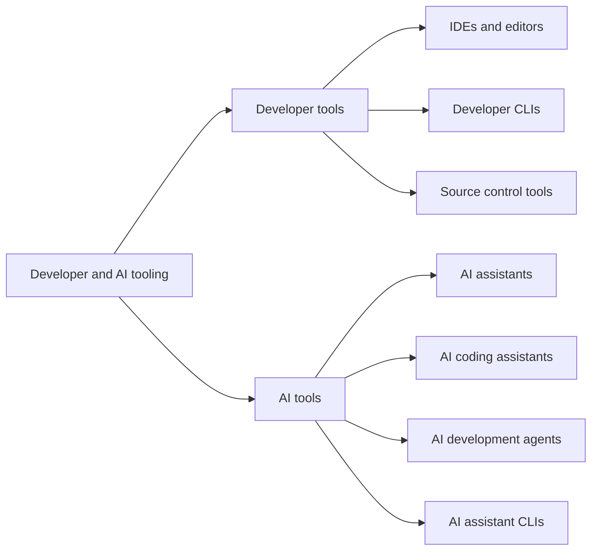
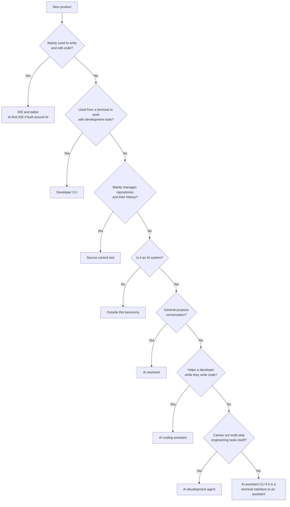

# Developer and AI tooling taxonomy

A lookup reference, not a lesson. The short explanation of the kinds is [Module 0.5: What kinds of tools are these?](../0_prerequisites/module-0-5-what-kinds-of-tools-are-these.md); this page is the long list behind it. It sorts the tools you will hear about into
a small number of categories, so that "what kind of thing is this?" has a
consistent answer. Use it when a new product name comes up, or when you are
deciding which of two tools do the same job.

**Verified on:** 2026-10-01. Product names, and which products exist, change
quickly. The "Naming and status notes" section below records what was checked
and what was not, and you should look at the vendor's own page before you rely
on a name.

## How to read this page

This taxonomy *classifies* many more tools than this program *teaches*. The
column **In this program** says which is which:

| Value | Meaning |
| --- | --- |
| Yes | The lessons or exercises use it |
| Install guide | The repository has an install guide for it (see `docs/`), but no lesson |
| No | Classified here only; not covered by the program |

One policy applies throughout: for now, all Git activity in this program is
done in **VS Code or on the command line**. GitHub Desktop and other Git clients
are classified below because they exist, and are deliberately not covered (see
the tools note in the education README).

The taxonomy intentionally leaves out data and analytics platforms (Snowflake,
Databricks, Microsoft Fabric, BigQuery, Redshift). They belong to a separate
domain.

## The taxonomy at a glance

What this diagram shows: two domains, developer tools and AI tools, and the
seven categories inside them.



## Developer tools

Developer tools provide the environments, interfaces, and workflows used to
build, test, manage, and deploy software.

### IDEs and editors

The primary workspaces for writing code.

- **Characteristics:** code authoring and editing, debugging, an extension
  ecosystem, build and test integration, source control integration.
- **Examples:**

| Tool | In this program |
| --- | --- |
| Visual Studio Code (VS Code) | Yes |
| Visual Studio | No |
| IntelliJ IDEA | No |
| WebStorm | No |
| Rider | No |
| Eclipse | No |
| Sublime Text | No |
| Vim / Neovim | No |
| Emacs | No |
| Cursor | No |
| Windsurf | No |

### Developer CLIs

Command-line tools for working with platforms, services, repositories,
containers, and infrastructure.

- **Characteristics:** terminal-based workflows, automation and scripting,
  infrastructure management, development environment integration.
- **Examples:**

| Tool | In this program |
| --- | --- |
| VS Code CLI (the `code` command) | Yes |
| Git CLI | Yes |
| GitHub CLI (`gh`) | Yes |
| Azure CLI | No |
| AWS CLI | No |
| Google Cloud CLI | No |
| Docker CLI | No |
| Kubernetes CLI (`kubectl`) | No |
| Terraform CLI | No |

### Source control tools

Tools for managing repositories, branches, commits, merges, pull requests, and
team collaboration.

- **Characteristics:** version control management, repository browsing,
  branching and merging, pull request workflows, collaboration support.
- **Examples:**

| Tool | In this program |
| --- | --- |
| GitHub | Yes |
| GitHub Desktop | No (excluded by policy, see above) |
| GitLab | No (mapped to GitHub concepts in the `github-for-gitlab-users` skill) |
| Bitbucket | No |
| Azure DevOps Repos | No (mapped in the `github-for-ado-users` skill) |
| GitKraken | No |
| Sourcetree | No |

### AI-first IDEs

A newer category combines an IDE with deeply integrated AI and agentic
workflows. Cursor and Windsurf are the usual examples. Compare the positioning:

```text
Traditional IDE          VS Code
IDE + AI assistant       VS Code + GitHub Copilot
AI-first IDE             Cursor, Windsurf
```

## AI tools

AI tools use large language models (LLMs) and agentic systems to support
knowledge work, software development, automation, and productivity.

### AI assistants

General-purpose conversational AI.

- **Characteristics:** natural language interaction, content creation,
  document analysis, research and summarising, general productivity help.
- **Typical uses:** answering questions, drafting documents, brainstorming,
  summarising, learning and tutoring.
- **Examples:**

| Tool | In this program |
| --- | --- |
| ChatGPT | Install guide |
| Claude | Install guide |
| Microsoft Copilot | No |
| Gemini | No |
| Perplexity | No |
| Le Chat (Mistral) | No |
| Meta AI | No |

### AI coding assistants

AI that helps a developer while they actively write code.

- **Characteristics:** code completion, refactoring help, code generation,
  documentation generation, context-aware suggestions.
- **Typical uses:** writing functions, explaining code, refactoring,
  generating tests.
- **Examples:**

| Tool | In this program |
| --- | --- |
| GitHub Copilot | Install guide |
| Cursor AI | No |
| JetBrains AI Assistant | No |
| Tabnine | No |
| Windsurf Plugin (the former Codeium extension, see the notes below) | No |
| Continue.dev | No |
| Amazon Q Developer (being retired, see the notes below) | No |

"Microsoft Copilot" (a general assistant) and "GitHub Copilot" (a coding
assistant) are different products with similar names.

### AI development agents

Autonomous or semi-autonomous systems that perform multi-step software
engineering tasks.

- **Characteristics:** repository awareness, multi-file editing, terminal
  execution, test execution, autonomous task completion, workflow
  orchestration.
- **Typical uses:** implementing features, fixing bugs, refactoring a
  codebase, creating pull requests.
- **Examples:**

| Tool | In this program |
| --- | --- |
| Codex (OpenAI) | Install guide |
| Claude Code (Anthropic) | Install guide |
| GitHub Copilot coding agent | Yes (Module 3.5) |
| GitHub Copilot CLI | Install guide |
| Cline | No |
| Aider | No |
| Cursor Agent | No |
| Windsurf Agent | No |

**Key distinction.** An AI coding assistant mainly helps while *you* write
code. An AI development agent can carry out a larger piece of engineering work
itself, with limited human intervention. That is why the review rules in
Module 2.4 and the LLM prerequisite apply with full force to agent output.

### AI assistant CLIs

Command-line interfaces that give access to an AI assistant or agent from the
terminal.

- **Characteristics:** terminal-native, workflow automation, shell integration,
  scripting support, developer-centric use.
- **Examples:**

| Tool | In this program |
| --- | --- |
| Gemini CLI | No |
| Codex CLI | Install guide |
| Claude Code (terminal) | Install guide |
| GitHub Copilot CLI | Install guide |
| Aider | No |
| Cline CLI | No |

A note on this category: the category answers *what a tool does* (assistant,
coding assistant, agent), while "CLI" describes *where it runs*. Several
products are agents that also run in a terminal, which is why Claude Code,
Codex, and GitHub Copilot CLI appear in both lists. The source taxonomy listed
"Claude CLI" and "ChatGPT CLI" here; the next section explains why this page
does not.

## Product classification matrix

| Product | Category |
| --- | --- |
| ChatGPT | AI assistant |
| Claude | AI assistant |
| Microsoft Copilot | AI assistant |
| Gemini | AI assistant |
| GitHub Copilot | AI coding assistant |
| Codex | AI development agent |
| Claude Code | AI development agent |
| GitHub Copilot coding agent | AI development agent |
| GitHub Copilot CLI | AI development agent, run from a terminal |
| Cline | AI development agent |
| Aider | AI development agent |
| Gemini CLI | AI assistant CLI |
| VS Code | IDE and editor |
| Visual Studio | IDE and editor |
| IntelliJ IDEA | IDE and editor |
| Cursor | AI-first IDE |
| Windsurf | AI-first IDE |
| VS Code CLI | Developer CLI |
| Git CLI | Developer CLI |
| GitHub CLI | Developer CLI |
| GitHub Desktop | Source control tool |
| GitKraken | Source control tool |
| Sourcetree | Source control tool |

## OpenAI and Anthropic, side by side

The closest functional equivalents between the two ecosystems, using the
products that exist today:

| Role | Anthropic | OpenAI |
| --- | --- | --- |
| General AI assistant | Claude | ChatGPT |
| AI development agent (terminal, IDE, web, desktop) | Claude Code | Codex (Codex CLI, IDE extension, cloud, desktop app) |

The source taxonomy also paired "Claude CLI" with "ChatGPT CLI" as a third row.
Neither is a separate official product, so that row is removed here.

## Naming and status notes

What was checked on 2026-10-01, and what it found:

| Name in the source taxonomy | Finding |
| --- | --- |
| Claude CLI | Not a separate product. Anthropic's terminal tool is **Claude Code**, which also runs in IDEs, a desktop app, and the web ([Claude Code overview](https://code.claude.com/docs/en/overview)). This page lists Claude Code instead. |
| ChatGPT CLI | Not an official OpenAI product. Several community projects use the name (for example [kardolus/chatgpt-cli](https://github.com/kardolus/chatgpt-cli)). OpenAI's official terminal tool is **Codex CLI**, which also runs as an IDE extension, in the cloud, and as a desktop app ([Codex CLI documentation](https://learn.chatgpt.com/docs/codex/cli)). |
| (missing) GitHub Copilot CLI | Missing from the source taxonomy and added here. It is GitHub's official terminal tool ([About GitHub Copilot CLI](https://docs.github.com/copilot/concepts/agents/about-copilot-cli)), and this repository's installer targets it. |
| Codeium | The Codeium extension was renamed the **Windsurf Plugin** in April 2025, when the company rebranded to Windsurf ([rebrand announcement](https://devin.ai/blog/windsurf-rebrand-announcement)). Secondary sources report that the Windsurf editor was renamed Devin Desktop on 2 June 2026; this has not been confirmed on the vendor's own page, so treat it as reported. |
| Amazon Q Developer | Secondary sources report that AWS stopped new sign-ups on 15 May 2026, set end of support for 30 April 2027, and replaced it with Kiro (the Q command-line tool became Kiro CLI). This has not been confirmed on an AWS page, so check AWS before relying on it. |
| Microsoft Copilot and GitHub Copilot | Kept as two separate products, as in the source taxonomy. |

**Not checked:** Cursor, Gemini and Gemini CLI, Cline, Aider, Continue.dev,
Tabnine, Perplexity, Le Chat, Meta AI, JetBrains AI Assistant, and the
developer and source control tools were kept as listed in the source taxonomy
and were not verified individually.

## Deciding where a new product belongs

What this diagram shows: the questions to ask of an unfamiliar product, in
order. The first "yes" is the category.



If a product runs in a terminal, classify it by what it does first. Claude
Code is an AI development agent that happens to have a terminal interface.

## Summary

- Developer tools are IDEs and editors, developer CLIs, and source control
  tools. AI tools are assistants, coding assistants, development agents, and
  assistant CLIs.
- ChatGPT and Claude are AI assistants. GitHub Copilot is an AI coding
  assistant. Codex and Claude Code are AI development agents.
- VS Code is an IDE. The `code` command (VS Code CLI) is a developer CLI.
  GitHub Desktop is a source control tool, and is not covered by this program.
- Cursor and Windsurf are the emerging AI-first IDEs.
- Check the vendor's page before you rely on a product name: several of the
  names in the source taxonomy had changed or were never official.
