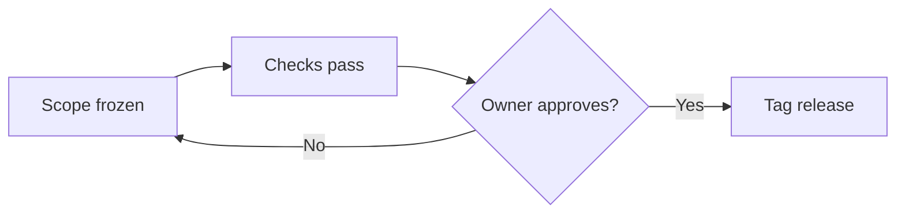

# Release Readiness Handbook: A Markdown Showcase

This page is a **sample document**. It is a short, fictional handbook written
so that every kind of Markdown formatting GitHub renders appears at least once,
in a realistic place, instead of one feature at a time. Read it rendered to see
the result, then open the **Raw** view (or the edit view) on GitHub to see the
source that produced it.

Use it as a comparison page: if something you wrote in an issue, pull request
or README looks different from the same construct here, check your source
against this file's raw text.

The companion
[Markdown Formatting Showcase](markdown-formatting-showcase.md) is the lookup
reference, with each syntax shown next to its output. This page is the other
half: the same formatting working together in one document. All names, versions
and numbers below are invented for illustration.

## Contents

- [Text and emphasis](#text-and-emphasis)
- [Quotes and alerts](#quotes-and-alerts)
- [Lists](#lists)
- [Tables](#tables)
- [Code](#code)
- [Diagrams](#diagrams)
- [Links and images](#links-and-images)
- [Footnotes](#footnotes)
- [Collapsible sections](#collapsible-sections)
- [Math](#math)
- [Inline HTML extras](#inline-html-extras)
- [Escaping and comments](#escaping-and-comments)
- [Emoji and rules](#emoji-and-rules)
- [Feature index](#feature-index)

## Text and emphasis

Project Orchard ships a release every four weeks. A paragraph is one or more
lines of text; a blank line starts the next paragraph. Words can be *italic*,
**bold**, ***bold and italic***, or ~~struck through~~ when a plan changes.
Inline `code` marks a file name such as `CHANGELOG.md` or a command such as
`git tag`.

A single newline inside a paragraph does not break the line.\
A backslash at the end of a line does, and so does a trailing double space.

### Heading level three: the release owner

Every release has one owner. The owner is named in the release issue, not in
this handbook.

#### Heading level four: the backup owner

The backup owner steps in when the owner is away. Headings go up to level
six, but a document that needs more than four levels usually needs splitting.

## Quotes and alerts

A plain blockquote quotes a source or sets a remark apart:

> A release is ready when the checklist is done, not when the calendar says so.
>
> — the Orchard maintainers' rule of thumb
>
> > A nested quote answers the quote above it.

GitHub also renders five kinds of **alert**, which are blockquotes that start
with a marker. Use them sparingly: an alert on every paragraph stops anyone
reading them.

> [!NOTE]
> A note adds context the reader may want but does not need.

The next one is a tip, for advice that saves time.

> [!TIP]
> Draft the release notes while the changes are still fresh.

Then comes an important one, for something the reader must not miss.

> [!IMPORTANT]
> Tag a release only from a commit that passed every required check.

And a warning, for something that can go wrong.

> [!WARNING]
> Re-using a version number breaks anyone who has already installed it.

Last is a caution, for something that can cause harm.

> [!CAUTION]
> Deleting a published tag cannot be undone for people who already pulled it.

## Lists

An unordered list, with a nested level:

- Prepare
  - Freeze the scope
  - Update the changelog
- Verify
  - Run the full test suite
  - Check the install on a clean machine
- Publish

An ordered list. The numbers you type do not have to be right; GitHub numbers
them in order from the first one:

1. Merge the last approved pull request.
1. Confirm the main branch is green.
1. Tag the release.
   1. Use the version from the changelog.
   1. Push the tag.
1. Announce it.

A task list, which GitHub shows as checkboxes you can tick in an issue or
pull request:

- [x] Scope frozen
- [x] Changelog updated
- [ ] Clean-machine install checked
- [ ] Release notes reviewed
  - [x] Draft written
  - [ ] Second reader signed off

A list item can hold more than one paragraph or a code block, if it is
indented to line up with the item's text:

- Verify the package.

  Run the checks from a fresh clone, not from your working copy:

  ```bash
  git clone https://example.com/orchard.git
  cd orchard
  npm ci
  npm test
  ```

- Publish only after that passes.

## Tables

Columns are separated by pipes. The row of dashes sets each column's
alignment: left, centred or right.

| Check | Owner | Status | Duration (min) |
| :--- | :---: | :---: | ---: |
| Unit tests | **Release owner** | Passed | 4 |
| Install on Windows | *Backup owner* | Passed | 12 |
| Install on Linux | Release owner | `pending` | 9 |
| Docs links | [Style guide][style-guide] | Passed | 2 |
| Pipe in a cell | Use `\|` to show one | n/a | 0 |

A cell holds inline formatting only: emphasis, code and links work, but a list
or a code block does not.

## Code

Inline code uses single backticks, as in `npm run check`. A fenced block uses
three backticks and a language name, which turns on syntax colouring.

```bash
# Tag and push a release (example version)
git tag -a v2.4.0 -m "Orchard 2.4.0"
git push origin v2.4.0
```

```json
{
  "name": "orchard",
  "version": "2.4.0",
  "private": true
}
```

A `diff` block colours added and removed lines, which suits showing a change:

```diff
- version: 2.3.1
+ version: 2.4.0
  channel: stable
```

A block with no language, or with `text`, is shown as plain monospace:

```text
Orchard 2.4.0
  released: example only
```

## Diagrams

A fenced block with the language `mermaid` is drawn as a diagram on GitHub:



What this shows: work loops back to the start until the owner approves, and
only then is the release tagged. See the
[Mermaid Diagram Types Showcase](mermaid-diagram-types-showcase.md) for the
other diagram types.

## Links and images

There are several link forms, and each has a place:

- An inline link: [the Markdown guide](https://example.com/markdown-guide).
- An inline link with a hover title:
  [the Markdown guide](https://example.com/markdown-guide "Opens the guide").
- A reference-style link, whose address is defined once at the bottom of the
  file: [the style guide][style-guide]. Several links can share one definition.
- A link to another file in the repository, by relative path:
  [the Markdown Formatting Showcase](markdown-formatting-showcase.md).
- A link to a heading in this page: [back to the contents](#contents).
- A bare web address in angle brackets: <https://example.com>.

An image uses the link syntax with a leading exclamation mark. The text in
the square brackets is the **alt text**: what a screen reader says, and what
shows if the image fails to load. This page includes no image file, so the
syntax is shown as code:

```markdown

```

On GitHub, `@username` mentions a person and notifies them, and `#123` links
to issue or pull request 123 in the same repository. Both are shown as code
here so that this page notifies nobody and points at nothing.

## Footnotes

A footnote keeps a side remark out of the sentence.[^cadence] A page can have
as many as it needs, and GitHub numbers them in the order they are used.[^order]

[^cadence]: The four-week cadence is an example, not a recommendation.
[^order]: The definitions can sit anywhere in the file; GitHub collects them at
    the bottom of the rendered page.

## Collapsible sections

Long optional detail can be folded away. This needs a little raw HTML, because
Markdown has no syntax of its own for it:

<!-- markdownlint-disable MD033 -->
<details>
<summary>Release day checklist (click to expand)</summary>

Anything Markdown can do works inside, including:

1. A numbered list
2. **Bold text** and `code`

```bash
echo "release day"
```

</details>
<!-- markdownlint-enable MD033 -->

## Math

GitHub renders LaTeX-style math between dollar signs. Inline math sits in a
sentence: a release that fixes $n$ bugs and adds $m$ features has
$n + m$ entries in its notes.

A block of math goes between double dollar signs:

$$
\text{ready} = \frac{\text{checks passed}}{\text{checks required}} \times 100
$$

A fenced block with the language `math` does the same:

```math
\sum_{i=1}^{n} \text{entries}_i
```

## Inline HTML extras

A few HTML tags are allowed because Markdown has no equivalent. Use them only
when you need them, since they do not read well in the raw source.

<!-- markdownlint-disable MD033 -->
- Keyboard keys: press <kbd>Ctrl</kbd> + <kbd>Shift</kbd> + <kbd>P</kbd> to open
  the command palette.
- Subscript and superscript: water is H<sub>2</sub>O, and 2<sup>10</sup> is 1024.
- Inserted text: the deadline moved to <ins>Friday</ins>.
- A forced line break inside one line of text: first part<br>second part.
<!-- markdownlint-enable MD033 -->

## Escaping and comments

A backslash shows a Markdown character literally: \*not italic\*, \# not a
heading, \[not a link\], and \`not code\`.

The line below this one holds a comment. It is part of the source but is not
shown in the rendered page, so it suits a note to the next editor:

<!-- Editors: keep this page fictional. Do not add real names or addresses. -->

## Emoji and rules

GitHub turns shortcodes into emoji: :rocket: for a launch, :white_check_mark:
for done, and :warning: for a risk.

A horizontal rule, made with three dashes on a line of their own, separates
two large parts of a page:

---

Use one only where a heading would not already do the job.

## Feature index

| Feature | Where it appears |
| --- | --- |
| Headings, levels 1 to 4 | [Text and emphasis](#text-and-emphasis) |
| Emphasis, strikethrough, inline code | [Text and emphasis](#text-and-emphasis) |
| Line breaks | [Text and emphasis](#text-and-emphasis) |
| Blockquotes, nested quotes, alerts | [Quotes and alerts](#quotes-and-alerts) |
| Unordered, ordered, nested and task lists | [Lists](#lists) |
| Tables with alignment | [Tables](#tables) |
| Fenced code, diff blocks | [Code](#code) |
| Mermaid diagram | [Diagrams](#diagrams) |
| Links, reference links, anchors, images | [Links and images](#links-and-images) |
| Footnotes | [Footnotes](#footnotes) |
| Collapsible section | [Collapsible sections](#collapsible-sections) |
| Math | [Math](#math) |
| `kbd`, subscript, superscript | [Inline HTML extras](#inline-html-extras) |
| Escaping, hidden comments | [Escaping and comments](#escaping-and-comments) |
| Emoji, horizontal rule | [Emoji and rules](#emoji-and-rules) |

[style-guide]: https://example.com/style-guide "The Orchard style guide"
