# Mermaid Diagram Types Showcase

Copyable examples of 33 diagram types, built around familiar documentation,
review, and learning workflows. Each example has one visual job: follow a
process, understand a relationship, or compare a small set of values.

## Choose the right visual

| What you want to explain | Start with | Also useful |
| --- | --- | --- |
| Steps and decisions | [Flowchart](#flowchart) | [State](#state-diagram), [Kanban](#kanban), [Agent flow](#agent-flow-diagram), [Swimlane](#swimlane-diagram) |
| Who talks to whom | [Sequence](#sequence-diagram) | [C4](#c4-diagram-context-level), [ZenUML](#zenuml), [Use case](#use-case-diagram), [Event modeling](#event-modeling-diagram) |
| Structure and relationships | [Class](#class-diagram) | [ER](#entity-relationship-diagram), [Architecture](#architecture-diagram), [Block](#block-diagram), [Tree view](#tree-view) |
| Branches or topic groups | [Git graph](#git-graph) | [Mindmap](#mindmap), [Requirements](#requirement-diagram) |
| Time and experience | [Gantt](#gantt-chart) | [Timeline](#timeline), [Journey](#user-journey) |
| Quantities and comparisons | [XY](#xy-chart) | [Pie](#pie-chart), [Quadrant](#quadrant-chart), [Sankey](#sankey-diagram), [Radar](#radar-chart), [Treemap](#treemap), [Venn](#venn-diagram) |
| Causes, strategy, and how predictable work is | [Ishikawa](#ishikawa-fishbone-diagram) | [Wardley](#wardley-map), [Cynefin](#cynefin-diagram) |
| The shape of a text rule | [Railroad](#railroad-diagram) | Use for a grammar or a naming pattern |
| A binary field layout | [Packet](#packet-diagram) | Use when bit positions matter |

## Read, copy, and adapt

- Copy the whole fenced block, including its configuration between the two
  `---` lines, for the example's colours and spacing. Remove that configuration
  to use your viewer's default theme.
- Blue, teal, and amber form a small recurring palette. Labels, shapes, and
  arrow text carry the meaning; colour is an additional cue.
- The examples use a light palette. For a dark-background document, remove
  the configuration to inherit your viewer's theme, or adapt the theme for it.
- Keep labels short. Use `LR` for a short horizontal sequence and `TD` for
  branching paths. Split a crowded diagram into two smaller ones.
- Values and dates below are illustrative, not repository metrics or a
  delivery commitment. Every diagram has a nearby explanation of its meaning.

The configuration uses Mermaid's [diagram-level theming](https://mermaid.js.org/config/theming.html).
Diagram types support different styling options, and viewers may use different
Mermaid versions. Check the preview in the viewer your readers will use;
configuration cannot add a diagram type missing from that renderer.

Use the Mermaid preview described in
[Setting Up Your Local Dev Environment](../0_prerequisites/setup-local-dev-environment.md)
when working locally. The later examples need particular renderer features;
ZenUML additionally needs its integration. Their support notes are part of the
copy-and-preview guidance, not a promise of identical GitHub rendering.

**Checked against Mermaid 12.0.0.** Every example here except ZenUML parses
under that version, which is pinned in `package.json` and checked by
`tests/mermaid-diagrams.test.mjs` on every pull request, so a diagram that
stops parsing fails CI. A parse check proves the syntax is valid for that
version; it does not prove a viewer draws it the same way.

Mermaid 12 changed the defaults. Per its 12.0.0 release notes, flowchart, class,
state, entity-relationship, and requirement diagrams that do not name a layout
are now laid out by ELK instead of dagre, and the default look is new, so a
diagram can be arranged differently from an earlier screenshot or from a viewer
still on Mermaid 11. To keep the previous arrangement, add `layout: dagre` (and
`look: classic` for the old look) to the diagram's configuration. The examples
below set their own colours; the parse check does not render them.

**GitHub rendering (checked by hand on 2026-09-30):** every example rendered on
github.com except ZenUML, which GitHub does not render because it needs the
integration described below. That result is a dated one-off check and can
change when GitHub updates its Mermaid version, so re-check before you rely on a
newer diagram type there.

## Workflow and structure

### Flowchart

**Use for:** A process with a decision and a clear destination. A change either returns
for more evidence or proceeds to review. Rounded ends, a decision diamond, and labelled
arrows make the two paths easy to follow.

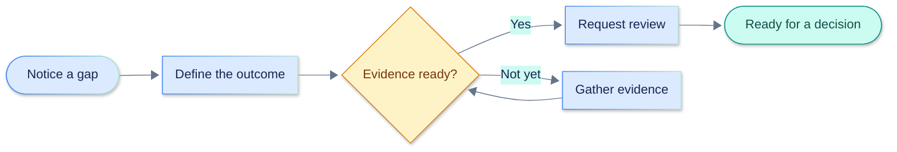

**Try changing:** `LR` to `TD`, then compare the reading direction.

### Sequence diagram

**Use for:** Interactions in time order. A contributor submits a change, the reviewer
checks its evidence, and GitHub records the review. Numbered messages make the order
explicit; shaded phases separate submission from assessment.

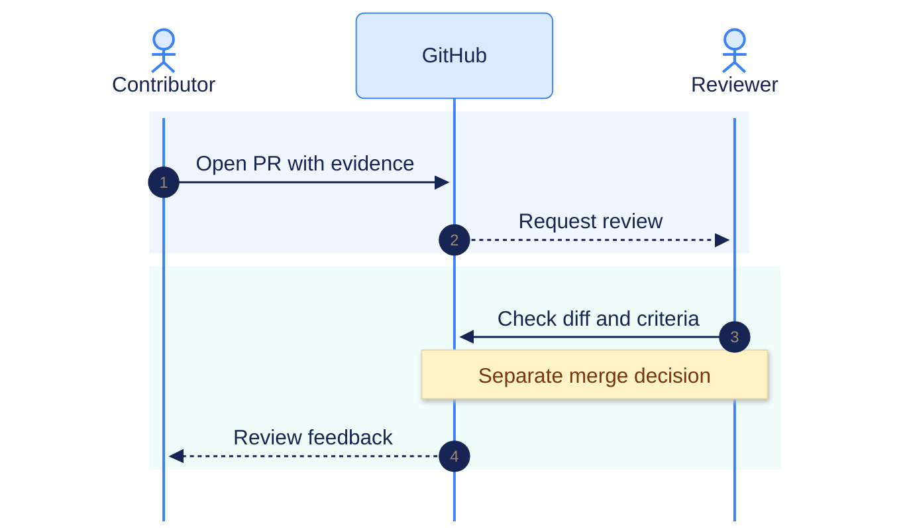

### Class diagram

**Use for:** Types, their properties, and their relationships. An issue defines
criteria; a pull request references the issue and supplies evidence for review.
Different fills distinguish the types without changing their relationship.

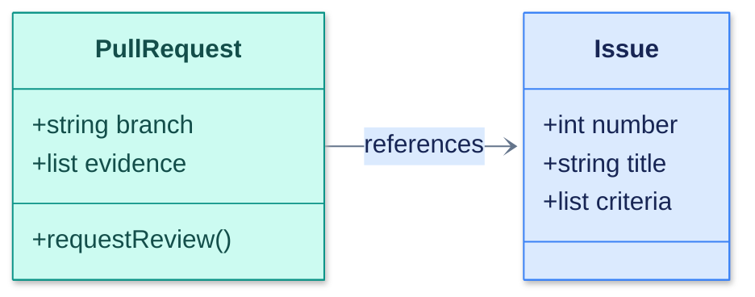

### State diagram

**Use for:** An item's states and the events that change them. This includes a normal
completion path and a return to open when an audit finds an outstanding criterion. A
merge alone is not the evidence gate.

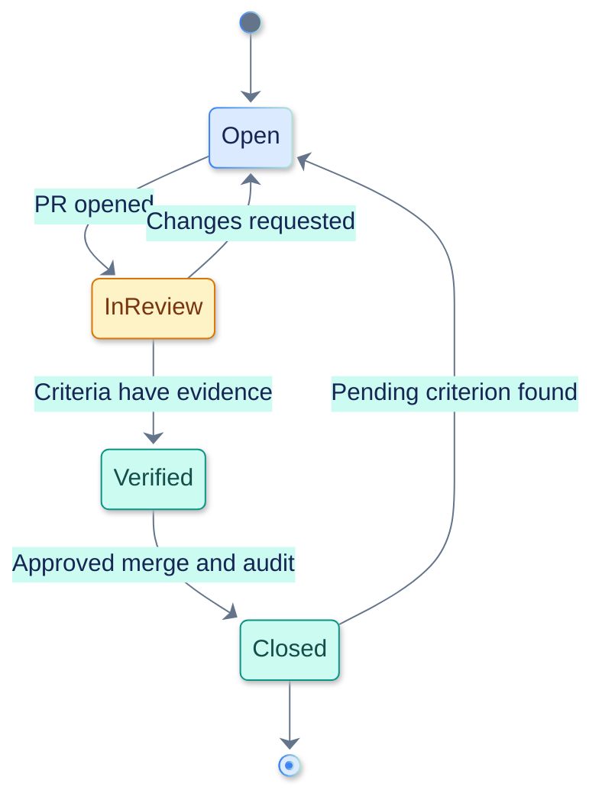

### Entity relationship diagram

**Use for:** Records and cardinality. One issue can have several pull requests; each
pull request in this simplified model references one issue. `PK` identifies the primary
key and `FK` the linking field.

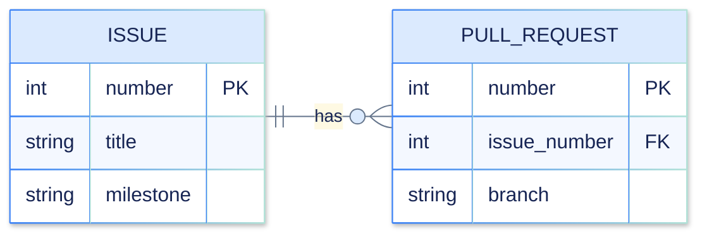

### Git graph

**Use for:** Commits, branches, and merges. The feature branch contains two commits
before it merges into `main`. Commit labels describe changes; the graph shows topology
rather than the full review process.

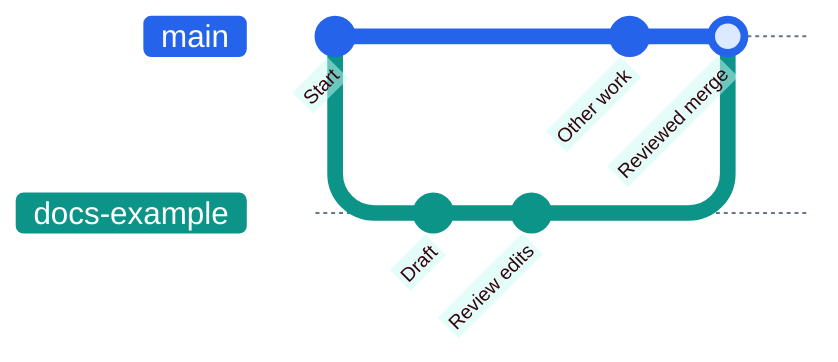

### Mindmap

**Use for:** A topic and its parts. Three branches group the learning path into
understanding, practice, and verification. Indentation defines the hierarchy.

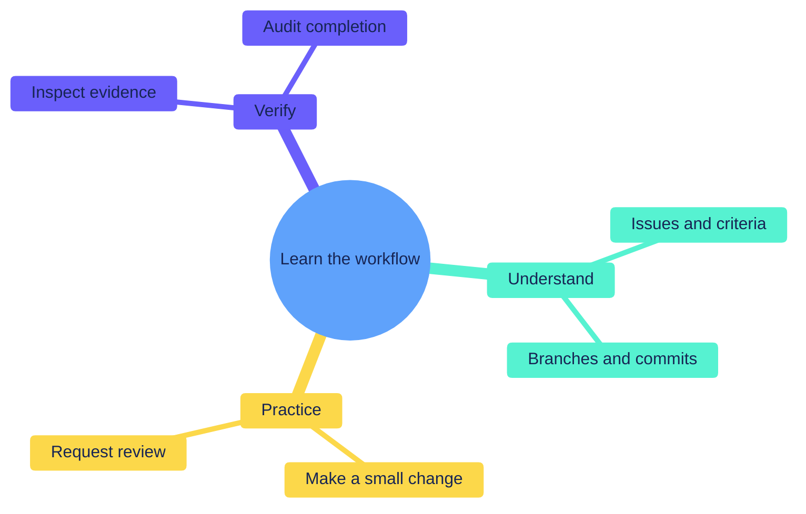

### Requirement diagram

**Use for:** An explicit requirement and what satisfies or verifies it. The PR template
prompts for evidence; a closure review verifies that evidence exists.

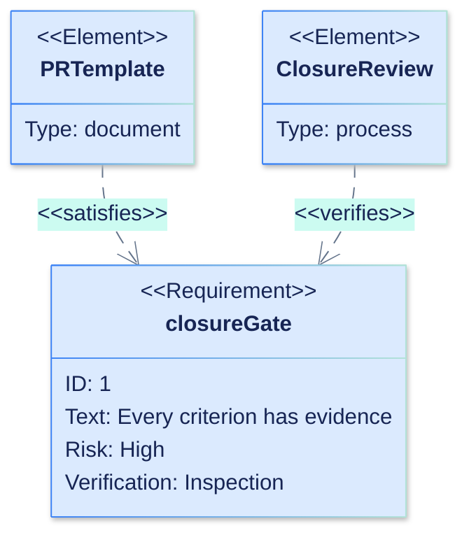

### C4 diagram (context level)

**Use for:** People and systems at a high level. A colleague asks a coding assistant for
help; the assistant interacts with GitHub when tools and authorization permit it. C4 has
its own styling and layout commands.

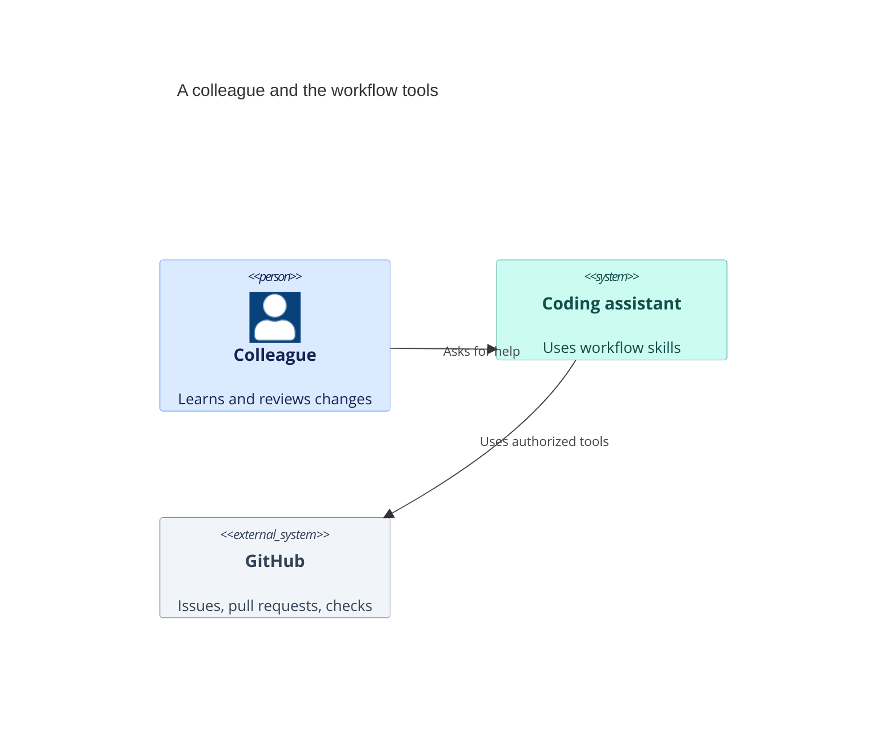

**Preview note:** C4 is experimental in Mermaid; check its layout in your target viewer.

## Time and experience

### Gantt chart

**Use for:** Task duration, overlap, and dependencies. A completed draft is followed by
an active review and planned verification. The final marker is a decision milestone, not
a publish command.

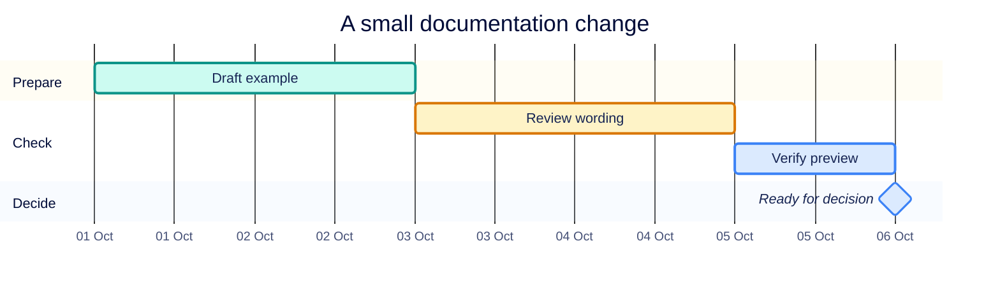

### Timeline

**Use for:** Milestones in order when duration is not the point. These four illustrative
stages show how a rough idea becomes a verified example.

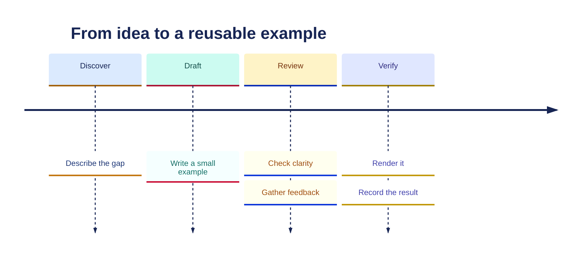

### User journey

**Use for:** The experience of moving through a process. Scores run from 1 (difficult)
to 5 (smooth). The lower feedback score suggests a place for better instructions; the
values are fictional.

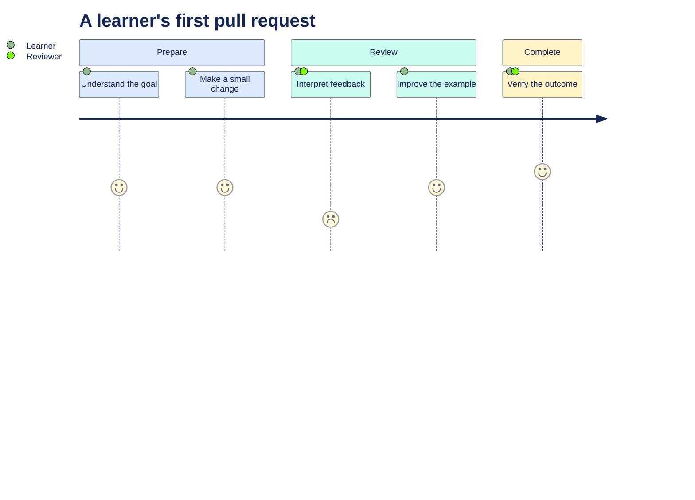

## Quantities and comparisons

### Pie chart

**Use for:** A few parts of one total. Ten fictional learning tasks are split into seven
complete, two in progress, and one planned. `showData` makes counts visible in the
legend rather than relying on slice size alone.

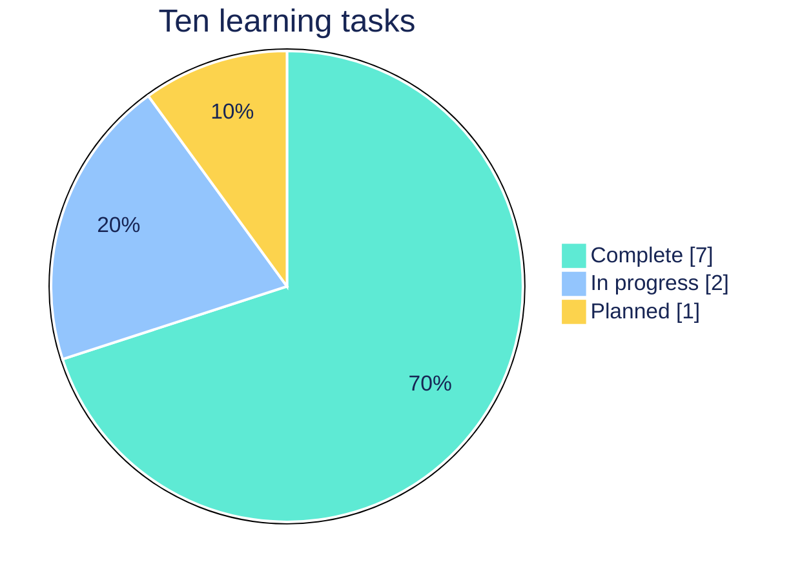

### Quadrant chart

**Use for:** Tradeoffs across two axes. Impact increases to the right; effort increases
upward. The lower-right quadrant contains useful, smaller changes. This comparison aid
does not replace the repository's priority labels.

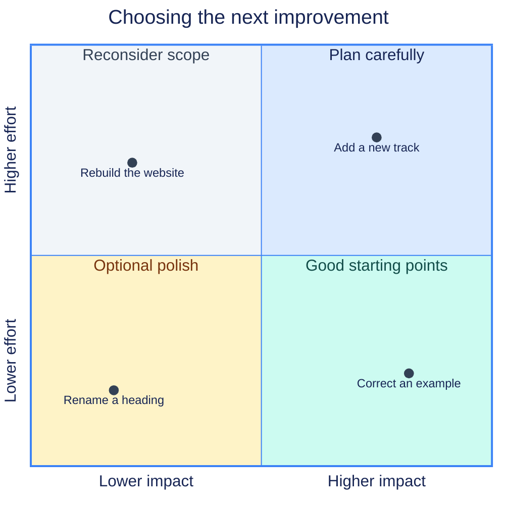

### Sankey diagram

**Use for:** Quantities moving between stages. Of ten fictional submissions, seven are
ready and three need changes. Outgoing values sum to the incoming ten; band width
represents quantity, not priority.

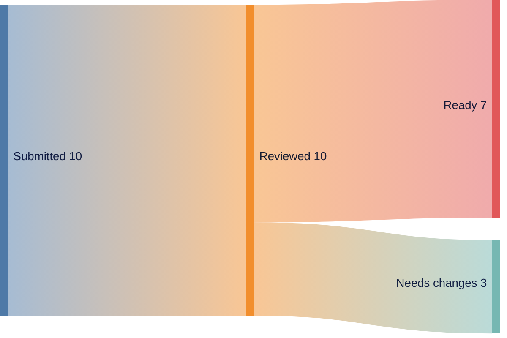

### XY chart

**Use for:** Values across categories or time. The bars show completed practice tasks in
four fictional weeks: 4, 9, 6, and 15. A zero baseline lets readers compare bar lengths
fairly.

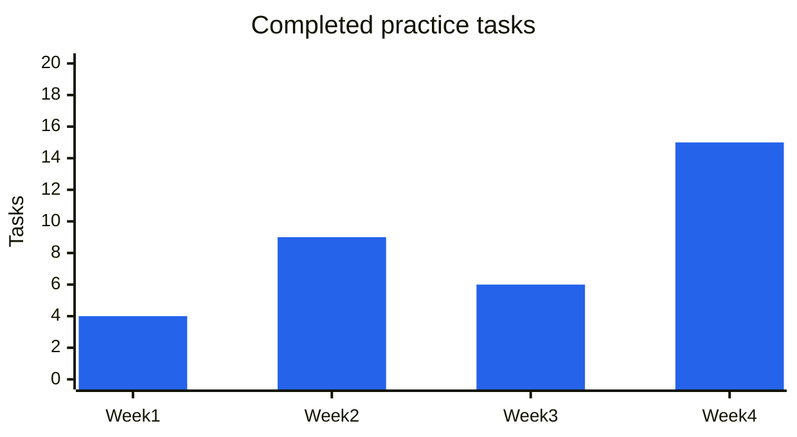

## Examples needing particular renderer features

Preview these examples with your actual Mermaid integration before choosing
one for a shared document. A `-beta` keyword is part of the syntax where shown;
keep it when copying the example.

### Architecture diagram

**Use for:** Services grouped within an infrastructure boundary. A documentation server
and its database belong to the same group; their connection is explicit. Built-in icons
avoid a dependency on a custom icon pack.

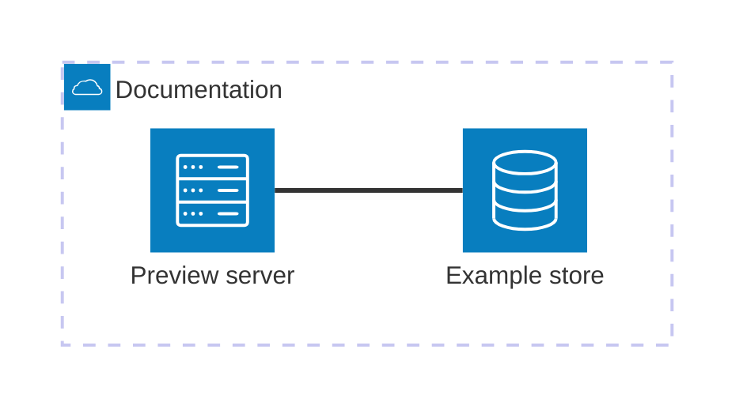

### Block diagram

**Use for:** A deliberately arranged grid of components. Three components occupy
alternate columns, leaving room for arrows. Spacing clarifies the flow without adding
more boxes.

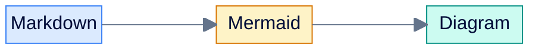

### Kanban

**Use for:** Work grouped by status. Each column has a stable identifier and a readable
label; the cards are fictional examples at different stages. A Mermaid board is a
picture, not a live GitHub Projects board.

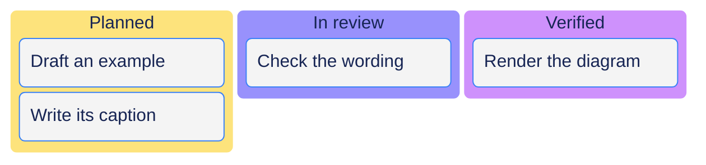

### Radar chart

**Use for:** Several comparable measures on the same scale. Two fictional practice
profiles are compared across Git, GitHub, review, and automation. The fixed 0–5 scale
avoids rescaling around whichever series is visible; these are illustrative scores.

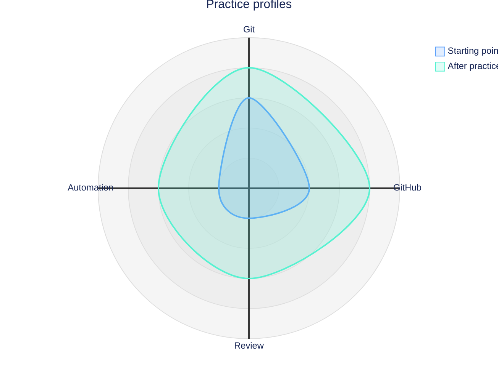

### Packet diagram

**Use for:** Fields at specific bit positions. This fictional 32-bit header contains
four 8-bit fields. Labels and boundaries explain the layout; it is not a real network
protocol definition.

```mermaid
---
config:
  theme: "base"
  packet:
    bitsPerRow: 32
  themeVariables:
    primaryColor: "#dbeafe"
    primaryTextColor: "#172554"
    primaryBorderColor: "#3b82f6"
    secondaryColor: "#ccfbf1"
    tertiaryColor: "#fef3c7"
    lineColor: "#64748b"
    fontFamily: "Segoe UI, Arial, sans-serif"
---
packet-beta
    0-7: "Version"
    8-15: "Flags"
    16-23: "Length"
    24-31: "Checksum"
```

### ZenUML

**Use for:** Interactions expressed as nested calls. The contributor asks for a review;
the assistant reads criteria and inspects evidence through GitHub. Nesting shows that
these calls happen inside the review request.

```mermaid
zenuml
    title Review interactions
    Contributor->Assistant: RequestReview() {
        Assistant->GitHub: ReadCriteria()
        Assistant->GitHub: InspectEvidence()
    }
```

**Preview note:** your renderer must register the
[Mermaid ZenUML integration](https://mermaid.js.org/syntax/zenuml.html#integrating-with-your-librarywebsite).
Use the earlier sequence-diagram example when that integration is unavailable.

### Treemap

**Use for:** Parts within nested groups. The fictional collection has six GitHub
lessons, two LLM lessons, and two example pages. Rectangle area represents the values;
the parent label groups the ten items.

```mermaid
---
config:
  theme: "base"
  themeVariables:
    primaryColor: "#dbeafe"
    primaryTextColor: "#172554"
    primaryBorderColor: "#3b82f6"
    secondaryColor: "#ccfbf1"
    tertiaryColor: "#fef3c7"
    lineColor: "#64748b"
    fontFamily: "Segoe UI, Arial, sans-serif"
---
treemap-beta
"Education collection"
    "GitHub lessons": 6
    "LLM lessons": 2
    "Example pages": 2
```

## Added in Mermaid 12

Mermaid 12.0.0 added the ten types below. They need a Mermaid 12 renderer: a
viewer on an older version shows an error instead of a diagram, and each keyword
ends in `-beta` (except event modeling), which is part of the syntax. The
parse check proves these examples are valid for Mermaid 12.0.0; it does not
prove how any viewer draws them, so preview them in the viewer your readers will
use. Their content is fictional.

### Use case diagram

**Use for:** Who does what with a system. A reader works through modules and a maintainer reviews pull
requests; reviewing includes checking the acceptance criteria. The boundary names the
system, and the people sit outside it.

```mermaid
---
config:
  theme: "base"
  themeVariables:
    primaryColor: "#dbeafe"
    primaryTextColor: "#172554"
    primaryBorderColor: "#3b82f6"
    secondaryColor: "#ccfbf1"
    tertiaryColor: "#fef3c7"
    lineColor: "#64748b"
    fontFamily: "Segoe UI, Arial, sans-serif"
---
usecase-beta
  actor Reader
  actor Maintainer
  systemBoundary Training["Training program"]
    ReadModule(Read a module)
    DoExercise(Do the exercise)
    ReviewPr(Review a pull request)
    CheckCriteria(Check the criteria)
  end
  Reader --> ReadModule
  Reader --> DoExercise
  Maintainer --> ReviewPr
  ReviewPr --include--> CheckCriteria
```

### Venn diagram

**Use for:** What two groups share. The fictional counts show modules done in a web browser, modules
done in a terminal, and the few that need both. The overlap is its own labelled region.

```mermaid
---
config:
  theme: "base"
  themeVariables:
    primaryColor: "#dbeafe"
    primaryTextColor: "#172554"
    primaryBorderColor: "#3b82f6"
    secondaryColor: "#ccfbf1"
    tertiaryColor: "#fef3c7"
    lineColor: "#64748b"
    fontFamily: "Segoe UI, Arial, sans-serif"
---
venn-beta
  title "Modules by how you do them"
  set Web["Web UI"]: 10
  set Terminal["Terminal"]: 4
  union Web,Terminal["Mixed"]: 2
```

### Ishikawa (fishbone) diagram

**Use for:** Causes behind one problem, grouped by category. The first line is the effect, and each
indented group lists its causes.

```mermaid
---
config:
  theme: "base"
  themeVariables:
    primaryColor: "#dbeafe"
    primaryTextColor: "#172554"
    primaryBorderColor: "#3b82f6"
    secondaryColor: "#ccfbf1"
    tertiaryColor: "#fef3c7"
    lineColor: "#64748b"
    fontFamily: "Segoe UI, Arial, sans-serif"
---
ishikawa-beta
    Release is late
    Process
        Unclear acceptance criteria
        Changelog reviewed at the end
    People
        One maintainer
    Tools
        Slow checks
```

### Wardley map

**Use for:** Where the parts of a service sit by visibility to the user and maturity. Each component
has two coordinates between 0 and 1, links show dependency, and an `evolve` line shows
where a component is expected to move.

```mermaid
---
config:
  theme: "base"
  themeVariables:
    primaryColor: "#dbeafe"
    primaryTextColor: "#172554"
    primaryBorderColor: "#3b82f6"
    secondaryColor: "#ccfbf1"
    tertiaryColor: "#fef3c7"
    lineColor: "#64748b"
    fontFamily: "Segoe UI, Arial, sans-serif"
---
wardley-beta
title Documentation site
anchor Reader [0.95, 0.63]
component Training module [0.78, 0.62]
component Diagram showcase [0.55, 0.45]
component Mermaid renderer [0.30, 0.75]
Reader -> Training module
Training module -> Diagram showcase
Diagram showcase -> Mermaid renderer
evolve Mermaid renderer 0.9
```

### Tree view

**Use for:** A folder or hierarchy as an indented tree. The fictional tree shows three of the
education folders, each with one file.

```mermaid
---
config:
  theme: "base"
  themeVariables:
    primaryColor: "#dbeafe"
    primaryTextColor: "#172554"
    primaryBorderColor: "#3b82f6"
    secondaryColor: "#ccfbf1"
    tertiaryColor: "#fef3c7"
    lineColor: "#64748b"
    fontFamily: "Segoe UI, Arial, sans-serif"
---
treeView-beta
    "education"
        "0_prerequisites"
            "module-0-1-what-is-version-control.md"
        "1_beginners"
            "module-1-1-getting-started.md"
        "4_next-step"
            "module-4-1-reviewing-changes-an-ai-agent-wrote.md"
```

### Railroad diagram

**Use for:** The shape of a text rule. This one is an EBNF grammar for a branch name: a type, a
slash, then words joined by hyphens. Alternatives branch, and `{ ... }` repeats. The
keyword `railroad-ebnf-beta` selects EBNF notation; the same family has other keywords
for other notations, and only the EBNF form is shown here.

```mermaid
---
config:
  theme: "base"
  themeVariables:
    primaryColor: "#dbeafe"
    primaryTextColor: "#172554"
    primaryBorderColor: "#3b82f6"
    secondaryColor: "#ccfbf1"
    tertiaryColor: "#fef3c7"
    lineColor: "#64748b"
    fontFamily: "Segoe UI, Arial, sans-serif"
---
railroad-ebnf-beta
  branch = type , "/" , description ;
  type = "fix" | "feat" | "docs" | "test" | "ci" ;
  description = word , { "-" , word } ;
  word = letter , { letter | digit } ;
```

### Cynefin diagram

**Use for:** Sorting work by how predictable it is: clear, complicated, complex, or chaotic. Each
domain lists fictional items, so a reader can see which kind of response each needs.

```mermaid
---
config:
  theme: "base"
  themeVariables:
    primaryColor: "#dbeafe"
    primaryTextColor: "#172554"
    primaryBorderColor: "#3b82f6"
    secondaryColor: "#ccfbf1"
    tertiaryColor: "#fef3c7"
    lineColor: "#64748b"
    fontFamily: "Segoe UI, Arial, sans-serif"
---
cynefin-beta
  title Where does this work belong
  complex
    "Try a new teaching format"
  complicated
    "Plan a release"
  clear
    "Fix a typo"
  chaotic
    "Respond to a leaked secret"
```

### Event modeling diagram

**Use for:** A system as a timeline of frames. Each numbered frame is a command (`cmd`), an event
(`evt`), or a read model (`rmo`). Names are single words. The keyword has no `-beta`.

```mermaid
---
config:
  theme: "base"
  themeVariables:
    primaryColor: "#dbeafe"
    primaryTextColor: "#172554"
    primaryBorderColor: "#3b82f6"
    secondaryColor: "#ccfbf1"
    tertiaryColor: "#fef3c7"
    lineColor: "#64748b"
    fontFamily: "Segoe UI, Arial, sans-serif"
---
eventmodeling
  tf 01 cmd OpenPullRequest
  tf 02 evt PullRequestOpened
  tf 03 rmo ReviewQueue
  tf 04 cmd ApproveChange
  tf 05 evt ChangeApproved
```

### Agent flow diagram

**Use for:** The loop an AI agent follows, with the point where a person decides. It uses the same
node and arrow syntax as a flowchart. The agent plans, acts, checks, and repeats; a
maintainer, not the agent, merges.

```mermaid
---
config:
  theme: "base"
  themeVariables:
    primaryColor: "#dbeafe"
    primaryTextColor: "#172554"
    primaryBorderColor: "#3b82f6"
    secondaryColor: "#ccfbf1"
    tertiaryColor: "#fef3c7"
    lineColor: "#64748b"
    fontFamily: "Segoe UI, Arial, sans-serif"
---
agentflow-beta
  start((Task)) --> plan[Plan the change]
  plan --> act[Run a tool]
  act --> check{Checks pass?}
  check -->|yes| review[Human reviews the diff]
  check -->|no| plan
  review --> done((Merged by a maintainer))
```

### Swimlane diagram

**Use for:** Handoffs between roles in one process. It reuses flowchart syntax, and each `subgraph`
is a lane: a reader works through a module, then hands the result to a maintainer.

```mermaid
---
config:
  theme: "base"
  themeVariables:
    primaryColor: "#dbeafe"
    primaryTextColor: "#172554"
    primaryBorderColor: "#3b82f6"
    secondaryColor: "#ccfbf1"
    tertiaryColor: "#fef3c7"
    lineColor: "#64748b"
    fontFamily: "Segoe UI, Arial, sans-serif"
---
swimlane-beta
  subgraph Reader
    A[Open the module] --> B[Do the exercise]
  end
  subgraph Maintainer
    C[Review the pull request]
  end
  B --> C
```

## Make your own diagram clearer

1. Choose the type that answers the reader's question.
2. Write the main path before adding secondary branches.
3. Keep labels short and identify what arrows or values mean.
4. Add spacing, then use a small palette to reinforce groups or states.
5. Preview at the width your readers will see and check for clipped labels.
6. Keep a nearby sentence explaining relationships or the underlying values.

For a different visual theme, adapt the configuration using the
[Mermaid theme reference](https://mermaid.js.org/config/theming.html).
