# Mermaid Diagram Types Showcase

A lookup reference — one minimal example of every Mermaid diagram type
documented as of this page's writing, so you can copy the shape you need
instead of searching external docs. Two tiers, in this order:

1. **Established types** — mature, in Mermaid for years, confirmed to
   render on GitHub.com.
2. **Newer/extended types** — added to Mermaid more recently. GitHub's own
   diagram-support announcement only explicitly lists flowcharts, UML,
   git graphs, user journey, and Gantt — it predates these, and doesn't
   confirm or rule them out. Treat these as "try it, verify on GitHub
   after you push" rather than guaranteed.

If you're viewing this in an editor instead of on GitHub.com, the Mermaid
preview extension from
[Extra: Setting Up Your Local Dev Environment](../0_prerequisites/setup-local-dev-environment.md)
renders most of these locally regardless of what GitHub itself supports —
useful for checking a newer-tier diagram before you commit it somewhere
that matters.

## Established types

## Flowchart

The most common type — already used throughout this program's other
pages. Nodes, edges, and decision branches.

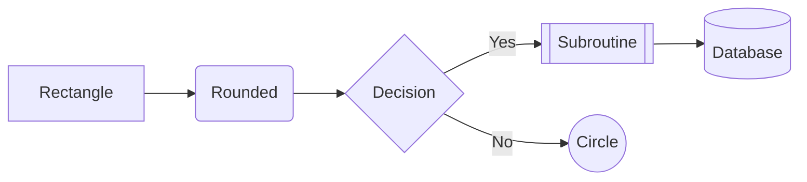

## Sequence diagram

Shows interactions between participants over time — requests, responses,
who talks to whom in what order.

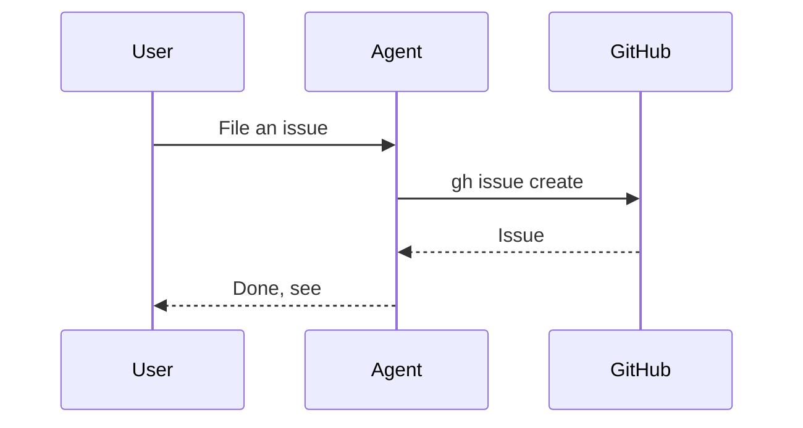

## Class diagram

Structure — objects, their attributes/methods, and relationships between
them. More common in software design docs than this program's usual
content, but worth knowing it exists.

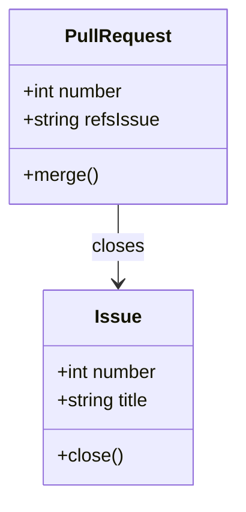

## State diagram

Already used in `education/facilitator-guide.md` for the sandbox repo's
lifecycle — states and the transitions between them.

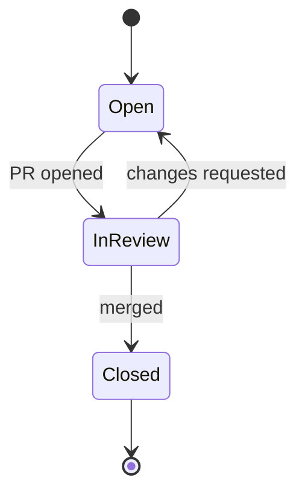

## Entity relationship diagram

Database-style schema — entities, their fields, and how they relate.

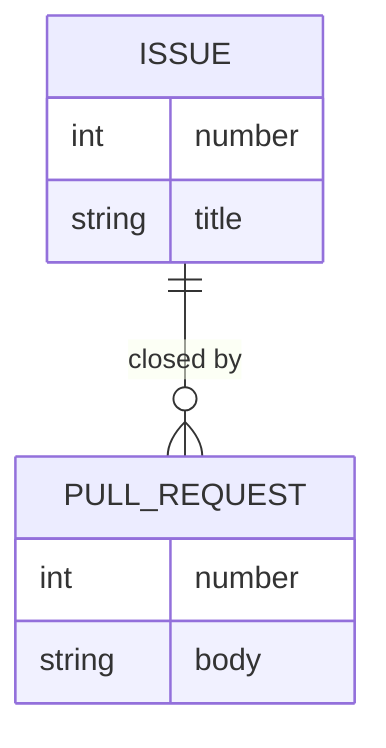

## Git graph

Already used in `education/1_beginners/session-1-getting-started.md` —
commits, branches, and merges, drawn the way `git log --graph` would show
them.

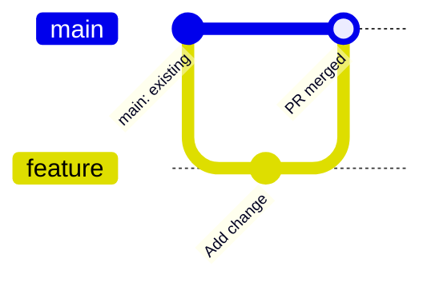

## Mindmap

Already used throughout `education/README.md` for topic overviews — a
central idea branching into related sub-topics.

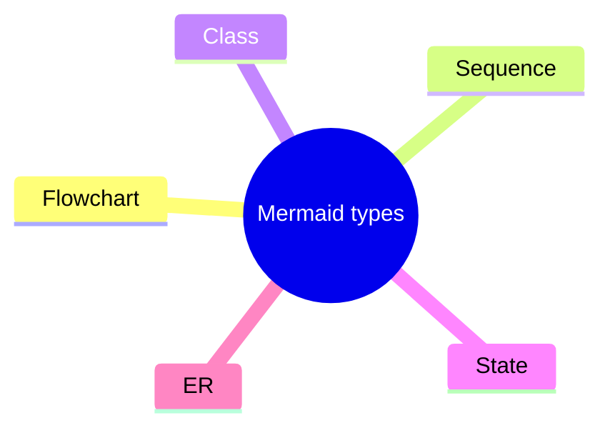

## Pie chart

Proportions of a whole.

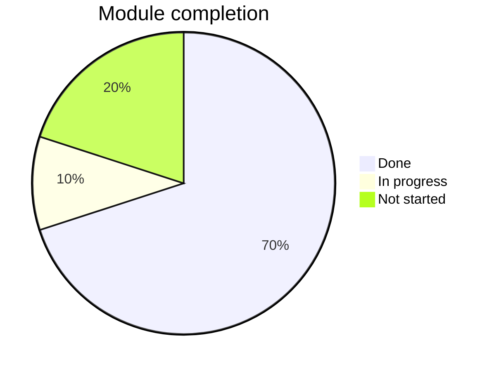

## Gantt chart

Timeline/scheduling — tasks, durations, and dependencies.

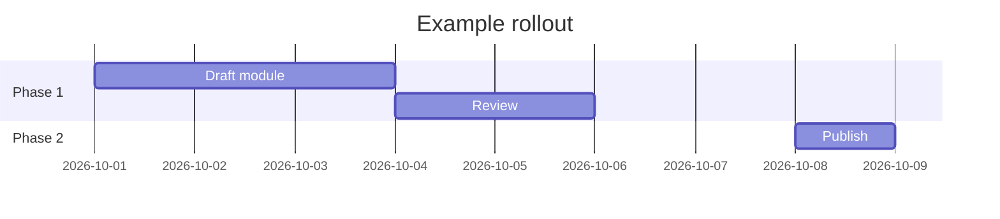

## User journey

Steps in a process from a user's perspective, each scored for
satisfaction — useful for UX-style walkthroughs.

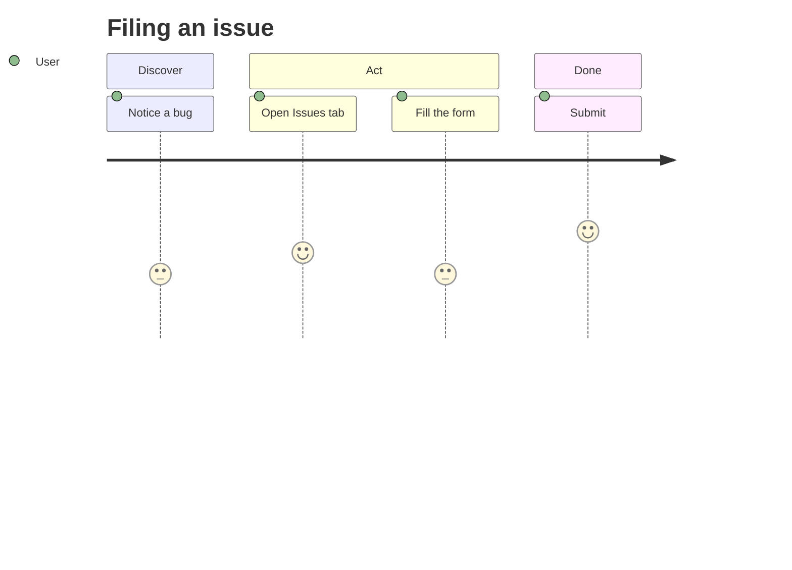

## Quadrant chart

Plots items across two axes into four quadrants — useful for
prioritization (e.g. this repo's own P0-P3 impact/urgency thinking).

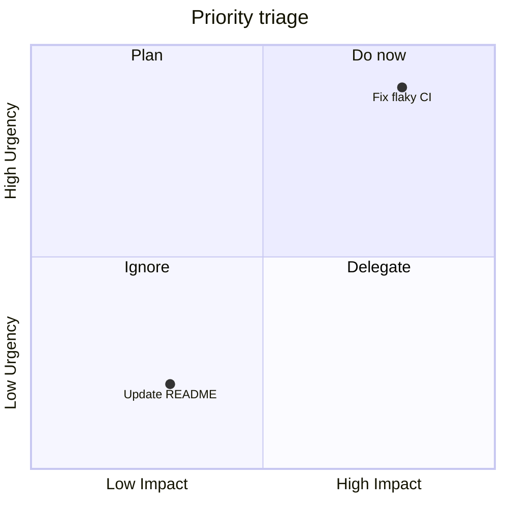

## Timeline

A chronological sequence of events, simpler than a Gantt chart when
duration/overlap doesn't matter.

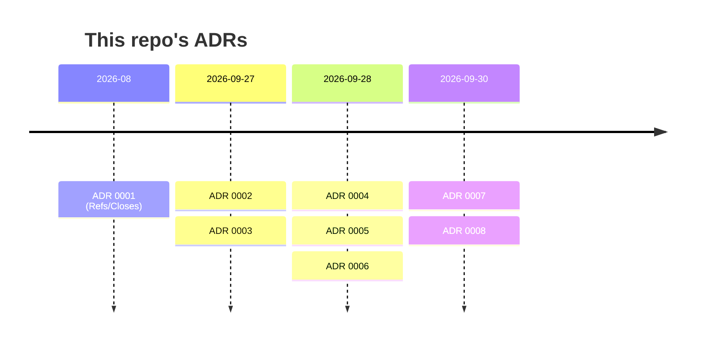

## Requirement diagram

Formal requirements and what satisfies them — closer to systems
engineering than everyday software docs, but a real Mermaid type.

```mermaid
requirementDiagram
    requirement closureGate {
      id: 1
      text: every criterion needs evidence
      risk: high
      verifymethod: review
    }
    element PRTemplate {
      type: file
    }
    PRTemplate - satisfies -> closureGate
```

## C4 diagram (context level)

Software architecture at the "who talks to what system" level — the
level this program's own skills-vs-education split operates at, even
though this repo doesn't use C4 notation elsewhere.

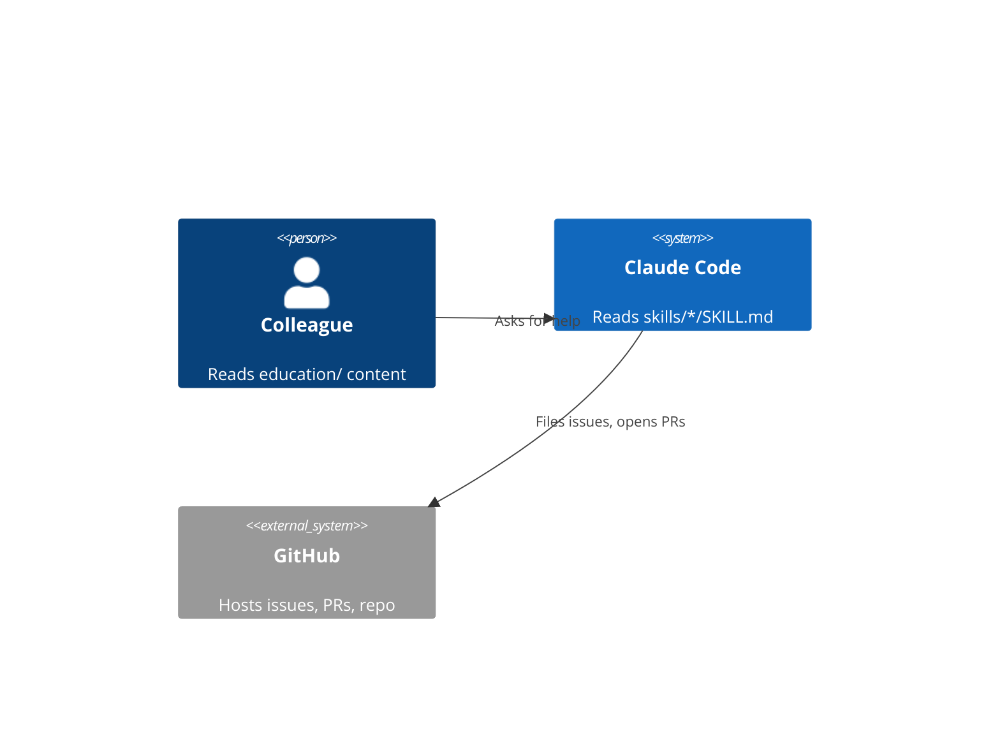

## Sankey diagram

Flow quantities between stages — width of each band shows volume, useful
for showing where something (traffic, budget, issues) actually goes.


## XY chart

Plotted data points/bars along two axes — closer to a conventional bar or
line chart than any of the above.

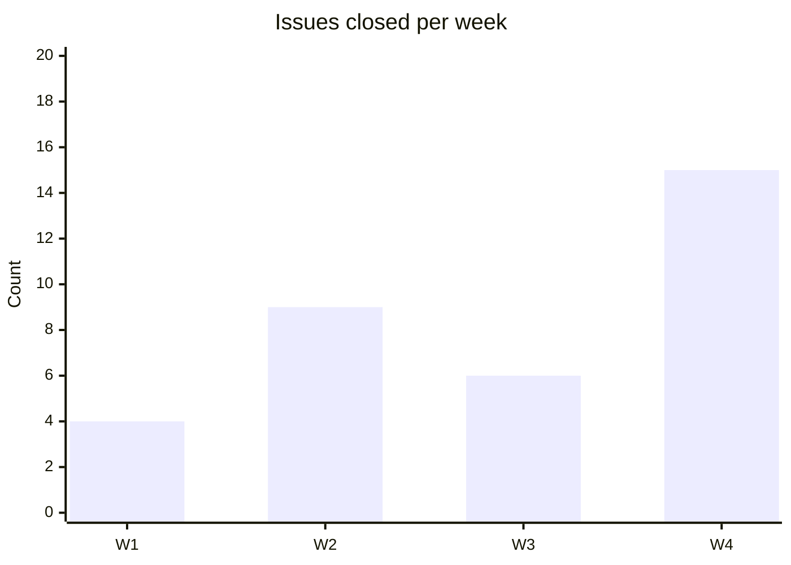

## Newer/extended types

Everything below is a more recent Mermaid addition. Confirmed to parse
under current Mermaid syntax; **not** confirmed to render on GitHub.com
specifically — check the rendered page after pushing before relying on
one of these somewhere colleagues will actually read it.

### Architecture diagram

A cloud/infrastructure-style boxes and the
connections between them, GitHub's newest diagram type as of this
writing.

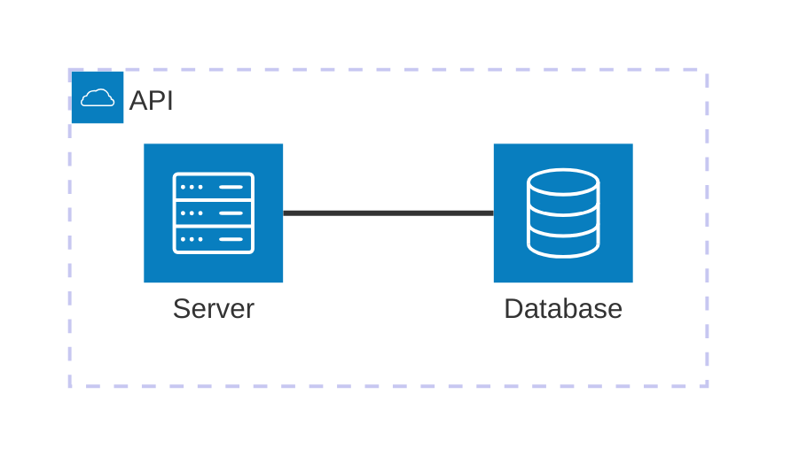

### Block diagram

General-purpose boxes-and-connections, less constrained than a flowchart
— closer to a whiteboard sketch than a strict flow.

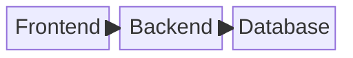

### Kanban

A literal Kanban board — columns and cards, the shape `github-projects`
describes conceptually but as an actual diagram.

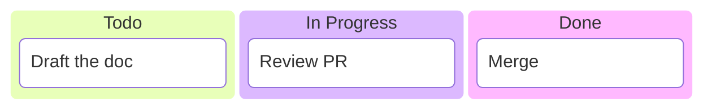

### Radar chart

Multiple quantities compared across axes radiating from a center point —
skill/capability comparisons are the common use.

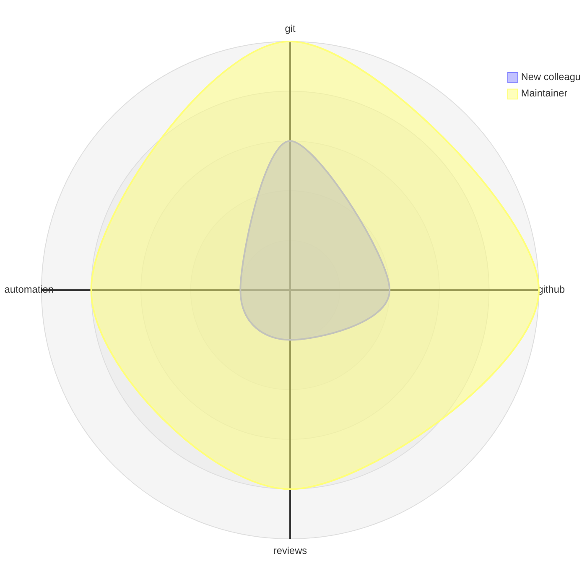

### Packet diagram

Byte/bit-level layout of a network packet or binary format — a niche,
specific use case.

```mermaid
packet-beta
0-7: "Source Port"
8-15: "Destination Port"
16-31: "Length"
```

### ZenUML

An alternative syntax for sequence diagrams, more code-like than
Mermaid's own `sequenceDiagram`.

```mermaid
zenuml
    title Filing an issue
    User->Agent: File an issue
    Agent->GitHub: gh issue create
```

### Treemap

Nested rectangles sized by value — proportions within a hierarchy, an
alternative to a pie chart when categories nest.

```mermaid
treemap-beta
"Education"
    "GitHub track": 6
    "LLM track": 1
    "Examples": 2
```
