# Mermaid Diagram Types Showcase

A lookup reference — one minimal example of each major Mermaid diagram
type, so you can copy the shape you need instead of searching external
docs. Every example here is confirmed to render on GitHub.com; if you're
viewing this in an editor instead, the Mermaid preview extension from
[Extra: Setting Up Your Local Dev Environment](../extra/setup-local-dev-environment.md)
renders these locally too. Mermaid has more diagram types than this page
covers (some are newer or still experimental) — this is the established
core, not the complete list.

## Flowchart

The most common type — already used throughout this program's other
pages. Nodes, edges, and decision branches.

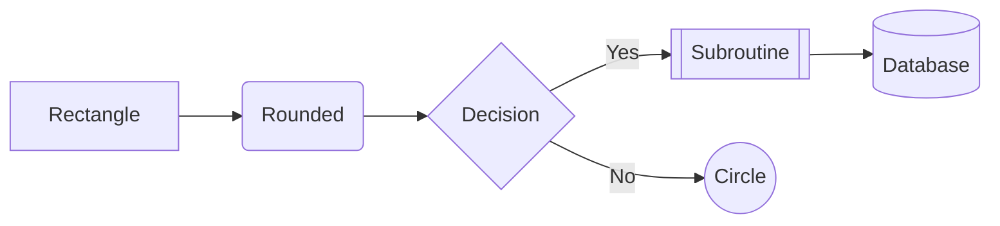

## Sequence diagram

Shows interactions between participants over time — requests, responses,
who talks to whom in what order.

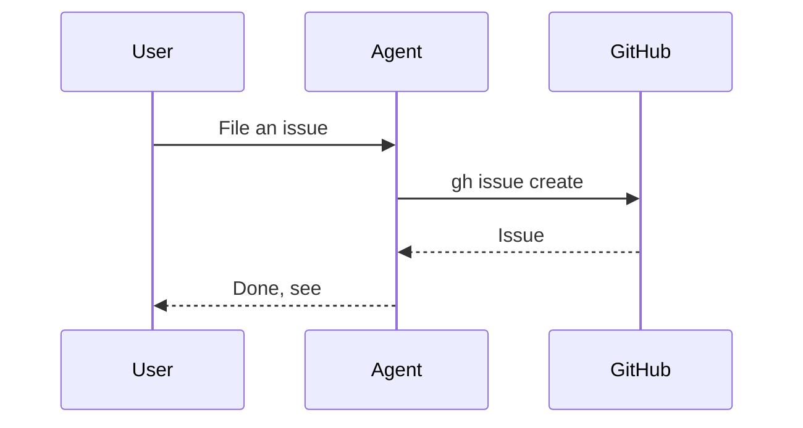

## Class diagram

Structure — objects, their attributes/methods, and relationships between
them. More common in software design docs than this program's usual
content, but worth knowing it exists.

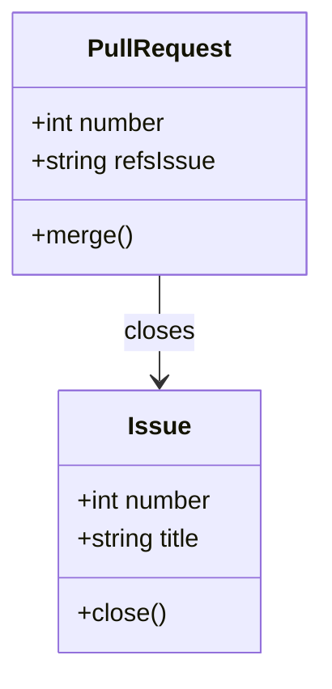

## State diagram

Already used in `education/facilitator-guide.md` for the sandbox repo's
lifecycle — states and the transitions between them.

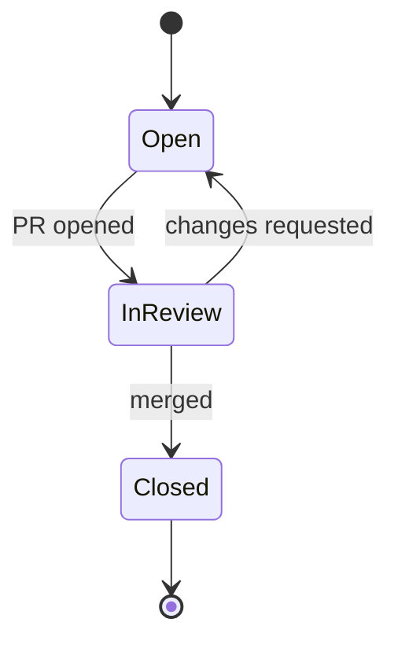

## Entity relationship diagram

Database-style schema — entities, their fields, and how they relate.

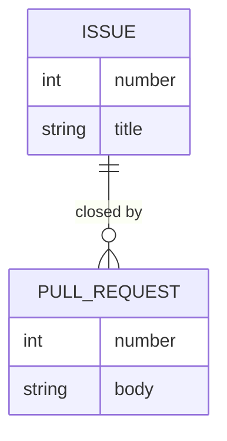

## Git graph

Already used in `education/beginners/session-1-getting-started.md` —
commits, branches, and merges, drawn the way `git log --graph` would show
them.

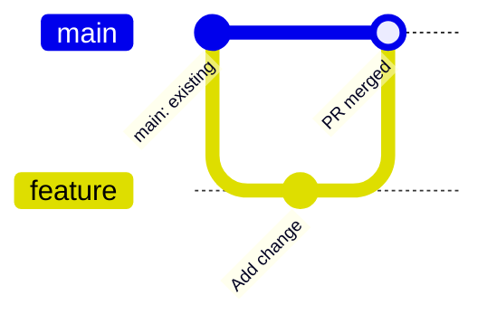

## Mindmap

Already used throughout `education/README.md` for topic overviews — a
central idea branching into related sub-topics.

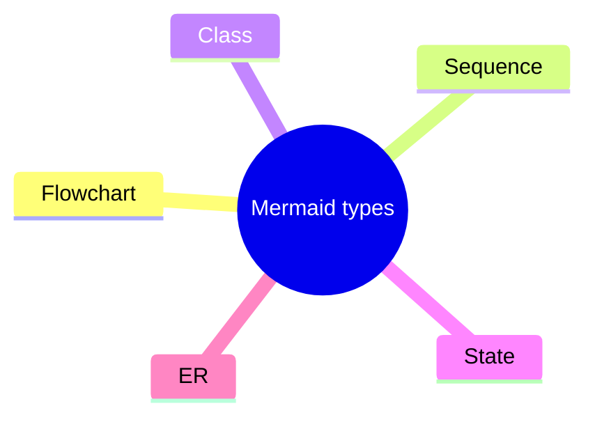

## Pie chart

Proportions of a whole.

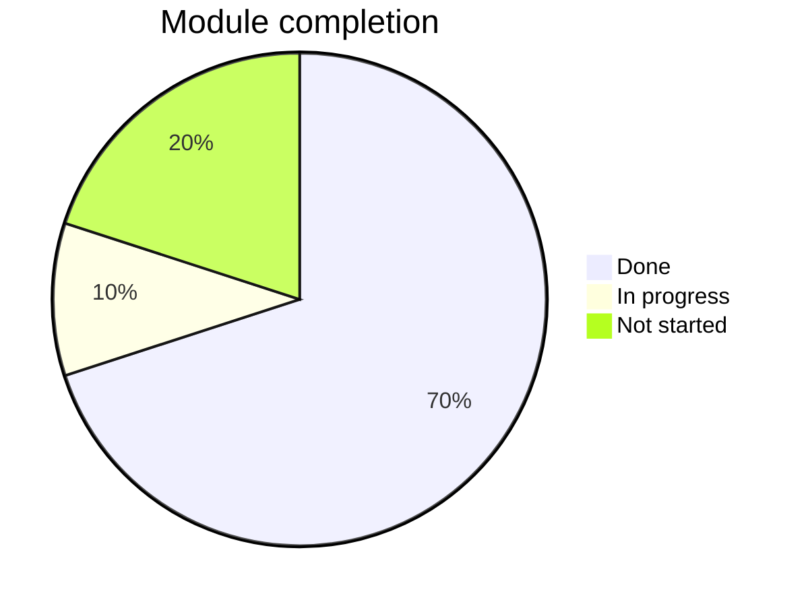

## Gantt chart

Timeline/scheduling — tasks, durations, and dependencies.

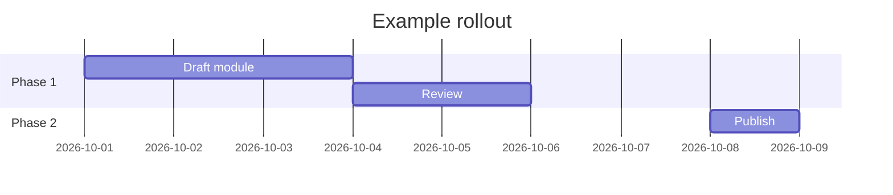

## User journey

Steps in a process from a user's perspective, each scored for
satisfaction — useful for UX-style walkthroughs.

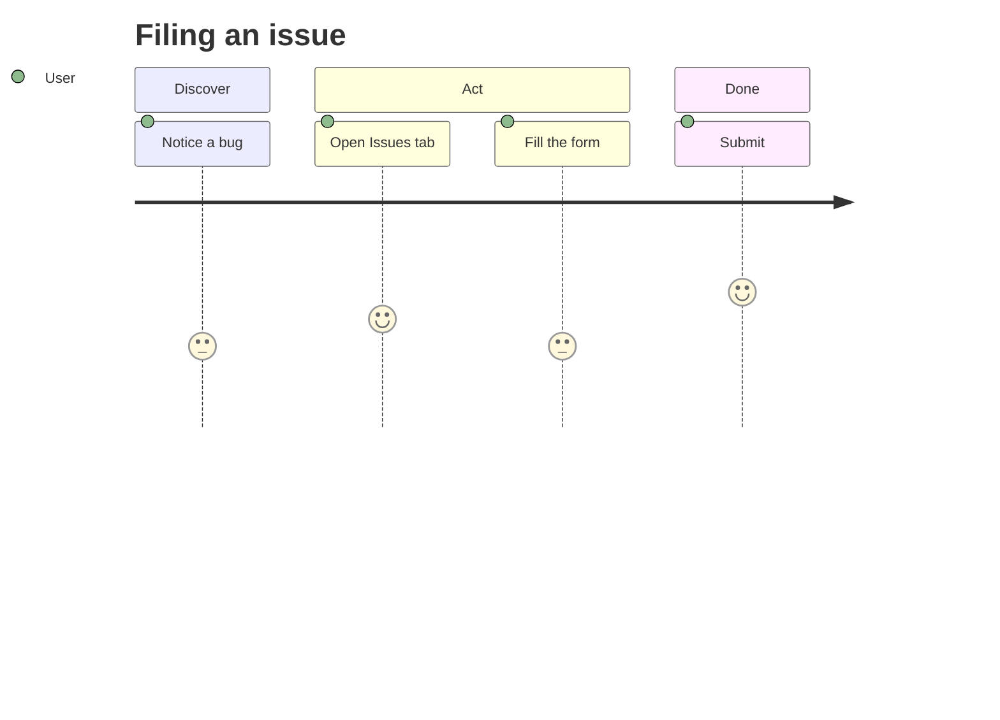

## Quadrant chart

Plots items across two axes into four quadrants — useful for
prioritization (e.g. this repo's own P0-P3 impact/urgency thinking).

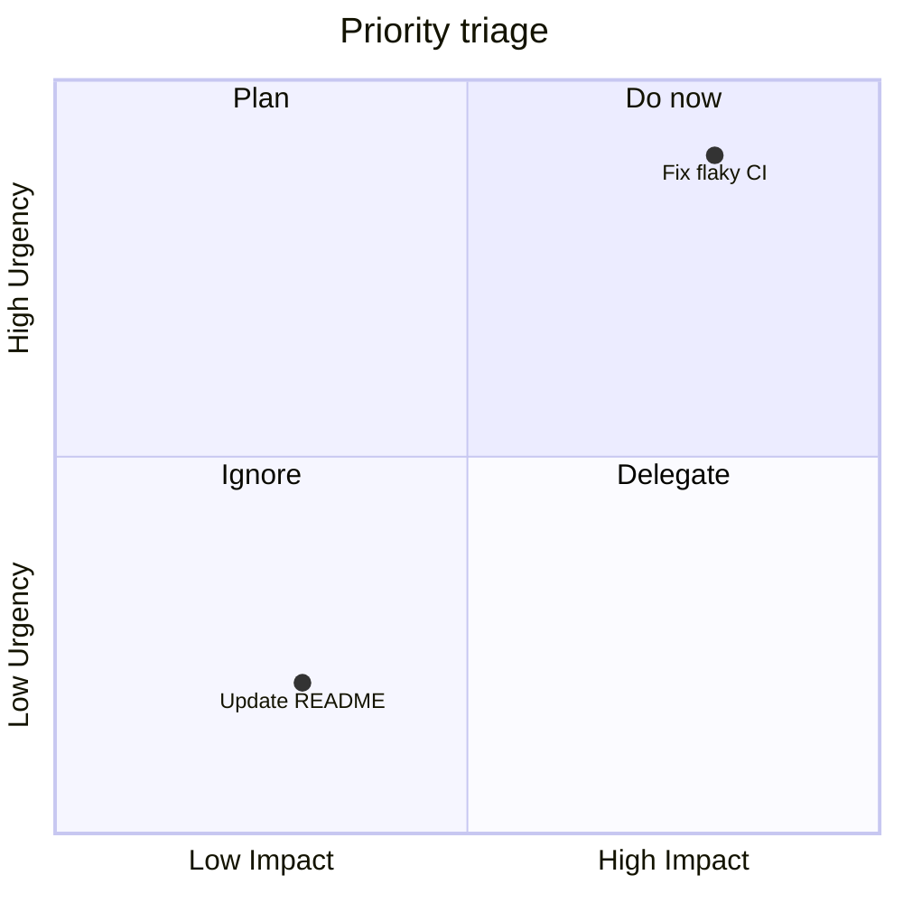

## Timeline

A chronological sequence of events, simpler than a Gantt chart when
duration/overlap doesn't matter.

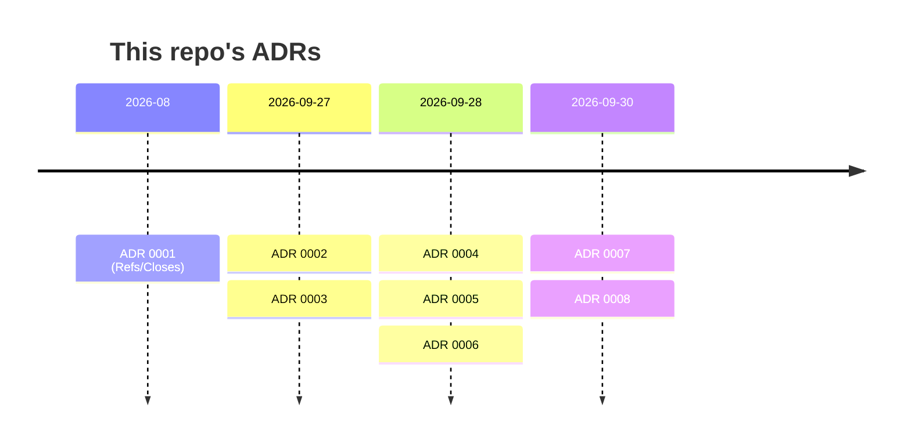
